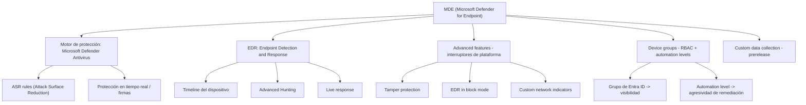
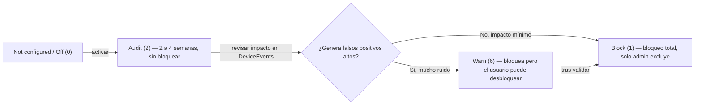
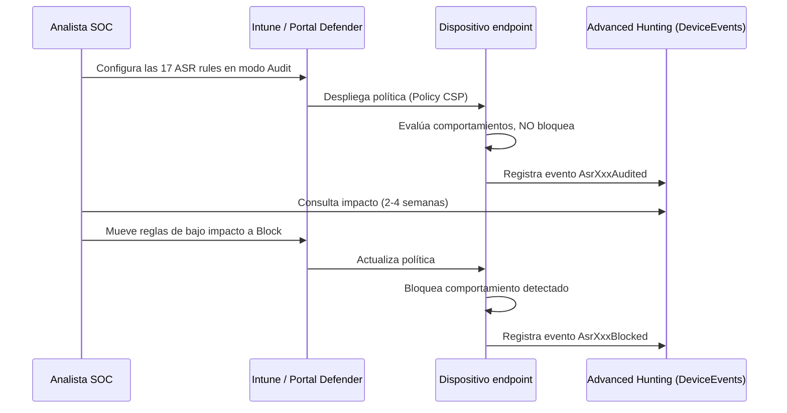
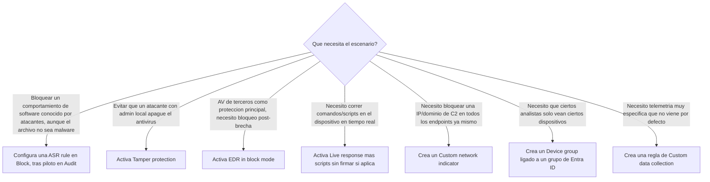
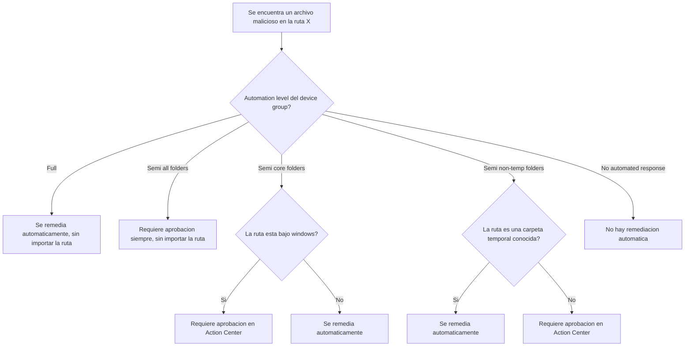
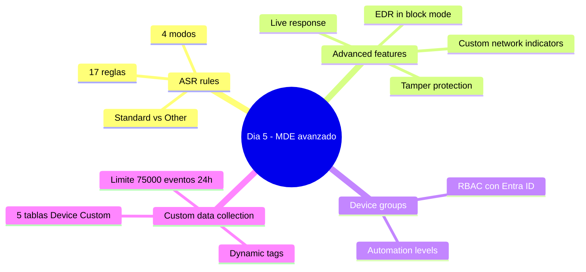

# Lección Día 5 — Configuración avanzada de MDE: ASR rules, advanced features, device groups y custom data collection

> [!info] Contexto
> Día 5 del plan (Dominio 1 — Manage a security operations environment, 40–45% del examen). Hasta el Día 4 vimos cómo llega la telemetría a Sentinel y cómo Sentinel detecta amenazas sobre esos datos. Hoy cambiamos de plataforma hacia **MDE (Microsoft Defender for Endpoint)**, el producto que protege y vigila directamente los dispositivos (Windows, Linux, macOS, móviles). Cubrimos cuatro bloques: **ASR (Attack Surface Reduction) rules**, **advanced features**, **device groups + automation levels**, y **custom data collection**. Esta versión reescrita el 11-sep-2026 amplía cada concepto desde cero, con diagramas y ejemplos adicionales, porque el examen ya está agendado en firme para el **sábado 3 de octubre de 2026** y a este bloque le faltaba profundidad.

> [!warning] Corregido 11-sep-2026 — AIR ya no es una fecha futura, es un hecho pasado
> La versión original de esta lección (18-jul-2026) advertía que AIR se retiraría "a partir del 1 de septiembre de 2026" y asumía que el examen (entonces agendado el 29-ago) ocurriría *antes* de ese cambio. Verificado hoy directamente en Microsoft Learn (`learn.microsoft.com/defender-endpoint/automation-levels`, actualizado 14-ago-2026): el retiro **ya ocurrió**. Desde el 1-sep-2026, AIR **ya no corre como experiencia de investigación separada en MDE ni puede activarse manualmente**; sus capacidades de detección y respuesta quedaron absorbidas dentro de la protección antivirus por defecto, que actúa sola. Tu examen es el **3 de octubre**, es decir, **después** del retiro. Esto importa para el Día 5 en un punto muy concreto: al revisar hoy la lista de advanced features en el portal de Defender, confirmé que el interruptor **"Automated Investigation"** ya **no aparece** en la documentación oficial de advanced features — fue retirado junto con la experiencia que controlaba. Sigo enseñando el modelo completo de automation levels (Full/Semi/No automation) porque el concepto de "qué tan agresiva es la remediación automática" sigue siendo examinable y sigue existiendo en los device groups, pero debes saber que hoy gobierna un mecanismo que ya no se activa manualmente sino que corre integrado en el antivirus. Lo retomamos con más detalle en el Día 6.

## 📖 Lectura del día

### 1. MDE (Microsoft Defender for Endpoint)

**Definición desde cero.** MDE es la plataforma de Microsoft para proteger, detectar y responder a amenazas directamente en los **endpoints**: las computadoras de escritorio, laptops, servidores y dispositivos móviles de una organización. No es una sola herramienta, sino un conjunto de capas que trabajan juntas: un motor de antivirus (**Microsoft Defender Antivirus**), un motor de comportamiento en tiempo real (**EDR — Endpoint Detection and Response**), reglas de reducción de superficie de ataque (ASR), gestión de vulnerabilidades, y toda una consola centralizada en el **portal de Defender** (`security.microsoft.com`) desde donde un analista SOC (Security Operations Center) ve alertas, investiga dispositivos y configura políticas para miles de endpoints a la vez.

**Qué problema resuelve.** Antes de productos como MDE, proteger endpoints significaba instalar un antivirus tradicional por firma en cada máquina y confiar en que detectara archivos maliciosos conocidos. Eso no alcanza contra atacantes que usan herramientas legítimas del sistema operativo de forma maliciosa (movimiento lateral con PsExec, robo de credenciales con Mimikatz, scripts de PowerShell ofuscados) o malware que cambia de firma constantemente. MDE resuelve esto combinando detección por firma con detección de **comportamiento**, y le da al SOC visibilidad y control centralizados sobre toda la flota de dispositivos, no dispositivo por dispositivo.

**Cómo funciona por dentro.** Cada dispositivo se "onboardea" (se conecta) a MDE mediante un sensor ligero que envía telemetría constante — procesos que se ejecutan, archivos que se crean o modifican, conexiones de red, cambios de registro — al backend en la nube de Microsoft. Ese backend correlaciona la telemetría con inteligencia de amenazas global y genera alertas cuando detecta algo sospechoso. Todo lo que vemos hoy (ASR rules, advanced features, device groups, custom data collection) son capas de configuración sobre ese flujo base de telemetría y protección.

**Dónde se configura.** Todo el día de hoy ocurre dentro de **Settings → Endpoints** en el portal de Defender (`security.microsoft.com`). El rol mínimo para ver esta configuración es **Security Reader**; para modificarla hace falta **Security Administrator** o un rol personalizado con los permisos específicos de gestión de seguridad de endpoints.

**Ejemplo concreto.** Una empresa con 5,000 dispositivos Windows onboardea todos sus endpoints a MDE. A partir de ese momento, cualquier ejecución sospechosa de PowerShell, cualquier intento de acceder a LSASS, o cualquier archivo con comportamiento tipo ransomware, genera telemetría visible desde una sola consola — sin que el analista tenga que conectarse dispositivo por dispositivo.

**Trampa de examen.** El examen distingue con cuidado entre **Microsoft Defender Antivirus** (el motor de protección, con o sin MDE) y **MDE** (la plataforma completa con EDR, consola centralizada y gestión en la nube). Una pregunta puede describir "protección básica por firma sin consola centralizada ni telemetría en la nube" para señalar que *no* se está usando MDE, solo el antivirus local.

📎 Nota de concepto: [[Conceptos/MDE (Microsoft Defender for Endpoint)]]



### 2. ASR (Attack Surface Reduction) rules

**Definición desde cero.** Una ASR rule (regla de reducción de superficie de ataque) es una configuración de **Microsoft Defender Antivirus** que bloquea o audita **comportamientos concretos de software** que los atacantes explotan con frecuencia, incluso cuando el archivo que los ejecuta no está catalogado todavía como malware. En vez de preguntar "¿este archivo es malo?" (lo que hace un antivirus por firma), ASR pregunta "¿este comportamiento es sospechoso, sin importar quién lo haga?" — por ejemplo, "Word está intentando lanzar un proceso hijo" o "un script se está ejecutando ofuscado".

**Qué problema resuelve.** Reduce la "superficie de ataque": cierra de antemano los caminos que el malware usa típicamente (macros de Office, scripts, robo de credenciales de LSASS, herramientas de administración remota abusadas), antes de que exista una firma específica para detectar el malware que los usaría.

**Cómo funciona por dentro.** Existen **17 reglas ASR** verificadas hoy contra la referencia oficial (`attack-surface-reduction-rules-reference`, actualizada 9-sep-2026), agrupadas en dos categorías:

- **Standard protection rules** (3 reglas): Microsoft recomienda activarlas en **Block** de inmediato por su bajo impacto en productividad: *Block abuse of exploited vulnerable signed drivers*, *Block credential stealing from the Windows local security authority subsystem* (protege LSASS, el proceso que autentica inicios de sesión — objetivo típico de Mimikatz), y *Block persistence through WMI event subscription*.
- **Other ASR rules** (14 reglas — la lista completa incluye una regla más de la que registraba la versión anterior de esta nota, *Block Adobe Reader from creating child processes*, que había quedado fuera): bloquear que Adobe Reader o las apps de Office creen procesos hijo, bloquear contenido ejecutable en email, bloquear ejecutables sin reputación/antigüedad/lista de confianza suficiente, bloquear scripts ofuscados, bloquear JavaScript/VBScript que lance contenido descargado, bloquear que Office cree o inyecte código ejecutable, bloquear que Outlook cree procesos hijo, bloquear procesos desde PsExec/WMI, bloquear reinicio en modo seguro, bloquear ejecutables sin firmar desde USB, bloquear herramientas del sistema copiadas/suplantadas, bloquear creación de web shells en servidores Exchange, bloquear llamadas Win32 API desde macros de Office, y **Use advanced protection against ransomware** (heurísticas de nube y cliente que bloquean archivos que "parecen" ransomware aunque no tengan mala reputación confirmada).

Cada regla se configura en uno de **4 estados**:

| Estado | Qué hace | Cuándo usarlo |
|---|---|---|
| **Not configured / Off (0)** | La regla no actúa | Regla que aún no se ha evaluado |
| **Audit (2)** | No bloquea ni molesta al usuario; registra en el log lo que habría bloqueado | Siempre el punto de partida de un despliegue nuevo, 2-4 semanas |
| **Warn (6)** | Bloquea la acción pero muestra un aviso ("toast") con botón "Unblock" para que el usuario lo desbloquee voluntariamente | Paso intermedio educativo antes del bloqueo total |
| **Block (1)** | Bloquea sin excepción posible por el usuario; solo un administrador puede añadir una exclusión | Estado final tras validar en Audit |

**Dato de examen que suele confundirse:** dos reglas están documentadas explícitamente como **incompatibles con Warn** — *Block credential stealing from the Windows local security authority subsystem* (LSASS) y *Block Office applications from injecting code into other processes*. Solo admiten Audit o Block.

**Dónde se configura y qué rol hace falta.** Las ASR rules no se activan aisladas desde MDE: se despliegan vía **Intune** (o las mismas políticas de seguridad de endpoint del portal unificado de Defender, que usan el motor de Intune), **Microsoft Configuration Manager**, cualquier **MDM (Mobile Device Management)** vía **Policy CSP (Configuration Service Provider)**, o **Group Policy** centralizada. En el portal de Defender la ruta es **Settings → Endpoints → Attack surface reduction rules**, y requiere el rol **Security Administrator** (o un rol de Intune con permiso sobre "Endpoint Security" si se despliega desde ahí).

**Auditar el impacto con KQL:** cada evento de una regla ASR queda registrado con un `ActionType` que empieza con el prefijo `Asr` (por ejemplo `AsrLsassCredentialTheftAudited` o `AsrOfficeChildProcessBlocked`) dentro de la tabla `DeviceEvents` de Advanced Hunting.

**Ejemplo concreto.** Un SOC quiere desplegar las 17 reglas en 5,000 dispositivos. La estrategia recomendada por Microsoft: Audit en las 17 reglas simultáneamente durante 2-4 semanas → revisar el reporte de impacto en `DeviceEvents` → mover a Block regla por regla, empezando por las 3 Standard protection rules (menor disrupción).

**Trampa de examen.** El examen pregunta con frecuencia "¿puedo aplicar Warn a la regla de LSASS?" — la respuesta es no, solo Audit o Block. También pregunta por el orden correcto de despliegue (Audit primero, nunca Block directo en producción sin pasar por Audit).

📎 Nota de concepto: [[Conceptos/ASR rules]]





### 3. Advanced features (caracteristicas avanzadas)

**Definicion desde cero.** Las advanced features son un conjunto de interruptores de configuracion a nivel de tenant en MDE, se activan o desactivan capacidades completas del producto, no reglas de comportamiento como ASR. Viven en Settings, Endpoints, Advanced features del portal de Defender.

**Que problema resuelven.** MDE trae docenas de capacidades que no todas las organizaciones necesitan activas por defecto, algunas tienen costo de rendimiento, otras dependen de licencias o de otros productos Microsoft, y otras cambian el comportamiento de remediacion de forma importante. Separarlas en interruptores permite que cada tenant las active segun su arquitectura real.

Verificado hoy contra la documentacion oficial (defender-endpoint/advanced-features, actualizada 2-jul-2026), la lista completa incluye, entre otras: restringir correlacion a device groups especificos, EDR in block mode, resolver alertas automaticamente, permitir/bloquear archivos, ocultar registros duplicados de dispositivos, custom network indicators, tamper protection, mostrar detalles de usuario desde Entra ID, integracion con Skype for Business, integracion con Defender for Cloud Apps, web content filtering, unified audit log, device discovery, descargar archivos en cuarentena, conectividad optimizada al onboardear, live response (con dos interruptores hermanos: uno para estaciones de trabajo y otro separado para servidores, mas un tercer interruptor para scripts sin firmar), configurar automatic attack disruption (lo vemos a fondo el Dia 6), compartir alertas con Microsoft Purview, conexion con Intune, telemetria autenticada, preview features, y notificaciones de ataques a endpoints.

A continuacion, las cuatro que mas pregunta el examen, explicadas cada una desde cero:

#### 3.1 Tamper protection (proteccion contra manipulacion)

**Definicion.** Bloquea que se cambien configuraciones criticas de seguridad de Microsoft Defender Antivirus, desactivar proteccion en tiempo real, eliminar actualizaciones de firmas, deshabilitar el motor, incluso con privilegios de administrador local o via Registro/PowerShell/GPO.

**Por que existe.** Es la defensa contra el paso tipico de un atacante que, tras comprometer una cuenta admin, intenta apagar el antivirus antes de desplegar su payload. Sin tamper protection, un atacante con acceso admin local puede desactivar Defender Antivirus con un solo comando.

**Como funciona.** Cuando esta activada, cualquier intento de cambiar la configuracion protegida (via Registro, PowerShell, Group Policy o la interfaz local de seguridad de Windows) es bloqueado, incluso si quien lo intenta tiene privilegios administrativos en esa maquina. La unica forma de cambiar esa configuracion es de forma centralizada desde MDE.

**Donde se configura / rol.** Settings, Endpoints, Advanced features, Tamper protection (interruptor On/Off). Requiere rol Security Administrator. Para tenants con Intune, tambien puede reforzarse via perfil de seguridad de endpoint.

**Ejemplo.** Un atacante compromete una cuenta de administrador local en un servidor y ejecuta el comando para apagar la proteccion en tiempo real antes de soltar su payload. Con tamper protection activo, el comando falla silenciosamente, el motor sigue corriendo.

**Trampa de examen.** El examen suele describir "un atacante con privilegios administrativos locales intenta desactivar el antivirus" y pide identificar que feature lo previene, la respuesta es tamper protection, no EDR in block mode (que es post-brecha) ni custom network indicators (que es de red).

Nota de concepto: [[Conceptos/Tamper protection]]

#### 3.2 EDR in block mode

**Definicion.** Provee proteccion desde artefactos maliciosos incluso cuando Microsoft Defender Antivirus corre en modo pasivo, es decir, no es el antivirus principal del dispositivo.

**Por que existe.** Resuelve un escenario especifico: la organizacion usa otro antivirus de terceros como proteccion principal, asi que Defender Antivirus corre en modo pasivo (solo monitoreando, sin bloquear). Normalmente en modo pasivo Defender no puede bloquear nada.

**Como funciona.** Al activar EDR in block mode, el motor EDR (el componente que analiza comportamiento y telemetria, no firmas) si puede bloquear y remediar artefactos maliciosos detectados despues de que ya se ejecutaron (post-breach, despues de la brecha), aunque el antivirus principal del dispositivo sea de otro fabricante. Es una capa de seguridad adicional, no un reemplazo del AV de terceros.

**Donde se configura / rol.** Settings, Endpoints, Advanced features, EDR in block mode. Requiere Security Administrator. Prerrequisito: el dispositivo debe estar onboardeado a MDE aunque su AV principal sea otro.

**Ejemplo.** Un servidor usa un antivirus de terceros como proteccion principal. MDE detecta, via telemetria de comportamiento, que un proceso desconocido cifra archivos masivamente (patron de ransomware). Con EDR in block mode activo, MDE puede terminar ese proceso y poner en cuarentena el artefacto, aunque el AV de terceros no lo haya detectado.

**Trampa de examen.** El distractor tipico es confundirlo con activar Defender Antivirus como proteccion principal, EDR in block mode no reemplaza al AV de terceros, coexiste con el y actua solo post-brecha.

Nota de concepto: [[Conceptos/EDR in block mode]]

#### 3.3 Live response

**Definicion.** Habilita una consola de respuesta remota en vivo sobre los dispositivos onboardeados, que permite a un analista con permisos ejecutar comandos, recolectar archivos, correr scripts y remediar directamente sobre el endpoint en tiempo real (se profundiza en el Dia 9).

**Por que existe.** Cuando un analista necesita investigar o remediar activamente un dispositivo comprometido, sin esperar a un ciclo de politicas ni desplazarse fisicamente, live response da una terminal remota controlada y auditada.

**Como funciona.** Existen en realidad tres interruptores relacionados (correccion respecto a la version anterior de esta nota, que los describia como uno solo con un sub-interruptor): Enable live response (para estaciones de trabajo), Enable live response for servers (equivalente pero para servidores, con su propio interruptor separado), y Allow unsigned script execution in live response (permite correr scripts propios sin firmar durante la sesion, desactivado por defecto).

**Donde se configura / rol.** Settings, Endpoints, Advanced features, los tres interruptores de live response. Para usar live response ademas del interruptor de tenant, el analista necesita un rol con permiso de Live response asignado en Settings, Endpoints, Roles (permisos Basic o Advanced segun que comandos puede ejecutar).

**Ejemplo.** Un analista de Tier 2 detecta un proceso sospechoso corriendo en un servidor. Abre una sesion de live response, sube un script propio de triage (requiere que Allow unsigned script execution este activo), lo ejecuta, y recolecta un paquete de investigacion sin necesitar acceso fisico ni RDP al servidor.

**Trampa de examen.** El examen pregunta por que un analista no puede correr su propio script en una sesion de live response aunque tenga el rol correcto, la respuesta suele ser que falta activar Allow unsigned script execution, un interruptor aparte del interruptor general de live response.

Nota de concepto: [[Conceptos/Live response]]

#### 3.4 Custom network indicators

**Definicion.** Permite crear indicadores personalizados de IP, dominio o URL (permitir/bloquear) que MDE aplica a nivel de red en los endpoints onboardeados.

**Por que existe.** Es el mecanismo detras de "bloquear esta IP de C2 (Command and Control) en todos los dispositivos onboardeados ya mismo", sin esperar a que exista una firma de antivirus para el malware asociado.

**Como funciona.** Una vez activada la advanced feature, un analista puede ir a Settings, Endpoints, Indicators y agregar una IP, dominio o URL especifica con una accion de Allow o Block. La politica se distribuye a todos los dispositivos onboardeados y network protection la aplica a nivel de red.

**Donde se configura / rol.** El interruptor vive en Advanced features, los indicadores concretos se crean en Settings, Endpoints, Indicators. Requiere Security Administrator o un rol con permiso de Manage security settings. Requisito de dispositivo: Windows 10 1709+ o Windows 11.

**Ejemplo.** Durante la respuesta a un incidente, threat intelligence confirma que un dominio especifico es la infraestructura de comando y control del atacante. El analista crea un indicador de bloqueo para ese dominio, en minutos, ningun endpoint onboardeado puede comunicarse con el, incluso los que aun no muestran senales de compromiso.

**Trampa de examen.** Se confunde con ASR rules (que bloquean comportamiento de software local), custom network indicators bloquea destinos de red especificos, no comportamientos.

Nota de concepto: [[Conceptos/Custom network indicators]]



### 4. Device groups: RBAC y automation levels

**Definicion desde cero.** Un device group (grupo de dispositivos) en MDE es una agrupacion logica de endpoints, construida normalmente con reglas basadas en atributos (dominio, rango de IP, tag, nombre del dispositivo) en vez de asignacion manual uno por uno.

**Que problema resuelve.** En un tenant con miles de dispositivos, no todos deben tratarse igual: un analista de una filial no deberia ver los servidores de otra, y un servidor de produccion critico no deberia remediar archivos automaticamente con la misma agresividad que una laptop de usuario final. Los device groups permiten aplicar reglas distintas a subconjuntos de dispositivos.

Sirven para dos cosas distintas que el examen le encanta separar:

**4.1 RBAC (Role-Based Access Control, control de acceso basado en roles).** Puedes asociar un device group con un grupo de Microsoft Entra ID especifico, de forma que los analistas que pertenecen a ese grupo de Entra solo vean alertas, incidentes y datos de esos dispositivos, por ejemplo, el equipo de SOC de la filial de LATAM solo ve los servidores de LATAM, no los de EMEA. Esto es puramente sobre visibilidad y permisos, no sobre remediacion.

**4.2 Automation level.** Cada device group tiene asignado un nivel de automatizacion que determina que tan agresivamente actua la remediacion automatica (historicamente gobernada por AIR de forma manual; hoy, tras el retiro del 1-sep-2026, gobierna la remediacion integrada en el antivirus por defecto) cuando encuentra evidencia maliciosa en esos dispositivos. Verificado hoy contra defender-endpoint/automation-levels (actualizado 14-ago-2026), los niveles son:

| Nivel | Que hace | Cuando se usa por defecto |
|---|---|---|
| Full - remediate threats automatically | Remedia automaticamente todo lo determinado como malicioso, sin aprobacion | Recomendado por Microsoft; default para tenants creados desde el 16-ago-2020 sin device groups definidos. Los tenants con Full remueven un 40% mas de malware de alta confianza que los de niveles inferiores |
| Semi - require approval for all folders | Toda remediacion queda pendiente de aprobacion en el Action Center, sin excepcion | Default para tenants creados antes del 16-ago-2020 sin device groups |
| Semi - require approval for core folders remediation | Requiere aprobacion solo si el archivo esta en una carpeta del sistema operativo (windows), fuera de ahi, remedia solo | - |
| Semi - require approval for non-temp folders remediation | Invierte el criterio: remedia automaticamente solo en carpetas temporales conocidas (temp, downloads, program files, etc.); todo lo demas requiere aprobacion | - |
| No automated response | No corre remediacion automatica en absoluto sobre esos dispositivos | No recomendado, reduce la postura de seguridad |

Las acciones pendientes de aprobacion (niveles Semi) expiran a los 7 dias, si nadie las aprueba ni rechaza, se tratan como rechazadas automaticamente.

**Donde se configura / rol.** Settings, Endpoints, Device groups, Add device group. Se define ahi mismo el grupo de Entra ID asociado (para RBAC) y el automation level. Requiere Security Administrator; asociar un grupo de Entra ID especifico ademas requiere que ese grupo ya exista en Microsoft Entra ID.

**Ejemplo concreto.** Un device group llamado Servidores-Finanzas tiene automation level Semi - require approval for core folders remediation. Se detecta un archivo malicioso en la carpeta Windows\Temp y otro en ProgramData\App. El primero cae bajo windows\* y requiere aprobacion manual. El segundo no esta en una core folder y se remedia automaticamente. Es un error comun asumir que "Temp" siempre implica remediacion automatica, eso aplica al nivel non-temp folders, un nivel distinto, aqui lo que decide es si la ruta cae bajo windows\*.

**Trampa de examen.** El examen pone rutas de archivo parecidas (la palabra Temp en el nombre) para dos niveles distintos (core folders vs non-temp folders) esperando que confundas el criterio. Lee siempre cual es el nivel exacto antes de decidir la ruta.

Notas de concepto: [[Conceptos/Device groups]] y [[Conceptos/Automation levels]]



### 5. Custom data collection (prerelease)

**Definicion desde cero.** Custom data collection es una capacidad de MDE, confirmada hoy como todavia prerelease (la documentacion oficial sigue marcandola como informacion relacionada a un producto prelanzado que puede cambiar sustancialmente), que permite definir reglas de recoleccion personalizadas con filtros especificos sobre propiedades de evento (rutas de carpeta, nombres de proceso, conexiones de red).

**Que problema resuelve.** La telemetria por defecto de MDE es enorme pero generica; a veces un SOC necesita visibilidad muy especifica, por ejemplo todas las ejecuciones de PowerShell en las workstations administrativas o todo acceso a archivos en la carpeta de una app financiera propietaria, sin pagar el costo y el ruido de ingerir absolutamente todo. Verificado hoy contra la documentacion oficial (actualizada 20-may-2026), los casos de uso reconocidos oficialmente son: threat hunting dirigido, monitoreo de aplicaciones propias, evidencia de cumplimiento normativo (PCI-DSS, HIPAA, GDPR), respuesta a incidentes activa, y deteccion de movimiento lateral.

**Como funciona por dentro.** El proceso documentado tiene 5 pasos: 1) Define rules, creas reglas de recoleccion en el portal de Defender con filtros especificos; 2) Target devices, usas dynamic tags (etiquetas dinamicas que se actualizan solas cuando cambian los atributos del dispositivo, a diferencia de las tags manuales) para decidir a que dispositivos aplica; 3) Deploy rules, las reglas se transmiten a los endpoints objetivo, tipicamente en 20 minutos a 1 hora; 4) Collect events, los endpoints recolectan eventos que cumplen los filtros, ademas de la telemetria estandar (no la reemplazan ni la modifican); 5) Analyze data, se consultan los eventos personalizados en el workspace de Sentinel conectado.

Las dynamic tags se configuran primero en Asset Rule Management, es un prerequisito obligatorio: no puedes crear una regla de custom data collection sin haber definido antes la dynamic tag que la va a targetear, y las tags manuales no son compatibles con esta funcion.

Los eventos capturados van a 5 tablas nuevas y separadas: DeviceCustomProcessEvents (creacion/terminacion de procesos), DeviceCustomImageLoadEvents (carga de DLLs), DeviceCustomFileEvents (creacion/modificacion/eliminacion/acceso a archivos), DeviceCustomNetworkEvents (conexiones de red con IP, puerto y protocolo) y DeviceCustomScriptEvents (ejecucion de scripts, PowerShell/JavaScript/etc.).

**Donde se configura / rol.** Settings, Endpoints, Custom data collection (o buscarlo en el buscador del portal, dado que sigue en prerelease puede requerir activar Preview features primero). Requiere Security Administrator y un workspace de Sentinel conectado y seleccionado explicitamente al crear la regla, sin Sentinel no puedes crear ni usar reglas de custom data collection.

**Limite documentado:** 75,000 eventos por regla por dispositivo cada 24 horas. Al llegar al tope, esa regla concreta deja de recolectar en ese dispositivo hasta que la ventana rotativa de 24h se reinicia (las demas reglas del dispositivo siguen funcionando con normalidad); la solucion si te topas con el limite es afinar los filtros de la regla para que sea mas especifica.


*Captura oficial de Microsoft Learn: fijate en como la pagina lista las reglas de recoleccion activas junto con su estado y las dynamic tags que targetean, esta es la vista que veras al ir a Settings, Endpoints, Custom data collection.*

**Ejemplo concreto.** El equipo de compliance necesita evidencia forense detallada de todo acceso a archivos dentro de la carpeta de una aplicacion financiera propietaria en 40 servidores especificos, sin aumentar el costo de ingesta del resto del entorno. Con Sentinel ya conectado: 1) crear/verificar una dynamic tag en Asset Rule Management que identifique esos 40 servidores; 2) crear una regla de custom data collection con un filtro de ruta de carpeta apuntando a la app financiera, dirigida a esa dynamic tag; 3) seleccionar el workspace de Sentinel de destino; 4) esperar el despliegue (20 min a 1h) y consultar DeviceCustomFileEvents.

**Trampa de examen.** El distractor tipico ofrece crear una automation rule o un playbook como primer paso, pero el prerequisito real y documentado es la dynamic tag en Asset Rule Management, no un mecanismo de Sentinel.

Nota de concepto: [[Conceptos/Custom data collection]]



Notas del vault relacionadas (revisar criticamente, no como fuente): [[03_Semana3_Defender_XDR]] parrafo 1 (features basicas de MDE), [[Modulo_2_Defender_for_Endpoint]]. Ninguna de las dos cubre hoy los 4 temas completos.

## Ejemplos concretos

**Ejemplo 1 - Elegir el modo correcto de una ASR rule (tipo examen)**

Escenario: "El SOC de Contoso quiere desplegar la regla Block credential stealing from the Windows local security authority subsystem con una notificacion al usuario antes de bloquear la accion, para minimizar quejas de soporte. Es posible?"

Razonamiento: No. Esta regla protege el acceso a memoria de LSASS y esta documentada explicitamente como incompatible con el modo Warn, solo admite Audit o Block. Ademas, produce un volumen alto de eventos de auditoria que en su mayoria son ruido seguro de ignorar; Microsoft recomienda incluso saltarse la evaluacion extensa en Audit para esta regla en particular y desplegarla directo en Block sobre un piloto pequeno de dispositivos.

```kql
// Auditar impacto de la regla LSASS antes/durante el despliegue (Dia 5)
DeviceEvents
| where ActionType in ("AsrLsassCredentialTheftAudited", "AsrLsassCredentialTheftBlocked")
| summarize Eventos = count(), Dispositivos = dcount(DeviceName), Procesos = make_set(InitiatingProcessFileName, 10)
    by ActionType
| order by Eventos desc
```

**Ejemplo 2 - Automation level y remediacion por ruta (tipo examen)**

Escenario: "Un device group llamado Servidores-Finanzas tiene el nivel Semi - require approval for core folders remediation. Se detecta un archivo malicioso en C:\Windows\Temp\payload.exe y otro en C:\ProgramData\App\update.exe, ambos con veredicto Malicious. Que ocurre con cada uno?"

Razonamiento: la clave de este nivel es que core folders significa directorios del sistema operativo, especificamente rutas bajo windows. El archivo en Windows\Temp cae dentro de esa definicion, requiere aprobacion manual en el Action Center. El archivo en ProgramData\App no esta en una core folder, se remedia automaticamente sin esperar aprobacion. Es un error comun asumir que Temp siempre implica remediacion automatica (eso aplica al nivel non-temp folders, un nivel distinto), aqui lo que decide es si la ruta cae bajo windows, sin importar si contiene la palabra Temp.

**Ejemplo 3 - Custom data collection para hunting dirigido (tipo examen)**

Escenario: "El equipo de compliance necesita evidencia forense detallada de todo acceso a archivos dentro de la carpeta de una aplicacion financiera propietaria en 40 servidores especificos, sin aumentar el costo de ingesta del resto del entorno. Tienen Sentinel conectado. Que configuran y en que orden?"

Razonamiento: 1) primero crear/verificar una dynamic tag en Asset Rule Management que identifique esos 40 servidores; 2) crear una regla de custom data collection con un filtro de ruta de carpeta apuntando a la app financiera, dirigida a esa dynamic tag; 3) seleccionar el workspace de Sentinel de destino; 4) esperar el despliegue (20 min a 1h) y consultar la tabla DeviceCustomFileEvents. Content search o Purview Audit (temas del Dia 13) NO aplican aqui porque el escenario es sobre archivos en un endpoint, no sobre operaciones de M365/SharePoint.

```kql
// Verificar que la regla de custom data collection esta capturando eventos (Dia 5)
DeviceCustomFileEvents
| where TimeGenerated > ago(1h)
| summarize Eventos = count(), UltimoEvento = max(TimeGenerated) by DeviceName, RuleName
| order by Eventos desc
```

**Ejemplo 4 - Distinguir advanced feature correcta segun el enunciado (tipo examen, nuevo en esta reescritura)**

Escenario: "Un atacante obtiene credenciales de administrador local de una laptop, e intenta apagar Defender Antivirus antes de soltar su payload. El comando falla. Semanas despues, en otro incidente, un servidor con antivirus de terceros como proteccion principal (Defender en modo pasivo) sufre un ataque; MDE detecta post-brecha un proceso que cifra archivos masivamente y lo termina automaticamente. Que advanced feature explica cada comportamiento?"

Razonamiento: el primer caso es Tamper protection, bloquea cambios a la configuracion de seguridad incluso con privilegios admin locales. El segundo caso es EDR in block mode, permite que el motor EDR bloquee y remedie artefactos maliciosos detectados despues de la ejecucion, aunque el antivirus principal sea de un tercero. Son features distintas que resuelven problemas distintos, no son intercambiables, y el examen las separa con precision.

## Videos

1. "Microsoft Defender ASR Rules Explained - Strengthen Endpoint Security with Intune" - [YouTube](https://www.youtube.com/watch?v=M5oYvTLDmOg), publicado en febrero de 2025. Cubre el despliegue practico de ASR rules via Intune (audit a warn/block), que es exactamente el flujo que el examen espera que domines. Duracion aproximada 15-20 min; el mecanismo de despliegue de ASR no ha cambiado desde entonces.
2. "Preparing for SC-200: Manage a security operations environment (Part 1 of 4)" - [Microsoft Learn Shows](https://learn.microsoft.com/en-us/shows/exam-readiness-zone/preparing-for-sc-200-manage-a-security-operations-environment). Nota de honestidad: este video usa los pesos de dominio viejos (4 dominios de 15-30% cada uno, ya no vigentes, los pesos correctos son los 3 dominios 40-45/35-40/20-25 de tu guia), pero la parte de configuracion de MDE (device groups, ASR, automation levels) sigue siendo conceptualmente correcta.

No encontre un video reciente y bueno especifico sobre custom data collection (sigue siendo una funcion en prerelease, casi no hay contenido en YouTube todavia), para eso usa directamente la [documentacion oficial](https://learn.microsoft.com/en-us/defender-endpoint/custom-data-collection), que es la fuente verificada hoy para esta leccion.

## Ejercicio practico

> [!info] Requisito
> Usa tu trial M365 E5 / portal de Defender (security.microsoft.com). Si tu tenant universitario de La Salle tiene el portal unificado limitado, haz este ejercicio en el trial E5 personal, NO en el tenant universitario.

Learn (teoria, ~20-30 min): [Mitigacion de amenazas con Defender for Endpoint](https://learn.microsoft.com/es-es/training/paths/sc-200-mitigate-threats-using-microsoft-defender-for-endpoint/)

Lab (practica): [Lab 4 Ex1 - Deploy Defender for Endpoint](https://microsoftlearning.github.io/SC-200T00A-Microsoft-Security-Operations-Analyst/Instructions/Labs/LAB_AK_04_Lab1_Ex01_Deploy_Defender_Endpoint.html)

- [ ] Paso 1 - Explorar ASR rules. Ve a Settings, Endpoints, Attack surface reduction rules. Revisa las 17 reglas, identifica las 3 Standard protection rules, y confirma que la regla de LSASS no ofrece la opcion Warn en su selector de modo.
- [ ] Paso 2 - Explorar Advanced features. Ve a Settings, Endpoints, Advanced features. Localiza Tamper protection, EDR in block mode, los tres interruptores de Live response, Custom network indicators, y confirma con tus propios ojos que ya no existe un interruptor separado de Automated Investigation. Anota cuales estan activadas por defecto en tu trial.
- [ ] Paso 3 - Crear un device group. Ve a Settings, Endpoints, Device groups, Add device group. Crea uno de prueba con una regla simple (por nombre o tag), asignale automation level Full - remediate threats automatically, y dejalo sin asociar a un grupo de Entra especifico si no tienes uno de prueba disponible.
- [ ] Paso 4 - Buscar Custom data collection. Ve a Settings, Endpoints, Custom data collection (activando Preview features si hace falta). Si tu tenant aun no tiene la funcion visible, documenta que no esta disponible y en su lugar lee la seccion "How custom data collection works" de la [documentacion oficial](https://learn.microsoft.com/en-us/defender-endpoint/custom-data-collection).
- [ ] Paso 5 (teoria complementaria) - repasa el lab oficial [Lab 4 Ex1](https://microsoftlearning.github.io/SC-200T00A-Microsoft-Security-Operations-Analyst/Instructions/Labs/LAB_AK_04_Lab1_Ex01_Deploy_Defender_Endpoint.html) para ver device groups y automation levels en el flujo completo de onboarding. Si este lab necesita mas de 30-40 minutos continuos para completarse a fondo, no lo fuerces entre semana, agendalo para el bloque grande del sabado.
- [ ] Paso 6 - responde el quiz de hoy.

## Quiz del dia

**P1.** Tu SOC quiere desplegar las 17 ASR rules por primera vez en un entorno de 5,000 dispositivos. Cual es la estrategia recomendada?
A) Activar todas en Audit durante 2-4 semanas, revisar el impacto, y mover a Block regla por regla empezando por las de menor disrupcion - B) Activar todas en Block de inmediato para maxima proteccion - C) Activar solo la regla de ransomware y dejar el resto en Off - D) Activar todas en Warn permanentemente

**P2.** Un analista intenta configurar la regla Block Office applications from injecting code into other processes en modo Warn. Que ocurre?
A) Se configura sin problema - B) Se configura pero nunca notifica al usuario - C) No es posible: esta regla no soporta el modo Warn, solo Audit o Block - D) Requiere licencia adicional para Warn

**P3.** Un servidor corre un antivirus de terceros como proteccion principal (Defender Antivirus en modo pasivo). El SOC quiere que MDE pueda bloquear y remediar artefactos maliciosos detectados despues de la ejecucion, sin reemplazar el AV de terceros. Que advanced feature activan?
A) Tamper protection - B) Live response - C) Custom network indicators - D) EDR in block mode

**P4.** Un device group tiene automation level "Semi - require approval for non-temp folders remediation". Se encuentra un archivo malicioso en C:\Users\jdoe\Downloads\invoice.exe. Que ocurre?
A) Requiere aprobacion manual porque Downloads no es system folder - B) Se remedia automaticamente porque Downloads esta en la lista de carpetas temporales reconocidas por este nivel - C) No hay remediacion porque el nivel es "No automated response" - D) Se rechaza automaticamente a los 7 dias

**P5.** Quieres crear una regla de custom data collection que capture ejecuciones de PowerShell en 20 servidores administrativos especificos. Que debes configurar ANTES de poder crear la regla?
A) Una analytics rule en Sentinel - B) Una automation rule - C) Una dynamic tag en Asset Rule Management que identifique esos 20 servidores - D) Un playbook de Logic Apps

### Respuestas explicadas

> [!note]- Ver respuestas (spoiler)
> **P1 - A.** Es la estrategia oficial documentada por Microsoft: Audit primero (2-4 semanas), revisar impacto, luego Block gradual empezando por las Standard protection rules (menor disrupcion). B es riesgoso sin datos de impacto previos; C ignora las otras 16 reglas; D no bloquea nada de forma permanente.
> **P2 - C.** Junto con la regla de LSASS, esta es una de las dos unicas ASR rules documentadas como incompatibles con Warn. A y B inventan un comportamiento que no existe; D no es un tema de licenciamiento.
> **P3 - D.** EDR in block mode existe exactamente para este escenario: AV de terceros como proteccion principal mas Defender Antivirus en modo pasivo mas necesidad de que el motor EDR bloquee post-brecha. Tamper protection (A) protege configuracion, no bloquea artefactos; Live response (B) es una consola manual, no automatizada; Custom network indicators (C) opera sobre destinos de red, no sobre artefactos locales.
> **P4 - B.** El nivel "non-temp folders" invierte el criterio del nivel "core folders": remedia automaticamente en carpetas temporales conocidas (la lista oficial incluye explicitamente Downloads) y requiere aprobacion para todo lo demas. A confunde el criterio con el nivel de "core folders"; C describe un nivel distinto al del enunciado; D es un plazo que aplica solo a acciones pendientes de aprobacion, no a este caso.
> **P5 - C.** Custom data collection requiere targeting por dynamic tags configuradas primero en Asset Rule Management, es un prerequisito documentado explicitamente, no es opcional ni se puede usar tags manuales. A, B y D son mecanismos de Sentinel/SOAR que no son prerequisito de esta funcion de MDE.

---

*Relacionadas: [[GUIA_INTENSIVA_24_DIAS]] · [[TRACKER_TUTOR]] · [[MAPA_DIARIO_LEARN_LABS]] · [[Dia 04 - Detecciones Sentinel Analytics Rules y Anomalias]] · [[Dia 06 - AIR Attack Disruption Automation Rules y Playbooks]] · [[03_Semana3_Defender_XDR]]*

**Fuentes verificadas (Microsoft Learn, verificacion 11-sep-2026):**
- [ASR rules reference](https://learn.microsoft.com/en-us/defender-endpoint/attack-surface-reduction-rules-reference) - actualizado 9-sep-2026
- [Configure advanced features](https://learn.microsoft.com/en-us/defender-endpoint/advanced-features) - actualizado 2-jul-2026
- [Automation levels](https://learn.microsoft.com/en-us/defender-endpoint/automation-levels) - actualizado 14-ago-2026 (confirma retiro de AIR desde 1-sep-2026)
- [Custom data collection](https://learn.microsoft.com/en-us/defender-endpoint/custom-data-collection) - actualizado 20-may-2026 (sigue en prerelease)
