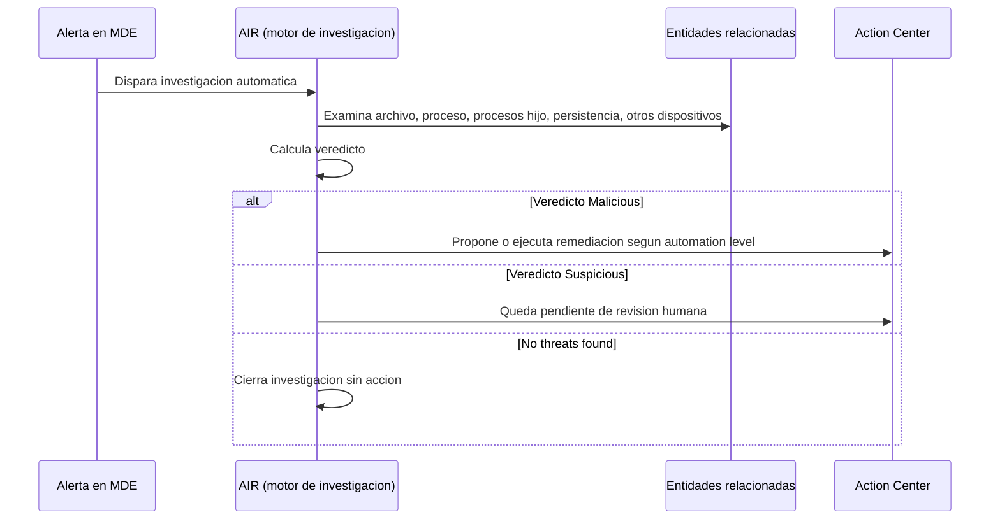
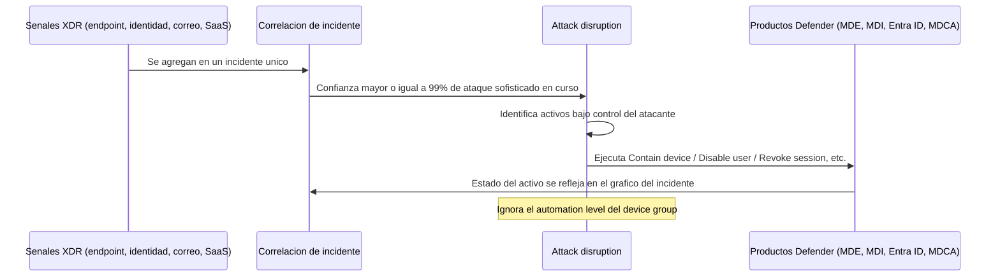
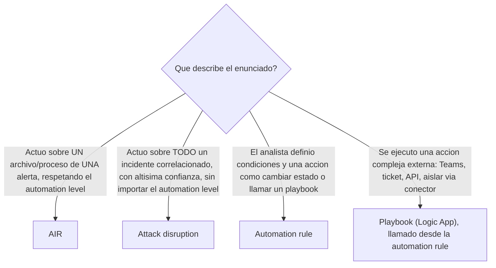
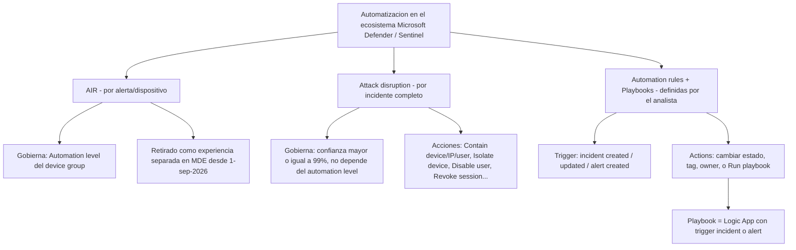
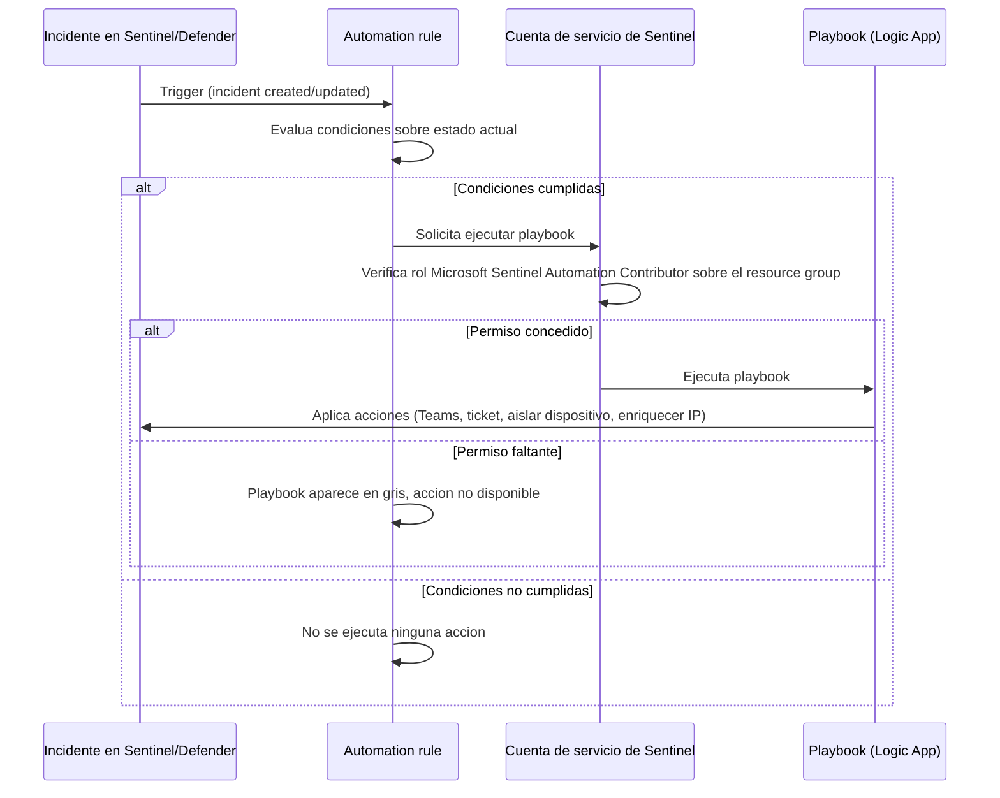
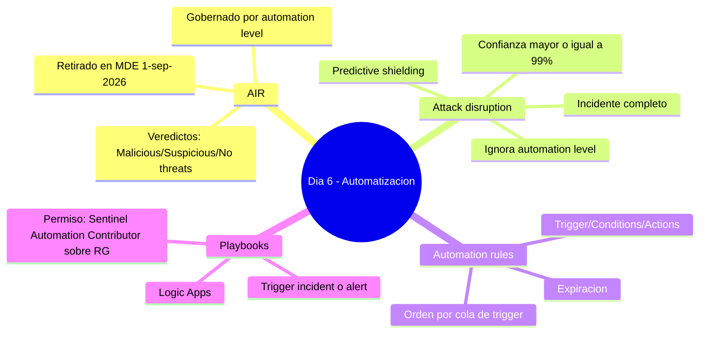

# Lección Día 6 — AIR, Attack Disruption, Automation Rules y Playbooks

> [!info] Contexto
> Día 6 del plan (Dominio 1 — Manage a security operations environment, 40–45% del examen). Hoy cerramos el bloque de **automatización** de MDE y Sentinel: qué actúa solo cuando encuentra evidencia maliciosa en un dispositivo (AIR), qué actúa solo cuando detecta un ataque completo en curso (Attack Disruption), y cómo tú, como analista, construyes tu propia automatización a medida (Automation rules + Playbooks). Es uno de los bloques más preguntados del examen porque pone escenarios casi idénticos entre sí y te pide distinguir cuál mecanismo actuó. Esta versión reescrita el 11-sep-2026 amplía cada concepto desde cero, con diagramas y una tabla de acciones de Attack Disruption ampliada y reverificada, porque el examen está agendado en firme para el **sábado 3 de octubre de 2026**.

> [!warning] Corregido 11-sep-2026 — el retiro de AIR en MDE ya no es una fecha futura
> La versión original de esta lección (24-jul-2026) explicaba el retiro de AIR como algo que ocurriría "a partir del 1 de septiembre de 2026" y tranquilizaba con que el examen (entonces agendado el 29-ago) sería antes del cambio. Verificado hoy contra `learn.microsoft.com/defender-endpoint/automation-levels` (actualizado 14-ago-2026): el texto oficial dice literalmente *"As of September 1, 2026, Automated Investigation and Response (AIR) will no longer run as a separate investigation experience or be available for manual triggering in Microsoft Defender"*. Hoy es 11-sep-2026: **esa fecha ya pasó**. Tu examen del 3-oct-2026 ocurre **después** del retiro. Esto no invalida lo que aprendes hoy — el modelo de veredictos (Malicious/Suspicious/No threats found) y de automation levels sigue siendo el marco conceptual que describe cómo actúa la remediación automática de Defender, y el examen (que se actualiza con más lentitud que el producto) probablemente lo siga preguntando con el vocabulario "AIR" durante un tiempo. Pero en el producto real, hoy, AIR ya no es algo que actives o dispares manualmente en MDE: sus capacidades quedaron absorbidas dentro de la protección antivirus por defecto, que corre sola. **Esto aplica solo a Microsoft Defender for Endpoint** — AIR en Microsoft Defender for Office 365 (investigación automática de phishing/malware en correo) sigue funcionando sin cambios, no fue tocado por este anuncio.

## Lectura del dia

### 1. AIR (Automated Investigation and Response)

**Definicion desde cero.** AIR (Automated Investigation and Response, investigacion y respuesta automatizadas) es la capacidad de Microsoft Defender que, cuando una alerta dispara una investigacion automatica, examina cada entidad relacionada con esa alerta (el archivo, el proceso que lo lanzo, los procesos hijo, las claves de registro de persistencia que creo, los servicios que instalo, otros dispositivos donde aparece el mismo artefacto) para decidir si esa evidencia es realmente una amenaza y, si lo es, remediarla. Piensa en AIR como un investigador automatico que reproduce los pasos que haria un analista humano, que toco este archivo, que otros dispositivos lo tienen, es parte de una cadena mas larga, pero a maquina y en segundos.

**Que problema resuelve.** Un SOC (Security Operations Center) recibe cientos o miles de alertas diarias. Si cada una requiriera investigacion manual completa antes de actuar, el equipo se saturaria y las amenazas reales tardarian horas en contenerse. AIR automatiza la parte repetible de esa investigacion (recolectar evidencia, correlacionar entidades, decidir veredicto) para que el analista humano solo intervenga donde realmente aporta valor: casos ambiguos o de alto impacto.

**Como funciona por dentro.** El resultado de una investigacion de AIR siempre es uno de tres veredictos:

- **Malicious** - se confirma amenaza; se ejecutan (o se proponen, segun el automation level) acciones de remediacion: cuarentena de archivo, terminar proceso, eliminar tarea programada de persistencia, etc.
- **Suspicious** - hay indicios pero no certeza total; normalmente requiere revision humana antes de remediar.
- **No threats found** - la investigacion cierra sola, sin accion.

Que tan agresiva es la remediacion lo decide el automation level del device group al que pertenece el dispositivo (visto el Dia 5: Full, las tres variantes de Semi, o No automated response). Cuando una accion queda pendiente de aprobacion (niveles Semi), aparece en el Action Center del portal de Defender, y si nadie la aprueba ni rechaza en 7 dias, se trata como rechazada automaticamente.

**Donde se configura / rol.** Historicamente, el interruptor maestro vivia en Settings, Endpoints, Advanced features, Automated Investigation; verificado hoy, ese interruptor ya no aparece en la documentacion tras el retiro del 1-sep-2026. Lo que si sigue siendo configurable es el automation level por device group (Settings, Endpoints, Device groups), que hoy gobierna la agresividad de la remediacion integrada en el antivirus. El rol requerido para configurar cualquiera de estas piezas es Security Administrator; para aprobar o rechazar acciones pendientes en el Action Center basta con un rol que incluya "Remediation actions" (por ejemplo Security Operator).

**Ejemplo concreto.** Un dispositivo dispara una alerta por un archivo ejecutable sospechoso descargado desde un correo de phishing. AIR examina automaticamente el archivo, el proceso de Outlook que lo origino, y detecta que el mismo archivo aparece en otros 12 dispositivos de la misma oficina. El veredicto es Malicious. Si el device group esta en Full automation, AIR pone en cuarentena el archivo en los 13 dispositivos sin esperar aprobacion. Si esta en Semi con aprobacion para todas las carpetas, la accion queda pendiente en el Action Center hasta que un analista la apruebe.

**Trampa de examen.** El examen distingue con cuidado entre el alcance de AIR (una alerta y su evidencia local, gobernado por automation level) y el de Attack Disruption (el incidente completo, sin depender del automation level) - lo profundizamos en el siguiente bloque, es la comparacion mas preguntada del dia.

Nota de concepto: [[Conceptos/AIR (Automated Investigation and Response)]]



### 2. Automatic attack disruption

**Definicion desde cero.** Automatic attack disruption (disrupcion automatica de ataques) es la capacidad de Microsoft Defender que correlaciona millones de senales individuales para identificar, con muy alta confianza, campanas activas de ransomware u otros ataques sofisticados, y mientras el ataque esta en progreso, contiene automaticamente los activos comprometidos que el atacante controla.

**Que problema resuelve.** Si AIR investiga una alerta y su evidencia local, Attack Disruption trabaja en una capa distinta: mira el incidente completo, la correlacion de senales de endpoints, identidades, correo/colaboracion y apps SaaS, y cuando esa correlacion describe con muy alta confianza un ataque sofisticado en curso (ransomware operado por humanos, compromiso de correo empresarial/BEC, adversary-in-the-middle/AiTM robando tokens), actua de inmediato para contener los activos que el atacante esta usando para propagarse, sin esperar a que un analista apruebe nada. El objetivo es limitar el movimiento lateral temprano y reducir el costo y la perdida de productividad de un ataque, mientras el equipo de seguridad mantiene control total para investigar, remediar y traer los activos de vuelta.

**Como funciona por dentro.** La logica interna opera en tres etapas, verificadas hoy contra la documentacion oficial (defender-xdr/automatic-attack-disruption, actualizada 28-jun-2026):

1. Correlaciona senales de multiples productos Defender (endpoints, identidades, correo y colaboracion, apps SaaS) en un unico incidente de alta confianza.
2. Identifica que activos (dispositivos, cuentas, direcciones IP) estan bajo control del atacante y sirviendo para propagar el ataque.
3. Ejecuta automaticamente acciones de contencion en los productos Defender relevantes, en tiempo real.

La confianza requerida es extremadamente alta: Microsoft mantiene un umbral de 99% o mas de precision (medido como signal-to-noise ratio, la proporcion de detecciones reales frente a falsos positivos) antes de que un detector de disrupcion se libere en produccion; cada detector nuevo pasa primero por un modo de auditoria y un despliegue gradual, y sigue siendo evaluado dinamicamente despues.

Tabla de acciones que puede ejecutar (verificada y ampliada hoy contra la documentacion oficial, esto es lo que mas pregunta el examen, memoriza que accion corresponde a que producto):

| Accion | Capacidad | Producto | Que hace |
|---|---|---|---|
| Contain device | Attack disruption | Defender for Endpoint | Bloquea comunicacion desde un dispositivo sospechoso, aplicando una politica en todos los dispositivos onboardeados |
| Contain IP | Attack disruption | Defender for Endpoint | Contiene una IP asociada a dispositivos no descubiertos/no onboardeados, bloqueando comunicacion desde esa IP |
| Isolate device | Attack disruption | Defender for Endpoint | Aisla completamente un dispositivo identificado como punto de apoyo activo; bloquea casi todo el trafico salvo servicios de seguridad esenciales |
| Disable user | Attack disruption | Defender for Identity | Deshabilita la cuenta para impedir mas inicios de sesion |
| Contain user | Attack disruption, Predictive shielding | Defender for Endpoint | Bloquea temporalmente comunicacion de red asociada a una identidad sospechosa, reduce movimiento lateral y riesgo de cifrado remoto |
| Revoke user session | Attack disruption | Microsoft Entra ID | Revoca sesiones activas del usuario para interrumpir el acceso |
| Suspend user in Entra | Attack disruption | Microsoft Entra ID | Suspende la cuenta directamente en Entra ID |
| OAuth app compromise | Attack disruption | Defender for Cloud Apps | Ejecuta medidas de proteccion sobre una app OAuth potencialmente comprometida |
| Safeboot hardening | Predictive shielding | Defender for Endpoint | Hardening preventivo que bloquea manipulacion via reinicios en Modo seguro |
| GPO hardening | Predictive shielding | Defender for Endpoint | Hardening preventivo que bloquea abuso de Group Policy |
| Proactive user containment | Predictive shielding | Defender for Endpoint | Contiene proactivamente a un usuario de alto riesgo antes de que escale a incidente, sin cortar sesiones existentes |
| Attach deny policy to AWS user | Attack disruption | Sentinel (conector AWS, preview) | Adjunta una politica deny a un usuario/rol IAM de AWS comprometido para revocar permisos |
| Suspend user in Okta | Attack disruption | Sentinel (conector Okta, preview) | Suspende una cuenta Okta comprometida |

Sobre "Contain user": se usa tanto en Attack disruption como en Predictive shielding, pero de forma distinta. En Attack disruption corta comunicacion de un usuario ya confirmado como parte de un ataque activo. En Predictive shielding aplica restricciones mas selectivas sobre usuarios identificados como de alto riesgo por logica de prediccion, y previene sesiones nuevas en vez de cortar las existentes.

Sobre "Disable user": el comportamiento exacto depende de donde vive la cuenta. Si esta solo en Active Directory local, Defender for Identity dispara la accion en los controladores de dominio con el sensor instalado. Si esta sincronizada a Microsoft Entra ID, ademas se deshabilita alli. Si es una cuenta nativa de la nube (solo Entra ID), Defender for Identity ejecuta la accion en Entra ID mediante una aplicacion empresarial administrada por Microsoft, que valida los roles del usuario via RBAC antes de deshabilitar la cuenta.

Ademas existe Predictive shielding, una categoria hermana que actua de forma preventiva sobre usuarios/dispositivos identificados como de alto riesgo antes de que el ataque escale a incidente confirmado (ya incluida en la tabla de arriba junto a sus acciones especificas).

Diferencia clave AIR vs Attack Disruption (pregunta de examen garantizada):

- AIR actua por dispositivo/alerta, respeta el automation level configurado en el device group, y su alcance es la evidencia de esa alerta especifica (archivo, proceso, persistencia).
- Attack Disruption actua a nivel de incidente completo, con altisima confianza, e ignora el automation level, se ejecuta igual aunque el device group este en "No automated response", porque su criterio de activacion es independiente (basado en la correlacion XDR, no en la configuracion de AIR).

Donde se configura / rol. Settings, Microsoft Defender XDR, Attack disruption (tambien accesible desde Settings, Endpoints, Advanced features, "Configure automatic attack disruption"). Si tienes activos criticos que nunca deben contenerse automaticamente, puedes configurar exclusiones por usuario, dispositivo o IP. Todas las acciones automaticas tambien pueden deshacerse manualmente despues, el equipo de seguridad nunca pierde el control final. Requiere rol Security Administrator para configurar exclusiones.

Como se identifica en el portal: un incidente donde actuo Attack Disruption muestra una etiqueta "Attack Disruption" en la cola de incidentes y en la pagina del incidente, una barra amarilla en la parte superior describiendo la accion tomada, el estado del activo reflejado directamente en el grafico del incidente (por ejemplo "device contained"), y via API el titulo del incidente termina con el sufijo "(attack disruption)".


*Captura oficial de Microsoft Learn: la barra amarilla en la parte superior de la pagina del incidente describe exactamente que accion automatica se tomo; es la senal visual mas rapida de que Attack Disruption actuo, sin tener que leer el titulo completo del incidente.*

Ejemplo concreto. Durante un ataque de ransomware operado por humanos, en cuestion de segundos Defender for Endpoint contiene automaticamente un dispositivo y Defender for Identity deshabilita la cuenta de usuario asociada, sin que ningun analista haya intervenido. El device group de ese dispositivo tiene el automation level "No automated response". Esto no es una falla de configuracion: Attack Disruption ignora ese ajuste porque gobierna un mecanismo distinto, activado por la correlacion de todo el incidente con confianza igual o mayor al 99%.

Trampa de examen. El distractor mas comun es asumir que "No automated response" en el device group tambien desactiva Attack Disruption. No es asi, son dos mecanismos independientes con criterios de activacion distintos.

Nota de concepto: [[Conceptos/Attack disruption]]





### 3. Automation rules

**Definicion desde cero.** Una automation rule es el mecanismo central para gestionar automatizacion en Sentinel/Defender: te permite definir un conjunto pequeno de reglas que se aplican de forma transversal a incidentes y alertas, sin tener que repetir logica en cada analytics rule.

**Que problema resuelve.** Sin automation rules, cada analytics rule tendria que llevar su propia logica de respuesta (a quien asignar, que tag poner, si cerrar el incidente, si llamar un playbook), duplicando configuracion decenas de veces. Las automation rules centralizan esa logica: se definen una vez y se aplican a cualquier incidente o alerta que cumpla sus condiciones, sin importar que analytics rule lo genero.

**Como funciona por dentro.** Se compone de tres piezas:

- Trigger, que evento dispara la regla: "When incident is created", "When incident is updated" (cambio de estado, owner, severity, se agregan alertas/tags/comentarios), o "When alert is created" (solo para alertas generadas por reglas Scheduled, NRT o Microsoft security, no aplica a alertas nativas de Defender XDR sin pasar por Sentinel; en el portal de Defender ademas existen los triggers "Case created" y "Case updated" para Simple Flows, en preview).
- Conditions, filtros sobre propiedades del incidente/alerta y de sus entidades. Para el trigger de creacion se evaluan condiciones sobre el estado actual (equals, contains, starts with, ends with). Para el trigger de actualizacion se suman condiciones de cambio de estado: changed, changed from, changed to, added (por ejemplo, "el status cambio a Closed" o "se agrego un tag").
- Actions, que hace la regla si se cumplen las condiciones: agregar una tarea al incidente, cambiar su estado (incluyendo motivo de cierre), cambiar severidad, asignar un owner, agregar un tag, o ejecutar un playbook. Puedes encadenar varias acciones y el orden en que se listan es el orden en que se ejecutan.

**Orden de ejecucion (detalle que el examen adora, verificado hoy contra la documentacion oficial actualizada 30-jun-2026):** cada tipo de trigger mantiene su propia "cola" de orden, primero se ejecutan, en su orden numerico, todas las reglas con trigger "incident created"; solo despues corren las reglas con trigger "incident updated" (incluso si una regla de creacion disparo una actualizacion). Dentro de la misma cola, las reglas corren secuencialmente, nunca en paralelo, y cada regla evalua sus condiciones contra el estado del incidente despues de que las reglas anteriores ya actuaron, no contra el estado original. Ejemplo textual de la documentacion oficial: si la "Regla 1" baja la severidad de High a Low, y la "Regla 2" solo debia correr sobre incidentes con severidad Medium o superior, la Regla 2 no se ejecuta, porque para cuando le toca evaluar, la severidad ya es Low. Un detalle adicional confirmado hoy: si no hay validacion que impida que dos reglas del mismo trigger tengan el mismo numero de orden, y si eso ocurre, el motor de ejecucion elige aleatoriamente cual corre primero entre ellas.

Tambien puedes definir una fecha de expiracion en una automation rule, muy util para reglas temporales, como suprimir automaticamente los incidentes ruidosos generados durante una ventana de pentesting programado.

**Donde se configura / rol.** En Sentinel o el portal unificado de Defender, Automation, Create, Automation rule. Tambien se pueden crear desde la pestana "Automated response" del wizard de una analytics rule, o desde la pagina de un incidente especifico (util para crear una regla de supresion sobre un incidente recurrente). Requiere el rol Microsoft Sentinel Contributor (o equivalente) sobre el workspace.

**Ejemplo concreto.** "Regla A" (Order=1, trigger creacion) cambia automaticamente la severidad de todo incidente generado por la analytics rule "Suspicious PowerShell activity" de High a Low, porque el SOC la considera ruidosa. "Regla B" (Order=2, mismo trigger) esta configurada para asignar el incidente al equipo Tier 2 solo si la severidad es High o Critical. Cuando se crea un incidente de esa analytics rule, Regla A corre primero y baja la severidad a Low; cuando le toca correr a Regla B, la severidad ya es Low, asi que su condicion no se cumple y nunca asigna el incidente a Tier 2.

**Trampa de examen.** El examen pregunta por el resultado exacto de dos reglas encadenadas describiendo su Order, y espera que sepas que la segunda evalua el estado YA modificado por la primera, no el estado original del incidente.

Nota de concepto: [[Conceptos/Automation rules]]

### 4. Playbooks (Logic Apps)

**Definicion desde cero.** Un playbook es una Logic App de Azure, un flujo de trabajo low-code/no-code, que ejecuta acciones mas complejas que las que una automation rule puede hacer por si sola: enviar una notificacion a Teams, consultar una API externa, crear un ticket en ServiceNow, aislar un dispositivo llamando al conector de Defender for Endpoint, enriquecer una IP contra un feed de threat intelligence, etc.

**Que problema resuelve.** Las automation rules cubren acciones simples predefinidas (cambiar severidad, agregar tag, cerrar incidente), pero no pueden hablar con sistemas externos ni ejecutar logica condicional compleja. Si la automation rule es el orquestador que decide cuando y bajo que condiciones actuar, el playbook es el brazo ejecutor que sabe como hacer algo complejo paso a paso.

**Como funciona por dentro.** Un playbook se construye sobre uno de dos tipos de disparador (trigger): "Microsoft Sentinel incident" (recibe el incidente completo con sus alertas y entidades) o "Microsoft Sentinel alert" (recibe una alerta individual sin incidente asociado). Esto importa porque solo los playbooks con trigger de incidente pueden ser llamados desde automation rules con trigger de incidente, y lo mismo para el par alerta/alerta, no se pueden mezclar. Verificado hoy: en el portal de Defender, para automatizar respuestas a alertas de Defender XDR que no pasan por el trigger clasico, existe el "Enhanced Alert Trigger", pensado especificamente para el portal unificado.

**Permisos, el punto donde mas falla la gente en el examen.** Cuando una automation rule ejecuta un playbook, no lo hace con tu cuenta de usuario, sino con una cuenta de servicio dedicada de Microsoft Sentinel. Para que esa cuenta de servicio pueda ejecutar un playbook concreto, necesita el rol Microsoft Sentinel Automation Contributor otorgado explicitamente sobre el resource group donde vive el playbook (no sobre el playbook individual, y no sobre la suscripcion completa). Una vez otorgado ese permiso sobre el resource group, cualquier automation rule puede ejecutar cualquier playbook de ese resource group. Si el permiso falta, el playbook aparece "en gris" (no seleccionable) en el desplegable de la automation rule; se resuelve desde el enlace "Manage playbook permissions", que a su vez requiere que tu tengas el rol Owner sobre ese resource group para poder concederlo. Playbooks construidos con Logic Apps Standard o Consumption son ambos compatibles con automation rules.

**Timing de ejecucion dentro de una automation rule:** si un playbook tarda menos de 1 segundo, la regla avanza a la siguiente accion justo al terminar; si tarda menos de 2 minutos, la regla espera hasta 2 minutos (o hasta 10 segundos despues de que el playbook termine, lo que ocurra primero); si tarda mas de 2 minutos, la regla avanza de todas formas a los 2 minutos, haya terminado el playbook o no (el playbook sigue corriendo en segundo plano, pero la automation rule ya no espera su resultado).

Un dato historico que aparece en preguntas de "trampa": antes de junio de 2023 se podia adjuntar un playbook directamente a una analytics rule (sin pasar por una automation rule). Esa via ya no existe, hoy la automation rule es el unico mecanismo soportado para invocar un playbook automaticamente.

**Donde se configura / rol.** Automation, Playbooks, Add playbook (Consumption o Standard). Para crear el playbook se necesita permiso de Contributor sobre el resource group de destino; para que la automation rule lo pueda ejecutar, ademas hace falta el rol Microsoft Sentinel Automation Contributor sobre ese resource group, concedido por alguien con rol Owner.

**Ejemplo concreto.** Un analista crea una automation rule y quiere agregar la accion "Run playbook: Isolate-Device-and-Notify", pero el playbook aparece en gris y no se puede seleccionar. El analista tiene rol Sentinel Contributor. Falta que la cuenta de servicio de Microsoft Sentinel tenga el rol Microsoft Sentinel Automation Contributor sobre el resource group donde vive ese playbook, Sentinel Contributor no incluye ese permiso, son roles distintos con propositos distintos. La solucion es abrir el enlace "Manage playbook permissions" desde el propio wizard de la automation rule y conceder el rol sobre el resource group; para hacerlo, quien lo conceda necesita permisos Owner sobre ese resource group especifico.

**Trampa de examen.** El examen pregunta por que un playbook aparece en gris, y el distractor tipico ofrece explicaciones inventadas (tipo de Logic App incompatible, limite de un playbook por workspace); la causa real y unica es siempre el permiso Microsoft Sentinel Automation Contributor faltante sobre el resource group.

Nota de concepto: [[Conceptos/Playbook]]







Notas del vault relacionadas (revisar criticamente, no como fuente): [[PLAN_INTENSIVO_4SEMANAS]] (menciona playbooks y automation rules a nivel superficial), [[Modulo_3_Sentinel]]. Ninguna cubre en detalle el orden de ejecucion por colas de trigger ni la tabla completa de acciones de Attack Disruption.

## Ejemplos concretos

**Ejemplo 1 - Distinguir AIR de Attack Disruption (tipo examen)**

Escenario: "Durante un ataque de ransomware operado por humanos, en cuestion de segundos Defender for Endpoint bloquea la comunicacion de red de un dispositivo y Defender for Identity deshabilita la cuenta de usuario asociada, sin que ningun analista haya intervenido. El device group de ese dispositivo tiene el automation level 'No automated response'. Que explica esta respuesta automatica?"

Razonamiento: El automation level "No automated response" desactiva especificamente la remediacion automatica gobernada por el modelo de AIR para ese device group, pero Automatic attack disruption es un mecanismo distinto que evalua el incidente completo con altisima confianza y actua sin importar el automation level configurado, porque su criterio de activacion no depende de esa configuracion. La combinacion "Contain device (MDE) + Disable user (MDI)" ejecutada en segundos y sin aprobacion es la firma caracteristica de Attack Disruption, no de AIR.

```kql
// Buscar incidentes donde actuo Automatic attack disruption en los ultimos 30 dias (Dia 6)
SecurityIncident
| where TimeGenerated > ago(30d)
| where Title endswith "(attack disruption)" or Tags has "Attack Disruption"
| project TimeGenerated, IncidentNumber, Title, Severity, Status
| order by TimeGenerated desc
```

**Ejemplo 2 - Orden de ejecucion de automation rules (tipo examen)**

Escenario: "'Regla A' (Order = 1, trigger: When incident is created) cambia automaticamente la severidad de todo incidente generado por la analytics rule 'Suspicious PowerShell activity' de High a Low, porque el SOC considera esa deteccion ruidosa. 'Regla B' (Order = 2, mismo trigger) esta configurada para asignar el incidente al equipo Tier 2 solo si la severidad es High o Critical. Se crea un incidente de esa analytics rule. Se asigna al equipo Tier 2?"

Razonamiento: No. Las reglas del mismo tipo de trigger corren secuencialmente segun su Order. Regla A corre primero y baja la severidad a Low. Cuando le toca correr a Regla B, evalua el estado actual del incidente, que ya es Low, no High, asi que su condicion no se cumple y la accion de asignacion nunca se ejecuta. Si el SOC quisiera que Regla B si actuara, tendria que invertir el orden (Regla B con Order menor que Regla A) o basar la condicion de Regla B en el nombre de la analytics rule en vez de la severidad.

**Ejemplo 3 - Permisos de playbook (tipo examen)**

Escenario: "Un analista crea una automation rule y quiere agregar la accion 'Run playbook: Isolate-Device-and-Notify', pero el playbook aparece en gris y no se puede seleccionar. El analista tiene rol Sentinel Contributor. Que falta y como se soluciona?"

Razonamiento: Falta que la cuenta de servicio de Microsoft Sentinel tenga el rol Microsoft Sentinel Automation Contributor sobre el resource group donde vive ese playbook, Sentinel Contributor (el rol del analista) no incluye ese permiso, son roles distintos con propositos distintos. La solucion es abrir el enlace "Manage playbook permissions" desde el propio wizard de la automation rule y conceder el rol sobre el resource group; para hacerlo, quien lo conceda necesita permisos Owner sobre ese resource group especifico.

**Ejemplo 4 - Que hace y que NO hace Predictive shielding (tipo examen, nuevo en esta reescritura)**

Escenario: "Un usuario es senalado por el motor de prediccion de riesgo como de alto riesgo, pero aun no forma parte de ningun incidente confirmado. El sistema aplica 'Proactive user containment' sobre ese usuario. Puede el usuario seguir usando sus sesiones ya iniciadas en otros dispositivos?"

Razonamiento: Si. Proactive user containment (parte de Predictive shielding, no de Attack disruption) restringe selectivamente al usuario para prevenir sesiones NUEVAS y limitar su capacidad de dano potencial, pero a diferencia de "Contain user" dentro de Attack disruption (que corta comunicacion de un usuario ya confirmado en un ataque activo), no corta las sesiones existentes. Es una diferencia sutil que el examen usa para separar "prevencion antes del incidente" de "contencion durante el incidente".

## Videos

1. "Attack Disruption: Live demo" - [Microsoft Learn Shows, serie Microsoft Sentinel & Defender XDR Virtual Ninja Training](https://learn.microsoft.com/en-us/shows/microsoft-sentinel-defender-xdr-virtual-ninja-training/attack-disruption-live-demo), con Mattias Borg (Threat Hunter y MVP de Microsoft). Aproximadamente 19 minutos (00:00 intro, 07:22 demo en vivo, 16:03 insights de attack disruption). Muestra la anatomia completa de un ataque simulado y como Attack Disruption lo contiene en tiempo real, el mejor recurso gratuito y reciente que encontre sobre este tema exacto.
2. Para automation rules y playbooks: no encontre un video de YouTube reciente (2025-2026) que cubra especificamente el orden de ejecucion por colas de trigger y los permisos de Automation Contributor con el nivel de detalle que necesitas para el examen, la mayoria del contenido en video es de 2022-2023 y ya no refleja el modelo actual de order/queues. En su lugar, usa el modulo oficial y actualizado: [Automate threat response in Microsoft Sentinel with automation rules](https://learn.microsoft.com/en-us/azure/sentinel/automate-incident-handling-with-automation-rules) (documento base de esta leccion, verificado hoy 11-sep-2026, actualizado 30-jun-2026) y el tutorial practico [Use a Microsoft Sentinel playbook to stop potentially compromised users](https://learn.microsoft.com/en-us/azure/sentinel/automation/tutorial-respond-threats-playbook), que trae un ejercicio guiado paso a paso.

## Ejercicio practico

> [!info] Requisito
> Usa tu trial M365 E5 / suscripcion Azure for Students con Sentinel habilitado. Recuerda dejar la VM en "Stopped (deallocated)" si la usas, para no gastar credito.

Learn (teoria): [Creacion de detecciones e investigaciones](https://learn.microsoft.com/es-es/training/paths/sc-200-create-detections-perform-investigations-azure-sentinel/) (modulos SOAR)

Lab (practica): [Lab 8 Ex1 - Create a Playbook](https://microsoftlearning.github.io/SC-200T00A-Microsoft-Security-Operations-Analyst/Instructions/Labs/LAB_AK_08_Lab1_Ex01_Playbook_Defender.html)

- [ ] Paso 1 - Crear una automation rule simple. En Sentinel (o el portal unificado de Defender) ve a Automation, Create, Automation rule. Trigger: "When incident is created". Condicion: Severity equals High. Acciones: "Change status" a Active mas "Add tag" con el texto "Revisado-Dia6". Guarda con Order = 1.
- [ ] Paso 2 - Crear un playbook minimo. Desde Automation, Playbooks, Add playbook (Consumption), crea una Logic App con trigger "Microsoft Sentinel incident" y un solo paso "Compose" (o "Post message in a Teams channel" si tienes Teams disponible). No necesita hacer nada destructivo, el objetivo es ver el flujo de creacion y el trigger correcto.
- [ ] Paso 3 - Intentar llamarlo desde la automation rule. Vuelve a tu automation rule del Paso 1, agrega la accion "Run playbook" y selecciona el que acabas de crear. Si aparece en gris, sigue el enlace "Manage playbook permissions" y otorga el rol Microsoft Sentinel Automation Contributor sobre el resource group correspondiente, documenta si tu cuenta tenia o no el permiso Owner necesario para hacerlo.
- [ ] Paso 4 - Revisar Attack Disruption en el portal de Defender. Ve a Settings, Microsoft Defender XDR, Attack disruption (si tu tenant lo expone) y revisa que acciones estan habilitadas y si hay exclusiones configuradas. Si tu tenant universitario tiene el portal unificado limitado, documenta el hallazgo y en su lugar lee [Configure attack disruption capabilities](https://learn.microsoft.com/en-us/defender-xdr/configure-attack-disruption).
- [ ] Paso 5 - corre la query KQL del Ejemplo 1 contra tu workspace (aunque probablemente devuelva 0 filas, sirve para validar la sintaxis contra la tabla SecurityIncident).
- [ ] Paso 6 - responde el quiz de hoy. Si el Paso 2 y 3 (crear el playbook y resolver permisos) requieren mas de 30-40 minutos continuos por trabas de permisos en tu tenant, no los fuerces entre semana, documenta el bloqueo y agenda el resto para el bloque grande del sabado.

## Quiz del dia

> [!warning] Quiz corregido el 29-jul-2026
> La version original de este quiz tenia un defecto grave: las 5 respuestas correctas eran la opcion B, y en las 5 preguntas B era ademas la opcion mas larga y detallada. Se podia sacar 5/5 eligiendo siempre la mas larga, sin saber el tema, la misma fuga que se corrigio en los Dias 1-3 (alli era negrita). Abajo esta la version corregida, con las correctas repartidas (clave C, A, D, A, C) y longitudes parejas. Es la version que se administro en el chat el 27-jul, donde el resultado fue 4/5 (unico fallo: P5).

**P1.** Durante un ataque de ransomware operado por humanos, Defender for Endpoint contiene automaticamente un dispositivo y Defender for Identity deshabilita la cuenta asociada, en segundos y sin intervencion humana. El device group de ese dispositivo tiene automation level "No automated response". Que explica esta respuesta?
A) AIR ignoro el automation level por un error de configuracion del device group
B) Fue un playbook de Logic Apps disparado a mano por un analista de Tier 3
C) Attack disruption actua a nivel de incidente, sin depender del automation level
D) El nivel "No automated response" solo aplica a archivos, no a dispositivos ni cuentas

**P2.** "Regla A" (Order=1, trigger "When incident is created") cambia la severidad de un incidente de High a Low. "Regla B" (Order=2, mismo trigger) solo debe actuar si la severidad es High o Critical. Que ocurre con Regla B sobre ese incidente?
A) No se ejecuta: evalua el estado actual, ya en Low tras correr la Regla A
B) Si se ejecuta: evalua el estado original del incidente, previo a todo cambio
C) Corren en paralelo, asi que el resultado es indeterminado en cada ejecucion
D) El orden es irrelevante: las automation rules no se afectan entre si nunca

**P3.** Un playbook aparece en gris (no seleccionable) al intentar agregarlo como accion "Run playbook" en una automation rule. Cual es la causa mas probable?
A) El playbook usa Logic Apps Standard, incompatible con las automation rules
B) El playbook no tiene entidades mapeadas en su trigger de incidente
C) Las automation rules solo permiten llamar a un playbook por workspace
D) Falta Sentinel Automation Contributor sobre el resource group del playbook

**P4.** Que describe correctamente el cambio de AIR que entra en vigor el 1 de septiembre de 2026?
A) Deja de ser experiencia separada y manual en MDE; Defender for Office 365 sigue igual
B) AIR desaparece de todos los productos Defender, incluido Defender for Office 365
C) Attack disruption reemplaza por completo a AIR en todos los escenarios y productos
D) Todos los device groups pasan a automation level Full sin opcion de cambiarlo

**P5.** Quieres consultar en KQL los incidentes de los ultimos 30 dias donde actuo Automatic attack disruption. Que tabla y que campo revisas?
A) SecurityAlert, campo AlertName
B) DeviceEvents, campo ActionType
C) SecurityIncident, campo Title o Tags
D) IdentityLogonEvents, campo ActionType

### Respuestas explicadas

> [!note]- Ver respuestas (spoiler)
> **P1 - C.** Attack disruption evalua el incidente completo con confianza mayor o igual a 99% y actua sin importar el automation level del device group, que solo gobierna a AIR. A inventa un error inexistente; B contradice el enunciado ("sin intervencion humana"); D es falso: el automation level aplica a todas las acciones de AIR sobre ese device group.
>
> **P2 - A.** Las automation rules del mismo trigger corren secuencialmente segun su Order, y cada una evalua el estado actual del incidente, ya modificado por las anteriores. Por eso B queda fuera de condicion. B invierte el comportamiento; C es falso (no hay paralelismo dentro de un mismo trigger); D contradice la existencia misma del campo Order.
>
> **P3 - D.** El permiso va sobre el resource group donde vive el playbook, no sobre el playbook individual ni la suscripcion; se concede desde "Manage playbook permissions" y requiere ser Owner de ese RG. A es falso: Logic Apps Standard si es compatible. B y C son restricciones inventadas.
>
> **P4 - A.** El retiro aplica solo a Microsoft Defender for Endpoint: AIR deja de existir ahi como experiencia de investigacion separada y de poder activarse manualmente, quedando absorbido en la proteccion antivirus por defecto. AIR en Defender for Office 365 sigue disponible sin cambios, lo que descarta B. C confunde dos mecanismos distintos; D no forma parte del anuncio. Nota de actualidad (11-sep-2026): esta fecha ya paso, hoy el retiro ya es un hecho consumado, no una fecha futura.
>
> **P5 - C.** Este es el que fallaste el 27-jul (respondiste A). Attack disruption opera a nivel de incidente, asi que el registro vive en SecurityIncident: se identifica por el sufijo "(attack disruption)" en el campo Title, o por Tags. A es la trampa: SecurityAlert guarda alertas individuales de producto, no incidentes correlacionados. B y D son tablas de telemetria de endpoint e identidad, no de incidentes.
>
> Regla a fijar: alerta individual de producto va a SecurityAlert; incidente correlacionado de Sentinel va a SecurityIncident. Y SecurityIncident guarda una fila por actualizacion del incidente: usa `summarize arg_max(LastModifiedTime, *) by IncidentNumber` para quedarte con el estado final.

---

*Relacionadas: [[GUIA_INTENSIVA_24_DIAS]] · [[TRACKER_TUTOR]] · [[MAPA_DIARIO_LEARN_LABS]] · [[Dia 05 - Configuracion Avanzada de MDE ASR Rules Advanced Features Device Groups y Custom Data Collection]] · [[Modulo_3_Sentinel]]*

**Fuentes verificadas (Microsoft Learn, verificacion 11-sep-2026):**
- [Automation levels](https://learn.microsoft.com/en-us/defender-endpoint/automation-levels) - actualizado 14-ago-2026 (confirma retiro de AIR desde 1-sep-2026, hoy ya consumado)
- [Automatic attack disruption in Microsoft Defender](https://learn.microsoft.com/en-us/defender-xdr/automatic-attack-disruption) - actualizado 28-jun-2026 (tabla de acciones ampliada y umbral de confianza 99%)
- [Automate threat response in Microsoft Sentinel with automation rules](https://learn.microsoft.com/en-us/azure/sentinel/automate-incident-handling-with-automation-rules) - actualizado 30-jun-2026
