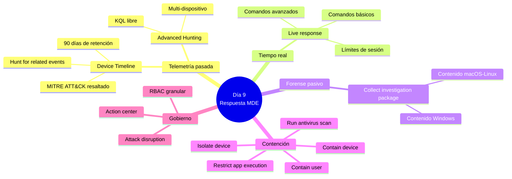
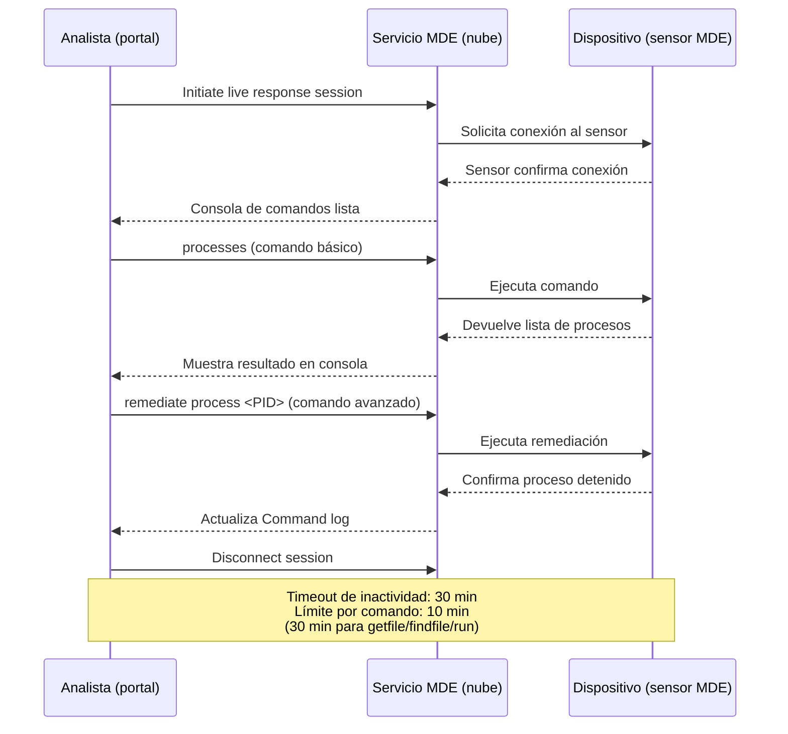
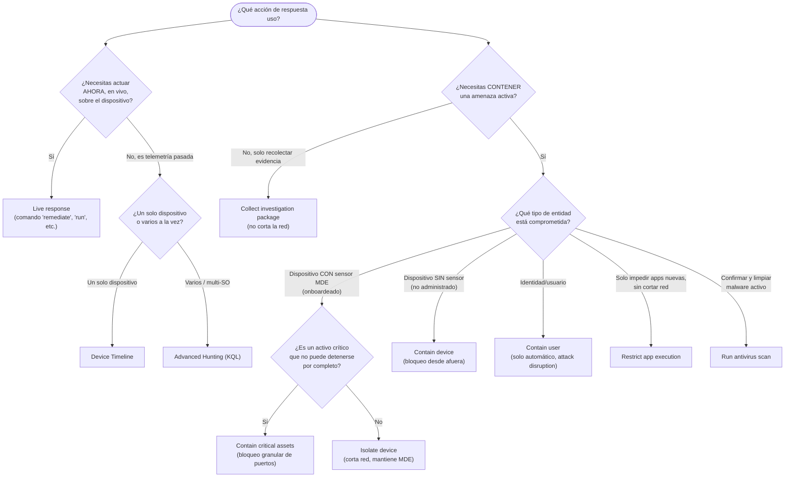

# Lección Día 9 — Respuesta en Microsoft Defender for Endpoint: Timeline, Live Response y Evidencia

> [!info] Contexto
> Día 9 del plan de [[PLAN_MAESTRO_MULTITRACK]], dentro del **Dominio 2 — Respond to security incidents**, que vale entre el **35 % y el 40 %** del examen. Esta lección estaba agendada para el martes 11-ago-2026 y no se dio — el alumno tuvo tres entregas de universidad ese día, exactamente el tipo de choque que el reanclaje #3 (9-ago) ya anticipaba. Se impartió originalmente el miércoles 12-ago, con un día de retraso real, sin maquillarlo. **Esta versión, reescrita el 11-sep-2026, no cambia esa fecha de impartición histórica** — es una reescritura en profundidad del mismo día de contenido, con más fundamentos, más diagramas y hechos re-verificados contra Microsoft Learn a la fecha de hoy. El calendario de [[PLAN_MAESTRO_MULTITRACK]] sigue intacto: el examen es el **sábado 3 de octubre de 2026**.
>
> Este día importa más que el resto por un dato concreto: en tu Practice Assessment oficial del 23-jul (46 %), **el bloque de respuesta en Microsoft Defender for Endpoint (MDE) fue el más débil — cinco fallos seguidos** (Timeline, Live response, Isolate device, Collect investigation package, Advanced hunting, todos mezclados). El diagnóstico que quedó registrado entonces sigue siendo preciso: no fallaste por no saber qué hace cada herramienta — fallaste en **leer el calificador del enunciado** que decide entre herramientas parecidas ("minimizar impacto", "revisar ANTES de que saltara la alerta", "analizar EN VIVO", "preservar evidencia"). Por eso, además de explicar cada herramienta desde cero con su propia nota de concepto, esta lección incluye una **tabla de decisión** que traduce ese calificador directamente a la respuesta correcta — sigue siendo el entregable de mayor valor del día.

---

## 📖 Lectura del día

### 0. Dónde estamos dentro del Dominio 2

El Dominio 2, *Respond to security incidents*, tiene tres sub-bloques según el temario vigente ("skills measured as of July 28, 2026"):

| Sub-bloque | Qué agrupa | Cuándo lo ves |
|---|---|---|
| Respond to alerts and incidents in Microsoft Defender XDR | Gestión de incidentes, case management, respuesta por producto (MDO, Purview, Defender for Cloud, MDCA, Entra ID, MDI), ataques multi-etapa, agentic AI/Copilot | Días 8, 10-13 |
| **Respond to alerts and incidents in Microsoft Defender for Endpoint** | **Device timeline, live response, collect investigation package, evidencia y entidades, attack disruption** | **Hoy (Día 9)** |
| Investigate Microsoft 365 activities to identify threats | Purview Audit, eDiscovery, Microsoft Graph activity logs | Día 13 |

Hoy cerramos el segundo sub-bloque casi completo: nos falta únicamente la parte de "entidades" (investigar archivos, usuarios, dominios) que se apoya en las mismas herramientas de hoy y se retoma de forma natural cuando lleguemos a Advanced Hunting (Días 14-16).

### 1. El panorama completo: qué es un "dispositivo" y qué puede hacer un analista con él

Antes de entrar herramienta por herramienta, hace falta fijar el objeto sobre el que todo esto actúa: el **dispositivo** (llamado *device* o, en la documentación más técnica, *machine*). Es cualquier endpoint — una laptop, un servidor, una máquina virtual — que tiene instalado el **sensor de MDE**, un agente ligero que corre en segundo plano y envía telemetría continua (procesos, archivos, conexiones de red, cambios de registro, inicios de sesión) al servicio en la nube de Microsoft Defender for Endpoint. A ese proceso de instalar el sensor y conectar el dispositivo al servicio se le llama **onboarding** (incorporación) — es un concepto que ya viste en el Día 5 y que hoy vuelve a ser relevante porque **varias herramientas de respuesta solo funcionan en dispositivos onboardeados**.

Cuando MDE detecta o sospecha una amenaza en un dispositivo, un analista tiene, en esencia, una fila completa de botones en la parte superior de la **página del dispositivo** (`security.microsoft.com` → **Assets → Devices** → seleccionar un dispositivo). Verificado hoy contra Microsoft Learn, esa fila de "response actions" (acciones de respuesta) incluye, de izquierda a derecha: **Manage tags**, **Initiate automated investigation**, **Initiate live response session**, **Collect investigation package**, **Run antivirus scan**, **Restrict app execution**, **Isolate device**, **Contain device**, **Consult a threat expert**, y **Action center**.


*Captura oficial de Microsoft Learn: la fila de botones que verás siempre en la parte superior de cualquier página de dispositivo. Fíjate en que "Timeline" no es un botón de esta fila — es una pestaña dentro de la misma página, junto a "Overview", "Alerts", "Vulnerabilities", etc.*

> [!warning] Corregido 11-sep-2026 — una capa de licenciamiento que la versión anterior de esta lección no mencionaba
> No todas las acciones de la fila están disponibles con cualquier licencia. **Defender for Endpoint Plan 1** (el nivel más básico) solo incluye cuatro acciones manuales: **Run antivirus scan**, **Isolate device**, **Stop and quarantine a file**, y **Add an indicator to block or allow a file**. El resto de las acciones que vas a ver hoy — Collect investigation package, Restrict app execution, Contain device, Live response — requieren **Defender for Endpoint Plan 2**. Tu trial M365 E5 trae Plan 2, así que en tu lab de hoy verás la fila completa, pero es un dato de examen: si el enunciado menciona "Plan 1", elimina de tu razonamiento cualquier opción que no esté en esa lista corta de cuatro.

Antes de entrar al detalle de cada herramienta, conviene fijar el eje que las organiza, porque es exactamente el eje que el examen explota:

- **¿Estoy mirando el pasado o actuando en el presente?** El Timeline y Advanced Hunting muestran telemetría **ya recolectada** — nada de lo que hagas ahí cambia el dispositivo. Live response, en cambio, es una conexión **en tiempo real** al dispositivo: lo que corres ahí sucede ahora mismo, en la máquina remota.
- **¿Estoy recolectando evidencia o conteniendo una amenaza?** Collect investigation package es **forense pasivo**: descarga un paquete de datos sin tocar la conectividad ni el funcionamiento del dispositivo. Isolate device, Contain device, Contain user y Restrict app execution son **acciones de contención**: cambian activamente lo que el dispositivo (o el usuario) puede hacer.
- **¿El dispositivo está administrado por MDE o no?** Isolate device solo aplica a dispositivos **onboardeados** (con el sensor de MDE instalado). Contain device existe precisamente para el caso contrario: un dispositivo **no administrado** que hay que aislar "desde afuera".



### 2. Device Timeline: el historial cronológico de un dispositivo

**Definición desde cero.** El **Timeline** (línea de tiempo) es una pestaña dentro de la página de un dispositivo específico en el portal de Microsoft Defender (`security.microsoft.com`) que muestra, en orden cronológico, **todos los eventos observados en ESE dispositivo**: procesos que se ejecutaron, archivos creados o modificados, conexiones de red, cambios de registro, inicios de sesión, alertas generadas, y más — toda la telemetría que el sensor de MDE recolectó de esa máquina.

**Por qué existe.** Cuando un analista recibe una alerta, esa alerta es solo un punto en el tiempo — el momento en que algo cruzó un umbral de detección. Pero un ataque real casi nunca empieza en ese punto: el atacante puede llevar horas o días dentro del dispositivo antes de que algo dispare una alerta formal. El Timeline resuelve el problema de "¿qué pasó antes de la alerta, en este dispositivo concreto?" sin obligar al analista a escribir una sola consulta.

**Cómo funciona por dentro.** El sensor de MDE envía continuamente eventos crudos al servicio en la nube. El Timeline toma esos eventos, ya asociados a ese dispositivo específico, y los renderiza en una vista cronológica navegable. Cada evento puede expandirse para ver detalles, y algunos eventos —los que coinciden con una técnica conocida— se enriquecen automáticamente con la técnica **MITRE ATT&CK** correspondiente.

**Dónde se configura / desde dónde se ejecuta.** No requiere configuración: está disponible por defecto para cualquier usuario con el permiso **View data (Security Operations)** — el nivel de acceso más básico del RBAC de MDE (sección 6). Se llega a ella desde el inventario de dispositivos (**Assets → Devices**), desde una alerta en la cola, o desde un incidente — seleccionas el dispositivo y abres la pestaña **Timeline**.

Capacidades clave que el examen puede preguntar de forma puntual:

- **Rango de fechas personalizado.** Por defecto muestra los últimos **30 días**, pero puedes elegir un rango custom. El dato de retención importante, re-verificado hoy: por defecto, los eventos del Timeline se conservan **90 días** según la política de retención de datos de seguridad del tenant (la del portal, distinta de la retención del workspace de Log Analytics si tienes uno conectado con retención extendida). Si necesitas datos de hace más de 90 días y no tienes un workspace con retención mayor, ya no están disponibles en el Timeline.
- **Vista de árbol de procesos (process tree).** Al seleccionar un evento, un panel lateral muestra la relación padre-hijo entre procesos — útil para entender qué proceso lanzó a cuál.
- **Técnicas MITRE ATT&CK.** Los eventos asociados a una técnica o subtécnica del framework MITRE ATT&CK aparecen resaltados en negrita con un ícono azul, con la técnica y su ID visibles en "Additional information".
- **Marcado de eventos (event flags).** Puedes marcar con una bandera los eventos importantes durante una investigación, y luego filtrar/exportar solo los marcados — sirve para construir una "línea de tiempo limpia" del ataque para un reporte.
- **"Hunt for related events".** Desde el panel de detalle de un evento (o de una técnica MITRE), puedes lanzar directamente una query de **Advanced hunting** ya construida que trae el evento seleccionado más otros eventos que ocurrieron alrededor del mismo momento en el mismo endpoint. Es el puente formal entre Timeline y Advanced hunting.
- **Exportación.** Puedes exportar el Timeline del día actual o de un rango de hasta **7 días**.

**Ejemplo concreto de escenario SOC.** Llega una alerta de "PowerShell sospechoso" en `WKS-042` a las 14:32. Antes de escalar, el analista abre el Timeline de `WKS-042`, retrocede a las 13:00, y observa que un archivo adjunto se abrió desde Outlook a las 13:05, seguido de un proceso hijo de Word que lanzó PowerShell a las 13:07 — la cadena completa del ataque, reconstruida sin escribir una sola línea de código.

**Trampa de examen.** El punto que el examen más te va a poner a prueba: **Timeline vs Advanced Hunting**. Ambos consultan telemetría ya recolectada, así que suenan intercambiables — no lo son. El Timeline está **acotado a un solo dispositivo** y no necesita KQL (Kusto Query Language, el lenguaje de consulta de Sentinel y Advanced Hunting): es la herramienta correcta cuando la pregunta ya te dio el dispositivo y quiere que reconstruyas qué pasó ahí, especialmente **antes** de que existiera una alerta formal. Advanced hunting, en cambio, es una consulta libre en KQL que puede cruzar **múltiples dispositivos, sistemas operativos y tablas a la vez** — es la herramienta correcta cuando la pregunta pide **alcance** ("¿en qué otros dispositivos apareció este hash?", "¿qué tan lejos llegó el atacante?").

Nota de concepto: [[Conceptos/Device timeline]]

### 3. Live response: shell remoto en tiempo real

**Definición desde cero.** **Live response** le da a un analista acceso instantáneo a un dispositivo mediante una **conexión de shell remota** (una consola de comandos que se ejecuta directamente sobre el dispositivo, aunque el analista esté físicamente en otra parte del mundo), para hacer trabajo de investigación profundo y tomar acciones de contención inmediatas **en tiempo real**.

**Por qué existe.** El Timeline te dice qué pasó. Live response te deja **actuar ahora mismo**: correr comandos, subir y bajar archivos, ejecutar scripts, y remediar entidades directamente en el dispositivo comprometido, sin tener que esperar a que el usuario final haga algo o a que una acción automática se dispare.

**Cómo funciona por dentro.** Cuando inicias una sesión, el portal abre un panel de consola que se comunica con el sensor de MDE instalado en el dispositivo; el sensor ejecuta los comandos localmente y devuelve el resultado a la consola del analista. Cada sesión queda registrada con un **dashboard**: quién la creó, cuándo empezó, cuánto duró, y un **Command log** con cada comando ejecutado (ID, línea de comando, duración, estado).



**Prerrequisitos, dos capas separadas (y esto es un punto fino de examen):**

1. **A nivel de tenant:** hay que habilitar Live response en **Settings → Endpoints → Advanced features** (solo administradores o usuarios con el permiso **"Manage Portal Settings"** pueden hacerlo). Hay un toggle adicional para habilitarlo también en **servidores** (recomendado), y otro opcional para permitir la ejecución de **scripts sin firmar** (aumenta el riesgo, así que es una decisión deliberada; la verificación de firma solo aplica a scripts de PowerShell).
2. **A nivel de usuario:** el analista necesita el permiso RBAC (Role-Based Access Control, control de acceso basado en roles) de **Live response capabilities**, que se concede en un rol custom (**Settings → Endpoints → Roles**) — este permiso es **independiente** del que te deja isolar o contener dispositivos. Se profundiza en la sección 6.

**Dónde se configura / desde dónde se ejecuta.** Desde el inventario de dispositivos (**Assets → Device inventory**) o directamente desde la página del dispositivo, botón **Initiate live response session**. El requisito de sistema operativo es amplio (Windows 10/11, macOS, Linux, Windows Server 2016 en adelante), así que en la práctica la limitación real casi siempre es de permisos, no de plataforma.

**Comandos: básicos vs avanzados.** El rol asignado al analista determina qué tipo de comandos puede correr. Esta tabla está re-verificada hoy contra la documentación oficial, incluyendo la columna de plataforma que la versión anterior de esta lección no traía completa:

| Comando | Qué hace | Windows | macOS | Linux |
|---|---|---|---|---|
| `dir`, `cd`, `cls` | Navegación básica de archivos y consola | Sí | Sí | Sí |
| `processes` | Lista procesos corriendo | Sí | Sí | Sí |
| `connections` | Muestra conexiones activas | Sí | No | No |
| `registry` | Muestra valores de registro | Sí | No | No |
| `drivers`, `services`, `scheduledtasks` | Inventario del sistema | Sí | No | No |
| `fileinfo` | Información sobre un archivo | Sí | Sí | Sí |
| `getfile <ruta>` | Descarga un archivo (básico, solo lectura) | Sí | Sí | Sí |
| `findfile` | Localiza archivos por nombre | Sí | Sí | Sí |
| `run` (avanzado) | Ejecuta un script de PowerShell/Bash ya subido a la librería | Sí | Sí | Sí |
| `putfile` (avanzado) | Sube un archivo del dispositivo | Sí | Sí | Sí |
| `remediate` (avanzado) | Elimina/detiene una entidad: archivo, proceso, servicio, registro, tarea programada | Sí | Sí | Sí |
| `undo` (avanzado) | Revierte una remediación | Sí | No | No |
| `analyze` (avanzado) | Analiza una entidad con motores de detección | Sí | No | No |
| `collect` (avanzado) | Recolecta un paquete forense **desde la consola de live response** | No | Sí | Sí |
| `scan` (avanzado) | Antivirus scan rápido | No | Sí | Sí |
| `isolate` / `release` (avanzado) | Aísla o libera el dispositivo | No | Sí | No |

> [!warning] Corregido 11-sep-2026 — el comando `collect` no es lo mismo que el botón "Collect investigation package"
> La versión anterior de esta lección no distinguía esto. Hoy la documentación oficial confirma que existe un comando `collect` dentro de la consola de live response — pero solo para **macOS y Linux**, no para Windows. En Windows, la forma de obtener el paquete forense completo es siempre el botón **Collect investigation package** de la página del dispositivo (sección 4), no un comando dentro de Live response.

La trampa real, ya señalada en el simulacro: dentro de la consola de Live response, los comandos `isolate` y `release` **solo existen para macOS**. En Windows, aislar un dispositivo se hace desde el botón **Isolate device** de la página del dispositivo, no desde un comando dentro de la sesión de Live response.

**Novedad verificada hoy, no documentada en la versión anterior de esta lección: descarga de archivos en segundo plano.** Si un `getfile` va a tardar (archivo grande), puedes escribir `getfile "ruta" &` para que corra en segundo plano y seguir investigando; `Ctrl+Z` mueve una descarga en curso al segundo plano, y `fg <command_id>` la trae de vuelta al primer plano. Límites de tamaño: `getfile` hasta 3 GB, `fileinfo` hasta 30 GB, `library` (subir a la librería del tenant) hasta 250 MB, `putfile` hasta 300 MB en Windows y 10 MB en otras plataformas.

**Límites operativos que el examen puede citar textualmente:** máximo **50 sesiones de live response simultáneas** en el tenant, un analista puede iniciar hasta **5 sesiones concurrentes**, el timeout por inactividad de una sesión es de **30 minutos**, y cada comando individual tiene un límite de **10 minutos** (30 minutos para `getfile`, `findfile` y `run`). Un dispositivo solo puede estar en una sesión a la vez.

**Trampa de examen.** Si el enunciado dice "analizar en vivo" o "actuar ahora mismo sobre un proceso en ejecución", la respuesta casi nunca es Timeline ni Advanced hunting (eso es pasado) — es Live response. Pero el distractor típico es olvidar la segunda capa: aunque el analista tenga acceso a Live response, el comando concreto que necesita (`remediate`, `run`, `putfile`) puede requerir el nivel **Advanced**, no el **Basic**.

Nota de concepto: [[Conceptos/Live response]]

### 4. Collect investigation package: forense pasivo, sin tocar la red

**Definición desde cero.** **Collect investigation package** es una acción que descarga un archivo comprimido (.zip) con el **estado actual del dispositivo** en el momento de la recolección, pensada para entender qué herramientas y técnicas usó un atacante — **sin ejecutar nada en el dispositivo ni alterar su conectividad**.

**Por qué existe.** A veces un analista necesita evidencia forense completa (procesos, conexiones, persistencia) pero **no** quiere alertar al atacante de que fue detectado, ni interrumpir a un usuario que está trabajando, ni arriesgarse a que un falso positivo cause una interrupción innecesaria. Isolate device resolvería la amenaza pero al costo de un impacto inmediato y visible; Collect investigation package resuelve "necesito ver qué pasó" sin ese costo.

**Cómo funciona por dentro.** Al confirmar la acción desde la página del dispositivo (con un comentario obligatorio explicando el motivo), el sensor de MDE ejecuta en el dispositivo una serie de comandos de recolección locales (listar procesos, leer el registro de auto-arranque, volcar la caché DNS, etc.), empaqueta los resultados, y los sube al **Action center**, desde donde el analista descarga el .zip. Nota operativa verificada hoy: la recolección puede **fallar** si el dispositivo tiene batería baja o está en una conexión medida (metered connection) — un detalle que no aparecía en la versión anterior de esta lección y que el examen podría usar como distractor ("¿por qué falló la recolección?").


*Captura oficial: así se ve el botón dentro de la fila de acciones de respuesta. El flujo completo pide un comentario obligatorio antes de confirmar.*

**Dónde se configura / rol necesario.** No requiere configuración previa. El permiso necesario es **Alerts investigation** (sección 6) — **no** hace falta el permiso más invasivo de Active remediation actions.

**Contenido, para Windows** (verificado hoy contra Microsoft Learn, con una carpeta adicional que la versión anterior no mencionaba): **Autoruns** (puntos de arranque automático, para detectar persistencia), **Installed programs**, **Network connections** (conexiones TCP/IP activas, tabla ARP — Address Resolution Protocol —, caché DNS, configuración de firewall, log de ejecución del firewall), **Prefetch files** (rastro de aplicaciones ejecutadas, incluso ya borradas), **Processes** (procesos corriendo al momento de la recolección), **Scheduled tasks**, **Security event log** (log de eventos de seguridad de Windows), **Services**, sesiones **SMB** (Server Message Block, para detectar movimiento lateral o exfiltración), **System Information**, **Temp Directories**, **Users and Groups**, **WdSupportLogs** (logs de soporte de Microsoft Defender Antivirus, solo en versiones recientes de Windows 10+), y un **CollectionSummaryReport.xls** que resume qué se recolectó y si hubo errores.

**Contenido, para macOS y Linux:** aplicaciones instaladas (solo macOS), volumen de disco, archivos abiertos con su proceso asociado, historial de shell (solo macOS), módulos de kernel cargados (solo macOS), conexiones de red activas, procesos, historial de inicio de sesión, sudoers, y (solo macOS) información de integridad EFI (Extensible Firmware Interface) y estado de SIP (System Integrity Protection).

**Ejemplo concreto de escenario SOC.** En un dispositivo de un ejecutivo, Defender genera una alerta de severidad media mientras el ejecutivo está en una llamada importante. El analista recolecta el paquete de investigación para revisar procesos y conexiones de red sin cortar su acceso — si resulta ser un falso positivo, no hubo ningún impacto visible para el usuario.

**Trampa de examen.** Este paquete **no aísla el dispositivo ni corta su red**. Es exactamente la herramienta cuando el enunciado pide "minimizar el impacto en el usuario" o "evitar alertar al atacante" — porque, a diferencia de Isolate device, el dispositivo sigue funcionando con normalidad mientras se recolecta la evidencia.

Nota de concepto: [[Conceptos/Collect investigation package]]

### 5. Las acciones de contención: Isolate, Contain device, Contain user, Restrict app execution y Run AV scan

Estas acciones sí **cambian** algo activamente en el dispositivo, en el usuario o en la red. Se diferencian por **qué** cambian y **a qué tipo de entidad** aplican.

**Isolate device (aislar dispositivo).** Desconecta al dispositivo **onboardeado** de la red, **manteniendo su conexión con el servicio de MDE** (para que se siga pudiendo monitorear y gestionar). Existen dos modos: **aislamiento completo** (corta todo salvo la comunicación con MDE) y **aislamiento selectivo** (permite excepciones configurables — por ejemplo, mantener Outlook y Teams activos, o procesos/destinos específicos vía *isolation exclusions*). Requiere al menos el permiso **Active remediation actions**. Datos de examen re-verificados hoy: **la desisolación es automática a los 7 días** si nadie la libera antes manualmente; si el dispositivo está offline cuando se envía la orden de aislamiento, MDE **reintenta aplicarla hasta por 3 días**, y si no se reconecta en ese plazo, hay que reenviar la acción manualmente.

**Contain device (contener dispositivo).** Se usa para un dispositivo **NO administrado** por MDE (no tiene el sensor instalado) — por ejemplo, un dispositivo IoT o de red comprometido que se detectó por su comportamiento. En vez de aislarlo directamente (no se puede, no tiene sensor), Contain hace que **todos los dispositivos onboardeados de MDE bloqueen las comunicaciones entrantes y salientes hacia ese dispositivo** — es una contención "desde afuera". Microsoft recomienda contener como máximo **100 dispositivos a la vez** por temas de rendimiento, y el efecto tarda hasta **5 minutos** en propagarse a todos los dispositivos onboardeados.

**Contain critical assets (contener activos críticos).** Una variante más granular de Contain, pensada para activos que no se pueden permitir el lujo de quedar completamente aislados — controladores de dominio, servidores DNS, servidores DHCP. En vez de bloquear todo el tráfico, aplica una política que **bloquea solo puertos y direcciones de comunicación específicos**, manteniendo el activo operativo mientras corta la propagación del ataque.

**Contain user (contener usuario) — sección ampliada hoy.** Cuando una **identidad** (no un dispositivo) está comprometida, Contain user bloquea, a nivel de endpoint, los protocolos típicos de movimiento lateral asociados a esa cuenta: inicios de sesión de red, RPC (Remote Procedure Call), SMB, y RDP (Remote Desktop Protocol) en todos los dispositivos onboardeados soportados — además, termina sesiones remotas activas y cierra conexiones RDP existentes de esa cuenta. El tráfico legítimo de la cuenta sigue funcionando con normalidad para el resto de operaciones.

> [!warning] Corregido 11-sep-2026 — Contain user tiene un matiz que la versión anterior de esta lección no explicaba
> Contain user **no deshabilita la cuenta en el proveedor de identidad** (no la bloquea en Microsoft Entra ID) — actúa exclusivamente a nivel de endpoint, restringiendo lo que esa identidad puede hacer sobre dispositivos protegidos por MDE. Y un dato de examen clave, verificado hoy: **actualmente, contener a un usuario solo se activa de forma automática mediante Automatic attack disruption — no existe un botón para que un analista dispare esta acción manualmente.** Un usuario contenido por attack disruption se libera automáticamente a los **5 días** (distinto de los 7 días del Isolate device), o antes si un administrador con el rol **Global Administrator** de Microsoft Entra lo libera manualmente desde el Action center.

**Restrict app execution (restringir ejecución de apps).** Aplica una política de integridad de código que solo permite ejecutar archivos **firmados por Microsoft**. Es reversible (**Remove app restrictions**) y es más quirúrgico que Isolate: corta la posibilidad de ejecutar programas nuevos, pero no corta la red del dispositivo. Requiere Windows 10 1709+ o Windows Server 2019+, y que el dispositivo use Microsoft Defender Antivirus.

**Run antivirus scan.** Inicia remotamente un scan de Microsoft Defender Antivirus, en modalidad **rápido (quick)** o **completo (full)**. Puede correr en paralelo a otro antivirus de terceros, incluso si Defender Antivirus está en modo pasivo. Dato nuevo verificado hoy: el escaneo remoto respeta el valor `ScanAvgCPULoadFactor` — por defecto, limita el uso de CPU durante el scan a un **máximo del 50 %**.



Nota de concepto: [[Conceptos/Isolate device]] · [[Conceptos/Contain device]] · [[Conceptos/Restrict app execution]]

### 6. RBAC: quién puede hacer qué (la pieza que más falta en tu mapa mental)

Este es un punto que el simulacro no llegó a probarte directamente pero que es una fuente natural de preguntas de examen, y que además explica *por qué* existen escenarios como "minimizar impacto": porque en un SOC real, no todos los analistas tienen permiso para las acciones más invasivas. En **Settings → Endpoints → Roles**, un rol custom se arma combinando permisos independientes. Tabla re-verificada hoy con la redacción exacta de Microsoft Learn:

| Permiso | Qué habilita | Ejemplos de acciones |
|---|---|---|
| View data — Security Operations | Solo lectura | Ver alertas, incidentes, dispositivos, Timeline |
| **Active remediation actions — Security Operations** | Tomar acciones con impacto real en el dispositivo o la red | Isolate device, Contain device, Restrict app execution, aprobar/rechazar remediaciones pendientes, gestionar listas de indicadores bloqueados/permitidos |
| **Alerts investigation** | Investigar y recolectar evidencia sin necesariamente contener | Gestionar alertas, iniciar Automated investigation, correr Run antivirus scan, **Collect investigation package**, gestionar tags de dispositivo, descargar archivos PE (Portable Executable) |
| **Manage portal system settings** | Configuración global del tenant | Storage settings, SIEM, API de threat intel, advanced settings, roles, device groups — solo disponible en el rol de Administrador por defecto |
| **Manage security settings in Security Center** | Configuración operativa | Alert suppression, exclusiones de automatización, onboarding/offboarding de dispositivos, notificaciones por correo, evaluation lab |
| **Live response capabilities — Basic** | Sesión de solo lectura | Iniciar sesión, comandos de solo lectura (`dir`, `processes`, `getfile`), sin poder subir ni ejecutar nada |
| **Live response capabilities — Advanced** | Control remoto completo | Subir/ejecutar scripts de la librería, `remediate`, `undo`, `analyze` |

Fíjate en algo importante: **Alerts investigation te permite recolectar un investigation package sin darte permiso para aislar el dispositivo** (eso es Active remediation actions, un permiso distinto). Un analista junior podría estar autorizado exactamente para "capturar evidencia" pero no para "cortar la red" — que es, casi textualmente, el tipo de escenario que ya te costó puntos en el simulacro.

> [!warning] Nota sobre el modelo de permisos vigente
> Lo anterior es el modelo clásico de roles específico de MDE (`Settings → Endpoints → Roles`), documentado y vigente hoy (verificado contra Microsoft Learn, actualizado 17-jun-2026). Desde el **16 de febrero de 2025**, los tenants **nuevos** de MDE usan por defecto el **Unified RBAC (URBAC)** de Defender XDR — el mismo sistema de permisos "Security operations > ..." que ya viste en case management el Día 8 —, mientras que los tenants existentes conservan sus roles clásicos. Para el examen, ambos modelos son justificables; la tabla de arriba es la que documenta Microsoft Learn con el detalle más fino por acción, así que es la más útil para responder preguntas puntuales.

Nota de concepto: [[Conceptos/RBAC MDE]]

### 7. Action center: el registro de todo lo que se hizo

**Definición desde cero.** El **Action center** (`security.microsoft.com/action-center`) es la pantalla que centraliza el historial de **todas las acciones de respuesta** que se tomaron sobre dispositivos y archivos en el tenant — quién las lanzó, cuándo, sobre qué entidad, y si tuvieron éxito o fallaron.

**Por qué existe.** Cuando lanzas una acción (Collect investigation package, Isolate device, Run antivirus scan, Restrict app execution), esa acción no siempre se completa al instante — el dispositivo puede estar offline, la recolección puede tardar minutos. El Action center es el lugar donde vuelves a **verificar el estado** y, en el caso de Collect investigation package, **descargar el resultado**.

**Cómo funciona por dentro.** Cada vez que se dispara una acción de respuesta (manual o automática, incluidas las de Automatic attack disruption), se crea una entrada con timestamp, usuario o sistema que la disparó, entidad afectada, y estado (pending, succeeded, failed). Las acciones automáticas de attack disruption también aparecen aquí, incluyendo su estado si fueron **"Skipped"** por una regla de exclusión configurada.

**Dónde se configura / rol necesario.** No requiere configuración — cualquier usuario con **View data** puede consultarlo; para descargar un investigation package hace falta además el permiso que autorizó la acción original (Alerts investigation).

**Ejemplo concreto.** Un analista lanzó Collect investigation package hace 10 minutos y el navegador no descargó nada porque cerró la pestaña. Vuelve al Action center, busca la entrada más reciente de ese dispositivo, y selecciona "Package collection package available" para descargar el .zip de nuevo.

**Trampa de examen.** El Action center **no es un lugar donde se disparan nuevas acciones** — es un historial y un punto de descarga. Si el enunciado pide "iniciar" una acción, la respuesta está en la página del dispositivo, no en el Action center.

Nota de concepto: [[Conceptos/Action center]]

### 8. La conexión con Attack disruption (Día 6) — y el retiro de AIR, ya consumado

Ya viste en el Día 6 que **Automatic attack disruption** puede ejecutar automáticamente algunas de estas mismas acciones — en particular **Isolate device**, **Contain device**, **Contain user**, **Contain IP** (dispositivos no descubiertos) y **Revoke user session** — a nivel de **incidente completo**, sin intervención manual, cuando el sistema tiene alta confianza de que un ataque está en curso. La diferencia con lo que viste hoy no es la acción en sí (el mecanismo de aislamiento es el mismo), sino **quién la dispara**: aquí lo hace un analista manualmente, evaluando el escenario; ahí lo dispara el sistema automáticamente. Isolate device también existe hoy en una variante **"automatic attack disruption isolate device (preview)"**, que es exactamente ese disparo automático aplicado a este botón concreto.

> [!warning] Corregido 11-sep-2026 — el retiro de AIR ya no es un evento futuro, ya ocurrió
> La versión anterior de esta lección, escrita el 12-ago, hablaba del retiro de AIR (Automated Investigation and Response) del 1-sep-2026 en futuro. **Hoy, 11-sep-2026, esa fecha ya pasó.** Confirmado: desde el 1-sep-2026, AIR **dejó de existir como experiencia de investigación separada y ya no se puede disparar manualmente** en Microsoft Defender for Endpoint — esto aplica **únicamente a MDE**; el AIR de Defender for Office 365 (que verás el Día 10) sigue funcionando sin cambios. Las capacidades de detección y respuesta que tenía AIR ya están integradas de forma automática en la protección estándar de Microsoft Defender Antivirus. **Consecuencia práctica de examen:** si ves una pregunta sobre "iniciar una investigación automatizada manualmente en un dispositivo de MDE", ya no es la respuesta correcta — el reemplazo funcional para investigación bajo demanda es correr un **Run antivirus scan completo**. Ojo: la documentación de Microsoft Learn para la página de acciones de respuesta que se usó hoy como fuente (actualizada 25-ago-2026) todavía lista "Initiate automated investigation" como botón visible en la interfaz — es probable que el botón siga apareciendo en el portal por un tiempo de transición aunque su función real de disparo manual ya esté retirada. Para el examen, trata "disparar AIR manualmente" como una opción obsoleta.

Nota de concepto: [[Conceptos/Attack disruption]] (ya creada en días anteriores; hoy se amplía con Contain user)

### 9. La tabla de decisión: el calificador del enunciado manda

Esto es lo que realmente te costó los cinco puntos del simulacro, así que aquí está construida desde cero, con el razonamiento completo de por qué cada calificador elimina a las demás opciones. Tabla ampliada hoy con dos filas nuevas (Contain user, Contain critical assets) que la versión anterior no cubría:

| El enunciado dice (calificador) | Herramienta correcta | Por qué NO las demás |
|---|---|---|
| "Reconstruir qué pasó en ESTE dispositivo ANTES de que se disparara la alerta" | **Timeline** | Advanced hunting sirve para consultas libres, no para reconstruir de forma directa un solo host; Live response es en tiempo real, no mira el pasado |
| "Identificar el ALCANCE de un incidente en varios dispositivos o distintos sistemas operativos" | **Advanced hunting** | Timeline está acotado a UN dispositivo a la vez; no cruza hosts ni sistemas operativos |
| "Analizar EN VIVO, interactuar con un proceso sospechoso, correr un comando AHORA" | **Live response** | Timeline y Advanced hunting son telemetría ya recolectada — pasado, no presente; no permiten "tocar" el dispositivo |
| "Capturar evidencia forense MINIMIZANDO el impacto al usuario / sin alertar al atacante / evitando un falso positivo de aislar sin necesidad" | **Collect investigation package** | Isolate device SÍ corta la red del dispositivo — es exactamente el impacto que el enunciado pide evitar |
| "Cortar la red de un dispositivo ONBOARDEADO y comprometido, riesgo alto de propagación" | **Isolate device** | Contain device es para dispositivos NO administrados; Restrict app execution no corta la red, solo la ejecución de apps |
| "Bloquear las comunicaciones de un dispositivo NO administrado (sin sensor de MDE) que otros equipos sí detectan en la red" | **Contain device** | Isolate solo aplica a dispositivos onboardeados — este dispositivo, por definición, no lo está |
| "Un servidor crítico (controlador de dominio) está comprometido pero NO puede quedar completamente fuera de línea" | **Contain critical assets** | Isolate device cortaría el dispositivo por completo; esta variante solo bloquea puertos y direcciones específicos |
| "Bloquear el movimiento lateral de una IDENTIDAD comprometida, sin deshabilitar la cuenta en Entra ID" | **Contain user** (solo vía attack disruption automático) | No es una acción manual disponible por botón; y no es lo mismo que deshabilitar la cuenta en el proveedor de identidad |
| "Impedir que corran programas nuevos no firmados, SIN cortar la red completa" | **Restrict app execution** | Isolate es más agresivo: corta toda la red, no solo la ejecución de apps nuevas |
| "Confirmar si hay malware activo y limpiarlo automáticamente" | **Run antivirus scan** | Collect investigation package no remedia nada, solo recolecta evidencia pasiva |
| "Delegar la investigación automática de una alerta repetida en el mismo dispositivo" (ya no vigente tras 1-sep-2026) | Ya no aplica — usar **Run antivirus scan completo** | AIR manual en MDE está retirado; Live response es manual e interactivo, no automatizado |

**El patrón detrás de la tabla, resumido en una frase:** cuando el enunciado trae un calificador ("minimizar impacto", "antes de la alerta", "en vivo", "sin sensor instalado", "sin poder detenerse por completo"), ese calificador casi siempre **elimina la opción más genérica o más agresiva** (Isolate, Advanced hunting sin acotar) a favor de la herramienta más quirúrgica para ese caso puntual.

---

## 💡 Ejemplos concretos

### Ejemplo 1 — Timeline vs Advanced hunting: el calificador "antes de la alerta"

**Escenario:** Un incidente se genera a las 14:32 por una alerta de "Suspicious PowerShell commandline" en el dispositivo `WKS-042`. El analista sospecha que el atacante estuvo activo en ese equipo desde antes, y necesita reconstruir qué procesos y conexiones de red ocurrieron en `WKS-042` **entre las 13:00 y las 14:32**, antes de que la alerta se disparara.

**Razonamiento:** el enunciado ya te dio el dispositivo específico (`WKS-042`) y un rango de tiempo concreto, y pide reconstruir una secuencia — exactamente el caso de uso del **Timeline**: abres la página de `WKS-042`, seleccionas la pestaña Timeline, ajustas el rango de fechas personalizado a 13:00-14:32, y filtras por tipo de evento (procesos, red). No hace falta escribir una sola línea de KQL. Si en cambio el enunciado hubiera pedido "confirmar si ese mismo hash de PowerShell apareció en otros dispositivos de la organización", ahí sí correspondería Advanced hunting, porque cruza múltiples hosts:

```kql
DeviceProcessEvents
| where ProcessCommandLine has "IEX" or ProcessCommandLine has "-EncodedCommand"
| where Timestamp between (datetime(2026-08-12T13:00:00Z) .. datetime(2026-08-12T14:32:00Z))
| project Timestamp, DeviceName, AccountName, FileName, ProcessCommandLine, InitiatingProcessFileName
| order by Timestamp asc
```

Esta query es, en esencia, el mismo tipo de consulta que genera el botón **"Hunt for related events"** cuando lo usas desde un evento del Timeline — el puente entre las dos herramientas.

### Ejemplo 2 — Collect investigation package vs Isolate device: el calificador "minimizar impacto"

**Escenario:** En un dispositivo de un ejecutivo (`LT-CEO-01`), Defender genera una alerta de severidad media por un archivo sospechoso. El analista necesita capturar memoria, lista de procesos, conexiones de red activas y el log de eventos de seguridad, **minimizando el impacto al usuario y evitando actuar en falso** si resulta ser un falso positivo — el ejecutivo está en una llamada importante.

**Razonamiento:** el calificador "minimizando el impacto al usuario" es la señal directa. **Isolate device** cortaría la red de inmediato — impacto real, inmediato, sobre alguien que está en una llamada — y si termina siendo un falso positivo, ese impacto fue innecesario. **Collect investigation package** recolecta exactamente los datos que el enunciado pide (procesos, network connections, security event log — todos están en las carpetas documentadas del paquete) **sin tocar la conectividad del dispositivo**. El analista con solo el permiso **Alerts investigation** (sin Active remediation actions) puede hacer esta acción, pero no podría aislar el dispositivo aunque quisiera — el sistema de permisos refleja el mismo principio de "acción mínima necesaria" que pide el enunciado.

### Ejemplo 3 — Live response con RBAC granular: el calificador "en vivo"

**Escenario:** Un proceso sospechoso sigue corriendo en `SRV-DB-07` en este momento. El analista de turno, con el rol **"Analista Nivel 1"** (que solo tiene **Live response capabilities — Basic**), necesita terminar el proceso y eliminar el archivo asociado de inmediato.

**Razonamiento:** "en este momento" y "terminar el proceso ahora" descartan Timeline y Advanced hunting (telemetría pasada) — corresponde **Live response**. Pero aquí hay una segunda capa: el comando `remediate` (que detiene procesos y elimina archivos) es un comando **avanzado**, y el analista solo tiene permisos **básicos** (solo lectura: `dir`, `processes`, `getfile`). El analista puede conectarse, listar el proceso con `processes` y confirmar el archivo con `fileinfo`, pero **no puede ejecutar `remediate`** — necesita escalar a un analista con **Live response capabilities — Advanced**, o usar el botón de acción de dispositivo **Restrict app execution** (que sí cae bajo su alcance si además tiene Active remediation actions) como alternativa de contención mientras espera el escalamiento.

---

## 🎥 Videos

1. **[Live Response | Microsoft Defender for Endpoint](https://www.youtube.com/watch?v=z9gODTDljBU)** — canal oficial de Microsoft Security. Nota de honestidad: es un video más antiguo (circulando desde 2023) y no encontré un reemplazo 2025/2026 mejor en YouTube; lo mecánico de Live response (consola, comandos básicos/avanzados, subir/bajar archivos) no ha cambiado de fondo, así que sigue siendo útil como introducción visual. Duración aproximada 3-5 minutos.
2. **[Perform actions on a device using Microsoft Defender for Endpoint](https://learn.microsoft.com/en-us/training/modules/perform-actions-device-microsoft-defender-for-endpoint/)** — módulo oficial de Microsoft Learn (re-verificado hoy, sigue activo), 7 unidades que cubren exactamente el temario de hoy: acciones de dispositivo, antivirus scan, **Collect investigation package** y **Live response**. No es un video, pero es la fuente más alineada y más al día que encontré — recomendado como complemento directo de esta lección, con quiz de módulo incluido.

---

## 🧪 Ejercicio práctico

> [!info] Requisito
> Usa tu trial M365 E5 / portal de Defender (`security.microsoft.com`), **no** el tenant universitario de La Salle (portal unificado limitado, ya detectado en sesiones anteriores).

- [ ] **Paso 1 — Explorar Roles.** Ve a **Settings → Endpoints → Roles**. Abre el rol por defecto (o crea uno de prueba) y localiza los permisos de la tabla de la sección 6: View data, Active remediation actions, Alerts investigation, y las dos opciones de Live response capabilities (Basic/Advanced). Confirma que son casillas independientes entre sí.
- [ ] **Paso 2 — Confirmar prerrequisitos de Live response.** Ve a **Settings → Endpoints → Advanced features** y confirma que el toggle de **Live response** esté visible (ya lo viste en el Día 5). Anota si el toggle de "servidores" y el de "scripts sin firmar" están activados por defecto en tu trial.
- [ ] **Paso 3 — Explorar un dispositivo (si tienes uno onboardeado).** Ve a **Assets → Devices**, abre cualquier dispositivo disponible y explora la pestaña **Timeline**: prueba el selector de rango de fechas, marca un evento con la bandera, y si aparece algún evento con técnica MITRE ATT&CK, ábrelo para ver el panel lateral.
- [ ] **Paso 4 — Collect investigation package (si tienes un dispositivo real onboardeado).** Selecciona **Collect investigation package** desde la barra de acciones del dispositivo, escribe un comentario, confírmalo, y cuando el Action center te avise que está listo, descarga el .zip y abre las carpetas para verificar que coinciden con la tabla de la sección 4 (Autoruns, Processes, Network connections, etc.).
- [ ] **Paso 5 — Revisar el Action center.** Ve a `security.microsoft.com/action-center` y localiza la entrada de la acción que acabas de lanzar. Confirma el estado (succeeded/pending/failed) y el usuario que la disparó.
- [ ] **Paso 6 (si no tienes un dispositivo onboardeado) —** haz el módulo de Learn del apartado de Videos (unidades 2 a 5), que simula el flujo completo con capturas de pantalla reales, y complementa con el lab oficial [Lab 4 Ex2 — Mitigate Attacks with Microsoft Defender for Endpoint](https://microsoftlearning.github.io/SC-200T00A-Microsoft-Security-Operations-Analyst/Instructions/Labs/LAB_AK_04_Lab1_Ex02_Mitigate_Attacks.html) si tienes acceso al sandbox de pago de Microsoft Learn — genera un incidente real en `WIN1` que puedes luego explorar en su Timeline.
- [ ] **Paso 7 —** responde el quiz del día y el repaso acumulativo de abajo.

---

## ✅ Quiz del día

Cinco preguntas sobre el contenido nuevo de hoy. Responde antes de abrir el bloque de respuestas.

**1.** Un analista abre el Timeline de un dispositivo para revisar un incidente que ocurrió hace 120 días, pero no encuentra ningún evento de esa fecha aunque el dispositivo sigue onboardeado y activo. ¿Cuál es la explicación más probable?

- A) El Timeline solo admite un máximo de 30 días de rango de fechas configurable, sin excepción
- B) El Timeline requiere reprocesar manualmente cada evento con Advanced hunting antes de mostrarlo
- C) La retención por defecto del Timeline es de 90 días y ese evento ya expiró sin un workspace de retención extendida
- D) El evento fue movido automáticamente a la tabla `SecurityIncident` y ya no aparece en el Timeline

**2.** Una organización detecta que un dispositivo IoT sin sensor de MDE instalado se está comunicando con varios equipos administrados de la red y podría estar comprometido. ¿Qué acción usan para bloquear esas comunicaciones?

- A) Isolate device, en modo de aislamiento selectivo
- B) Contain device, para bloquear comunicaciones desde los dispositivos administrados hacia él
- C) Restrict app execution, aplicando la política de integridad de código
- D) Collect investigation package, para documentar el comportamiento antes de actuar

**3.** Ana tiene un rol con el permiso "Alerts investigation" pero no tiene "Active remediation actions" ni "Live response capabilities". ¿Cuál de las siguientes acciones SÍ puede realizar?

- A) Recolectar un investigation package del dispositivo
- B) Aislar el dispositivo desde el botón Isolate device
- C) Ejecutar el comando `remediate` sobre un archivo malicioso
- D) Iniciar una sesión de live response con comandos básicos

**4.** Durante una sesión de Live response contra un dispositivo Windows, un analista escribe el comando `isolate` en la consola esperando cortar la red del equipo. ¿Qué ocurre?

- A) El comando se ejecuta con éxito y el dispositivo queda aislado de inmediato
- B) El comando requiere primero ejecutar `connect` para habilitarse en cualquier sistema operativo
- C) El comando funciona, pero solo aplica aislamiento selectivo, nunca aislamiento completo
- D) El comando `isolate` dentro de Live response solo existe para macOS; en Windows se usa el botón Isolate device de la página del dispositivo

**5.** El equipo de cumplimiento pregunta si el paquete descargado con Collect investigation package interrumpe la conectividad de red del dispositivo mientras se recolecta. ¿Cuál es la respuesta correcta?

- A) Sí, el dispositivo queda aislado automáticamente durante la recolección y se libera al terminar
- B) No, es una recolección pasiva de datos que no cambia la conectividad ni el funcionamiento del dispositivo
- C) Depende del sistema operativo: en Windows sí aísla, en macOS y Linux no
- D) Sí, pero solo si el dispositivo forma parte de un incidente activo en ese momento

> [!note]- Ver respuestas
> **1 — C.** Verificado hoy contra Microsoft Learn: la retención por defecto de los eventos del Timeline en Microsoft Defender for Endpoint es de **90 días**, salvo que el tenant tenga un workspace de Log Analytics o Sentinel conectado con retención extendida. **A** es falso: el rango configurable admite fechas más allá de 30 días, el límite real es de retención, no de selector. **B** inventa un paso que no existe: Timeline no depende de Advanced hunting para mostrar eventos. **D** confunde el nivel del dato: `SecurityIncident` es una tabla de Sentinel a nivel de incidente correlacionado, no un destino de migración de eventos individuales del Timeline.
>
> **2 — B.** Contain device existe exactamente para este escenario: un dispositivo **no administrado** (sin sensor de MDE) que no se puede aislar directamente porque Isolate solo funciona sobre dispositivos onboardeados. Contain hace que los dispositivos administrados bloqueen las comunicaciones hacia y desde ese dispositivo, conteniéndolo "desde afuera" — un proceso que puede tardar hasta 5 minutos en propagarse. **A** es incorrecta porque Isolate no aplica a dispositivos sin sensor. **C** restringe apps, no bloquea comunicaciones de red entre dispositivos. **D** solo recolecta evidencia, no bloquea nada.
>
> **3 — A.** El permiso "Alerts investigation" incluye explícitamente Collect investigation package, además de gestionar alertas, iniciar Automated investigation (ya retirado en MDE desde el 1-sep-2026, ver sección 8), correr AV scan y gestionar tags — sin necesitar Active remediation actions. **B** requiere el permiso Active remediation actions, que Ana no tiene. **C** requiere el permiso separado Live response capabilities — Advanced, que tampoco tiene. **D** requiere como mínimo Live response capabilities — Basic, un permiso que Ana no tiene en este escenario.
>
> **4 — D.** Dentro de la consola de Live response, los comandos `isolate` y `release` solo están disponibles para dispositivos macOS; en Windows y Linux no existen como comandos de Live response, y el aislamiento en Windows se hace desde la acción de dispositivo Isolate device, fuera de la sesión de Live response. **A** describe el comportamiento en macOS, no en Windows. **B** inventa un requisito técnico que no existe. **C** es falso: la elección entre aislamiento completo y selectivo se hace al iniciar Isolate device desde la página del dispositivo, no depende del comando `isolate` de Live response.
>
> **5 — B.** Collect investigation package es forense pasivo: descarga un paquete con el estado del dispositivo (procesos, conexiones de red, autoruns, logs, etc.) sin alterar su conectividad ni su funcionamiento normal — es justamente lo que lo distingue de Isolate device. Nota operativa: puede **fallar** si el dispositivo tiene batería baja o conexión medida, pero eso no es "aislamiento", es un fallo de recolección. **A** describe Isolate device, no esta acción. **C** inventa una diferencia por sistema operativo que no existe para esta acción específica. **D** también es falso por el mismo motivo que A: no hay aislamiento asociado a esta acción bajo ninguna condición.

---

## 🔁 Repaso acumulativo — re-test espaciado

Estas preguntas re-testean puntos ya medidos como débiles en sesiones anteriores, con otro enunciado. Incluye, como estaba marcado para hoy, el re-test de P1 y P5 del quiz del Día 7.

**R1.** Un administrador con el rol **Microsoft Sentinel Contributor** intenta crear un workbook nuevo desde cero en un resource group donde nunca antes se había creado ninguno, y la operación falla. ¿Qué le falta?

- A) Nada le falta: Sentinel Contributor ya incluye todo lo necesario para crear workbooks
- B) El rol **Workbook Contributor** sobre ese resource group, además de su rol de Sentinel
- C) El rol Logic App Contributor, porque los workbooks se ejecutan como Logic Apps por debajo
- D) Acceso de administrador global de Azure, porque crear workbooks es una operación a nivel de suscripción

**R2.** Un analista de SOC está en **Settings → Microsoft Defender XDR → Email notifications**, revisando cómo configurar el envío de correos cuando aparezca un nuevo incidente de severidad alta. ¿En qué rama del portal está correctamente parado?

- A) Está equivocado: las notificaciones de incidentes viven en Settings → Endpoints → General
- B) Está en la rama correcta: las notificaciones de incidentes viven exactamente ahí
- C) Está equivocado: las notificaciones de incidentes se configuran solo desde una automation rule, no desde Settings
- D) Está equivocado: las notificaciones de incidentes requieren primero crear un playbook de Logic Apps

**R3.** Una analytics rule de Sentinel correlaciona tres alertas individuales de distintos productos (Defender for Endpoint, Entra ID Protection y Defender for Cloud Apps) en un solo caso de investigación. ¿En qué tabla de Log Analytics consultas ese caso correlacionado como una sola entidad?

- A) `SecurityAlert`, filtrando por el campo `ProductName`
- B) `AlertEvidence`, que combina las tres alertas en una fila
- C) `ThreatIntelIndicators`, porque ahí se guardan las correlaciones automáticas
- D) `SecurityIncident`, que representa la correlación hecha por Sentinel

**R4.** El reporte **Risky users** y el reporte **Risky sign-ins** de Entra ID Protection muestran información distinta. Un analista necesita identificar qué usuarios acumularon actividad de riesgo **a lo largo de las últimas dos semanas**, no un evento de inicio de sesión puntual. ¿Qué reporte usa?

- A) Risky sign-ins report, porque agrupa todos los inicios de sesión sospechosos del periodo
- B) Ninguno de los dos: esa vista solo existe en Microsoft Sentinel vía KQL
- C) Risky users report, porque agrega el riesgo de un usuario a través del tiempo, no por evento individual
- D) Risky sign-ins report, filtrando por el campo `RiskState` en lugar de por usuario

> [!note]- Ver respuestas
> **R1 — B (re-test P1, Día 7).** Crear o eliminar workbooks exige la **combinación** de un rol de Sentinel **más** el rol **Workbook Contributor** sobre el resource group — ninguno de los dos solo es suficiente. **A** es justamente el error que cometiste el 9-ago: Sentinel Contributor no incluye por sí solo el permiso de Azure Resource Manager para gestionar el recurso "workbook". **C** confunde tecnologías: los workbooks no corren sobre Logic Apps (eso son los playbooks). **D** es un permiso excesivo e innecesario.
>
> **R2 — A (re-test P5, Día 7).** Las notificaciones de **incidentes** se configuran en **Settings → Endpoints → General**, no en la rama de Microsoft Defender XDR de Email notifications (que es la ruta de notificaciones de **vulnerabilidades**). Es la trampa exacta que ya te costó puntos: dos rutas de notificación que suenan intercambiables y no lo son. **B** describe la ruta de vulnerabilidades, no la de incidentes. **C** y **D** inventan requisitos previos que no existen para simplemente recibir un correo.
>
> **R3 — D.** Regla fijada tras el fallo del quiz del Día 6: una **alerta individual** de un producto vive en `SecurityAlert`; un **incidente correlacionado** por Sentinel (varias alertas de distintos productos unidas en una sola historia de ataque) vive en `SecurityIncident`. **A** describe la tabla de alertas sueltas, no de la correlación. **B** describe mal `AlertEvidence`, que guarda entidades de evidencia de una alerta, no la correlación de varias alertas. **C** es un distractor inventado: esa tabla es de indicadores de threat intelligence, sin relación con correlación de alertas.
>
> **R4 — C.** El **Risky users report** agrega el riesgo de un usuario **a través del tiempo** (varias señales acumuladas), mientras que el **Risky sign-ins report** muestra riesgo **por evento puntual** de inicio de sesión. El enunciado pide explícitamente "a lo largo de las últimas dos semanas", que es la definición misma del primero. **A** y **D** describen el reporte equivocado para ese calificador de tiempo. **B** es falso: ambos reportes existen de forma nativa en el portal de Entra ID Protection, sin necesidad de Sentinel.

---

## ⚠️ Trampas del examen en los temas de hoy

1. **Timeline ≠ Advanced hunting.** Timeline: un solo dispositivo, sin KQL, ideal para "antes de la alerta". Advanced hunting: multi-dispositivo/multi-SO, con KQL, ideal para "alcance del incidente".
2. **Collect investigation package NO aísla el dispositivo.** Es forense pasivo; si el enunciado pide "minimizar impacto" o "sin cortar la red", esta es casi siempre la respuesta, no Isolate device. Puede fallar por batería baja o conexión medida.
3. **Isolate device (dispositivo onboardeado) ≠ Contain device (dispositivo NO administrado) ≠ Contain critical assets (bloqueo granular en activos que no pueden detenerse).** El criterio que decide entre las dos primeras es si el dispositivo tiene o no el sensor de MDE instalado.
4. **Contain user solo se dispara automáticamente vía attack disruption — no hay botón manual.** Y no deshabilita la cuenta en Entra ID, solo bloquea protocolos de movimiento lateral a nivel de endpoint. Se libera a los 5 días (distinto de los 7 de Isolate device).
5. **La retención por defecto del Timeline es de 90 días**, no ilimitada ni de 30.
6. **RBAC de MDE es granular y las capas son independientes:** Active remediation actions (contener) ≠ Alerts investigation (recolectar/AV scan) ≠ Live response capabilities Basic/Advanced (shell remoto). Tener uno no implica tener los otros.
7. **Dentro de Live response, `isolate`/`release` solo existen como comandos para macOS**; el comando `collect` (paquete forense desde la consola) solo existe para macOS y Linux, no Windows. En Windows, aislar es un botón de la página del dispositivo, y el paquete forense se obtiene con Collect investigation package.
8. **El aislamiento manual de dispositivo se levanta automáticamente a los 7 días**; si el dispositivo está offline, MDE reintenta la orden hasta 3 días.
9. **Restrict app execution no corta la red** — solo bloquea la ejecución de programas no firmados por Microsoft. Es más quirúrgico que Isolate device, no un sinónimo.
10. **AIR (Automated Investigation and Response) en MDE ya está retirado desde el 1-sep-2026** — no se puede disparar manualmente. El reemplazo funcional para investigación bajo demanda es Run antivirus scan completo. El AIR de Defender for Office 365 sigue vigente sin cambios.
11. **`SecurityAlert` (alerta individual de producto) vs `SecurityIncident` (incidente correlacionado de Sentinel)** — regla que ya falló dos veces en este curso, reforzada hoy en R3.
12. **Defender for Endpoint Plan 1 solo trae cuatro acciones manuales** (Run antivirus scan, Isolate device, Stop and quarantine a file, Add an indicator to block/allow): el resto —incluida Collect investigation package y Live response— requiere Plan 2.

---

## 🔗 Notas relacionadas

- [[Conceptos/Device timeline]] · [[Conceptos/Live response]] · [[Conceptos/Collect investigation package]] · [[Conceptos/Isolate device]] · [[Conceptos/Contain device]] · [[Conceptos/Restrict app execution]] · [[Conceptos/Action center]] · [[Conceptos/RBAC MDE]] — notas de concepto nuevas de hoy
- [[Dia 06 - AIR Attack Disruption Automation Rules y Playbooks]] — Attack disruption, sus acciones automáticas (Isolate/Contain/Revoke session) y el retiro de AIR del 1-sep-2026 (solo Defender for Endpoint), que hoy se conecta directamente con la sección 8
- [[Dia 07 - Workbooks SOC Optimization Roles de Sentinel y Notificaciones]] — origen de R1 y R2 del repaso acumulativo de hoy
- [[Dia 08 - Incidentes Unificados y Case Management]] — RBAC unificado de Defender XDR (Security operations > ...), mencionado como contraste con el RBAC clásico de MDE de la sección 6
- [[Dia 10 - MDO Threat Explorer ZAP y MDCA]] — siguiente día, mismo patrón de tabla de decisión por calificador aplicado a MDO y MDCA
- [[PLAN_MAESTRO_MULTITRACK]] — calendario vigente, examen 3-oct-2026
- [[REPASO_RAPIDO_Errores_Simulacro]] — §6, origen del diagnóstico que hoy se ataca de raíz
- [[TRACKER_TUTOR]]

## 📚 Fuentes verificadas hoy (11-sep-2026)

- [Take response actions on a device in Microsoft Defender for Endpoint](https://learn.microsoft.com/en-us/defender-endpoint/respond-machine-alerts) — actualizado 23-jul-2026 (fecha de contenido), verificado 25-ago-2026, fuente principal de las secciones 1, 4, 5 y 7 (fila completa de acciones, contenido del investigation package, Isolate/Contain/Contain user/Contain critical assets, Action center)
- [Investigate devices in Microsoft Defender for Endpoint](https://learn.microsoft.com/en-us/defender-endpoint/investigate-machines) — fuente principal de la sección 2 (Timeline, retención de 90 días, MITRE ATT&CK, event flagging)
- [Investigate entities on devices using live response](https://learn.microsoft.com/en-us/defender-endpoint/live-response) — actualizado 28-jul-2026, fuente principal de la sección 3 (prerrequisitos, comandos básicos/avanzados por plataforma, descarga en segundo plano, límites)
- [Create and manage roles for role-based access control](https://learn.microsoft.com/en-us/defender-endpoint/user-roles) — actualizado 17-jun-2026, fuente principal de la sección 6 (permisos RBAC exactos, y el aviso sobre URBAC desde 16-feb-2025)
- [AIR retirement in Microsoft Defender for Endpoint (MC1411577)](https://m365admin.handsontek.net/microsoft-defender-automated-investigation-response-air-integrated-antivirus-manual-triggering-removed/) — confirmación del retiro efectivo desde el 1-sep-2026, usada en la sección 8
- [Study guide for Exam SC-200](https://learn.microsoft.com/en-us/credentials/certifications/resources/study-guides/sc-200) — skills measured as of July 28, 2026, verificado el desglose del Dominio 2
