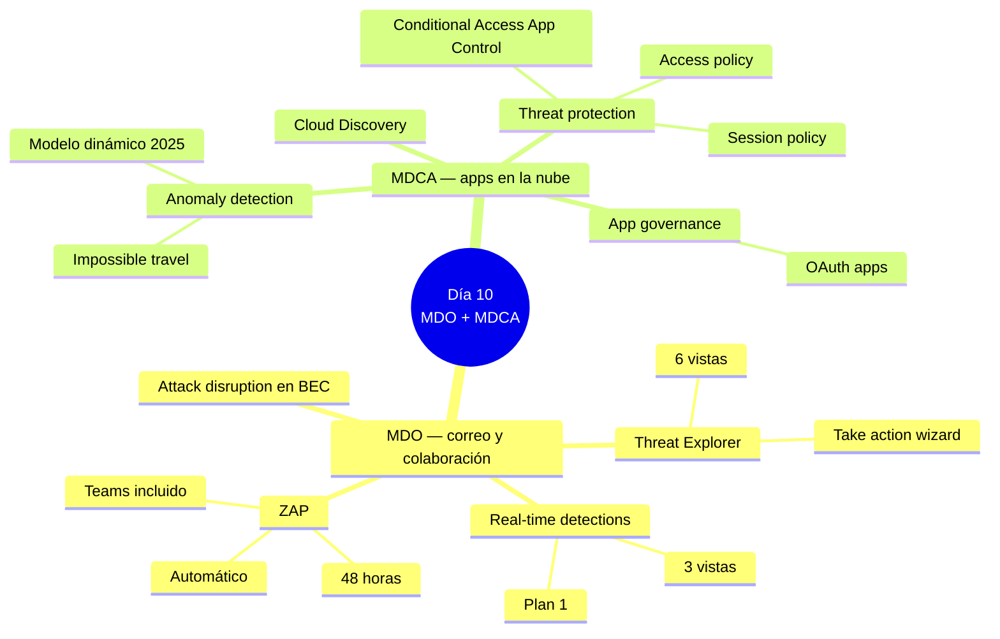
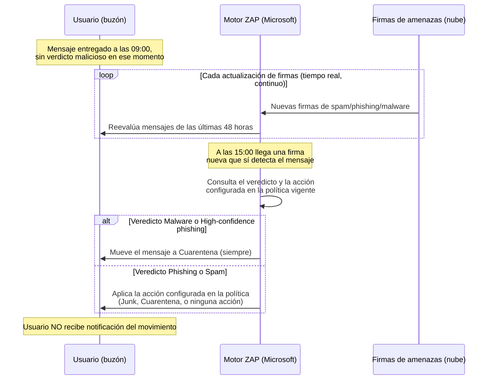
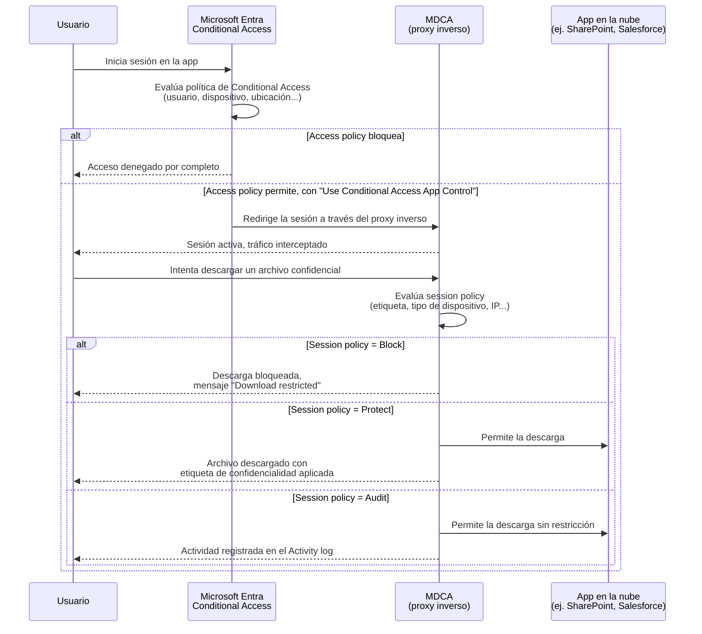

# Lección Día 10 — MDO: Threat Explorer y ZAP + MDCA: anomalías, OAuth y session policies

> [!info] Contexto
> Día 10 del plan de [[PLAN_MAESTRO_MULTITRACK]] §8, dentro del **Dominio 2 — Respond to security incidents**, que vale entre el **35 % y el 40 %** del examen. Se impartió en fecha, el lunes 24-ago, tal como marcaba el calendario estricto — el primer día de contenido nuevo desde que se cerró la deuda de labs. **Esta versión, reescrita el 11-sep-2026, no cambia esa fecha histórica de impartición** — es una reescritura en profundidad del mismo día, con más fundamentos, más diagramas, capturas oficiales y hechos re-verificados contra Microsoft Learn a la fecha de hoy, incluyendo dos correcciones importantes que la versión anterior no tenía (ver los callouts de advertencia). El calendario de [[PLAN_MAESTRO_MULTITRACK]] sigue intacto: el examen es el **sábado 3 de octubre de 2026**.
>
> Hoy cubrimos dos productos que responden a amenazas en superficies distintas de las que ya viste: **MDO (Microsoft Defender for Office 365)**, que protege correo y colaboración (Exchange, SharePoint, OneDrive, Teams), y **MDCA (Microsoft Defender for Cloud Apps)**, que vigila el uso de aplicaciones en la nube — tanto las de Microsoft como las de terceros conectadas a tu organización.
>
> El hilo conductor de hoy es el mismo que en el Día 9: varias herramientas que suenan parecidas (Threat Explorer vs ZAP, anomaly detection vs session policy) y que el examen distingue por el **calificador del enunciado** — si pide acción automática o investigación manual, si pide algo en tiempo real dentro de una sesión o una detección basada en patrón histórico. La tabla de decisión de la sección 9 es, otra vez, el entregable de mayor valor del día.

---

## 📖 Lectura del día

### 0. Dónde estamos dentro del Dominio 2

| Sub-bloque | Qué agrupa | Cuándo lo ves |
|---|---|---|
| Respond to alerts and incidents in Microsoft Defender XDR | Gestión de incidentes, case management, respuesta por producto (**MDO, MDCA** hoy; Purview, Defender for Cloud, Entra ID, MDI después), ataques multi-etapa, agentic AI/Copilot | Días 8, **10**, 11, 12, 13 |
| Respond to alerts and incidents in Microsoft Defender for Endpoint | Device timeline, live response, collect investigation package, evidencia, attack disruption | Día 9 (ya cubierto) |
| Investigate Microsoft 365 activities to identify threats | Purview Audit, eDiscovery, Microsoft Graph activity logs | Día 13 |

Hoy avanzamos dos de los cinco productos de respuesta por producto que quedan del primer sub-bloque (MDO y MDCA); Entra ID Protection + MDI llegan el Día 11 y Defender for Cloud el Día 12.



### 1. Microsoft Defender for Office 365 (MDO): qué protege y cómo se licencia

**Definición desde cero.** **MDO (Microsoft Defender for Office 365)** es el conjunto de protecciones de Microsoft para correo electrónico y herramientas de colaboración: Exchange Online (el correo), SharePoint Online (repositorios de archivos compartidos), OneDrive for Business (almacenamiento personal en la nube) y Microsoft Teams (chat y colaboración). Protege contra tres tipos de amenaza principales: **malware** (archivos maliciosos), **phishing** (correos que suplantan identidad para robar credenciales o dinero) y **enlaces maliciosos**.

**Por qué existe.** El correo sigue siendo el vector de entrada más común para un ataque — un adjunto infectado o un enlace de phishing puede comprometer una organización entera en un clic. MDO existe para interceptar esas amenazas en tres momentos distintos: **antes de la entrega** (filtrado preventivo), **en el momento del clic** (validación dinámica de enlaces) y **después de la entrega** (limpieza retroactiva, que veremos en la sección 3 con ZAP).

**Cómo se licencia — y por qué importa para el examen.** Se organiza en dos niveles, y el examen distingue con frecuencia cuál capacidad pertenece a cuál:

- **Plan 1**: protecciones preventivas — **Safe Attachments** (analiza archivos adjuntos en un entorno aislado, sandbox, antes de entregarlos al destinatario), **Safe Links** (reescribe URLs y las valida en el momento del clic, no solo al momento de la entrega — así detecta enlaces que "se arman" después de haber sido enviados), anti-phishing, y **Real-time detections** (una versión reducida de Threat Explorer, ver sección 2). Dato re-verificado hoy: desde el **1 de julio de 2026**, Defender for Office 365 Plan 1 viene **incluido** en las licencias Office 365 E3 y Microsoft 365 E3 — antes había que comprarlo como add-on separado para esos planes.
- **Plan 2**: incluye todo lo de Plan 1 y añade **Threat Explorer completo**, **Attack Simulation Training** (campañas de phishing simuladas para entrenar usuarios), **Threat Trackers**, y **AIR (Automated Investigation and Response) para MDO** — un mecanismo separado del AIR de MDE que viste en los Días 5, 6 y 9. Recordatorio importante, ya confirmado como hecho consumado en el Día 9: **el retiro de AIR del 1-sep-2026 aplicó ÚNICAMENTE a Defender for Endpoint — el AIR de MDO sigue funcionando sin cambios**, incluida la opción "Propose remediation" que verás en la sección 2. Plan 2 viene incluido en Microsoft 365 E5.

Todo esto se administra y se investiga desde el portal unificado de Defender (`security.microsoft.com`), bajo el nodo **Email & collaboration**.

**Trampa de examen.** Si el enunciado menciona "Office 365 E3 sin add-ons" y pregunta por Safe Links/Safe Attachments, la respuesta cambia según la fecha: antes del 1-jul-2026 la respuesta habría sido "no, hace falta comprar el add-on"; desde esa fecha, la respuesta es "sí, ya viene incluido en Plan 1".

### 2. Threat Explorer y Real-time detections: el hunting de correo

**Definición desde cero.** **Threat Explorer** (también llamado simplemente "Explorer") y **Real-time detections** son reportes casi en tiempo real dentro del portal de Defender que permiten a un analista identificar y analizar amenazas recientes de correo — quién las recibió, qué pasó con el mensaje, y si hace falta actuar sobre él.

**Por qué existe.** El filtrado automático de MDO no es perfecto ni instantáneo de investigar: cuando un usuario reporta un correo sospechoso, o cuando una alerta de MDO llega a la cola, el analista necesita una forma de **buscar mensajes por remitente, asunto, URL o adjunto** y ver de un vistazo qué verdicto les dio el sistema y dónde terminaron entregados. Sin esta herramienta, la única alternativa sería pedirle a un administrador de Exchange que corra búsquedas de contenido caso por caso.

**Cómo funciona por dentro.** Ambos reportes consultan, casi en tiempo real, el mismo almacén de metadatos y verdictos de MDO — la diferencia entre ellos no es la fuente de datos, sino **cuánto de esa información y de esas acciones te deja usar tu licencia**.

**Dónde se configura / desde dónde se ejecuta.** Se llega a Threat Explorer desde el portal de Defender en **Email & collaboration → Explorer**, o directamente con la URL `security.microsoft.com/threatexplorerv3`; Real-time detections vive en `security.microsoft.com/realtimereportsv3`.

> [!warning] Corregido 11-sep-2026 — Real-time detections tiene 3 vistas, no 2
> La versión anterior de esta lección afirmaba que Real-time detections (Plan 1) solo tenía las vistas **Malware** y **Phish**. Re-verificado hoy contra la documentación oficial: Real-time detections también incluye la vista **Content malware** (archivos maliciosos detectados por la protección antivirus integrada de SharePoint/OneDrive/Teams y por Safe Attachments para esos servicios). Son **3 vistas**, no 2. Las que **sí** son exclusivas de Threat Explorer (Plan 2) siguen siendo: **All email**, **Campaigns** y **URL clicks**.

Tabla comparativa, corregida hoy:

| Vista | Real-time detections (Plan 1) | Threat Explorer (Plan 2) |
|---|---|---|
| All email | No | Sí (vista por defecto) |
| Malware | Sí | Sí |
| Phish | Sí | Sí |
| Content malware | Sí | Sí |
| Campaigns | No | Sí |
| URL clicks | No | Sí |
| Filtros y consultas guardadas | Filtros básicos | Más propiedades de filtro, permite guardar consultas |
| Ventana de tiempo | Hasta 30 días atrás | Hasta 30 días atrás |
| Acciones de remediación | Muy limitadas (ver más abajo) | Todo el catálogo del **Take action wizard** |

**Vistas clave para el examen:**
- **All email**: todos los mensajes entrantes, salientes e intra-organización, con su veredicto y ubicación de entrega.
- **Campaigns**: agrupa automáticamente mensajes de phishing o malware que Microsoft identifica como parte de una **campaña coordinada** (mismo atacante, mismo patrón, dirigida a varios destinatarios) — útil para ver el alcance de un ataque sin tener que correlacionar mensaje por mensaje a mano.
- **URL clicks**: registra cada clic de usuario sobre una URL vigilada por Safe Links, en correo y en herramientas de colaboración — es la vista que responde "¿quién hizo clic en el enlace malicioso, y quién lo hizo *después* de que Safe Links ya lo había marcado como malo?".

> [!warning] Corregido 11-sep-2026 — el flujo de remediación cambió de "tres botones" a un asistente único, y Plan 1 casi no tiene acciones
> La versión anterior describía tres acciones sueltas (Soft delete, Hard delete, Move to Junk) como si fueran botones independientes. Re-verificado hoy contra la documentación oficial (actualizada 24-ago-2026): hoy es un único asistente llamado **Take action**, con la opción **"Move or delete"** que despliega **cinco destinos posibles** para el mensaje: **Junk** (correo no deseado), **Inbox** (incluye liberar de cuarentena si aplica), **Deleted items**, **Soft deleted items** (equivalente a "eliminado" recuperable — Recoverable Items\Deletions) y **Hard deleted items** (purga definitiva, solo recuperable por un admin vía single-item recovery). Y un dato crítico de licenciamiento que la versión anterior no explicaba: **en Real-time detections (Plan 1), la opción "Move or delete" NO está disponible** — solo puedes usar **"Submit to Microsoft for review"** y crear entradas en la **Tenant Allow/Block List**. Mover o eliminar un mensaje **requiere Threat Explorer, es decir, Plan 2**.

**Permisos: quién puede ver y quién puede mover/eliminar.** Seleccionar uno o más mensajes habilita el asistente **Take action**. Estas acciones — igual que previsualizar o descargar un mensaje — requieren permisos específicos, y son dos permisos **independientes** (verificado hoy, sin cambios respecto a la versión anterior en este punto):

- **Preview** (previsualizar/descargar el mensaje): asignado por defecto a los grupos de rol *Data Investigator* y *eDiscovery Manager*.
- **Search and Purge** (mover o eliminar mensajes de buzones — requerido específicamente para "Move or delete"): asignado por defecto a *Data Investigator* y *Organization Management*. En el modelo de **Unified RBAC (URBAC)** de Defender XDR (el mismo que viste en case management, Día 8), el permiso equivalente se llama **Security operations/Security data/Email & collaboration advanced actions (manage)**.

Un analista puede tener permiso para **ver** el contenido de un correo sospechoso sin tener permiso para **borrarlo** — el mismo principio de "acción mínima necesaria" que ya viste con el RBAC granular de MDE en el Día 9.

**Novedad verificada hoy, no cubierta en la versión anterior: "Propose remediation".** Cuando un analista **no** tiene permiso de Search and Purge pero sí necesita que un mensaje se elimine, puede usar **Propose remediation → Create new**: esto crea una acción de **soft delete pendiente de aprobación** que queda esperando en el **Action center** hasta que alguien con permisos la apruebe — un flujo de **aprobación en dos pasos** pensado exactamente para el principio de mínimo privilegio.

**Ejemplo concreto de escenario SOC.** Un analista júnior sin Search and Purge investiga en Threat Explorer un correo de phishing dirigido a 40 usuarios. No puede eliminarlo directamente, así que usa **Propose remediation → Create new** para dejar la eliminación en cola; un analista sénior con permisos revisa la propuesta en el Action center y la aprueba minutos después.

**Trampa de examen.** Si el enunciado dice "un analista sin permiso de Search and Purge necesita que se elimine un correo, pero solo tiene Preview" — la respuesta no es "no puede hacer nada": puede **proponer** la remediación para que otro la apruebe.

Nota de concepto: [[Conceptos/Threat Explorer]]

### 3. ZAP (Zero-hour Auto Purge): la limpieza automática después de la entrega

**Definición desde cero.** **ZAP (Zero-hour Auto Purge)** es un mecanismo **automático** — no algo que un analista dispara manualmente — que detecta y neutraliza **retroactivamente** mensajes de phishing, spam o malware que ya fueron entregados a un buzón en la nube.

**Por qué existe.** El filtrado de correo no es perfecto en el momento de la entrega: un archivo puede ser malware de día cero indetectable en ese instante, o un enlace puede "armarse" (volverse malicioso) recién después de haber sido entregado. ZAP resuelve ese hueco monitoreando continuamente las firmas de amenazas y actuando sobre mensajes que **ya están** en el buzón del usuario, sin esperar a que un analista lo detecte manualmente.

**Cómo funciona por dentro, punto por punto** (re-verificado hoy contra Microsoft Learn, doc actualizada 1-jun-2026, confirmada vigente el 7-ago-2026 y de nuevo hoy 11-sep-2026):



- **Alcance temporal**: la búsqueda de ZAP está limitada a los **últimos 48 horas** de correo entregado.
- **El resultado depende del veredicto y de la acción configurada en la política**, no es siempre "lo mismo":
  - **Malware**: ZAP siempre pone el mensaje en **cuarentena** (los destinatarios no pueden liberarlo por sí mismos, como mucho pueden *solicitar* su liberación a un admin).
  - **High confidence phishing**: igual que malware, siempre **cuarentena**.
  - **Phishing** (sin ser "high confidence") y **Spam / High confidence spam**: el resultado depende de la acción configurada en la política anti-spam para ese veredicto — si la política dice "Move to Junk Email", ZAP mueve el mensaje a Correo no deseado; si dice "Quarantine message", ZAP lo pone en cuarentena; si dice "Add X-Header", "Prepend subject line", "Redirect message" o "Delete message" (entre otras), **ZAP no actúa** sobre el mensaje.
- **No se notifica al usuario** cuando ZAP mueve un mensaje.
- **ZAP ya cubre la carpeta Elementos eliminados**, no solo la Bandeja de entrada — confirmado hoy como estado vigente en producción (la expansión, que empezó a desplegarse en junio de 2026, ya está completa). ZAP puede actuar sobre mensajes en otras carpetas siempre que el mensaje no haya sido ya eliminado definitivamente y que no se le haya aplicado ya una acción igual o más fuerte.
- **ZAP también protege Microsoft Teams** (mensajes de chat y de canal identificados como malware o high-confidence phishing, desde enero de 2026) — esto **sí requiere** licencia MDO Plan 1 o Plan 2. El resto de ZAP (correo) **no tiene requisito de licencia especial**: funciona en cualquier buzón alojado en Exchange Online. Dato nuevo verificado hoy: en Teams, cuando ZAP bloquea un mensaje de un chat grupal, **basta con que uno solo de los destinatarios no esté excluido** de la protección para que el mensaje se bloquee para todo el grupo — solo si **todos** los destinatarios están excluidos, ZAP no actúa.
- **Excepción importante con Safe Attachments**: si un adjunto todavía está pasando por **Dynamic Delivery** (el modo de Safe Attachments que entrega el cuerpo del correo de inmediato y solo retiene el adjunto mientras lo analiza en sandbox), ZAP no pone el mensaje en cuarentena directamente — si llega una señal de phishing o spam durante ese proceso, ZAP revierte a la acción "Move to Junk" en vez de cuarentena.
- **Cómo verificar si ZAP actuó**: en el portal, con el **Mailflow status report** (vista Mailflow, para contar cuántos mensajes afectó ZAP en un rango de fechas) o en **Threat Explorer**, filtrando la columna **"Additional action"** por el valor **ZAP** en la vista All email. En Advanced Hunting, la tabla **`EmailPostDeliveryEvents`** registra estas acciones con `ActionType` = **`Phish ZAP`** o **`Malware ZAP`** (y también `Manual remediation` cuando fue un analista quien actuó, por ejemplo desde Threat Explorer).

**Ejemplo concreto de escenario SOC.** Un mensaje de phishing (no high-confidence) llega a las 09:00 y no es detectado. A las 15:00 una nueva firma lo identifica. La política anti-spam del tenant tiene configurado "Move message to Junk Email" para el veredicto Phishing, así que ZAP mueve automáticamente el mensaje a Correo no deseado sin que ningún analista lo toque ni el usuario lo note.

**Trampa de examen.** El punto que más confunde: **Threat Explorer vs ZAP**. Ambos actúan sobre correo ya entregado, pero uno es investigación manual (Threat Explorer: tú decides, tú seleccionas, tú aplicas la acción vía Take action) y el otro es un mecanismo automático de la plataforma que corre solo, sin que nadie lo dispare (ZAP). Si el enunciado dice "el sistema removió el mensaje automáticamente, sin intervención de un analista" → ZAP. Si dice "un analista investigó y decidió eliminar el mensaje" → Threat Explorer.

Nota de concepto: [[Conceptos/ZAP]]

### 4. Attack disruption en MDO: conexión con lo que ya viste el Día 6 y el Día 9

Ya conoces **Automatic attack disruption** de los Días 6 y 9: un mecanismo que, con alta confianza de que un ataque multi-etapa está en curso, actúa automáticamente sobre varias señales de XDR (Extended Detection and Response) a la vez. En un ataque de **BEC (Business Email Compromise, compromiso de correo de negocios)** o **AiTM (Adversary-in-the-Middle, un atacante interceptando la sesión entre el usuario y el servicio real para robar tokens de sesión)**, attack disruption combina, en la misma respuesta automática: **contener al usuario comprometido** (la acción **Contain user** que ya estudiaste a fondo el Día 9 — bloquea movimiento lateral a nivel de endpoint, no deshabilita la cuenta en Entra ID), **aislar su dispositivo** (**Isolate device**, señal de MDE) y **remover el correo malicioso ya entregado** (señal de MDO) — todo en minutos y sin intervención humana.

**La diferencia con ZAP, otra vez un punto fino de examen**: ZAP solo actúa sobre el correo (lo mueve o lo cuarentena). Attack disruption es más amplio — actúa sobre identidad, dispositivo **y** correo a la vez, porque su objetivo no es limpiar un mensaje sino **cortar un ataque activo que ya comprometió una cuenta**.

### 5. Microsoft Defender for Cloud Apps (MDCA): qué es

**Definición desde cero.** **MDCA (Microsoft Defender for Cloud Apps)** es la plataforma de Microsoft para vigilar y controlar el uso de aplicaciones en la nube — tanto aplicaciones de Microsoft (SharePoint, OneDrive, Exchange Online) como aplicaciones de terceros conectadas a tu organización (Salesforce, Box, Dropbox, Google Workspace, y miles más).

**Por qué existe.** Ni MDE (que vigila dispositivos) ni MDO (que vigila correo) responden tres preguntas que solo importan cuando el dato vive en una app en la nube: **¿qué apps en la nube usa realmente mi organización, incluidas las que nadie autorizó formalmente ("Shadow IT")?**, **¿qué comportamiento anómalo ocurre dentro de esas apps?**, y **¿puedo controlar en tiempo real lo que un usuario hace dentro de una sesión de una app, sin bloquearle el acceso por completo?**.

**Cómo funciona por dentro, a alto nivel.** MDCA se conecta a las aplicaciones en la nube de dos formas: mediante **conectores de API** (integración directa con el proveedor de la app — por ejemplo, la API de Microsoft Graph para Microsoft 365, o la API de Salesforce) para analizar actividad histórica y aplicar gobernanza, y mediante **Conditional Access App Control**, un mecanismo de **proxy inverso** que intercepta el tráfico de una sesión en tiempo real (se explica a fondo en la sección 8).

**Dónde se configura.** Se administra desde el portal de Defender, en el nodo **Cloud apps**. Se organiza en cuatro capacidades principales, y el examen espera que sepas en cuál cae cada escenario:

1. **Cloud Discovery**: descubre qué aplicaciones en la nube se están usando en la organización (incluyendo Shadow IT), analizando logs de tráfico de red o firewall que subes o conectas al portal.
2. **App governance / OAuth apps**: evalúa el riesgo de las aplicaciones OAuth (aplicaciones de terceros a las que un usuario les dio permiso de acceder a sus datos de Microsoft 365 — correo, archivos, calendario) y permite revocar sus permisos si resultan riesgosas (sección 7).
3. **Information protection**: extiende las etiquetas de confidencialidad de Microsoft Purview a aplicaciones de terceros.
4. **Threat protection**: las políticas de **anomaly detection** (sección 6) y las **session policies** vía Conditional Access App Control (sección 8) — la parte que más pregunta el examen dentro de "respond to security incidents".

Nota de concepto: [[Conceptos/MDCA]]

### 6. Anomaly detection policies en MDCA

**Definición desde cero.** Las **anomaly detection policies** son políticas de **UEBA (User and Entity Behavior Analytics)** y machine learning que vienen **habilitadas por defecto** y empiezan a detectar de inmediato — con un **período de aprendizaje inicial de 7 días** durante el cual el sistema construye una línea base de comportamiento normal por usuario y por organización (ubicaciones habituales, dispositivos, horarios, IPs) antes de que todas las alertas empiecen a dispararse con precisión.

**Por qué existe.** Un ataque exitoso casi siempre produce comportamiento que se **desvía** del patrón normal del usuario: iniciar sesión desde un país nuevo, descargar cientos de archivos de golpe, fallar el login muchas veces seguidas. Detectar esa desviación automáticamente, sin que un analista tenga que revisarla manualmente sesión por sesión, es exactamente el trabajo de estas políticas.

**Cómo funciona por dentro.** El motor analiza cada sesión de usuario contra más de **30 indicadores de riesgo** agrupados en factores (IP riesgosa, fallos de login, actividad administrativa, cuentas inactivas, ubicación, viaje imposible, dispositivo/user agent, tasa de actividad), comparando contra la línea base de los últimos 30 días de actividad conocida del usuario y de la organización.

**Dónde se configura / rol necesario.** **Cloud apps → Policies → Policy management**, filtrando por tipo **Anomaly detection policy**. Requiere un rol con permisos de administración sobre MDCA (Security Administrator o un rol custom con permisos de Cloud Apps).

**Políticas vigentes con nombre propio** (re-verificado hoy, doc actualizada 8-ago-2026):

- **Impossible travel** (viaje imposible): dos inicios de sesión del mismo usuario, desde ubicaciones geográficamente muy distantes, en una ventana de tiempo demasiado corta para haber viajado físicamente entre ellas. Tiene un **slider de sensibilidad** con tres niveles: **Low** (suprime por sistema, tenant y usuario — el más permisivo), **Medium** (suprime por sistema y usuario), **High** (solo suprime lo que el sistema considera obviamente falso positivo — el más sensible, más alertas). Las ubicaciones se calculan a nivel de país/región, así que dos acciones dentro del mismo país o en países fronterizos no generan alerta.
- **Activity from infrequent country/region**: inicio de sesión desde una ubicación que el usuario nunca o casi nunca había usado antes.
- **Malware detection**: identifica archivos maliciosos en tu almacenamiento en la nube (Microsoft o de terceros: Box, Dropbox, Google Workspace también soportan *file sandboxing*), comparando contra threat intelligence de Microsoft. **Deshabilitada por defecto** (a diferencia de la mayoría, que vienen activas).
- **Suspicious OAuth app file download activities**: una aplicación OAuth conectada descarga múltiples archivos de SharePoint/OneDrive de forma atípica para ese usuario — señal de que la cuenta o la app pueden estar comprometidas.
- **Multiple failed login attempts**: múltiples intentos fallidos de inicio de sesión en una sola sesión, relativo a la línea base — posible ataque de fuerza bruta.
- **Multiple delete VM activities**: eliminación de múltiples máquinas virtuales en una sola sesión — posible intento de sabotaje o cobertura de huellas.
- **Unusual activities (by user)**: una familia de detecciones (descargas masivas inusuales, uso compartido inusual de archivos, eliminación inusual de archivos, actividad administrativa inusual, entre otras, algunas en preview) que compara el comportamiento de un usuario contra su propia línea base.

> [!warning] Corregido 11-sep-2026 — la lista de políticas renombradas es más larga de lo que decía la versión anterior
> La versión anterior citaba solo tres renombres. Re-verificado hoy: desde **junio de 2025**, MDCA migró progresivamente sus políticas de anomaly detection a un **modelo de detección dinámico** que adapta la lógica automáticamente sin configuración manual. La lista completa de políticas "clásicas" deshabilitadas y migradas incluye: *Activity from suspicious IP addresses* → **Successful logon from a suspicious IP address** + **Activity from a password-spray associated IP address**; *Activity from anonymous IP addresses* → **Activity from a TOR IP address** + **Anonymous proxy activity**; *Ransomware activity* → **Ransomware payment instruction file uploaded to {Application}**; *Activity performed by terminated user* → **Activity by a deprovisioned user**; *Suspicious inbox forwarding* → **Suspicious email forwarding rule created by third-party app**; *Suspicious inbox manipulation rules* → migrada sin nombre nuevo publicado; *Suspicious email deletion activity* → mismo nombre, migrada; *Unusual ISP for an OAuth app* → **OAuth application activity from an unknown ISP**; *Suspicious file access activity (by user)* → **Suspicious file access indicative of lateral movement** + **Suspicious file access from untrusted ISP and user agent with malicious IP indicator**. La protección sigue existiendo, solo cambió el nombre y el mecanismo interno — si el examen (o una guía vieja) menciona el nombre clásico, reconoce que describe el mismo tipo de amenaza aunque el portal ya muestre otro nombre.

**Governance actions**: cada política de anomaly detection permite configurar acciones automáticas de remediación (por app conectada o para todas) cuando se dispara — por ejemplo, suspender al usuario o revocar su sesión — sin que un analista tenga que hacerlo a mano cada vez. Cada política también se puede **acotar (scope)** a usuarios o grupos específicos, incluyendo o excluyendo explícitamente.

**Ejemplo concreto de escenario SOC.** Un usuario que nunca sale del país inicia sesión desde Ciudad de México a las 10:00 y, 40 minutos después, desde Singapur. La política Impossible travel, con sensibilidad Medium, dispara una alerta porque ningún vuelo real cubre esa distancia en ese tiempo.

**Trampa de examen.** Anomaly detection **siempre alerta después de que el comportamiento ya ocurrió** — es detección, no prevención en tiempo real. Si el enunciado pide "bloquear en el momento", no es esta política, es una session policy (sección 8).

Nota de concepto: [[Conceptos/Anomaly detection policy]]

### 7. App governance y OAuth apps

**Definición desde cero.** Cuando un usuario le da permiso a una aplicación de terceros para acceder a sus datos de Microsoft 365 (por ejemplo, un pop-up de "Permitir que esta app lea mi correo y mis archivos" al iniciar sesión con la cuenta corporativa), esa aplicación queda registrada como una **aplicación OAuth** en Microsoft Entra ID — OAuth es el protocolo estándar que permite a una app acceder a datos de un usuario sin que la app conozca la contraseña de ese usuario, mediante permisos delegados (*scopes*) y tokens. **App governance** es la capa de MDCA que evalúa el riesgo de esas aplicaciones.

**Por qué existe.** Las aplicaciones OAuth son un vector de ataque real y creciente: un atacante puede registrar una app maliciosa con un nombre convincente y pedirle a los usuarios que le den permisos amplios (leer correo, acceder a archivos) sin necesitar robar ninguna contraseña. Sin visibilidad centralizada, cada usuario decide por su cuenta qué apps autorizar, y nadie en el SOC (Security Operations Center, el equipo de operaciones de seguridad) tiene forma de saber cuántas apps de terceros tienen acceso a los datos de la organización.

**Cómo funciona por dentro.** App governance es un conjunto de capacidades para **apps OAuth registradas en Microsoft Entra ID, Google y Salesforce**: te muestra un panel único con todas las apps de terceros que tienen acceso, qué permisos tienen, cuántos usuarios las usan, y su nivel de actividad; puedes crear políticas proactivas o reactivas que detecten patrones de comportamiento anómalo de una app y disparen alertas o **acciones de remediación automáticas** (por ejemplo, revocar los permisos de una app sospechosa para todos los usuarios de la organización desde un solo lugar, sin tener que pedirle a cada usuario que la desconecte manualmente).

**Dónde se configura / rol necesario.** **Cloud apps → App governance** en el portal de Defender. Las alertas de app governance aparecen en la lista de alertas de Defender XDR con el **Detection source** (fuente de detección) marcado como **App Governance**.

**Ejemplo concreto de escenario SOC.** Una política de anomaly detection detecta que una app OAuth de terceros llamada "QuickPDF Converter" descargó 300 archivos de SharePoint en 10 minutos, algo atípico para esa app. El analista abre **App governance**, revisa qué permisos tiene la app (lectura de archivos, lectura de correo) y cuántos usuarios la autorizaron, y **revoca sus permisos para toda la organización** desde un único punto.

**Trampa de examen.** App governance gestiona **aplicaciones**, no sesiones de navegador de un usuario humano. Si el enunciado describe una app de terceros con permisos delegados haciendo algo atípico, la respuesta es App governance / la política "Suspicious OAuth app..."; si describe a un usuario humano navegando dentro de una app en su navegador, la respuesta está en session/access policies (sección 8).

Nota de concepto: [[Conceptos/App governance]]

### 8. Session policies vs access policies: la diferencia que más pregunta el examen

Aquí está la distinción central de la capacidad de **Threat protection** de MDCA, y es exactamente el tipo de par que el examen usa para poner a prueba si detectas el calificador correcto.

**Access policies — definición desde cero.** Deciden si un usuario puede entrar o no a una aplicación en la nube — **todo o nada**. Se evalúan al momento del inicio de sesión, antes de que el usuario pueda hacer nada dentro de la app.

**Session policies — definición desde cero.** **No bloquean el acceso** — dejan entrar al usuario, pero **monitorean y controlan lo que hace dentro de la sesión**, en tiempo real. Pueden bloquear una descarga específica, bloquear una subida, bloquear copiar-pegar o imprimir, forzar que se aplique una etiqueta de confidencialidad a un archivo antes de que salga de OneDrive, o exigir autenticación adicional (*step-up authentication*) en el momento en que ocurre una actividad sensible — todo esto **sin impedir que el usuario use la aplicación**.

**Cómo funcionan por dentro — el mecanismo de Conditional Access App Control.** Ambas dependen de **Conditional Access App Control**: MDCA actúa como un **proxy inverso** entre el usuario y la aplicación en la nube. En vez de que el navegador del usuario se conecte directamente a la app, el tráfico se redirige a través de MDCA, que puede ver e interceptar cada acción dentro de la sesión en tiempo real (esto se refleja visualmente en el navegador Microsoft Edge for Business con un ícono de candado, o en otros navegadores con el sufijo `.mcas` en la URL de la app). Las aplicaciones de **Microsoft Entra quedan automáticamente incorporadas (onboarded)** para Conditional Access App Control; las apps de proveedores de identidad que no son de Microsoft necesitan una incorporación manual.



**Requisitos previos.** Para que una session policy funcione, hace falta: licencia de MDCA, licencia de Microsoft Entra ID P1 (o el nivel equivalente de tu proveedor de identidad), y **una política de Conditional Access en Microsoft Entra ID** que, en la sección **Access controls → Session**, tenga marcada la opción **"Use Conditional Access App Control"** — sin esa política de Conditional Access, la session policy de MDCA nunca se activa, porque es esa política la que redirige el tráfico hacia el proxy inverso.

**Tipos de control de sesión (session control type) — tabla de referencia rápida:**

| Tipo | Qué hace |
|---|---|
| Monitor only | Solo monitorea la actividad de inicio de sesión |
| Block activities | Bloquea actividades específicas (imprimir, copiar/pegar, enviar mensajes) filtradas por tipo |
| Control file download (with inspection) | Inspecciona y controla descargas: puede auditar, bloquear, o proteger (aplicar etiqueta de confidencialidad) |
| Control file upload (with inspection) | Inspecciona y controla subidas: bloquea la subida si el archivo contiene datos sensibles sin la etiqueta correcta |

**Novedad verificada hoy, no cubierta en la versión anterior: conflicto entre políticas.** Cuando la sesión de un usuario coincide con **dos session policies distintas** al mismo tiempo (por ejemplo, una que bloquea descargas y otra que solo las audita), **gana siempre la política más restrictiva** — en este ejemplo, la descarga se bloquea.

**El caso de uso que el examen cita con frecuencia**: bloquear la descarga de información sensible desde un dispositivo no administrado, en tiempo real, sin bloquear el acceso completo a la aplicación — eso es exactamente una **session policy**, no una access policy (demasiado radical: bloquearía todo) ni una anomaly detection policy (esa solo alerta *después* de que ya ocurrió, no previene la descarga en el momento).

**Ejemplo concreto de escenario SOC.** El equipo legal exige que ningún archivo etiquetado como "Altamente confidencial" pueda descargarse desde un dispositivo no administrado por la organización. El analista crea una session policy con tipo **Control file download (with inspection)**, filtro de archivo por **etiqueta de confidencialidad**, filtro de dispositivo **no administrado**, y acción **Block**.

**Trampa de examen.** Access policy y session policy sí pueden combinarse: es común bloquear el acceso completo desde apps de escritorio/móviles nativas con una access policy (porque esas apps nativas no siempre pueden ser interceptadas por el proxy) y, al mismo tiempo, usar una session policy para controlar la actividad dentro del navegador.

Nota de concepto: [[Conceptos/Session policy MDCA]]

### 9. La tabla de decisión: el calificador del enunciado, otra vez

| El enunciado dice (calificador) | Herramienta correcta | Por qué NO las demás |
|---|---|---|
| "Investigar manualmente un correo YA entregado y decidir si se elimina" | **Threat Explorer** (Take action → Move or delete) | ZAP es automático, no algo que un analista dispare a mano; en Real-time detections (Plan 1) esta opción ni siquiera está disponible |
| "El sistema removió un mensaje malicioso automáticamente, sin intervención de un analista, después de la entrega" | **ZAP** | Threat Explorer es la herramienta de investigación manual, no el mecanismo automático de la plataforma |
| "Un correo malicioso fue detectado ya dentro de la carpeta de Elementos eliminados" | **ZAP** (cubre Deleted Items) | Threat Explorer no purga de forma automática; requeriría acción manual |
| "Un analista sin permiso de Search and Purge necesita que se elimine un mensaje" | **Propose remediation → Create new** (aprobación en dos pasos) | Move or delete directo requiere Search and Purge; sin ese permiso, la única vía es proponer y esperar aprobación |
| "Detectar un inicio de sesión desde un país que ese usuario nunca había usado antes" | **Anomaly detection policy** (Activity from infrequent country/region) | Session policy solo actúa DURANTE una sesión ya en curso, no analiza patrón histórico de ubicaciones |
| "Bloquear en tiempo real la descarga de un archivo confidencial desde un dispositivo no administrado, sin bloquear el resto de la sesión" | **Session policy** (Conditional Access App Control) | Anomaly detection solo alerta después del hecho; access policy bloquearía toda la sesión, no solo la descarga |
| "Una app OAuth de terceros descargó cientos de archivos de SharePoint de forma atípica para ese usuario" | **Suspicious OAuth app file download activities** + revisión y revocación en **App governance** | No es una sesión de navegador de un usuario web, es una app con permisos delegados |
| "Ataque de BEC en curso: contener usuario, aislar dispositivo y limpiar el correo entregado, todo automático y a la vez" | **Automatic attack disruption** | ZAP solo actúa sobre el correo; no contiene identidad ni dispositivo |

---

## 💡 Ejemplos concretos

### Ejemplo 1 — Threat Explorer vs ZAP: quién actuó sobre el mensaje

**Escenario:** Un usuario reporta que recibió un correo de phishing hace tres días. El analista abre Threat Explorer, filtra por remitente y encuentra el mensaje. La columna "Additional action" muestra el valor **ZAP**, y el mensaje ya no está en la bandeja de entrada del usuario. El analista se pregunta si necesita eliminarlo manualmente.

**Razonamiento:** el valor `ZAP` en esa columna significa que **el sistema ya actuó automáticamente** sobre ese mensaje después de la entrega — no hace falta ninguna acción manual adicional del analista, el mensaje ya fue movido o puesto en cuarentena según el veredicto y la política vigente. Si en cambio la columna mostrara vacío o "Manual remediation" con el nombre de otro analista, ahí sí sabrías que hizo falta una intervención manual. Para confirmar el detalle exacto vía KQL:

```kql
EmailPostDeliveryEvents
| where NetworkMessageId == "<id-del-mensaje>"
| project Timestamp, ActionType, RecipientEmailAddress, ActionResult
// ActionType esperado aquí: "Phish ZAP" o "Malware ZAP"
```

### Ejemplo 2 — Anomaly detection vs Session policy: cuándo cada una

**Escenario:** El equipo legal pide dos cosas distintas: (1) que les avisen si algún usuario descarga una cantidad inusual de archivos de SharePoint comparado con su comportamiento habitual, y (2) que se **impida en el momento** la descarga de cualquier archivo con etiqueta de confidencialidad "Altamente confidencial" desde un dispositivo no administrado por la organización.

**Razonamiento:** son dos mecanismos distintos aunque suenen parecidos. La petición (1) es un patrón de comportamiento a lo largo del tiempo comparado contra una línea base — eso es una **anomaly detection policy** (la familia "Unusual activities by user", específicamente descargas inusuales), que **alerta después** de detectar el patrón. La petición (2) exige **bloquear la acción en el momento exacto en que ocurre**, dentro de una sesión activa, condicionado al tipo de dispositivo — eso solo lo hace una **session policy** vía Conditional Access App Control, configurada para bloquear la acción de descarga cuando el archivo tiene esa etiqueta de confidencialidad y el dispositivo no está marcado como administrado.

```kql
// Confirmar descargas masivas de SharePoint capturadas por MDCA (Día 10)
CloudAppEvents
| where Application == "Microsoft SharePoint" and ActionType == "FileDownloaded"
| summarize Descargas = count() by AccountDisplayName, bin(Timestamp, 1h)
| where Descargas > 50
| order by Descargas desc
```

### Ejemplo 3 — Attack disruption en un BEC: qué se dispara y qué no

**Escenario:** Se detecta con alta confianza que la cuenta de un empleado del área de finanzas está comprometida y siendo usada para enviar correos de fraude (BEC) a proveedores, pidiendo cambiar datos bancarios. En minutos, sin intervención humana, el sistema contiene al usuario, aísla el dispositivo del empleado y remueve los correos fraudulentos que ya habían sido enviados a otros buzones internos.

**Razonamiento:** la combinación de **tres acciones simultáneas sobre tres superficies distintas** (identidad, dispositivo, correo) sin intervención humana es la firma de **Automatic attack disruption**, no de ZAP. ZAP por sí solo podría haber limpiado el correo fraudulento, pero **no tiene capacidad de contener una identidad ni aislar un dispositivo** — esas acciones vienen de las señales de MDI/Entra ID Protection y MDE que attack disruption correlaciona junto con la señal de MDO, exactamente como ya viste con **Contain user** e **Isolate device** en el Día 9.

---

## 🎥 Videos

1. **[Preparing for SC-200: Manage incident response (Part 3 of 4)](https://learn.microsoft.com/en-us/shows/exam-readiness-zone/preparing-for-sc-200-manage-incident-response)** — Exam Readiness Zone, Microsoft Learn Shows. Nota de honestidad, la misma que ya viste en el Día 5: esta serie usa los **pesos de dominio viejos** (4 dominios de 15-30% cada uno, ya no vigentes — los correctos son los 3 dominios 40-45/35-40/20-25 de tu guía), pero el contenido de respuesta con MDO y MDCA que cubre sigue siendo conceptualmente correcto y vale la pena verlo solo por esa parte.
2. No encontré un video reciente (2025-2026) de buena calidad específico sobre Threat Explorer/ZAP o sobre session policies de MDCA — el candidato más visto sobre Threat Explorer sigue siendo de 2021, demasiado viejo para citarlo como "reciente". En su lugar, usa el módulo oficial [Implement threat protection by using Microsoft Defender for Office 365](https://learn.microsoft.com/en-us/training/modules/implement-threat-protection-use-microsoft-defender-office-365/) de Microsoft Learn como fuente principal para MDO, y la documentación de [Create session policies](https://learn.microsoft.com/en-us/defender-cloud-apps/session-policy-aad) para MDCA — ambas están activamente mantenidas y son las que se usaron para verificar esta lección hoy.

---

## 🧪 Ejercicio práctico

> [!info] Requisito
> Usa tu trial M365 E5 / portal de Defender (`security.microsoft.com`), **no** el tenant universitario de La Salle. MDCA necesita estar habilitado/onboardeado en el tenant — si algún paso no está disponible, documenta la limitación y sigue con el siguiente en vez de forzarlo.

- [ ] **Paso 1 — Explorar Threat Explorer.** Ve a **Email & collaboration → Explorer** (o `security.microsoft.com/threatexplorerv3`). Revisa las seis vistas disponibles (All email, Malware, Phish, Campaigns, Content malware, URL clicks) y confirma si tu trial trae Plan 1 o Plan 2 según cuántas vistas ves.
- [ ] **Paso 2 — Confirmar tus permisos.** Intenta seleccionar un mensaje (si hay alguno en el rango de 30 días) y abre el asistente **Take action** para ver qué opciones de "Move or delete" aparecen disponibles vs en gris — eso te dice si tu cuenta tiene Preview, Search and Purge, o ambos.
- [ ] **Paso 3 — Anomaly detection policies.** Ve a **Cloud apps → Policies → Policy management**, filtra por tipo **Anomaly detection policy**, y localiza al menos 3 de las políticas de la sección 6 (Impossible travel, Suspicious OAuth app file download activities, Multiple failed login attempts). Abre la de Impossible travel y localiza el slider de sensibilidad (Low/Medium/High).
- [ ] **Paso 4 — Session policies.** En la misma pantalla de Policy management, ve a la pestaña **Conditional Access** y revisa si hay alguna app de Microsoft Entra ya incorporada automáticamente para Conditional Access App Control. Si tienes permisos, intenta crear una session policy de prueba con tipo "Control file download (with inspection)" sin activarla.
- [ ] **Paso 5 — App governance (si está disponible).** Busca **Cloud apps → App governance** y revisa la lista de aplicaciones OAuth conectadas, si el tenant tiene alguna, y qué permisos tiene cada una.
- [ ] **Paso 6 —** responde el quiz de hoy y el repaso acumulativo.

---

## ✅ Quiz del día

Cinco preguntas sobre el contenido nuevo de hoy. Responde antes de abrir el bloque de respuestas.

**1.** Un mensaje de phishing fue entregado a un buzón y, 6 horas después, el sistema lo movió automáticamente a la carpeta de correo no deseado del destinatario, sin que ningún analista lo tocara. ¿Qué mecanismo actuó?

- A) Threat Explorer, mediante una acción de "Move or delete" aplicada por un analista
- B) ZAP (Zero-hour Auto Purge), según la acción configurada para el veredicto Phishing en la política anti-spam
- C) Automatic attack disruption, por una señal de identidad comprometida
- D) App governance, al detectar una aplicación OAuth riesgosa

**2.** Un analista con el permiso "Preview" asignado, pero sin el permiso "Search and Purge", investiga un mensaje sospechoso en Threat Explorer. ¿Qué puede hacer con ese mensaje?

- A) Aplicar hard delete de forma permanente
- B) Moverlo a la carpeta de correo no deseado del destinatario
- C) Previsualizar y descargar el mensaje, sin poder moverlo ni eliminarlo
- D) Ninguna acción, ambos permisos son obligatorios en conjunto

**3.** El equipo legal pide bloquear, en el momento exacto en que ocurre y sin cortar el resto del acceso a la aplicación, la descarga de archivos con etiqueta de confidencialidad alta desde dispositivos no administrados. ¿Qué configuran en MDCA?

- A) Una anomaly detection policy de descargas inusuales
- B) Una access policy que bloquee la aplicación completa
- C) Una regla de app governance sobre la aplicación OAuth correspondiente
- D) Una session policy usando Conditional Access App Control

**4.** Durante un ataque de BEC (Business Email Compromise) detectado con alta confianza, el sistema contiene automáticamente al usuario comprometido, aísla el dispositivo del usuario y elimina el correo fraudulento ya entregado a otros buzones, todo en la misma respuesta automática. ¿Qué mecanismo describe mejor este comportamiento?

- A) Automatic attack disruption, correlacionando señales de MDO, MDE y MDI/Entra ID
- B) ZAP actuando de forma coordinada sobre identidad, dispositivo y correo
- C) Una session policy de MDCA aplicada al buzón comprometido
- D) Threat Explorer ejecutando una remediación en lote sobre la campaña detectada

**5.** Una organización con licencia Office 365 E3 (sin add-ons de seguridad adicionales) pregunta si tiene disponible Safe Links y Safe Attachments a partir de julio de 2026. ¿Cuál es la respuesta correcta?

- A) No, esas capacidades solo existen en Defender for Office 365 Plan 2
- B) Sí, porque desde el 1 de julio de 2026 Defender for Office 365 Plan 1 viene incluido en Office 365 E3
- C) No, Office 365 E3 nunca incluye ninguna capacidad de Defender for Office 365
- D) Sí, pero solo si además compran por separado Microsoft Defender for Cloud Apps

> [!note]- Ver respuestas
> **1 — B.** El comportamiento descrito (movimiento automático, sin intervención de un analista, después de la entrega) es exactamente ZAP. El resultado (Move to Junk) depende de la acción configurada para el veredicto Phishing en la política anti-spam vigente. **A** describe una acción manual, contradice "sin que ningún analista lo tocara" — y además, "Move or delete" en Threat Explorer requiere el permiso Search and Purge. **C** es un mecanismo más amplio (identidad + dispositivo + correo), no solo mover un mensaje. **D** no tiene nada que ver con correo entregado, gestiona aplicaciones OAuth.
>
> **2 — C.** El permiso Preview habilita previsualizar y descargar el mensaje; moverlo o eliminarlo (la opción "Move or delete" del asistente Take action) requiere el permiso independiente Search and Purge, que el analista no tiene en este escenario. **A** y **B** requieren Search and Purge. **D** es falso: los dos permisos son independientes, no un paquete obligatorio conjunto — se puede tener uno sin el otro, y con solo Preview el analista todavía podría usar "Propose remediation" para dejar una eliminación pendiente de aprobación por otro analista con más permisos.
>
> **3 — D.** "En el momento exacto en que ocurre" y "sin cortar el resto del acceso" son las dos señales que apuntan a una session policy vía Conditional Access App Control: permite la sesión pero controla una acción específica dentro de ella en tiempo real. **A** solo alerta después del hecho, no bloquea nada en el momento. **B** bloquearía toda la aplicación, no solo la descarga — más agresivo de lo que pide el enunciado. **C** gestiona permisos de aplicaciones OAuth de terceros, no sesiones de navegador de usuarios dentro de una app.
>
> **4 — A.** La combinación simultánea de tres acciones sobre tres superficies distintas (identidad, dispositivo, correo) sin intervención humana es la firma de Automatic attack disruption, que correlaciona señales de varios productos XDR a la vez — la acción sobre identidad es específicamente Contain user, que ya viste a fondo en el Día 9. **B** es incorrecta porque ZAP solo actúa sobre el correo, no tiene capacidad de contener identidades ni aislar dispositivos. **C** no aplica: las session policies actúan sobre sesiones de aplicaciones en la nube, no sobre buzones de correo. **D** describe una acción manual de Threat Explorer, no una respuesta automática multi-señal.
>
> **5 — B.** Verificado en esta lección: desde el 1 de julio de 2026, Defender for Office 365 Plan 1 (que incluye Safe Links y Safe Attachments) viene incluido en las licencias Office 365 E3 y Microsoft 365 E3, sin necesidad de comprarlo como add-on separado. **A** describe el estado anterior a julio de 2026. **C** es falso tras el cambio verificado. **D** confunde productos: MDCA no es un requisito para tener Safe Links/Safe Attachments, esas son capacidades de MDO Plan 1.

---

## 🔁 Repaso acumulativo — re-test espaciado

Tres preguntas que re-testean puntos ya medidos como débiles en sesiones anteriores, con un enunciado nuevo.

**R1.** Un analista de Contoso necesita crear una regla de detección con lógica de correlación compleja (joins entre varias tablas y una watchlist), y el escenario **no menciona ninguna restricción de latencia**. ¿Qué tipo de analytics rule de Sentinel usa?

- A) NRT, porque puede referenciar múltiples tablas y watchlists en la misma query
- B) Scheduled, porque da control total sobre frecuencia, umbral de alerta y ventana de lookback
- C) Anomaly, porque el machine learning maneja mejor la correlación compleja
- D) TI Map, porque compara automáticamente contra indicadores de amenaza

**R2.** Contoso ya tiene licencia Microsoft Defender Threat Intelligence (MDTI) Premium y quiere ingerir los indicadores de amenaza curados por Microsoft a Sentinel con el **mínimo esfuerzo de configuración posible**. ¿Qué hacen?

- A) Instalar la solución Threat Intelligence y habilitar el conector Premium Defender TI ya prearmado
- B) Configurar la Upload API para subir manualmente los indicadores todos los días
- C) Crear una analytics rule TI Map que genere los indicadores automáticamente
- D) Exportar los indicadores desde MDTI a un archivo CSV y cargarlos en una watchlist

**R3.** Una anomaly detection policy de MDCA genera una alerta individual porque detecta un inicio de sesión desde un país infrecuente para un usuario. Ese mismo evento, correlacionado con otras dos señales de distintos productos, termina generando un caso completo en Sentinel. ¿En qué tabla consultas cada uno de los dos elementos?

- A) La alerta individual y el caso correlacionado están ambos en `SecurityIncident`
- B) La alerta individual está en `SecurityAlert`; el caso correlacionado está en `SecurityIncident`
- C) La alerta individual está en `SecurityIncident`; el caso correlacionado está en `SecurityAlert`
- D) Ambos elementos están en `CloudAppEvents`, ya que el origen es MDCA

> [!note]- Ver respuestas
> **R1 — B.** Recordatorio del Día 4: la corrección de 29-jul dejó claro que NRT sí admite múltiples tablas y joins, así que eso ya no descarta NRT por sí solo. Lo que decide aquí es que el escenario no pide latencia mínima y sí pide control fino — frecuencia, umbral y lookback configurables — que solo da Scheduled. **A** ya no es incorrecta por la razón vieja (no admitir joins), pero sigue siendo incorrecta porque NRT no permite ese nivel de configuración. **C** confunde: Anomaly rules no generan incidentes por sí solas, solo pueblan la tabla `Anomalies`. **D** es para comparar contra indicadores de amenaza conocidos, no para correlación de lógica custom.
>
> **R2 — A.** Regla fijada tras el fallo del simulacro del 23-jul: con licencia Premium ya pagada, instalar la solución Threat Intelligence + el conector Premium Defender TI prearmado es la ruta de **menor** esfuerzo. **B** es la opción de **mayor** esfuerzo (manual, recurrente) — el distractor más tentador de este ítem. **C** es un tipo de analytics rule que consume indicadores, no una forma de ingerirlos. **D** añade pasos manuales innecesarios cuando ya existe un conector prearmado.
>
> **R3 — B.** Regla fijada tras el fallo del quiz del Día 6, reforzada hoy con un origen distinto (MDCA en vez de MDE): una **alerta individual** que emite cualquier producto (aquí, MDCA) vive en `SecurityAlert`; un **caso correlacionado** por Sentinel a partir de varias alertas de distintos productos vive en `SecurityIncident`. **A** y **C** invierten la regla. **D** confunde la tabla de origen de la telemetría de MDCA (`CloudAppEvents`, usada para hunting) con las tablas de alertas/incidentes de Sentinel, que son conceptos distintos.

---

## ⚠️ Trampas del examen en los temas de hoy

1. **Threat Explorer (manual) ≠ ZAP (automático).** El calificador "sin intervención de un analista" es la señal de ZAP; "un analista investigó y decidió" es Threat Explorer.
2. **Real-time detections (Plan 1) tiene 3 vistas** (Malware, Phish, Content malware), **no 2**. Las exclusivas de Threat Explorer (Plan 2) son All email, Campaigns y URL clicks.
3. **"Move or delete" en Threat Explorer NO está disponible en Real-time detections (Plan 1).** Plan 1 solo permite "Submit to Microsoft for review" y entradas en la Tenant Allow/Block List.
4. **ZAP ya cubre Elementos eliminados**, no solo Bandeja de entrada.
5. **Preview y Search and Purge son permisos independientes** en Threat Explorer — se puede previsualizar sin poder eliminar. Sin Search and Purge, la vía alternativa es "Propose remediation" (aprobación en dos pasos).
6. **Anomaly detection policy (alerta después del hecho) ≠ Session policy (bloquea en tiempo real dentro de la sesión).** Si el enunciado pide detener algo *en el momento*, es session policy, no anomaly detection.
7. **Session policy ≠ Access policy.** Session policy deja pasar pero vigila/controla; access policy es todo-o-nada. Pueden combinarse.
8. **Varias anomaly detection policies "clásicas" de MDCA cambiaron de nombre desde junio de 2025** (modelo de detección dinámico) — reconoce el concepto aunque el nombre en el portal ya no coincida con guías viejas.
9. **Automatic attack disruption es más amplio que ZAP en un BEC**: actúa sobre identidad (Contain user) + dispositivo (Isolate device) + correo a la vez, no solo sobre el mensaje.
10. **Defender for Office 365 Plan 1 viene incluido en Office 365/Microsoft 365 E3 desde el 1-jul-2026** — antes había que comprarlo aparte.
11. **App governance gestiona aplicaciones OAuth, no sesiones de usuarios humanos** — no confundirlo con session policies.
12. **`SecurityAlert` (alerta individual, cualquier producto) vs `SecurityIncident` (caso correlacionado de Sentinel)** — regla que ya falló dos veces en este curso, reforzada hoy con MDCA como origen nuevo.

---

## 🔗 Notas relacionadas

- [[Conceptos/Threat Explorer]] · [[Conceptos/ZAP]] · [[Conceptos/MDCA]] · [[Conceptos/Anomaly detection policy]] · [[Conceptos/Session policy MDCA]] · [[Conceptos/App governance]] — notas de concepto nuevas de hoy
- [[Dia 06 - AIR Attack Disruption Automation Rules y Playbooks]] — Attack disruption y sus acciones (Contain user, Isolate device, Revoke session), base de la sección 4 de hoy
- [[Dia 09 - Respuesta MDE Timeline Live Response y Evidencia]] — mismo patrón de RBAC granular (permisos independientes) y de tabla de decisión por calificador del enunciado; origen de la explicación completa de Contain user e Isolate device que hoy se reutiliza en el Ejemplo 3
- [[PLAN_MAESTRO_MULTITRACK]] — calendario vigente §8, examen 3-oct-2026 fijo
- [[REPASO_RAPIDO_Errores_Simulacro]] — origen de los ítems del repaso acumulativo de hoy (§4 TI ingestion, §10 SecurityAlert vs SecurityIncident)
- [[TRACKER_TUTOR]]

## 📚 Fuentes verificadas hoy (11-sep-2026)

- [About Threat Explorer and Real-time detections](https://learn.microsoft.com/en-us/defender-office-365/threat-explorer-real-time-detections-about) — fuente principal de la sección 2 (vistas exactas por plan, licenciamiento Plan 1 vs Plan 2, roles Preview/Search and Purge) — corrige el conteo de vistas de Real-time detections respecto a la versión anterior
- [Threat hunting in Threat Explorer and Real-time detections](https://learn.microsoft.com/en-us/defender-office-365/threat-explorer-threat-hunting) — actualizado 3-jul-2026, fuente principal del asistente **Take action** (Move or delete con 5 destinos, Propose remediation, disponibilidad por plan)
- [Zero-hour auto purge in Microsoft Defender for Office 365](https://learn.microsoft.com/en-us/defender-office-365/zero-hour-auto-purge) — actualizado 1-jun-2026, confirmado vigente 7-ago-2026 y hoy, fuente principal de la sección 3 (comportamiento por veredicto, expansión a Deleted Items, ZAP en Teams, excepción con Dynamic Delivery)
- [EmailPostDeliveryEvents table in the advanced hunting schema](https://learn.microsoft.com/en-us/defender-xdr/advanced-hunting-emailpostdeliveryevents-table) — valores de `ActionType` (`Phish ZAP`, `Malware ZAP`, `Manual remediation`) usados en el Ejemplo 1
- [Anomaly detection policies in Microsoft Defender for Cloud Apps](https://learn.microsoft.com/en-us/defender-cloud-apps/anomaly-detection-policy) — actualizado 8-ago-2026, fuente principal de la sección 6, incluida la lista completa de políticas migradas al modelo dinámico desde junio de 2025
- [App governance in Microsoft Defender for Cloud Apps and Microsoft Defender XDR](https://learn.microsoft.com/en-us/defender-cloud-apps/app-governance-manage-app-governance) — fuente principal de la sección 7
- [Create session policies](https://learn.microsoft.com/en-us/defender-cloud-apps/session-policy-aad) — actualizado 16-jun-2026, fuente principal de la sección 8 (session vs access policies, proxy inverso, onboarding automático de apps de Entra, conflicto entre políticas, tipos de control de sesión)
- [CloudAppEvents table in the advanced hunting schema](https://learn.microsoft.com/en-us/defender-xdr/advanced-hunting-cloudappevents-table) — usada en el Ejemplo 2
- [Microsoft Defender for Office 365 Features service description](https://learn.microsoft.com/en-us/office365/servicedescriptions/microsoft-defender-for-office-365-features) — confirmación del cambio de licenciamiento de Plan 1 en Office 365/Microsoft 365 E3 desde el 1-jul-2026

---

> [!tip] Orden de consumo de hoy (fijado el 24-ago, ver [[PLAN_MAESTRO_MULTITRACK]] §7.7)
> 🎧 Escucha primero el Audio Overview de esta lección en NotebookLM → 📖 luego lee esta nota completa, con foco en la sección 9 (tabla de decisión) → ✅ y cierra con el quiz. Escuchar no sustituye leer, y leer no sustituye el quiz — el día se cierra con el quiz respondido, no antes.
