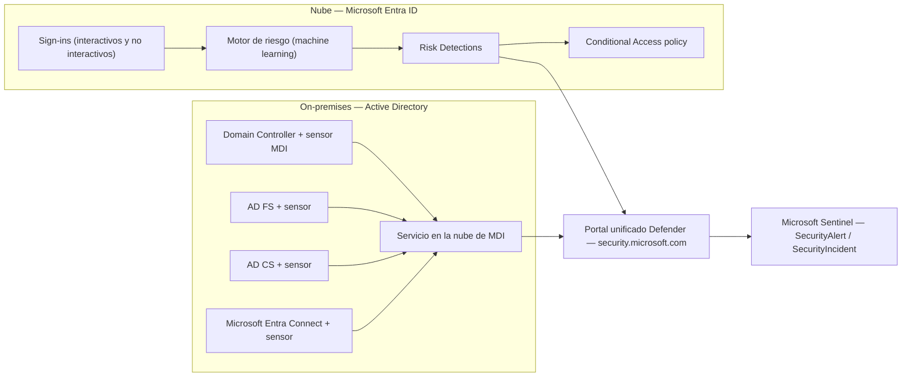
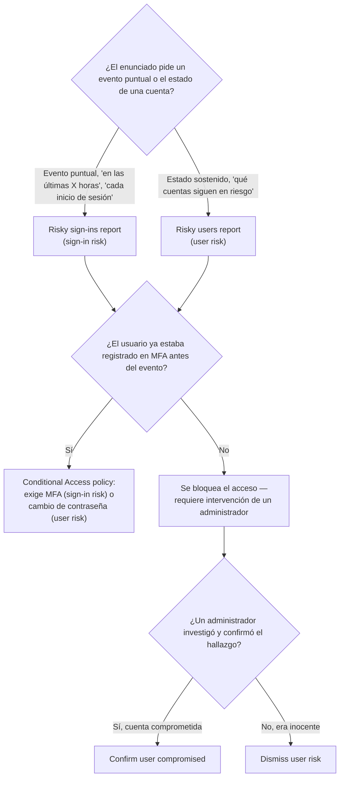
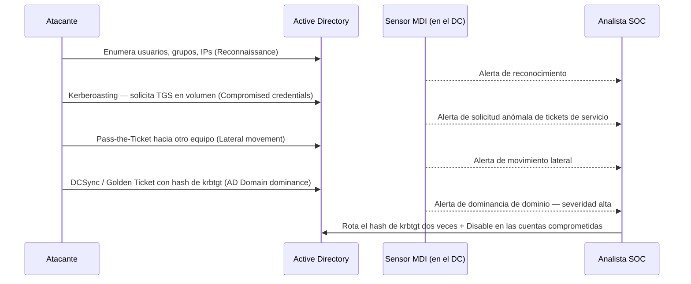
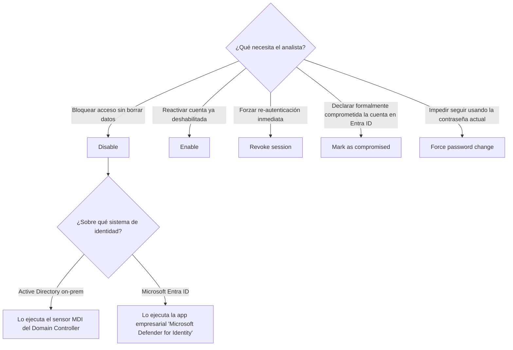

# Lección Día 11 — Identidades: Entra ID Protection + MDI (Microsoft Defender for Identity)

> [!info] Contexto
> Día 11 del plan de [[PLAN_MAESTRO_MULTITRACK]] §8.3, dentro del **Dominio 2 — Respond to security incidents (35-40% del examen)**. Estaba programado para el martes 25-ago y no se impartió — se retoma hoy, **6 días de retraso real**, sin maquillarlo (el detalle completo del porqué queda en el tracker). El Día 10 (MDO/MDCA) sigue siendo el último contenido impartido en fecha.
>
> Hoy cubrimos las dos herramientas de Microsoft que responden cuando el atacante ya no está atacando un buzón o un endpoint, sino una **identidad**: **Entra ID Protection**, que vigila cuentas en la nube (Microsoft Entra ID, antes Azure AD), y **MDI (Microsoft Defender for Identity)**, que vigila el **Active Directory on-premises** — el controlador de dominio, Kerberos, las cuentas de servicio — y también fuentes híbridas. El hilo conductor sigue siendo el mismo de toda la semana: herramientas que suenan parecidas (Risky users vs Risky sign-ins, Pass-the-Hash vs Pass-the-Ticket, Disable vs Delete) que el examen distingue por un detalle preciso del enunciado.
>
> **Hallazgo con fecha crítica, verificado hoy:** las políticas de riesgo "clásicas" configuradas directamente en el panel de Identity Protection **se retiran el 1 de octubre de 2026** — dos días antes de tu examen. La forma correcta de configurar respuesta a riesgo, la única vigente el día de tu examen, es una **Conditional Access policy** con condición de riesgo. Si una guía vieja o un video de 2023-2024 te muestra el flujo antiguo ("ID Protection → Policies → User risk policy"), ese camino ya no es el recomendado — lo ves en detalle en la sección 3.

> [!info] Nota de reescritura — 11-sep-2026
> Esta lección se reescribió en profundidad: cada concepto se explica desde cero (aunque ya se haya visto en otra lección), con diagramas Mermaid, una imagen oficial de Microsoft Learn, y una nota de concepto vinculada por cada tema clave (carpeta `Conceptos/`). El contenido factual, la tabla de decisión y el quiz original se preservan íntegros; los hallazgos nuevos de hoy quedan marcados con ⚠️.

---

## 📖 Lectura del día

### 0. Dónde estamos dentro del Dominio 2

| Sub-bloque | Qué agrupa | Cuándo lo ves |
|---|---|---|
| Respond to alerts and incidents in Microsoft Defender XDR | Gestión de incidentes, case management, respuesta por producto (MDO, MDCA ya vistos; **Entra ID Protection y MDI hoy**; Defender for Cloud después), ataques multi-etapa, agentic AI/Copilot | Días 8, 10, **11**, 12, 13 |
| Respond to alerts and incidents in Microsoft Defender for Endpoint | Device timeline, live response, collect investigation package, evidencia, attack disruption | Día 9 (ya cubierto) |
| Investigate Microsoft 365 activities to identify threats | Purview Audit, eDiscovery, Microsoft Graph activity logs | Día 13 |

Con la lección de hoy quedan cuatro de los cinco productos de respuesta por producto cubiertos (MDO, MDCA, Entra ID Protection, MDI); solo falta Defender for Cloud (Día 12) para cerrar ese sub-bloque completo.

### 0.5 Antes de entrar en materia: qué es una identidad y por qué es el blanco favorito de un atacante

Una **identidad**, en seguridad informática, es cualquier cuenta — de una persona, de una aplicación, de un servicio automatizado — que puede autenticarse (probar quién es) y a la que se le conceden permisos sobre recursos. Microsoft gestiona identidades en **dos mundos** que históricamente se desarrollaron por separado y que hoy conviven en la mayoría de las organizaciones (el llamado modelo **híbrido**):

- **Microsoft Entra ID** (antes Azure Active Directory): el directorio de identidades **en la nube**. Aquí vive la cuenta con la que inicias sesión en Microsoft 365, Azure, Teams, etc. No tiene un "servidor" que administres tú — es un servicio gestionado por Microsoft.
- **Active Directory Domain Services (AD DS)**, normalmente llamado solo **Active Directory (AD)**: el directorio de identidades **on-premises** (en tus propios servidores), con décadas de historia en el mundo corporativo. Aquí vive el concepto de **dominio**, **controlador de dominio (Domain Controller, DC)** — el servidor que valida quién eres y qué puedes hacer — y el protocolo **Kerberos**, que ves en la sección 6.

**Por qué un atacante prefiere robar una identidad en vez de usar malware:** si un atacante consigue una contraseña, un hash de contraseña, o un ticket de autenticación robado, puede iniciar sesión **como si fuera el usuario legítimo**. No hay un archivo malicioso que un antivirus pueda detectar, ni tráfico de red obviamente anómalo — desde el punto de vista del sistema, es un inicio de sesión válido. Una vez dentro, el atacante usa esa identidad para **moverse lateralmente** (saltar de una cuenta/equipo a otro), **escalar privilegios** (llegar a una cuenta de administrador) y **persistir** (mantener el acceso incluso después de que alguien cambie una contraseña, si lo que robó fue algo más profundo que una contraseña, como ves en la sección 6 con Golden Ticket).

Por eso existen **dos herramientas distintas, no una sola**: **Entra ID Protection** vigila el plano de identidad en la nube, y **MDI** vigila el plano de identidad on-premises (y aporta señal híbrida). Ambas alimentan el mismo portal unificado de Defender y correlacionan sus alertas con las de MDE, MDO y MDCA que ya viste en días anteriores.


*Diagrama: el mismo portal de Defender XDR recibe señal de dos planos de identidad distintos — la nube (Entra ID Protection) y on-premises (MDI, vía sensores) — y ambos terminan correlacionados en Sentinel.*

### 1. Microsoft Entra ID Protection: qué es y qué problema resuelve

**Definición:** **Entra ID Protection** es el servicio de Microsoft Entra ID (el directorio de identidades en la nube de Microsoft, antes llamado Azure Active Directory) que usa **machine learning** para calcular, en tiempo real y de forma continua, qué tan probable es que una cuenta o un inicio de sesión estén comprometidos. No es un producto separado que instalas: es una capacidad que se activa sobre el directorio que ya tienes, y su salida son **detecciones de riesgo** que alimentan reportes y pueden disparar respuestas automáticas.

**Por qué existe:** la pregunta de fondo que resuelve es distinta a la de un antivirus o un firewall: no analiza archivos ni tráfico de red, analiza **patrones de comportamiento de identidad** — ¿desde dónde inicia sesión normalmente este usuario?, ¿en qué dispositivo?, ¿a qué hora?, ¿sus credenciales aparecieron en una fuga de datos conocida? — y cuantifica cuánto se desvía cada evento de ese patrón. Es la respuesta de Microsoft al punto ciego que describimos en la sección 0.5: un inicio de sesión con credenciales robadas es indistinguible de uno legítimo a menos que alguien mida el comportamiento.

**Cómo funciona por dentro:** cada sign-in y cada estado de cuenta se evalúan contra el modelo de ML, que produce un `riskEventType` (el tipo exacto de detección, el valor que ves si consultas vía Microsoft Graph API) y un `riskLevel` (Low/Medium/High). Algunas detecciones se calculan **en tiempo real** (5-10 minutos) y pueden bloquear el acceso en el momento vía Conditional Access; otras se calculan **offline** (hasta 48 horas) porque necesitan correlacionar más señal, y solo permiten actuar retroactivamente sobre la cuenta, nunca sobre el sign-in original. Ver el detalle completo en la sección 2.

**Dónde se configura / investiga y qué rol hace falta:** los reportes viven en `entra.microsoft.com` → **Protection → Identity Protection**. Ver los reportes requiere como mínimo el rol **Security Reader**; configurar políticas de remediación requiere **Conditional Access Administrator**, **Security Administrator** o **Global Administrator**.

**Licenciamiento (verificado hoy):** el motor completo de detecciones requiere **Microsoft Entra ID P2** (o el paquete Microsoft Entra Suite). Con **Microsoft Entra ID Free o P1**, sigues recibiendo señal, pero las detecciones "premium" (la mayoría) se muestran genéricas, bajo el nombre **"Additional risk detected"**, sin el detalle de qué las disparó — el `riskEventType` que devuelve la API en ese caso literalmente es `generic`. Algunas detecciones sí están disponibles completas incluso sin P2: **Leaked credentials**, **Anonymous IP address**, **Microsoft Entra threat intelligence** y **Admin confirmed user compromised** (confirmado hoy contra la tabla oficial de Microsoft Learn, que lista cada detección con su columna "Premium"/"Nonpremium").

**Ejemplo concreto de escenario SOC:** un analista revisa el dashboard de Identity Protection un lunes por la mañana y ve que la cuenta de un gerente de finanzas tiene una detección "Leaked credentials" — sus credenciales aparecieron en una fuga de datos pública. Esta detección está disponible incluso con licencia P1, así que no hace falta P2 para verla completa.

**Trampa de examen:** el distractor típico es asumir que Identity Protection "analiza archivos o tráfico como un antivirus" — no lo hace, analiza exclusivamente comportamiento de autenticación. Otro distractor: creer que sin P2 no se recibe ninguna señal — sí se recibe, solo que genérica para las detecciones premium.

**Nota de concepto:** [[Conceptos/Entra ID Protection]]

### 2. Risk levels, y dos tipos de riesgo que NO son lo mismo

**Definición completa:** hay **dos ejes de riesgo** independientes en Entra ID Protection, y el examen exige distinguirlos con precisión de definición, no solo de memoria:

- **Sign-in risk**: la probabilidad de que **un inicio de sesión puntual** no lo haya hecho el dueño legítimo de la cuenta. Es un evento — cada sign-in tiene su propio cálculo de riesgo, independiente de los demás.
- **User risk**: la probabilidad de que **la cuenta en sí** esté comprometida, acumulando evidencia de varios sign-ins y señales a lo largo del tiempo. No es un evento puntual, es un estado de la cuenta que persiste hasta que se remedia.

**Por qué existe la distinción (por qué no basta un solo "riesgo"):** un solo sign-in raro (por ejemplo, viajar y conectarse desde un país nuevo) puede ser perfectamente inocente y no implica que la cuenta completa esté comprometida — sería excesivo bloquearla por completo. Pero varias señales acumuladas sobre la misma cuenta (leaked credentials + un ataque de tipo AiTM + actividad administrativa atípica) sí justifican tratar la cuenta entera como comprometida, sin importar cuál fue el evento puntual que la disparó. Separar ambos ejes evita sobre-reaccionar a un evento aislado y a la vez permite escalar cuando el patrón es sostenido.

**Este es el punto que ya te costó puntos en el Simulacro 01 del 23-jul**, así que vale la pena fijarlo con precisión.

**Los reportes que muestran cada uno, en el portal (Microsoft Entra admin center → Protection → Identity Protection):**

- **Risky sign-ins report**: lista de eventos de inicio de sesión individuales marcados con riesgo — un usuario puede aparecer varias veces, una fila por cada sign-in riesgoso.
- **Risky users report**: lista de usuarios con riesgo actual, una fila por usuario, con su nivel de riesgo agregado y el historial de detecciones que lo generaron.

**Regla fijada para no volver a confundirlos:** si el enunciado pide algo **por evento, puntual, "en las últimas X horas"** → Risky sign-ins. Si pide algo **por usuario, sostenido en el tiempo, "qué cuentas siguen en riesgo"** → Risky users.

Cada risk detection tiene un **risk level**: **Low**, **Medium** o **High**. Lo calcula el mismo modelo de machine learning, y representa qué tan confiado está Microsoft de que una credencial fue comprometida. Un dato operativo que el examen puede usar: **las detecciones de nivel Low se "envejecen" automáticamente a los 6 meses** si nadie las remedia; **Medium y High persisten indefinidamente** hasta que se remedian o se descartan manualmente.

**Real-time vs offline, otro eje que el examen distingue:** algunas detecciones se calculan **en tiempo real**, en 5-10 minutos (por ejemplo Unfamiliar sign-in properties, Anonymous IP address) y pueden bloquear el acceso en el momento vía Conditional Access. Otras se calculan **offline**, hasta 48 horas después (por ejemplo Impossible travel, Malicious IP address), porque requieren correlacionar más señal — con esas no puedes bloquear el sign-in original, solo actuar retroactivamente sobre la cuenta.

**Ejemplos de detecciones concretas, agrupadas por tipo (verificado hoy contra la lista completa de Microsoft Learn, `concept-identity-protection-risks`, ms.date 22-abr-2026):**

| Sign-in risk (evento puntual) | User risk (estado de cuenta) |
|---|---|
| Anonymous IP address / Anomalous token | Leaked credentials (credenciales de este usuario aparecieron en una fuga de datos conocida) |
| Impossible travel / Atypical travel | Attacker in the Middle (sesión enlazada a un proxy inverso malicioso — AiTM) |
| Password spray | Possible attempt to access Primary Refresh Token (PRT), señal que viene de MDE |
| Verified threat actor IP | Anomalous user activity (patrón administrativo atípico) |
| Malicious IP address | Suspicious API traffic (enumeración vía Graph API) |

**Dónde se investiga y con qué permiso:** ambos reportes viven en `entra.microsoft.com` → Protection → Identity Protection; leerlos requiere rol Security Reader como mínimo.

**Ejemplo concreto:** ver Ejemplo 1 de la sección de Ejemplos concretos más abajo, resuelto paso a paso.

**Trampa de examen:** ver la tabla de decisión de la sección 10 — este es el ítem con más peso histórico de error en este curso.

**Nota de concepto:** [[Conceptos/Riesgo de usuario vs riesgo de sign-in]]


*Diagrama de decisión: primero se determina qué eje de riesgo aplica, luego si la auto-remediación es posible, y solo si no lo es entra la intervención manual del administrador.*

### 3. Remediación: self-service vs administrador — y el cambio de dónde se configura

**Definición:** la remediación es el conjunto de acciones — automáticas o manuales — que cierran una detección de riesgo, ya sea confirmando que la cuenta estaba comprometida y arreglándola, o descartando el hallazgo como falso positivo.

Hay dos caminos de remediación, y el examen distingue cuál aplica según quién actúa:

**Auto-remediación (self-remediation), la opción recomendada por Microsoft:** en vez de bloquear directamente, configuras una **Conditional Access policy con condición de riesgo** que le exige al usuario probar que es él — completar MFA (Multi-Factor Authentication) para remediar sign-in risk, o hacer un cambio de contraseña seguro para remediar user risk. El usuario se auto-remedia sin que un analista tenga que intervenir manualmente. **Requisito importante que el examen puede preguntar como trampa:** el usuario debe estar **ya registrado en MFA antes** de que ocurra el evento de riesgo — si no lo está, la política lo bloquea y sí requiere intervención de un administrador.

**Recomendaciones oficiales de configuración (verificadas hoy, Microsoft Learn actualizado 28-abr-2026):**
- **User risk policy**: exigir remediación cuando el user risk llegue a **High**.
- **Sign-in risk policy**: exigir MFA cuando el sign-in risk sea **Medium o High**.

**El cambio de arquitectura que debes saber para tu examen (crítico, fecha de retiro justo antes de tu cita):** durante años, estas políticas se configuraban directamente en el panel de **Identity Protection → Policies**. Ese camino todavía existe hoy, pero **se retira formalmente el 1 de octubre de 2026**. La forma vigente — y la única que seguirá funcionando el 3 de octubre, día de tu examen — es crear la política directamente en **Conditional Access** (Microsoft Entra admin center → Protection → Conditional Access → New policy), usando la condición **User risk** o **Sign-in risk**, nunca ambas en la misma política (Microsoft lo marca explícitamente como advertencia: si combinas las dos condiciones en una sola política, no funcionan como se espera).

**Acciones de administrador cuando el riesgo no se auto-remedia:**
- **Confirm user compromised**: un administrador declara manualmente que la cuenta SÍ estaba comprometida (esto queda registrado como su propia detección: "Admin confirmed user compromised").
- **Dismiss user risk**: el administrador determina que la detección fue un falso positivo y descarta el riesgo sin más acción.
- **Reset password / Block user**: acciones directas disponibles desde el reporte de Risky users, útiles cuando no hay una Conditional Access policy configurada todavía.

> [!warning] ⚠️ Hallazgo nuevo, verificado hoy — cambio silencioso en cómo llegan estas alertas al portal de Defender
> Desde el **11 de diciembre de 2025**, el portal de Defender XDR (`security.microsoft.com`) trae por defecto configurado el ingreso de alertas de Entra ID Protection en modalidad **"High-risk detections only"** (solo detecciones de riesgo Alto) dentro de **Alert service settings**, accesible desde la página de Incidents. Antes de este cambio, el comportamiento por defecto ingería más volumen. Esto es configurable — puedes cambiarlo a "High + Medium" o "All detections" — pero si tu tenant nunca tocó esta configuración, es probable que solo estés viendo en el portal de Defender las detecciones de nivel Alto, aunque Medium y Low sigan existiendo y sean consultables directamente en el portal de Identity Protection. Si el examen describe un escenario donde "una detección de riesgo Medio no generó alerta en el portal de Defender pero sí aparece en Identity Protection", esta es la explicación: es la configuración por defecto, no un error.

**Trampa de examen:** confundir "no llegó como alerta a Defender XDR" con "no se detectó" — son cosas distintas desde diciembre de 2025.

**Nota de concepto:** [[Conceptos/Entra ID Protection]]

### 4. Microsoft Defender for Identity (MDI): qué protege y cómo llegan sus datos

**Definición:** **MDI** es el producto de Microsoft que monitorea señales de identidad provenientes de **Active Directory on-premises** (el directorio tradicional, con controladores de dominio) y de Microsoft Entra ID, además de otras soluciones de gestión de identidad (por ejemplo Okta). A diferencia de Entra ID Protection — que solo ve la nube — MDI es la herramienta que sí tiene visibilidad sobre protocolos y comportamientos exclusivos de un entorno Active Directory clásico: Kerberos, LDAP, replicación entre controladores de dominio, SAM-R.

**Por qué existe:** como se explicó en la sección 0.5, un AD on-premises tiene su propio conjunto de vectores de ataque que nunca pasan por la nube y que por tanto Entra ID Protection no puede ver. MDI cierra ese punto ciego específico, con detección basada en analítica de comportamiento, threat intelligence y patrones de ataque conocidos, y correlaciona sus hallazgos con el resto del ecosistema Defender.

**Cómo funciona por dentro (verificado hoy contra la documentación oficial, actualizada 23-jul-2026):** MDI usa **sensores** ligeros instalados en la infraestructura de identidad, más conectores de API para sistemas de IAM (Identity and Access Management) externos. Los sensores capturan y analizan localmente el tráfico de red y los eventos de Windows relevantes, y solo envían al servicio en la nube las señales que realmente hacen falta para detección — minimizando impacto de rendimiento y sin necesitar cambios complejos de red.

**Dónde se instala un sensor:**
- **Controladores de dominio (Domain Controllers)** — el despliegue más común y el único que puede **ejecutar acciones de remediación** (sección 9), incluyendo controladores de solo lectura (RODC).
- **AD FS (Active Directory Federation Services)**
- **AD CS (Active Directory Certificate Services)**
- **Microsoft Entra Connect** (el servidor de sincronización híbrida)

> [!warning] ⚠️ Corregido / ampliado 11-sep-2026 — requisitos exactos del sensor v3.x
> La nota anterior decía, en términos generales, que el sensor "ya no corre como agente separado". Verificado hoy contra la guía de despliegue oficial (`deploy-defender-identity`, actualizada 10-sep-2026), el detalle exacto es más fino y puede aparecer como trampa:
> - El **sensor v3.x** (la generación más nueva, integrada dentro del agente unificado de MDE) solo está disponible para servidores con **Windows Server 2019 o posterior**, y requiere la actualización acumulativa de **julio de 2026 o posterior**.
> - Para **controladores de dominio** elegibles, el sensor v3.x se puede activar **con o sin** que el servidor esté previamente onboarded a Microsoft Defender for Endpoint (hay un paquete de onboarding dedicado si el DC no tiene MDE).
> - Para servidores de **AD FS, AD CS y Microsoft Entra Connect**, el sensor v3.x **exige que el servidor ya esté onboarded a MDE antes** de poder activarlo — no hay ruta independiente para estos tres roles.
> - Servidores con **Windows Server 2016 o anterior** solo pueden usar el **sensor v2.x** (el agente independiente clásico), que además es obligatorio si la organización necesita integración VPN o notificaciones por syslog — capacidades que v3.x no soporta.
> - MDI soporta sensores v2.x y v3.x conviviendo en el mismo workspace, típico en migraciones graduales.


*Captura oficial de Microsoft Learn: fíjate en que la elección del sensor depende del sistema operativo del servidor, no de una preferencia — Windows Server 2019+ con la CU de julio-2026 habilita v3.x, todo lo anterior usa v2.x.*

**Dónde se configura / investiga y qué rol hace falta:** el despliegue y gestión de sensores vive en el portal de Defender (`security.microsoft.com` → Settings → Identities → Sensors), y requiere acceso administrativo al servidor de destino más permisos de configuración en el portal de Defender. La investigación de alertas y entidades vive en la página de Identidad del portal unificado.

**Ejemplo concreto de escenario SOC:** Contoso tiene 4 controladores de dominio con Windows Server 2022 (todos elegibles para v3.x) y 1 controlador legado con Windows Server 2012 R2 (solo puede usar v2.x). El equipo despliega v3.x en los 4 modernos aprovechando que ya están onboarded a MDE, y mantiene v2.x en el legado hasta que se retire ese servidor.

**Trampa de examen:** asumir que "todos los sensores nuevos son v3.x sin excepción" — el sistema operativo del servidor decide, no una preferencia de configuración; y AD FS/AD CS/Entra Connect necesitan MDE onboarding previo, a diferencia de los DC.

**Nota de concepto:** [[Conceptos/MDI]]

### 5. Las cuatro etapas del ataque que MDI detecta

**Definición:** MDI organiza sus detecciones alrededor de las etapas típicas de un ataque contra identidades — el examen suele dar un escenario y pedirte identificar en qué etapa cae. Esto se confirmó hoy exactamente igual contra la página oficial `what-is` (ms.date 23-jul-2026), palabra por palabra:

| Etapa | Qué detecta MDI |
|---|---|
| **Reconnaissance** (reconocimiento) | Actividad de enumeración sospechosa: intentos de listar nombres de usuario, membresías de grupo, direcciones IP y recursos de la red — el atacante todavía no tiene un objetivo, está mapeando el terreno. |
| **Compromised credentials** (credenciales comprometidas) | Intentos de comprometer credenciales: fuerza bruta, autenticaciones fallidas repetidas, cambios sospechosos de membresía de grupo — y aquí caen las técnicas clásicas de Kerberos que ves en la sección 6 (Kerberoasting, Pass-the-Hash, Pass-the-Ticket). |
| **Lateral movement** (movimiento lateral) | Intentos de moverse entre sistemas y expandir el control sobre identidades sensibles — el atacante ya tiene un punto de apoyo y busca escalar hacia cuentas de más privilegio. |
| **AD Domain dominance** (dominio del dominio) | El objetivo final del atacante: comportamiento asociado a comprometer el dominio por completo — ejecución remota de código en un controlador de dominio, DCShadow, replicación maliciosa entre controladores, actividad de Golden Ticket. |

Esta progresión (reconocimiento → credenciales → lateral → dominancia) es exactamente el mismo concepto de "cadena de ataque" (kill chain) que ya viste con Attack Disruption en el Día 6 — MDI es una de las señales que alimenta esa correlación.

> [!info] Matiz de portal, no de contenido
> El catálogo de alertas del portal unificado de Defender está en transición hacia categorías alineadas a MITRE ATT&CK (Reconnaissance and discovery, Persistence and privilege escalation, Credential access, Lateral movement) para las alertas en "formato Defender". La página conceptual de MDI (la más reciente y la que cita el examen) sigue usando el modelo de **4 etapas** de la tabla de arriba para explicar qué detecta el producto — ambos modelos describen la misma realidad, solo con distinta granularidad de etiquetado en el portal.

**Dónde se investiga:** portal de Defender → Incidents & alerts → Alerts, filtrando por producto MDI, o directamente en la Identity page de la entidad afectada.

**Ejemplo concreto:** ver Ejemplo 2 más abajo (reconocimiento antes de Kerberoasting, resuelto con KQL).

**Trampa de examen:** el examen da un escenario (ej. "un atacante enumera nombres de usuario y grupos") y pide la etapa, no la técnica — aquí la respuesta es Reconnaissance, no Kerberoasting (que es una técnica específica dentro de la etapa Compromised credentials).

**Nota de concepto:** [[Conceptos/MDI]]

### 6. Técnicas de ataque a Kerberos y AD — el vocabulario que el examen exige por nombre

**Definición desde cero:** Kerberos es el protocolo de autenticación por defecto de Active Directory. En vez de mandar la contraseña cada vez que un usuario accede a un recurso, el usuario recibe **tickets**: un **TGT** (Ticket Granting Ticket) para autenticarse ante el dominio en general, y **TGS** (Ticket Granting Service tickets) para acceder a un servicio específico dentro de ese dominio. El servicio que emite estos tickets se llama **KDC** (Key Distribution Center) y corre dentro de cada controlador de dominio. Existe una cuenta especial, **krbtgt**, cuyo hash de contraseña firma criptográficamente todos los TGT emitidos en el dominio — es, en la práctica, la "llave maestra" de confianza de todo el sistema Kerberos del dominio.

**Por qué el examen exige este vocabulario exacto:** varias de las técnicas de ataque más citadas en el examen abusan específicamente de este mecanismo de tickets, y cada una roba o falsifica algo distinto — el examen premia que sepas identificar QUÉ se robó, no solo que "es un ataque a Kerberos":

- **Kerberoasting**: el atacante, con cualquier cuenta de dominio válida (no necesita privilegios de administrador), solicita en volumen **tickets de servicio (TGS)** para cuentas que tienen un SPN (Service Principal Name) registrado — típicamente cuentas de servicio. Esos tickets vienen cifrados con el hash de la contraseña de la cuenta de servicio, y el atacante se los lleva para intentar romper el cifrado **offline**, sin generar más tráfico contra el dominio. La señal que MDI detecta es el volumen y patrón anómalo de esas solicitudes de TGS.
- **AS-REP Roasting**: variante relacionada — ataca cuentas que tienen deshabilitada la preautenticación Kerberos, permitiendo al atacante pedir directamente una respuesta cifrada (AS-REP) que también puede intentar romper offline, sin ni siquiera necesitar una contraseña válida previa.
- **Pass-the-Hash**: el atacante roba el **hash NTLM** de la contraseña de un usuario (no la contraseña en texto plano) y lo reutiliza directamente para autenticarse en otros sistemas — no necesita saber la contraseña real, el hash basta.
- **Pass-the-Ticket**: el atacante roba un **ticket Kerberos ya emitido** (un TGT o un TGS) de la memoria de un sistema comprometido y lo reutiliza en otro sistema para moverse lateralmente, sin tocar contraseñas ni hashes.
- **DCSync**: el atacante, usando una cuenta con permisos de replicación (normalmente robados o mal configurados), **se hace pasar por un controlador de dominio** y le pide a un controlador de dominio real que le "replique" el contenido de la base de datos de Active Directory — incluidos los hashes de contraseña de todas las cuentas, incluso las de administradores de dominio.
- **Golden Ticket**: la técnica de dominancia de dominio más grave. El atacante que ya obtuvo el hash de la cuenta especial **krbtgt** puede **forjar** un TGT válido para cualquier usuario, con cualquier privilegio, válido por el tiempo que el atacante decida — efectivamente una llave maestra falsificada del dominio completo.
- **Silver Ticket**: variante más acotada del Golden Ticket — el atacante forja un **TGS** (no un TGT) usando el hash de la cuenta de un servicio específico, obteniendo acceso falsificado solo a ese servicio, no a todo el dominio.

**Tabla resumen para memorizar rápido — qué roba/falsifica cada técnica:**

| Técnica | Qué usa el atacante | Qué obtiene |
|---|---|---|
| Kerberoasting | Solicitud masiva de TGS (cuenta normal, sin privilegios) | Hashes de cuentas de servicio, para romper offline |
| AS-REP Roasting | Solicitud de AS-REP sin preautenticación | Hash de la cuenta objetivo, para romper offline |
| Pass-the-Hash | Hash NTLM robado | Autenticación sin conocer la contraseña real |
| Pass-the-Ticket | Ticket Kerberos robado (TGT o TGS) | Movimiento lateral reutilizando la sesión ya autenticada |
| DCSync | Permisos de replicación (legítimos o robados) | Hashes de TODAS las cuentas del dominio |
| Golden Ticket | Hash de la cuenta krbtgt | TGT forjado, acceso ilimitado y persistente a todo el dominio |
| Silver Ticket | Hash de la cuenta de un servicio | TGS forjado, acceso ilimitado a ESE servicio específico |

**Dónde se investiga:** cada una de estas técnicas dispara una alerta específica de MDI en el portal de Defender, dentro de la etapa correspondiente (Kerberoasting y AS-REP Roasting en Compromised credentials; Pass-the-Ticket en Lateral movement; DCSync y Golden Ticket en AD Domain dominance).

**Ejemplo concreto:** ver Ejemplo 3 más abajo — un Golden Ticket resuelto (y por qué "Force password change" no basta).

**Trampa de examen:** ver la sección 10, filas específicas para Kerberoasting, DCSync y Golden Ticket.

**Nota de concepto:** [[Conceptos/Ataques a Kerberos y Active Directory]]


*Diagrama de secuencia: la progresión completa de un ataque de identidad, mapeada a las 4 etapas de MDI y a las técnicas de la sección 6.*

### 7. Honeytoken accounts: la trampa deliberada

**Definición:** un **honeytoken** es una cuenta señuelo — creada específicamente para no tener ningún uso legítimo — que un equipo de seguridad configura y monitorea de cerca dentro de MDI.

**Por qué existe:** como nadie legítimo debería tocarla nunca, **cualquier interacción con ella es, por definición, sospechosa**: si alguien la consulta vía LDAP, intenta autenticarse con ella, o modifica sus atributos, MDI genera una alerta de alta confianza casi sin falsos positivos, porque no hay una explicación inocente para esa actividad. Es una forma de generar señal de altísima confianza sin depender de que un modelo de ML "aprenda" qué es normal — aquí no existe un comportamiento normal posible.

**Cómo funciona:** el analista crea y marca una cuenta como honeytoken dentro de la configuración de MDI. **Actualización reciente verificada hoy:** la alerta genérica de "Honeytoken activity" se dividió en **cinco alertas separadas y más específicas** (por ejemplo: honeytoken consultada vía SAM-R, honeytoken consultada vía LDAP, honeytoken con atributos modificados, cambio de membresía de grupo de la honeytoken) — permite distinguir de inmediato qué tipo de interacción ocurrió, sin tener que abrir la alerta genérica para averiguarlo.

**Dónde se configura / rol necesario:** portal de Defender (`security.microsoft.com` → Settings → Identities → Entity tags → Honeytoken accounts). Requiere permisos administrativos sobre la configuración de MDI.

**Ejemplo concreto:** un atacante en fase de Reconnaissance enumera cientos de cuentas del directorio de forma automatizada; entre ellas está la honeytoken. Esa única consulta dispara una alerta de alta confianza mucho antes de que el atacante llegue a comprometer una cuenta real de valor.

**Trampa de examen:** no confundir con una **cuenta sensible** (sensitive account) — esa es una cuenta REAL de alto privilegio que SÍ se usa legítimamente y que MDI protege con más atención; el honeytoken es una trampa sin uso real alguno.

**Nota de concepto:** [[Conceptos/Honeytoken]]

### 8. Attack paths (antes "Lateral Movement Paths"): visualizar cómo llegaría un atacante

**Definición:** una de las capacidades de postura de MDI es identificar y **visualizar** las rutas que un atacante podría usar para moverse lateralmente desde una cuenta de bajo privilegio hasta una **cuenta sensible** (administradores de dominio, cuentas de servicio críticas), aprovechando credenciales compartidas entre máquinas, grupos mal configurados, o permisos administrativos innecesarios.

**Por qué existe:** conocer que una máquina está mal configurada no basta para priorizar remediación — lo que importa es si esa máquina conecta con algo crítico. Un equipo con configuración débil es un riesgo bajo si nadie con privilegios altos inicia sesión ahí; es un riesgo altísimo si un administrador de dominio comparte credenciales en esa misma máquina. Attack paths hace visible esa conexión de forma proactiva, **antes** de que un atacante la explote — es postura, no detección de un ataque ya en curso.

**Cambio de nombre importante para tu examen:** esta capacidad se llamaba **Lateral Movement Paths (LMPs)** en el portal clásico de MDI (ese portal y esa terminología ya están **retirados y archivados** por Microsoft). En el portal unificado de Defender (`security.microsoft.com`), dentro de la nueva **página de Identidad** de cada entidad, la misma capacidad vive ahora en la pestaña **Attack paths** — muestra las rutas potenciales de movimiento lateral que involucran a esa identidad o que llevan hacia ella. Si el examen o una guía vieja usa el nombre "Lateral Movement Path", reconoce que describe el mismo concepto que hoy se llama Attack paths en el portal vigente.

**Dónde se investiga / rol necesario:** portal de Defender, página de Identidad de la entidad afectada, pestaña Attack paths — es capacidad de solo lectura para investigación, no requiere un rol especial más allá del acceso estándar de analista.

**Ejemplo concreto:** Attack paths muestra que una cuenta de servicio de bajo privilegio tiene una sesión guardada en un equipo donde también inició sesión un administrador de dominio recientemente — si el atacante compromete la cuenta de servicio, puede robar el hash o ticket del administrador desde esa misma máquina.

**Trampa de examen:** no confundir con la **Identity Timeline**, que muestra actividad cronológica de UNA cuenta a lo largo del tiempo, no rutas de escalamiento entre cuentas distintas.

**Nota de concepto:** [[Conceptos/Attack paths]]

### 9. Remediación: qué acciones puede ejecutar MDI y sobre qué cuentas

Esta es la sección con más detalle fino de "ubicación y combinación exacta de permisos", el patrón que ya te costó puntos en el Día 7 con workbooks — así que vale la pena leerla despacio.

**Cómo se autoriza y ejecuta una acción (verificado hoy, doc actualizada 19-ago-2026):** el analista inicia la acción desde el portal de Defender (página de Identidad, panel lateral de la identidad, Advanced Hunting, o el Action center), el sistema la autoriza vía RBAC (Role-Based Access Control) basado en roles de Microsoft Entra ID, y **si el usuario no está autorizado, la acción se bloquea antes de ejecutarse** — nunca llega al sistema de identidad de destino.

**Las cinco acciones disponibles:**

| Acción | Qué hace | Sobre qué fuentes de identidad funciona |
|---|---|---|
| **Disable** | Deshabilita todas las cuentas ligadas a la identidad (o una cuenta específica). Impide inicio de sesión y acceso a recursos hasta reactivarla. **No borra** el perfil ni datos asociados (documentos, correo, calendario). | Active Directory, Microsoft Entra ID, Okta, CyberArk, SailPoint, Google Workspace, Salesforce, Box |
| **Enable** | Reactiva una cuenta previamente deshabilitada. | Active Directory, Microsoft Entra ID, Okta, CyberArk, SailPoint, Salesforce |
| **Revoke session** | Revoca las sesiones activas de la identidad — la fuerza a autenticarse de nuevo. | Microsoft Entra ID, Okta |
| **Mark as compromised** | Marca todas las cuentas ligadas a la identidad como comprometidas en Microsoft Entra ID. | Solo Microsoft Entra ID |
| **Force password change** | Fuerza un cambio de contraseña en el siguiente inicio de sesión — impide seguir usando la credencial comprometida. | Active Directory, Microsoft Entra ID |

**El detalle de arquitectura que el examen puede convertir en trampa:** para cuentas de **Active Directory** (on-premises), la acción la ejecuta físicamente el **sensor de MDI instalado en el controlador de dominio**, usando la cuenta de sistema local del propio controlador — **los sensores instalados en AD FS, AD CS o Microsoft Entra Connect NO pueden ejecutar acciones de remediación**, solo observan y reportan señal. Para cuentas de **Microsoft Entra ID**, la acción la ejecuta una aplicación empresarial administrada por Microsoft llamada literalmente "Microsoft Defender for Identity" (en tenants antiguos puede aparecer como "Radius Aad Syncer").

**Roles necesarios (verificado hoy), con el hallazgo más reciente:** ejecutar cualquiera de estas acciones requiere un **rol personalizado con el permiso "Response (manage)"** en el RBAC unificado de Defender. Además, cada acción tiene su propia lista de roles nativos de Entra ID que también la habilitan (por ejemplo, Force password change acepta Global Administrator, Privileged Authentication Administrator, Authentication Administrator, User Administrator, Password Administrator o Helpdesk Administrator). **Novedad de julio 2026 verificada hoy:** existe un nuevo rol dedicado, **SOC Identity Responder**, diseñado específicamente para que un analista de SOC pueda ejecutar acciones de respuesta de identidad (Disable, Revoke session, Mark as compromised, Force password change) **sin necesitar un rol administrativo amplio de Entra ID** — el mismo principio de mínimo privilegio que ya viste con los permisos granulares de MDE en el Día 9.

**Relación con Attack Disruption (conexión con el Día 6):** estas mismas acciones de remediación de MDI son las que **Attack Disruption usa automáticamente** cuando detecta un ataque activo con alta confianza — por ejemplo, la acción "Contain user" o "Disable user" que ya viste en la tabla de acciones del Día 6 se ejecuta, por debajo, a través de esta misma capacidad de remediación de MDI.

**Ejemplo concreto:** ver Ejemplo 3 (Golden Ticket, por qué Force password change no alcanza).

**Trampa de examen:** ver fila específica en la tabla de decisión, sección 10.

**Nota de concepto:** [[Conceptos/MDI]]


*Diagrama de decisión: qué acción usar según lo que el enunciado pide, y quién la ejecuta técnicamente por debajo.*

### 10. La tabla de decisión: el calificador del enunciado, otra vez

| El enunciado dice (calificador) | Herramienta / respuesta correcta | Por qué NO las demás |
|---|---|---|
| "Ver, evento por evento, todos los inicios de sesión riesgosos de un usuario en las últimas 24 horas" | **Risky sign-ins report** | Risky users agrega por usuario a través del tiempo, no lista eventos individuales |
| "Identificar qué cuentas siguen acumulando riesgo alto sostenido, sin importar el evento puntual que lo originó" | **Risky users report** | Risky sign-ins es por evento puntual, no por estado agregado de la cuenta |
| "Exigir MFA automáticamente cuando el riesgo del inicio de sesión sea medio o alto, sin bloquear ni forzar cambio de contraseña" | **Sign-in risk Conditional Access policy** | User risk policy exige remediación completa (cambio de contraseña), más agresivo que lo que pide el enunciado |
| "Forzar un cambio de contraseña seguro cuando el riesgo de la CUENTA llegue a alto, de forma sostenida" | **User risk Conditional Access policy** | Sign-in risk solo exige MFA por evento, no fuerza cambio de contraseña |
| "Un administrador determina, tras investigar, que la cuenta SÍ estaba comprometida" | **Confirm user compromised** | Dismiss risk es lo opuesto: declarar que fue un falso positivo |
| "Cuenta normal (no admin) solicita en volumen tickets de servicio para romperlos offline, sin generar más tráfico contra el dominio" | **Kerberoasting** | DCSync exige permisos de replicación; Pass-the-Ticket reutiliza un ticket ya emitido, no solicita nuevos |
| "Una cuenta se hace pasar por un controlador de dominio y pide replicar la base de datos completa de AD" | **DCSync** | Pass-the-Hash usa un hash de contraseña robado, no replicación de directorio |
| "Se forjó un TGT válido por tiempo indefinido usando el hash de la cuenta krbtgt" | **Golden Ticket** | Silver Ticket forja un TGS para UN servicio específico, no un TGT de todo el dominio |
| "Minimizar impacto: bloquear el acceso de la cuenta sin borrar sus datos, dejándola lista para reactivar" | **Disable** (acción de remediación de MDI) | No existe una acción "Delete" en este catálogo; Disable es la acción que preserva datos |
| "Visualizar cómo un atacante podría llegar desde una cuenta de bajo privilegio hasta un admin de dominio" | **Attack paths** (antes Lateral Movement Paths) | La Identity Timeline muestra actividad cronológica de UNA cuenta, no rutas de escalamiento entre cuentas |

---

## 💡 Ejemplos concretos

### Ejemplo 1 — Risky users vs Risky sign-ins: el fallo del Simulacro 01, resuelto paso a paso

**Escenario:** El equipo de SOC pide dos entregables distintos en la misma junta: (1) "denme la lista de todos los usuarios que tienen ahora mismo un nivel de riesgo Medio o Alto sin remediar, para priorizar a quién llamamos hoy", y (2) "para el usuario `jgarcia@contoso.com`, quiero el detalle de cada inicio de sesión marcado como riesgoso en los últimos 7 días, con IP y ubicación de cada uno".

**Razonamiento:** son dos preguntas con forma gramatical distinta y eso es la señal. La petición (1) pide un **estado actual, agregado por cuenta** — "qué usuarios siguen en riesgo ahora" — eso es exactamente el **Risky users report**: una fila por usuario con su nivel de riesgo vigente. La petición (2) pide **el detalle evento por evento de un solo usuario** — eso es el **Risky sign-ins report**, filtrado por ese usuario, donde cada fila es un inicio de sesión individual con su propia IP, ubicación y tipo de detección. Si invirtieras las dos herramientas, en (1) el Risky sign-ins report te daría demasiadas filas repetidas por usuario (una por cada evento, no un estado agregado), y en (2) el Risky users report no tendría el detalle de IP/ubicación por evento que se pidió.

### Ejemplo 2 — Reconocimiento antes de Kerberoasting: identificarlo con Advanced Hunting

**Escenario:** Un analista sospecha que una cuenta de dominio normal (sin privilegios administrativos) fue comprometida y está siendo usada para enumerar el directorio antes de lanzar un ataque de Kerberoasting. Quiere confirmar si esa cuenta hizo un volumen inusual de consultas contra objetos de Active Directory en la última hora.

**Razonamiento:** las consultas contra objetos de AD (usuarios, grupos, equipos, dominios) — típicas de la fase de **Reconnaissance** — quedan registradas en la tabla `IdentityQueryEvents` del esquema de Advanced Hunting de MDI, no en `IdentityLogonEvents` (esa es para eventos de autenticación, no de consulta/enumeración).

```kql
// Contar cuántos objetos DISTINTOS de AD consultó cada cuenta en la última hora
// Ajusta el filtro de ActionType al valor exacto que veas en tu esquema (por ejemplo, consultas vía LDAP o SAM-R)
IdentityQueryEvents
| where Timestamp > ago(1h)
| where Protocol in ("Ldap", "SamR")
| summarize ObjetosConsultados = dcount(ObjectName) by AccountUpn, bin(Timestamp, 15m)
| where ObjetosConsultados > 50
| order by ObjetosConsultados desc
```

Si el volumen es anómalo para esa cuenta (comparado con su comportamiento habitual), es la señal de reconocimiento que MDI también usaría internamente para generar una alerta — el analista está replicando esa lógica manualmente sobre datos ya recolectados, exactamente el mismo patrón de "confirmar con KQL lo que ya viste en una alerta" que usaste el Día 10 con `EmailPostDeliveryEvents`.

### Ejemplo 3 — Golden Ticket: por qué "Force password change" NO alcanza

**Escenario:** MDI genera una alerta de alta confianza de actividad tipo Golden Ticket sobre un controlador de dominio. El analista, siguiendo el reflejo de "credencial comprometida → forzar cambio de contraseña", ejecuta Force password change sobre la cuenta involucrada y da el incidente por cerrado.

**Razonamiento — por qué esto NO resuelve el problema:** un Golden Ticket no depende de la contraseña actual de ninguna cuenta de usuario — depende del **hash de la cuenta especial krbtgt**, que firma todos los tickets del dominio. Mientras ese hash no cambie, el atacante puede seguir forjando TGTs válidos para **cualquier cuenta**, incluida una con la contraseña recién cambiada. Cambiar la contraseña de la cuenta comprometida no invalida los tickets ya forjados ni impide forjar nuevos. La remediación real de un Golden Ticket es un procedimiento de **higiene de Active Directory a nivel de dominio** (fuera del catálogo de acciones de un clic de MDI): rotar la contraseña de la cuenta krbtgt — típicamente dos veces, con el intervalo que recomienda Microsoft, porque cada controlador de dominio guarda las dos últimas versiones del hash — y solo después de eso, invalidar los tickets ya emitidos. Es el mismo tipo de trampa que "minimizar impacto" en el Día 9: la opción que suena a respuesta rápida (cambiar contraseña) no es la que realmente ataca la causa raíz cuando el enunciado deja claro que se trata de dominancia de dominio, no de una credencial de usuario robada.

---

## 🎥 Videos

1. **[Leveraging Microsoft Defender for Identity](https://www.youtube.com/watch?v=09zXZcNPLuU)** — John Savill's Technical Training. Nota de honestidad: este video es de enero de 2024, así que **no es reciente** en el sentido estricto que pide este curso — no encontré un video de 2025-2026 específico y de buena calidad sobre MDI. Lo incluyo de todas formas porque John Savill es un creador reconocido y técnicamente sólido, y los conceptos centrales de MDI (sensores, etapas de ataque, remediación) no han cambiado en su esencia, aunque la lección de hoy ya incorpora las actualizaciones puntuales de 2026 (sensor v3.x con requisitos de SO específicos, retiro de LMP clásico → Attack paths, nuevo rol SOC Identity Responder, Alert service settings) que el video no puede cubrir por ser anterior.
2. Módulo oficial de Microsoft Learn: **[Examine Microsoft Entra ID Protection](https://learn.microsoft.com/en-us/training/modules/examine-azure-identity-protection/)** — cubre risk levels, risky users/sign-ins y la configuración de políticas de riesgo; y la ruta de aprendizaje completa **[SC-200: Mitigate threats using Microsoft Defender XDR](https://learn.microsoft.com/en-us/training/paths/sc-200-mitigate-threats-using-microsoft-365-defender)**, que incluye el módulo dedicado a MDI. No encontré un video reciente de Exam Readiness Zone específico para el bloque de identidades (la serie existente usa los 4 dominios viejos del temario, ya no vigentes) — mejor usar estos dos módulos activamente mantenidos como fuente principal.

---

## 🧪 Ejercicio práctico

> [!warning] Este lab probablemente NO cabe hoy — agéndalo
> A diferencia de las lecciones de MDO/MDCA, **MDI necesita un controlador de dominio real con el sensor instalado** para generar señal — algo que ni el trial M365 E5 por sí solo ni el tenant universitario de La Salle te dan de forma simple sin un laboratorio de AD dedicado. Explorar Entra ID Protection sí cabe en el bloque de hoy (es sobre el tenant en la nube); el lab de MDI de verdad (desplegar un DC de prueba + sensor + generar una alerta de Kerberoasting controlada) es exactamente el tipo de bloque continuo de 2-3h que este plan reserva para el sábado — no lo fuerces entre semana. Esto coincide con lo previsto en [[MAPA_DIARIO_LEARN_LABS]]: el Día 11 no tiene lab oficial de GitHub, solo práctica de KQL propia.

- [ ] **Paso 1 — Explorar Identity Protection.** En `entra.microsoft.com` → **Protection → Identity Protection**, revisa el Dashboard, el **Risky users report** y el **Risky sign-ins report**. Si tu trial no tiene actividad riesgosa real, revisa igual la estructura de columnas de cada reporte para fijar la diferencia visual entre ambos.
- [ ] **Paso 2 — Confirmar el estado de las políticas de riesgo.** Revisa si existe alguna Conditional Access policy con condición de User risk o Sign-in risk en **Protection → Conditional Access**. Si el tenant trae una política legacy en el panel viejo de Identity Protection → Policies, identifícala como el flujo que se retira el 1-oct-2026.
- [ ] **Paso 3 — Revisar Alert service settings (nuevo hoy).** En el portal de Defender (`security.microsoft.com`), busca **Incidents → Alert service settings** y confirma si Entra ID Protection está configurado en "High-risk detections only" (el default desde 11-dic-2025) o en otro nivel.
- [ ] **Paso 4 (agendar para sábado) — Lab de MDI.** Si tienes o puedes desplegar un DC de prueba, instala el sensor de MDI (verifica primero si tu servidor es elegible para v3.x según el SO, sección 4 de hoy) y provoca una detección controlada de Kerberoasting o de honeytoken (siguiendo la documentación oficial de deployment). Si no es viable en tu entorno, usa el módulo de Microsoft Learn como sustituto y documenta la limitación.
- [ ] **Paso 5 —** responde el quiz de hoy y el repaso acumulativo.

---

## ✅ Quiz del día

Cinco preguntas sobre el contenido nuevo de hoy. Responde antes de abrir el bloque de respuestas.

**1.** Un administrador necesita, evento por evento, la lista de inicios de sesión marcados como riesgosos de un usuario específico durante las últimas 24 horas, incluyendo IP y ubicación de cada uno. ¿Qué reporte de Entra ID Protection consulta?

- A) Risky sign-ins report
- B) Risky users report
- C) Identity Protection risk policy report
- D) Conditional Access insights report

**2.** Una organización configuró hace dos años una política de riesgo de usuario directamente en el panel clásico de Identity Protection → Policies (no en Conditional Access). ¿Qué debe hacer antes del 1 de octubre de 2026 para no perder esta protección el día de un examen agendado el 3 de octubre?

- A) No hacer nada, el panel clásico seguirá funcionando indefinidamente en paralelo
- B) Actualizar la licencia a Microsoft Entra ID P1, que reactiva el panel clásico de forma permanente
- C) Migrar la lógica a una Conditional Access policy con condición de riesgo y deshabilitar la política legacy
- D) Esperar a que Microsoft migre la política automáticamente sin intervención

**3.** Para que las acciones de remediación de MDI (como Disable o Force password change) se ejecuten sobre una cuenta de Active Directory on-premises, ¿en qué tipo de servidor debe estar instalado el sensor que ejecuta la acción?

- A) Servidor de AD FS
- B) Servidor de AD CS
- C) Servidor de Microsoft Entra Connect
- D) Controlador de dominio

**4.** Un atacante, usando una cuenta de dominio normal sin privilegios administrativos, envía en poco tiempo un volumen inusualmente alto de solicitudes de tickets de servicio (TGS) para varias cuentas que tienen un SPN registrado, con el objetivo de romper esos tickets offline más tarde. ¿Qué técnica describe este comportamiento?

- A) DCSync
- B) Kerberoasting
- C) Pass-the-Ticket
- D) Golden Ticket

**5.** Un analista configura una cuenta sin uso real ni permisos legítimos, exclusivamente para generar una alerta de alta confianza si alguien la consulta vía LDAP o intenta autenticarse con ella. ¿Cómo se llama este tipo de cuenta en MDI?

- A) Cuenta sensible (sensitive account)
- B) Cuenta de servicio con SPN
- C) Honeytoken account
- D) Cuenta de break-glass

> [!note]- Ver respuestas
> **1 — A.** "Evento por evento" y "durante las últimas 24 horas" son las señales de un reporte por evento puntual: Risky sign-ins. **B** agrega por usuario a través del tiempo, no lista eventos individuales con IP/ubicación por cada uno. **C** no es un reporte de eventos, es la configuración de política (y además ese flujo está en retiro). **D** es un reporte de impacto de políticas de Conditional Access, no de riesgo de identidad.
>
> **2 — C.** Las políticas de riesgo legacy configuradas en el panel de Identity Protection se retiran el 1-oct-2026 — hay que crear el equivalente en Conditional Access (en report-only primero, luego activarla) y deshabilitar la vieja antes de esa fecha. **A** es falso, hay fecha de retiro anunciada. **B** confunde licencia con arquitectura de configuración — P1 no reactiva nada, y de hecho P2 sigue siendo necesario para el detalle completo de detecciones. **D** no existe una migración automática; el proceso requiere que el administrador cree la nueva política manualmente.
>
> **3 — D.** Solo los sensores instalados en controladores de dominio pueden ejecutar acciones de remediación sobre cuentas de AD — usan la cuenta de sistema local del propio controlador. **A**, **B** y **C** son ubicaciones válidas para instalar un sensor de MDI (aportan señal), pero ninguna de ellas ejecuta acciones de remediación.
>
> **4 — B.** Cuenta normal (sin privilegios), volumen alto de solicitudes de TGS contra cuentas con SPN, y el objetivo de romper el cifrado offline es la firma exacta de Kerberoasting. **A** (DCSync) exige permisos de replicación de directorio, no solicitudes de tickets. **C** (Pass-the-Ticket) reutiliza un ticket YA emitido robado de memoria, no genera solicitudes nuevas en volumen. **D** (Golden Ticket) forja un TGT usando el hash de krbtgt, no solicita TGS legítimos para romperlos después.
>
> **5 — C.** Una cuenta señuelo sin uso legítimo, creada para que cualquier interacción con ella sea sospechosa por definición, es la descripción exacta de un honeytoken account. **A** (cuenta sensible) es una cuenta real de alto privilegio que SÍ se usa legítimamente y que MDI protege, no un señuelo. **B** describe cualquier cuenta de servicio normal, objetivo típico de Kerberoasting, no un señuelo deliberado. **D** (break-glass) es una cuenta de emergencia real para recuperar acceso administrativo, no una trampa de detección.

---

## 🔁 Repaso acumulativo — re-test espaciado

Cuatro preguntas que re-testean puntos ya medidos como débiles en sesiones anteriores, con enunciados nuevos. Dos de ellas (R1 y R2) son ítems del Simulacro 01 del 23-jul que **nunca se habían vuelto a testear en una lección diaria** — quedan cerradas hoy.

**R1.** Un usuario externo colaborador accedió a un documento de SharePoint marcado como confidencial. El equipo de cumplimiento necesita identificar exactamente quién fue, cuándo, y qué hizo con el documento. ¿Dónde revisa esta actividad?

- A) Microsoft 365 admin center, en el reporte de uso de SharePoint
- B) Purview portal, usando audit log search
- C) Portal de Defender, en la cola de incidentes
- D) SharePoint admin center, en el reporte de actividad de sitios

**R2.** Contoso necesita crear un dashboard visual que muestre, semana a semana, cuántas alertas de Kerberoasting generó MDI en los últimos tres meses, para presentarlo en una junta directiva. ¿Qué construyen?

- A) Un playbook que se ejecute automáticamente cada semana
- B) Una automation rule con una acción de notificación programada
- C) Un workbook de Sentinel con una visualización basada en esos datos
- D) Una anomaly detection policy configurada con umbral semanal

**R3.** Después de que MDI detecta actividad de movimiento lateral hacia una estación de trabajo específica, un analista necesita capturar la memoria, los procesos en ejecución y la actividad de red de ese dispositivo, **minimizando el impacto** sobre el usuario que lo está usando en ese momento. ¿Qué acción de MDE (Microsoft Defender for Endpoint) ejecuta?

- A) Isolate device
- B) Restrict app execution
- C) Live response con un script de captura manual
- D) Collect investigation package

**R4.** Un incidente de Sentinel correlaciona tres alertas: una de MDI (Kerberoasting), una de Entra ID Protection (impossible travel) y una de MDE (proceso sospechoso). ¿En qué tabla consultas el incidente correlacionado completo, y en qué tabla consultas cada una de las tres alertas individuales por separado?

- A) El incidente y las tres alertas están todas en `SecurityIncident`
- B) El incidente está en `SecurityAlert`; las tres alertas individuales están en `SecurityIncident`
- C) El incidente está en `SecurityIncident`; las tres alertas individuales están en `SecurityAlert`
- D) El incidente está en `IdentityLogonEvents`; las alertas están en `SecurityAlert`

> [!note]- Ver respuestas
> **R1 — B.** Regla fijada desde el Simulacro 01 (ítem nunca antes retesteado en una lección diaria, contenido que se profundiza formalmente el Día 13): identificar QUÉ HIZO un usuario con datos específicos es una búsqueda en el **audit log** del Purview portal. **A** y **D** no tienen visibilidad de auditoría a ese nivel de detalle de operación por usuario/documento. **C** es para alertas e incidentes de seguridad correlacionados, no para auditoría de actividad de usuario sobre un documento puntual.
>
> **R2 — C.** Regla fijada desde el Simulacro 01 (§1 de [[REPASO_RAPIDO_Errores_Simulacro]], nunca antes retesteado con este framing): "visualizar", "dashboard", "junta directiva" son las palabras que apuntan a workbook. **A** y **B** son acciones automatizadas (ejecutar algo), no visualización. **D** es un mecanismo de detección con umbral de comportamiento, no una herramienta de reporte visual histórico.
>
> **R3 — D.** Sigue siendo el bloque más débil medido en este curso (5 fallos en el Simulacro 01, reforzado el Día 9): "minimizar impacto" descarta Isolate device (corta la red del usuario, impacto directo). Collect investigation package es forense pasivo — no interrumpe al usuario. **B** es una acción más estrecha (solo bloquea ejecución de una app), no captura memoria/red. **C** exige que el analista sepa exactamente qué comandos correr; Collect investigation package ya empaqueta todo eso automáticamente.
>
> **R4 — C.** Regla fijada tras el fallo del quiz del Día 6, reforzada hoy con MDI como origen nuevo: una **alerta individual** de cualquier producto (MDI, Entra ID Protection, MDE) vive en `SecurityAlert`; el **incidente correlacionado** que las agrupa en Sentinel vive en `SecurityIncident`. **A** y **B** invierten o mezclan la regla. **D** confunde la tabla de telemetría cruda de MDI (`IdentityLogonEvents`, usada para hunting) con las tablas de alertas/incidentes, que son conceptos distintos.

---

## ⚠️ Trampas del examen en los temas de hoy

1. **Risky users (por usuario, agregado en el tiempo) ≠ Risky sign-ins (por evento puntual).** El calificador "en las últimas X horas, evento por evento" apunta a sign-ins; "qué cuentas siguen en riesgo" apunta a users.
2. **Las políticas de riesgo legacy de Identity Protection se retiran el 1-oct-2026** — dos días antes de tu examen. La configuración vigente es una Conditional Access policy con condición de riesgo, nunca combinando User risk y Sign-in risk en la misma política.
3. **Solo los sensores de MDI en controladores de dominio ejecutan remediación** sobre cuentas de AD — AD FS, AD CS y Entra Connect solo aportan señal, no ejecutan acciones.
4. **Kerberoasting (solicita TGS en volumen) ≠ Pass-the-Ticket (reutiliza un ticket ya robado) ≠ DCSync (replica el directorio) ≠ Golden Ticket (forja con el hash de krbtgt).** Cada una roba/falsifica algo distinto — memoriza qué, no solo que "todas son ataques a Kerberos/AD".
5. **Force password change no remedia un Golden Ticket.** La causa raíz es el hash de la cuenta krbtgt, no la contraseña de la cuenta de usuario afectada.
6. **Attack paths es el nombre vigente**; "Lateral Movement Paths (LMP)" es terminología del portal clásico ya retirado — mismo concepto, portal y nombre distintos.
7. **Disable preserva datos, no existe "Delete" en el catálogo de remediación de MDI** — si el enunciado pide minimizar impacto sin borrar nada, Disable es la respuesta, no una acción de eliminación.
8. **`SecurityAlert` (alerta individual, cualquier producto) vs `SecurityIncident` (caso correlacionado de Sentinel)** — regla que ya falló dos veces en este curso, reforzada hoy con MDI y Entra ID Protection como origen nuevo.
9. **SOC Identity Responder (rol nuevo, jul-2026)** es un ejemplo más del patrón de mínimo privilegio que el examen premia: un rol acotado a acciones de respuesta de identidad, sin necesitar Global Administrator ni otro rol amplio.
10. **⚠️ Nuevo hoy — Alert service settings (default 11-dic-2025):** si una detección de riesgo Medio/Low de Entra ID Protection "no aparece" en la cola de alertas del portal de Defender, no significa que no se detectó — el default es ingerir solo detecciones High; hay que revisar Identity Protection directamente o cambiar el filtro en Alert service settings.
11. **⚠️ Nuevo hoy — el sensor v3.x de MDI exige Windows Server 2019+ con la CU de julio-2026**, y solo los controladores de dominio pueden activarlo con o sin MDE previo; AD FS/AD CS/Entra Connect necesitan MDE onboarding primero. Servidores más antiguos usan v2.x, obligatorio también si se necesita VPN o syslog.

---

## 🔗 Notas relacionadas

- [[Conceptos/Entra ID Protection]] — nota de concepto dedicada
- [[Conceptos/Riesgo de usuario vs riesgo de sign-in]] — nota de concepto dedicada
- [[Conceptos/MDI]] — nota de concepto dedicada
- [[Conceptos/Ataques a Kerberos y Active Directory]] — nota de concepto dedicada
- [[Conceptos/Honeytoken]] — nota de concepto dedicada
- [[Conceptos/Attack paths]] — nota de concepto dedicada
- [[Dia 06 - AIR Attack Disruption Automation Rules y Playbooks]] — Attack disruption y sus acciones (Contain user, Disable user, Revoke session), que hoy se explican con más profundidad como acciones nativas de MDI
- [[Dia 09 - Respuesta MDE Timeline Live Response y Evidencia]] — mismo patrón de RBAC granular (permisos independientes) y de tabla de decisión por calificador del enunciado; base del repaso R3 de hoy
- [[Dia 10 - MDO Threat Explorer ZAP y MDCA]] — mismo patrón de tabla de decisión de 7+ filas y de refuerzo de `SecurityAlert` vs `SecurityIncident` con un origen nuevo
- [[PLAN_MAESTRO_MULTITRACK]] — calendario vigente §8, examen 3-oct-2026 fijo
- [[REPASO_RAPIDO_Errores_Simulacro]] — origen de los ítems R1 y R2 del repaso acumulativo de hoy (§5 Purview, §1 Workbook vs Playbook)
- [[TRACKER_TUTOR]]

## 📚 Fuentes verificadas hoy (11-sep-2026)

- [Risk detection types and levels](https://learn.microsoft.com/en-us/entra/id-protection/concept-risk-detection-types) — ms.date 10-jun-2026, fuente principal de la sección 2 (risk levels, real-time vs offline, envejecimiento de detecciones Low a 6 meses)
- [What are risk detections?](https://learn.microsoft.com/en-us/entra/id-protection/concept-identity-protection-risks) — ms.date 22-abr-2026, re-verificado hoy, fuente principal de la lista de detecciones de sign-in risk y user risk, y de los requisitos de licencia P1 vs P2 (confirmado el detalle exacto de qué detecciones son "Nonpremium")
- [Risk policies - Microsoft Entra ID Protection](https://learn.microsoft.com/en-us/entra/id-protection/howto-identity-protection-configure-risk-policies) — actualizado 28-abr-2026, fuente del hallazgo crítico: retiro de políticas legacy el **1-oct-2026** y la configuración recomendada en Conditional Access
- [Microsoft Defender for Identity Overview](https://learn.microsoft.com/en-us/defender-for-identity/what-is) — ms.date 23-jul-2026, re-verificado hoy, fuente principal de la sección 4-5 (arquitectura de sensores, tabla de las 4 etapas de ataque, confirmada palabra por palabra)
- [Deploy Microsoft Defender for Identity sensors](https://learn.microsoft.com/en-us/defender-for-identity/deploy/deploy-defender-identity) — ms.date 10-sep-2026, fuente nueva de hoy, base de la corrección de la sección 4 sobre requisitos exactos de sensor v3.x vs v2.x, y de la imagen incluida
- [Remediation Actions for Compromised Users in Microsoft Defender for Identity](https://learn.microsoft.com/en-us/defender-for-identity/remediation-actions) — ms.date 22-jul-2026, actualizado 19-ago-2026, fuente principal de la sección 9 (las 5 acciones, roles requeridos, rol nuevo SOC Identity Responder, restricción de sensores por tipo de servidor)
- [Security alerts - Microsoft Defender for Identity](https://learn.microsoft.com/en-us/defender-for-identity/alerts-overview) — ms.date 1-jul-2026, actualizado 11-ago-2026, re-verificado hoy; confirma la transición en curso entre alertas "classic" y "Defender-format" y las categorías alineadas a MITRE ATT&CK, incorporada como matiz en la sección 5
- Búsqueda verificada hoy: cambio de default a "High-risk detections only" en Alert service settings de Entra ID Protection dentro de Defender XDR desde el 11-dic-2025, configurable desde Incidents → Alert service settings — confirmado contra Microsoft Message Center (MC1190195) y documentación relacionada
- Búsqueda verificada: técnicas de ataque (Kerberoasting, DCSync, Pass-the-Hash/Ticket, Golden/Silver Ticket) y honeytokens divididos en 5 alertas separadas — confirmado contra documentación y comunidad técnica de Microsoft Defender for Identity, 2026
- [Investigate Identities - Microsoft Defender XDR](https://learn.microsoft.com/en-us/defender-xdr/investigate-users) y hallazgo de comunidad técnica — confirman el renombramiento de "Lateral Movement Paths" a la pestaña **Attack paths** en la nueva página de Identidad del portal unificado; la documentación del portal clásico de LMP está archivada y marcada `is_retired: true`
- [IdentityQueryEvents table in the advanced hunting schema](https://learn.microsoft.com/en-us/defender-xdr/advanced-hunting-identityqueryevents-table) — usada en el Ejemplo 2

---

> [!tip] Orden de consumo de hoy (fijado el 24-ago, ver [[PLAN_MAESTRO_MULTITRACK]] §7.7)
> 🎧 Escucha primero el Audio Overview de esta lección en NotebookLM → 📖 luego lee esta nota completa, con foco en la sección 10 (tabla de decisión) → ✅ y cierra con el quiz. Escuchar no sustituye leer, y leer no sustituye el quiz — el día se cierra con el quiz respondido, no antes.
