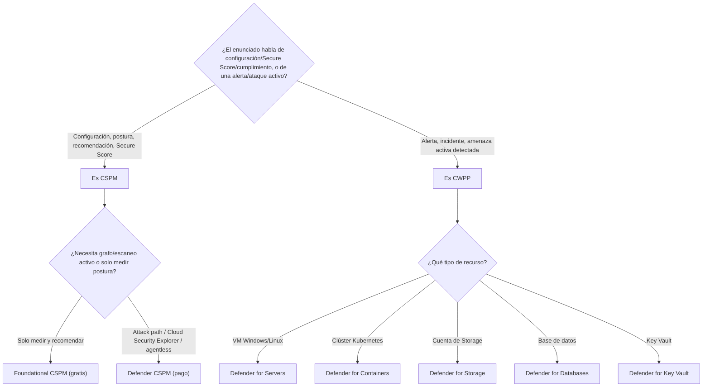
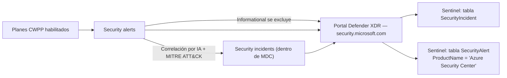
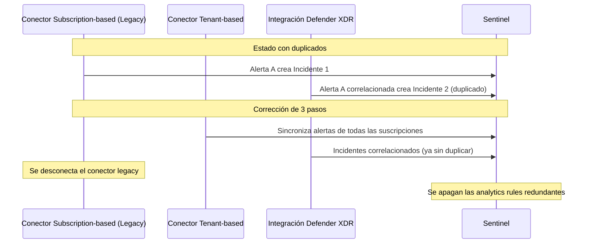

# Lección Día 12 — Microsoft Defender for Cloud: Workload Protections

> [!info] Contexto
> Día 12 del plan de [[PLAN_MAESTRO_MULTITRACK]] §8.3, dentro del **Dominio 2 — Respond to security incidents (35-40% del examen)**. Estaba programado para el miércoles 26-ago y se retoma hoy junto con el Día 11 — **5 días de retraso real**, sin maquillarlo (el detalle completo queda en el tracker). El objetivo exacto que cierra hoy, citado literal del study guide oficial (skills measured as of July 28, 2026): **"Investigate and remediate alerts and incidents identified by Microsoft Defender for Cloud workload protections"**, dentro del sub-bloque *Respond to alerts and incidents in Microsoft Defender XDR*.
>
> Con esta lección se completan los **cinco productos de respuesta por producto** de ese sub-bloque: MDO (Día 10), MDCA (Día 10), Entra ID Protection + MDI (Día 11) y hoy **Microsoft Defender for Cloud**. Es el quinto y último eslabón de esa cadena — después de hoy, lo que queda del sub-bloque son los temas transversales (ataques multi-etapa, agentic AI/Copilot, case management, ya vistos en el Día 8) y el cierre del Dominio 2 con Purview/eDiscovery/Graph el próximo día de contenido.
>
> Defender for Cloud es distinto a todo lo que viste hasta ahora esta semana: no protege un buzón, una identidad ni un endpoint — protege **recursos de infraestructura en la nube**: máquinas virtuales, contenedores, cuentas de almacenamiento, bases de datos, Key Vaults, APIs. Es, además, la única herramienta de esta semana que también tiene una mitad de "postura" (encontrar configuraciones débiles antes de que las exploten) además de su mitad de "respuesta" (detectar cuando ya las explotaron) — el examen distingue con cuidado cuál mitad te está preguntando.

> [!info] Nota de reescritura — 11-sep-2026
> Esta lección se reescribió en profundidad: cada concepto se explica desde cero, con diagramas Mermaid, tres imágenes oficiales de Microsoft Learn, y una nota de concepto vinculada por cada tema clave (carpeta `Conceptos/`). El contenido factual, la tabla de decisión y el quiz original se preservan íntegros (incluida la trampa documentada de `ProductName`); los hallazgos re-verificados hoy quedan marcados con ⚠️ donde hay matices nuevos.

---

## 📖 Lectura del día

### 0. Dónde estamos dentro del Dominio 2

| Sub-bloque | Qué agrupa | Cuándo lo ves |
|---|---|---|
| Respond to alerts and incidents in Microsoft Defender XDR | Gestión de incidentes, case management, respuesta por producto (MDO, MDCA, Entra ID Protection, MDI ya vistos; **Defender for Cloud hoy**), ataques multi-etapa, agentic AI/Copilot | Días 8, 10, 11, **12** |
| Respond to alerts and incidents in Microsoft Defender for Endpoint | Device timeline, live response, collect investigation package, evidencia, attack disruption | Día 9 (ya cubierto) |
| Investigate Microsoft 365 activities to identify threats | Purview Audit, eDiscovery, Microsoft Graph activity logs | Día 13 (pendiente, cierra el Dominio 2) |

### 0.5 Antes de entrar en materia: qué es un "recurso en la nube" y por qué necesita su propia herramienta

Hasta ahora esta semana viste tres superficies de ataque: un buzón de correo (MDO, Día 10), una app SaaS (MDCA, Día 10), y una identidad (Entra ID Protection + MDI, Día 11). Hoy ves la cuarta: la **infraestructura en la nube** — los recursos que una organización despliega en Azure, AWS o GCP para correr sus aplicaciones: máquinas virtuales, contenedores, bases de datos, cuentas de almacenamiento, Key Vaults (bóvedas de secretos), APIs.

Cada uno de estos recursos puede estar **mal configurado** (un puerto de administración remota abierto a todo internet, una cuenta de almacenamiento pública por error) o puede ser **atacado activamente** una vez que está corriendo (alguien explota una vulnerabilidad del sistema operativo de una VM, alguien ejecuta una herramienta de robo de credenciales dentro de un contenedor). Estas son dos preguntas distintas — "¿está bien configurado?" y "¿me están atacando ahora?" — y **Microsoft Defender for Cloud** es la única herramienta de este curso diseñada para responder ambas sobre el mismo tipo de recurso, con dos mitades de producto separadas que el examen distingue con cuidado (sección 1).

### 1. Qué es Microsoft Defender for Cloud y qué problema resuelve

**Definición desde cero:** **Microsoft Defender for Cloud** es una plataforma **CNAPP (Cloud Native Application Protection Platform)** — una categoría de producto que combina, en una sola solución, varias herramientas de seguridad para proteger aplicaciones a lo largo de todo su ciclo de vida: desde el código que un desarrollador escribe hasta el recurso ya corriendo en producción. No es un solo producto con una sola función; es un paraguas que agrupa tres capacidades distintas, y el examen las trata como tres conceptos separados que conviene no mezclar:

- **CSPM (Cloud Security Posture Management)**: revisa y mejora la configuración de seguridad de tus recursos en la nube. Responde a la pregunta "¿está bien configurado esto?" — encuentra puertos abiertos que no deberían estarlo, cifrado que falta, permisos excesivos — **antes** de que alguien lo explote.
- **DevSecOps (Development Security Operations)**: gestiona la seguridad a nivel de código a través de tus pipelines de CI/CD (por ejemplo GitHub Actions, Azure DevOps, GitLab). Encuentra secretos expuestos en el código y errores de configuración de Infrastructure as Code (IaC) **antes** de que ese código se despliegue.
- **CWPP (Cloud Workload Protection Platform)**: defiende workloads que ya están corriendo — máquinas virtuales, contenedores, cuentas de almacenamiento, bases de datos, funciones serverless — contra amenazas activas. Responde a la pregunta "¿alguien está atacando esto ahora mismo?" — es la mitad de **detección y respuesta**, la que más directamente cae dentro del objetivo del examen de hoy.


*Captura oficial de Microsoft Learn: los tres pilares — CSPM, DevSecOps, CWPP — como componentes de una sola plataforma CNAPP, no como productos separados que se compran de forma independiente.*

**Por qué existe:** antes de que existiera una plataforma unificada, una organización necesitaba herramientas distintas para postura de configuración, seguridad de pipelines de desarrollo, y detección de amenazas en producción — cada una con su propia consola, sin correlación entre ellas. Defender for Cloud junta las tres bajo un solo modelo de datos y un solo panel, permitiendo, por ejemplo, priorizar una recomendación de postura porque el **Attack path analysis** (sección 2) muestra que conecta directamente con datos sensibles expuestos.

**Regla para no confundir CSPM con CWPP en el examen:** si el enunciado habla de **recomendaciones, configuración, Secure Score, cumplimiento normativo** → es CSPM. Si habla de **una alerta, un ataque detectado, una amenaza activa, un incidente** → es CWPP. La lección de hoy se enfoca en CWPP (workload protections) porque es la mitad que el objetivo del examen nombra explícitamente, pero necesitas entender CSPM para no confundir sus recomendaciones con alertas de ataque real.

**Dónde se configura / rol necesario:** `portal.azure.com` → **Microsoft Defender for Cloud** → Environment settings (para habilitar planes sobre una suscripción; requiere rol Owner o Contributor sobre esa suscripción) y **Workload protections** (dashboard central, ver sección 6).

**Dato de arquitectura importante, verificado hoy:** Defender for Cloud está **expandiéndose activamente hacia el portal unificado de Defender** (`security.microsoft.com`). Microsoft Learn lo marca con un aviso explícito: algunas capacidades ya viven en el portal de Defender, y más se irán añadiendo con el tiempo — el mismo movimiento de unificación que ya viste con Sentinel (retiro del portal de Azure el 31-mar-2027) y con MDI (Días 6 y 11). Para el examen de octubre, asume que puedes encontrar preguntas que mencionen cualquiera de los dos portales.

**Ejemplo concreto de escenario SOC:** Contoso conecta su suscripción de Azure a Defender for Cloud, habilita Foundational CSPM (gratis) y revisa su Secure Score inicial; después habilita Defender for Servers Plan 2 solo sobre sus VMs de producción, no sobre las de desarrollo, para controlar el costo mientras prioriza dónde necesita detección activa.

**Trampa de examen:** el nombre comercial del producto es "Microsoft Defender for Cloud" desde hace años, pero el esquema de la tabla `SecurityAlert` de Sentinel conserva el nombre legado del producto anterior al rebranding — ver sección 7, es la trampa más citada de este día.

**Nota de concepto:** [[Conceptos/Defender for Cloud]]

### 2. CSPM: Foundational (gratis) vs Defender CSPM (de pago)

**Definición completa:** antes de entrar a las alertas de ataque, necesitas entender la base de postura sobre la que se apoyan, porque el examen distingue qué viene gratis y qué necesita un plan pagado. **Foundational CSPM** es el nivel gratuito, activo automáticamente en toda suscripción conectada a Defender for Cloud. **Defender CSPM** es un plan de pago que añade análisis avanzado de grafo y escaneo activo.

| Capacidad | Qué resuelve | Plan requerido |
|---|---|---|
| Políticas de seguridad centralizadas (Microsoft Cloud Security Benchmark) | Define las condiciones de seguridad que quieres mantener; se traduce en recomendaciones | Foundational CSPM (gratis) |
| **Secure Score** | Resume tu postura de seguridad en un número; mejora conforme remedias recomendaciones | Foundational CSPM (gratis) |
| Cobertura multicloud (conectar AWS y GCP) | Conecta cuentas de otros proveedores de nube sin agentes | Foundational CSPM (gratis) |
| **Attack path analysis** | Modela cómo un atacante podría llegar desde un recurso expuesto hasta datos sensibles, antes de que pase | **Defender CSPM** (pago) |
| **Cloud Security Explorer** | Mapa consultable de tu entorno completo para construir queries de riesgo | **Defender CSPM** (pago) |
| Data Security Posture Management | Descubre automáticamente dónde viven tus datos sensibles y evalúa el riesgo de exposición | Defender CSPM **o** Defender for Storage |
| Escaneo de vulnerabilidades **sin agente** (agentless) | Escanea software, vulnerabilidades y secretos sin instalar nada en la máquina | Defender CSPM **o** Defender for Servers Plan 2 |

**Por qué la división gratis/pago tiene esta forma exacta:** Microsoft regala la parte de "medir y recomendar" (Secure Score, políticas, multicloud) porque es lo mínimo para que cualquier cliente empiece a mejorar su postura sin fricción de costo. Cobra por la parte que exige cómputo pesado y correlación de grafo a gran escala (attack path, Cloud Security Explorer) y por cualquier cosa que implique **escanear activamente** contenido (vulnerabilidades, malware, secretos) sin agente instalado.

**Dónde se configura / rol necesario:** Environment settings → seleccionar la suscripción → activar/desactivar el plan Defender CSPM. Requiere Owner o Contributor sobre la suscripción.

**Ejemplo concreto:** Contoso quiere saber si un bucket de Storage mal configurado conecta, a través de permisos heredados, con una base de datos que contiene información de clientes — eso exige **Attack path analysis**, no basta con mirar el Secure Score, que solo da un número agregado sin mostrar la ruta.

**Trampa fijada:** Foundational CSPM (gratis) ya te da Secure Score y recomendaciones — la creencia de "necesito pagar para tener Secure Score" es un distractor típico. Lo que sí necesitas pagar es todo lo que huele a **análisis avanzado y de grafo** (attack path, cloud security explorer) o a **escaneo activo sin agente**.

**Nota de concepto:** [[Conceptos/CSPM vs CWPP]] y [[Conceptos/Secure Score]]


*Diagrama de decisión: primero CSPM vs CWPP, luego — dentro de cada rama — cuál plan específico corresponde.*

### 3. Los planes de CWPP: qué protege cada uno

**Definición:** esta es la tabla que el examen más te va a pedir traducir: dado un tipo de recurso o una necesidad concreta, ¿qué plan de Defender for Cloud lo cubre? Cada plan de CWPP es independiente — se habilita por separado y factura por separado, sobre el tipo de recurso que le corresponde.

| Plan | Qué protege | Detalle relevante |
|---|---|---|
| **Defender for Servers** | Máquinas virtuales Windows y Linux — en Azure, AWS, GCP y on-premises | Dos niveles, Plan 1 y Plan 2 (ver sección 4) |
| **Defender for Containers** | Clústeres y nodos de Kubernetes | Hardening del entorno, vulnerability assessment, protección en tiempo de ejecución (runtime) |
| **Defender for Storage** | Cuentas de Azure Storage | Malware scanning **sin agente**, detección de fugas de datos sensibles, mal uso de tokens SAS (Shared Access Signature) |
| **Defender for Databases** | Azure SQL, SQL Server en máquinas, bases relacionales open-source, Azure Cosmos DB | Detección de ataques y respuesta a amenazas por tipo de motor de base de datos |
| **Defender for Key Vault** | Azure Key Vault | Detecta intentos inusuales o potencialmente dañinos de acceder o explotar una bóveda de secretos |
| **Defender for App Service** | Aplicaciones web sobre Azure App Service | Identifica ataques dirigidos a la aplicación en ejecución |
| **Defender for Resource Manager** | La capa de gestión de Azure (operaciones de Azure Resource Manager) | Monitorea automáticamente operaciones de gestión de recursos inusuales o dañinas |
| **Defender for APIs** | APIs de negocio críticas | Visibilidad, postura de seguridad, priorización de vulnerabilidades, detección de amenazas activas en tiempo real |
| **AI Services** | Cargas de trabajo de IA generativa | Identifica amenazas a aplicaciones de IA generativa en tiempo real |


*Captura oficial de Microsoft Learn (re-verificada hoy, 10-ago-2026): cada plan cubre un tipo de recurso específico — no existe un solo plan que "lo cubra todo", por eso el examen da escenarios compuestos que exigen varios planes a la vez (ver Ejemplo 2 más abajo).*

**Nota sobre Defender for DNS (verificado hoy):** desde el 1 de agosto de 2023, ya no es un plan independiente para nuevas suscripciones — sus alertas de DNS sospechoso quedaron incluidas dentro de **Defender for Servers Plan 2**. El alcance de protección no cambió, solo cómo se empaqueta y factura. Si una guía vieja lo menciona como plan separado, es terminología desactualizada.

**Dónde se configura / rol necesario:** cada plan se habilita individualmente en Environment settings → suscripción → Defender plans. Requiere Owner o Contributor.

**Ejemplo concreto:** ver Ejemplo 2 más abajo, resuelto con tres necesidades distintas en un solo requerimiento.

**Trampa de examen:** asumir que "todo lo de VMs y contenedores lo resuelve un solo plan" — son planes completamente distintos porque protegen capas distintas (máquina individual vs orquestación de clúster).

**Nota de concepto:** [[Conceptos/Defender for Cloud]]

### 4. Defender for Servers: Plan 1 vs Plan 2, el detalle fino que el examen premia

**Definición:** este es el plan más denso del catálogo, y el que más "ubicación y combinación exacta" exige — el mismo patrón de trampa que ya te costó puntos en el Día 7 con workbooks. Ambos planes integran automáticamente **Microsoft Defender for Endpoint (MDE)** en la máquina (onboarding automático del sensor EDR — Endpoint Detection and Response), pero solo Plan 2 añade la mitad "proactiva" de protección.

**Por qué existen dos niveles:** permite a una organización elegir entre protección básica de bajo costo (Plan 1: EDR + alertas + inventario) y protección avanzada con capacidades de postura activa (Plan 2: escaneo sin agente, JIT, FIM) sin forzar a todos a pagar por capacidades que no necesitan en todas sus VMs — por ejemplo, VMs de desarrollo de bajo riesgo pueden quedarse en Plan 1.

| Capacidad | Plan 1 (P1) | Plan 2 (P2) |
|---|---|---|
| Onboarding automático de MDE + EDR | ✅ | ✅ |
| Alertas e incidentes integrados a Defender XDR | ✅ | ✅ |
| Descubrimiento de inventario de software | ✅ | ✅ |
| Evaluación de cumplimiento normativo | ✅ | ✅ |
| Escaneo de vulnerabilidades **con agente** | ✅ | ✅ |
| Escaneo de vulnerabilidades **sin agente (agentless)** | ❌ | ✅ |
| Escaneo de malware **sin agente** | ❌ | ✅ |
| Escaneo de secretos en la máquina **sin agente** | ❌ | ✅ |
| Alertas de Defender for DNS | ❌ | ✅ |
| Detección de amenazas a nivel de red (Azure) | ❌ | ✅ |
| **File Integrity Monitoring (FIM)** — monitoreo de cambios en archivos críticos del SO | ❌ | ✅ |
| **Just-in-Time (JIT) VM access** | ❌ | ✅ (solo Azure y AWS, **no GCP**) |
| Mapa de red (Network map) | ❌ | ✅ (solo Azure) |
| 500 MB de ingesta gratuita a Log Analytics | ❌ | ✅ |

**Trampa de alcance geográfico, verificada hoy:** JIT VM access **no está disponible para GCP**, solo Azure y AWS. Si el enunciado menciona una VM en Google Cloud y pide controlar el acceso remoto bajo demanda, JIT no es la respuesta disponible ahí — el examen puede usar esto exactamente como trampa.

**Dato de arquitectura reciente, verificado hoy:** Defender for Servers **ya no depende del agente clásico de Log Analytics ni de Azure Monitor Agent (AMA)** para la mayoría de sus funciones — el **escaneo sin agente (agentless)** y la **integración con MDE** reemplazaron esa dependencia. AMA sigue existiendo como método soportado, pero solo para aprovechar el beneficio de los 500 MB de ingesta gratuita, no como requisito de las funciones de protección.

**Dónde se configura / rol necesario:** Environment settings → suscripción → Defender for Servers → seleccionar Plan 1 o Plan 2. Requiere Owner o Contributor sobre la suscripción.

**Ejemplo concreto:** ver Ejemplo 2 más abajo — Contoso necesita JIT (exige Plan 2) sobre VMs de Azure.

**Trampa de examen:** confundir "cualquier escaneo de vulnerabilidades" con "escaneo sin agente" — el escaneo CON agente ya existe en Plan 1; lo exclusivo de Plan 2 es la variante SIN agente.

**Nota de concepto:** [[Conceptos/Defender for Servers Plan 1 vs Plan 2]] y [[Conceptos/JIT VM access]]

### 5. Alertas de seguridad: severidad, MITRE ATT&CK y qué es un incidente aquí

**Definición:** cuando Defender for Cloud detecta una amenaza en cualquier plan habilitado, genera una **alerta de seguridad**. Cada alerta trae detalles del recurso afectado, el problema detectado y pasos de remediación sugeridos.

**Por qué existe la clasificación por severidad:** un equipo de SOC no puede tratar cada alerta con la misma urgencia — necesita saber, de un vistazo, cuál investigar primero. Defender for Cloud resuelve esto asignando severidad según dos factores: qué tan específico es el disparador (una herramienta maliciosa conocida vs un patrón estadístico) y qué tan confiado está el sistema en que hay intención maliciosa real detrás.

**Los cuatro niveles de severidad (re-verificados hoy contra la fuente oficial) y qué significan realmente** — el examen suele dar un escenario y pedirte inferir la severidad, no solo memorizar el nombre:

| Severidad | Qué indica | Ejemplo oficial |
|---|---|---|
| **High** | Alta probabilidad de que el recurso esté comprometido. Confianza alta tanto en la intención maliciosa como en el hallazgo | Ejecución de una herramienta maliciosa conocida, como Mimikatz (robo de credenciales) |
| **Medium** | Actividad probablemente sospechosa. Confianza media en el análisis, confianza media-alta en la intención maliciosa | Detecciones basadas en machine learning o anomalías — por ejemplo, un inicio de sesión desde una ubicación inusual |
| **Low** | Podría ser un falso positivo benigno o un ataque ya bloqueado. Defender for Cloud no está lo bastante seguro de que la intención sea maliciosa | Limpieza de logs — puede ser un atacante ocultando huellas, o una tarea administrativa rutinaria |
| **Informational** | Un incidente típicamente agrupa varias alertas; algunas por sí solas parecen solo informativas, pero en el contexto de las demás importan | Se usa como parte del contexto de correlación, no como señal aislada de ataque |

Defender for Cloud usa el **MITRE ATT&CK Matrix** para asociar cada alerta con la intención táctica que percibe detrás del comportamiento — el mismo marco de referencia que ya viste con la cobertura de analytics rules en el Día 4, aplicado ahora a recursos de infraestructura en vez de identidades o endpoints.

**Qué es un "security incident" en Defender for Cloud (no confundir con `SecurityIncident` de Sentinel todavía, eso viene en la sección 7):** un incidente aquí es una **colección de alertas relacionadas**, correlacionadas por algoritmos de IA que analizan secuencias de ataque a través de recursos y hasta a través de distintas suscripciones. Da una vista única del ataque completo en lugar de obligar al analista a triar alertas sueltas una por una.


*Captura oficial de Microsoft Learn: cómo Defender for Cloud combina inteligencia de amenazas, análisis de seguridad, analítica de comportamiento y detección de anomalías para producir las alertas de la tabla de arriba.*

**Retención:** las alertas permanecen visibles en el portal **90 días**, incluso si el recurso afectado ya se eliminó en ese tiempo — porque la alerta puede seguir siendo evidencia relevante de una brecha que hay que investigar.

**Dónde se investiga / rol necesario:** `portal.azure.com` → Defender for Cloud → Security alerts, o directamente en el portal de Defender XDR (sección 7). Requiere rol de lectura de seguridad como mínimo.

**Ejemplo concreto:** ver el Quiz pregunta 5 — Mimikatz como ejemplo canónico de severidad High.

**Trampa de examen:** el examen puede describir una detección basada en ML/anomalía (ej. "inicio de sesión desde ubicación inusual") y esperar que identifiques **Medium**, no High — High se reserva para hallazgos de alta confianza tanto en el análisis como en la intención, típicamente herramientas maliciosas conocidas por nombre.

**Nota de concepto:** [[Conceptos/Defender for Cloud]]

### 6. El dashboard de Workload Protections: dónde vive todo esto en el portal

**Definición:** la sección **Workload protections** del portal de Defender for Cloud (Azure portal, dentro de Microsoft Defender for Cloud) es el panel central donde un analista revisa el estado de todos los planes CWPP y sus alertas. Verificado hoy, tiene cuatro áreas:

1. **Defender for Cloud coverage**: qué tipos de recurso de tu suscripción son elegibles para protección, y de dónde puedes hacer upgrade directo a un plan pagado.
2. **Security alerts**: gráfico resumen de alertas; hacer clic en cualquier punto abre la página completa de alertas.
3. **Advanced workload protection features**: el estado de cada plan (Servers, Containers, Storage, SQL, etc.) sobre tus suscripciones seleccionadas — clic en cualquiera te lleva a su configuración.
4. **Workload protection insights**: noticias, lecturas sugeridas y alertas de alta prioridad relevantes para tu entorno.

**Prerrequisito importante para el examen:** el plan debe estar habilitado **a nivel de suscripción** para que el recurso sea elegible para las capacidades completas del dashboard — un recurso habilitado solo a nivel individual (posible con Plan 1 de Servers, ver sección 4) no accede a todas las funciones del blade de Workload protection.

**Dónde se configura / rol necesario:** `portal.azure.com` → Microsoft Defender for Cloud → Workload protections. Rol de lectura de seguridad para ver, Owner/Contributor para cambiar planes desde ahí.

**Ejemplo concreto:** un analista nuevo en el equipo usa el panel de "coverage" para entender de un vistazo qué recursos de la suscripción todavía no tienen ningún plan CWPP habilitado, antes de decidir dónde priorizar.

**Trampa de examen:** habilitar un plan solo sobre un recurso individual (cuando el Plan lo permite) no es equivalente a habilitarlo a nivel de suscripción — el dashboard completo depende de la habilitación a nivel de suscripción.

### 7. Integración con Microsoft Defender XDR y con Sentinel — la parte más examinable de hoy

**Definición:** esta sección es la que conecta Defender for Cloud con todo lo que ya sabes de Sentinel y del portal unificado, y donde vive la trampa de nombres más citada del temario.

**Por qué existe la integración:** sin ella, un analista tendría que revisar Defender for Cloud por separado de MDE, MDO, MDCA, Entra ID Protection y MDI — perdiendo la correlación entre, por ejemplo, un proceso sospechoso detectado en una VM (Defender for Cloud) y el mismo proceso visto por el sensor EDR de esa VM (MDE). La integración nativa resuelve eso poniendo todo en el mismo portal y el mismo modelo de incidentes.

**Cómo funciona (verificado hoy):** Defender for Cloud está integrado con Microsoft Defender XDR — todas sus alertas e incidentes se ven directamente dentro del portal unificado (`security.microsoft.com`), con el mismo nivel de correlación que ya tienes con MDE, MDO, MDCA, Entra ID Protection y MDI. Detalles clave:

- **Todos** los incidentes de Defender for Cloud se integran a la cola de incidentes de Defender XDR — sin duplicados de otros workloads.
- **Todas** las alertas de Defender for Cloud (incluidas multicloud, y de proveedores internos y externos) se integran a la cola de alertas.
- **Excepción deliberada:** las alertas de severidad **Informational** de Defender for Cloud **NO** se integran al portal de Defender — es una decisión de diseño explícita para reducir la fatiga de alertas y mantener el foco en lo relevante, no un error ni un límite técnico.
- El acceso a las alertas de Defender for Cloud dentro del portal requiere el rol correcto de **RBAC unificado de Defender XDR** para Defender for Cloud, o alternativamente ser **Global Administrator** o **Security Administrator** en Microsoft Entra ID.
- Los permisos para ver alertas son automáticos a nivel de **todo el tenant** — no existe una vista filtrada por suscripción individual dentro del portal; para acotar por suscripción hay que usar el filtro de **alert subscription ID** en la cola de incidentes/alertas.

**El nombre que el examen usa como trampa, re-verificado hoy con la documentación del esquema de Sentinel:** aunque el producto se llama comercialmente "Microsoft Defender for Cloud" desde hace años, la columna `ProductName` de la tabla `SecurityAlert` en Sentinel **sigue usando el valor legado `"Azure Security Center"`** — el nombre antiguo del producto, previo al rebranding. Cualquier query KQL que filtre alertas de Defender for Cloud por nombre de producto tiene que usar ese valor exacto, no el nombre comercial actual.

> [!warning] Trampa "ProductName Azure Security Center" — documentada y medida en este curso
> Esta es una trampa ya identificada explícitamente en sesiones anteriores del curso: confiar en el nombre comercial actual del producto para filtrar KQL. Se refuerza hoy con la fuente oficial re-consultada — sigue vigente sin cambios.

**Cómo evitar incidentes duplicados si ya usas Sentinel con el conector legacy (verificado hoy, dato operativo, no solo teórico):** si tu organización ya integraba Microsoft Defender XDR con Sentinel **y además** ingería alertas de Defender for Cloud por separado, hay que hacer tres cambios para no duplicar:

1. Configurar el conector **Tenant-based Microsoft Defender for Cloud (Preview)** — sincroniza la recolección de alertas de todas tus suscripciones con los incidentes de Defender for Cloud que ya llegan correlacionados vía el conector de incidentes de Defender XDR.
2. **Desconectar** el conector **Subscription-based Microsoft Defender for Cloud (Legacy)** — evita que la misma alerta llegue dos veces por dos caminos distintos.
3. **Apagar** cualquier analytics rule (Scheduled o "Microsoft security") que estuviera creando incidentes a partir de esas alertas de Defender for Cloud — si sigue corriendo, genera un tercer incidente sobre el mismo evento.

**Dónde se configura / rol necesario:** conectores en Sentinel → Content Hub / Data connectors (requiere permisos de Azure Sentinel Contributor); alertas del portal de Defender XDR requieren el RBAC unificado descrito arriba.

**Ejemplo concreto:** ver Ejemplo 1 y Ejemplo 3 más abajo.

**Trampa de examen:** ver fila de la tabla de decisión, sección 9.

**Nota de concepto:** [[Conceptos/Defender for Cloud]]


*Diagrama: el camino completo desde un plan habilitado hasta la fila concreta que verás en KQL — nota el nombre legado en `ProductName`.*


*Diagrama de secuencia: por qué aparecen los duplicados y la secuencia exacta de tres pasos que los elimina (Ejemplo 3).*

### 8. Advanced Hunting: las tres tablas nuevas de recursos en la nube

**Definición:** la integración con Defender XDR también extiende **Advanced Hunting** con tres tablas nuevas específicas de recursos en la nube — te permiten cazar amenazas en infraestructura con el mismo lenguaje KQL que ya usas para endpoints e identidades.

| Tabla | Qué contiene |
|---|---|
| `CloudAuditEvents` | Eventos del plano de control — operaciones de Azure Resource Manager y de Kubernetes (`KubeAudit`) — útil para detectar actividad sospechosa de gestión de recursos |
| `CloudProcessEvents` | Actividades sospechosas invocadas dentro de tu infraestructura en la nube, con detalle de procesos |
| `CloudStorageAggregatedEvents` | Actividad de almacenamiento en la nube — patrones de acceso y operaciones sobre archivos, útil para detectar exfiltración o accesos anómalos |

**Dónde se usa / rol necesario:** portal de Defender XDR → Advanced hunting, con las mismas queries KQL que ya conoces; requiere permisos de hunting del RBAC unificado.

**Trampa de examen:** no confundir `CloudAuditEvents` (telemetría cruda para hunting) con `SecurityAlert`/`SecurityIncident` (alertas e incidentes ya generados) — son capas distintas del mismo pipeline de datos.

### 9. Tabla de decisión: el enunciado dice X → la respuesta es Y

| El enunciado dice (calificador) | Herramienta / respuesta correcta | Por qué NO las demás |
|---|---|---|
| "Cerrar los puertos de administración remota por defecto y abrirlos bajo demanda, por tiempo limitado" | **Just-in-Time (JIT) VM access** (Defender for Servers **Plan 2**) | Plan 1 no incluye JIT; Defender CSPM da postura y recomendaciones, no control de acceso en tiempo real |
| "Escanear vulnerabilidades y malware en máquinas sin instalar ningún agente" | **Agentless scanning** (Defender for Servers **Plan 2**) | El escaneo con agente también existe en Plan 1, pero el calificador "sin agente" es exclusivo de Plan 2 |
| "Detectar malware en archivos subidos a una cuenta de almacenamiento" | **Defender for Storage** | Defender for Servers protege VMs, no cuentas de Storage |
| "Visualizar cómo un recurso mal configurado conecta con datos sensibles expuestos a internet, antes de que ocurra un ataque" | **Attack path analysis** (Defender CSPM) | Foundational CSPM (gratis) da Secure Score y recomendaciones, pero no el grafo de rutas de ataque |
| "Filtrar en KQL las alertas de Defender for Cloud dentro de la tabla SecurityAlert" | `ProductName == "Azure Security Center"` | El nombre comercial cambió hace años, pero el esquema de la tabla conserva el valor legado |
| "Consultar el incidente correlacionado completo (no cada alerta suelta) de un ataque detectado por Defender for Cloud, ya en Sentinel" | Tabla `SecurityIncident`, con `summarize arg_max(LastModifiedTime, *) by IncidentNumber` | `SecurityAlert` da alertas individuales; consultar `SecurityIncident` en crudo sin arg_max duplica filas por cada actualización |
| "Evitar incidentes duplicados tras integrar Defender for Cloud con Defender XDR y Sentinel, viniendo de un conector legacy" | Conector **Tenant-based** + desconectar el **Subscription-based (Legacy)** + apagar las analytics rules que creaban incidentes desde esas alertas | Dejar ambos conectores activos duplica: cada capa sigue generando su propio incidente sobre la misma alerta |
| "Monitorear cambios no autorizados en archivos críticos del sistema operativo de un servidor" | **File Integrity Monitoring (FIM)** (Defender for Servers Plan 2) | No viene activo solo con habilitar Plan 1; hay que configurarlo aparte después de habilitar Plan 2 |
| "Reducir la fatiga de alertas mostrando solo lo relevante en la cola de Defender XDR" | Las alertas **Informational** de Defender for Cloud **no se sincronizan** a Defender XDR — es diseño deliberado | No es un bug ni un límite de licencia; es una decisión intencional documentada |
| "Proteger un clúster de Kubernetes: hardening, vulnerability assessment y protección en tiempo de ejecución" | **Defender for Containers** | Defender for Servers protege VMs/servidores individuales, no orquesta la capa de clústeres |

---

## 💡 Ejemplos concretos

### Ejemplo 1 — Filtrar y correlacionar alertas de Defender for Cloud en Sentinel: la trampa del nombre de producto

**Escenario:** Un analista de SOC necesita dos cosas en la misma sesión: (1) todas las alertas de severidad Alta que Defender for Cloud generó en los últimos 7 días, para revisar rápido, y (2) el **estado final actual** (no cada actualización histórica) de los incidentes correlacionados que agrupan esas alertas.

**Razonamiento:** para (1), el analista necesita filtrar `SecurityAlert` — cada alerta individual es una fila ahí — pero el filtro por producto **no** puede usar el nombre comercial actual, porque el esquema conserva `"Azure Security Center"` como valor legado de `ProductName`. Para (2), `SecurityIncident` guarda **una fila por cada actualización** del incidente (cambio de estado, de propietario, de severidad), así que consultarla en crudo devuelve el mismo incidente repetido varias veces — hay que quedarse solo con la versión más reciente por número de incidente.

```kql
// (1) Alertas de Defender for Cloud, severidad Alta, últimos 7 días
SecurityAlert
| where TimeGenerated > ago(7d)
| where ProductName == "Azure Security Center"   // NO "Microsoft Defender for Cloud" — valor legado del esquema
| where AlertSeverity == "High"
| project TimeGenerated, AlertName, AlertSeverity, CompromisedEntity, Description
| order by TimeGenerated desc
```

```kql
// (2) Estado final (no historico) de los incidentes que agrupan esas alertas
SecurityIncident
| where TimeGenerated > ago(7d)
| summarize arg_max(LastModifiedTime, *) by IncidentNumber   // se queda solo con la ultima actualizacion de cada incidente
| where Title has "Azure Security Center" or Title has "Defender for Cloud"
| project IncidentNumber, Title, Severity, Status, Owner, LastModifiedTime
```

Si el analista invirtiera la lógica — filtrando `SecurityIncident` sin `arg_max`, o buscando `"Microsoft Defender for Cloud"` en `ProductName` — la primera query devolvería el mismo incidente contado varias veces (una por actualización), y la segunda devolvería cero resultados a pesar de que las alertas sí existen.

### Ejemplo 2 — Elegir el plan correcto: escenario con tres necesidades distintas en la misma pregunta

**Escenario:** Contoso pide tres cosas en el mismo requerimiento de arquitectura: (a) que sus VMs de Azure tengan los puertos RDP/SSH cerrados por defecto y solo se abran bajo demanda por tiempo limitado; (b) que los archivos subidos a una cuenta de Azure Storage se escaneen automáticamente en busca de malware, sin instalar ningún agente; (c) que un clúster de AKS (Azure Kubernetes Service) tenga vulnerability assessment y protección en tiempo de ejecución.

**Razonamiento, resuelto pieza por pieza:** (a) es la definición exacta de **Just-in-Time VM access**, que solo existe en **Defender for Servers Plan 2** (Plan 1 no lo incluye, y como el escenario es Azure, tampoco choca con la limitación de que JIT no cubre GCP). (b) "sin instalar ningún agente" + "cuenta de Storage" apunta directo a **Defender for Storage**, cuyo malware scanning es agentless por diseño — no hace falta ni Defender for Servers ni CSPM. (c) "clúster", "vulnerability assessment" y "runtime protection" sobre Kubernetes es **Defender for Containers**, un plan completamente distinto de Servers porque protege la capa de orquestación, no máquinas individuales. Los tres requerimientos exigen **tres planes distintos habilitados en simultáneo** — es común que el examen dé un escenario compuesto así para verificar que no generalizas "todo lo de VMs y contenedores lo resuelve un solo plan".

### Ejemplo 3 — Resolver la duplicación de incidentes tras integrar Defender XDR con un conector legacy activo

**Escenario:** Contoso ya tenía Sentinel con el conector clásico **Subscription-based Microsoft Defender for Cloud (Legacy)** ingiriendo alertas desde hace un año. La semana pasada activaron la integración de incidentes de Microsoft Defender XDR con Sentinel (siguiendo el mismo flujo que ya conoces de MDE/MDO/MDCA). Desde entonces, cada ataque detectado por Defender for Cloud genera **dos incidentes idénticos** en la cola de Sentinel.

**Razonamiento — por qué pasa y cómo se resuelve:** el incidente duplicado ocurre porque ahora hay **dos caminos paralelos** trayendo la misma alerta: el conector legacy (que sigue activo, ingiriendo por suscripción) y la integración nativa de Defender XDR (que ya trae los incidentes de Defender for Cloud correlacionados a nivel de tenant). Cada camino genera su propio incidente sobre el mismo evento, y Sentinel no los reconoce como el mismo ataque porque llegaron por rutas distintas. La solución no es apagar la integración de Defender XDR (perderías la correlación rica con MDE/identidades) ni dejar ambos conectores activos con una automation rule que "fusione" — eso es un parche sobre el síntoma, no la causa. La solución correcta es la secuencia de tres pasos de la sección 7: activar el conector **Tenant-based** (el diseñado para trabajar junto con la integración de XDR sin duplicar), **desconectar** el legacy Subscription-based, y **apagar** cualquier analytics rule que todavía estuviera creando incidentes manualmente a partir de esas alertas — dejar esa regla corriendo generaría un tercer incidente, ahora desde Sentinel mismo, sobre el mismo evento ya correlacionado.

---

## 🎥 Videos

1. **[Modernizing Cloud Security with Next-Generation Microsoft Defender for Cloud](https://www.youtube.com/watch?v=kk-69HjNOOY)** — sesión oficial de **Microsoft Ignite 2025** (grabada en diciembre 2025, ~1 hora). Es el video más reciente y directamente relevante que encontré: cubre la dirección actual del producto, incluida su expansión hacia el portal unificado de Defender que se documenta en la sección 1 de hoy. Al ser una sesión larga de conferencia, no es un tutorial paso a paso —úsalo para contexto de arquitectura, no como sustituto de la lectura de hoy.
2. Módulo oficial de Microsoft Learn: **[Design cloud workload protection with Microsoft Defender for Cloud](https://learn.microsoft.com/en-us/training/modules/design-solutions-security-posture-management-hybrid-multicloud-environments/6-design-cloud-workload-protection-microsoft-defender-cloud)** y el módulo hands-on **[Mitigate threats using Microsoft Defender for Cloud](https://learn.microsoft.com/en-us/training/paths/sc-200-mitigate-threats-using-azure-defender/)** — cubren la configuración práctica de los planes que hoy viste en teoría. No encontré ningún video de Exam Readiness Zone dedicado específicamente a Defender for Cloud (la serie existente sigue el temario de 4 dominios ya retirado) — estos dos módulos de Learn son la fuente de práctica más confiable y actualizada disponible ahora mismo.

---

## 🧪 Ejercicio práctico

> [!note] Este lab SÍ cabe en un bloque normal entre semana
> A diferencia del lab de MDI del Día 11 (que necesita infraestructura de Active Directory que no tienes a mano), Defender for Cloud corre directamente sobre tu suscripción de **Azure for Students** — el mismo entorno que ya usaste en los labs de Sentinel de los Días 1-7. No hace falta esperar al sábado. Coincide con lo previsto en [[MAPA_DIARIO_LEARN_LABS]]: el Día 12 no tiene lab de GitHub, la práctica es generar **sample alerts** en Defender for Cloud y triarlas.

- [ ] **Paso 1 — Habilitar Foundational CSPM (gratis) y revisar Secure Score.** En `portal.azure.com` → **Microsoft Defender for Cloud** → **Environment settings**, confirma que tu suscripción tiene el nivel Free/Foundational activo. Revisa el **Secure Score** general y explora al menos 3 recomendaciones.
- [ ] **Paso 2 — Explorar el dashboard de Workload protections.** Dentro de Defender for Cloud, entra a **Workload protections**. Revisa las cuatro secciones de la §6 de hoy: coverage, security alerts, advanced workload protection features, insights. Anota qué planes aparecen como "no habilitados" para tu suscripción.
- [ ] **Paso 3 — Generar alertas de muestra (Sample alerts).** En la página de **Security alerts**, busca el botón **Sample alerts** en la barra de herramientas (requiere el rol Subscription Contributor). Selecciona tu suscripción y uno o dos planes (por ejemplo Defender for Servers), genera las alertas de muestra y espera unos minutos a que aparezcan. Esto te da alertas reales para practicar sin necesitar un ataque de verdad ni desplegar infraestructura nueva.
- [ ] **Paso 4 — Consultar esas alertas de muestra en Sentinel vía KQL.** Si tu workspace de Sentinel tiene el conector de Defender for Cloud conectado (de los labs del Día 1), corre la query del Ejemplo 1 de hoy contra `SecurityAlert` filtrando `ProductName == "Azure Security Center"` y confirma que ves las alertas de muestra que acabas de generar.
- [ ] **Paso 5 —** responde el quiz de hoy y el repaso acumulativo.

---

## ✅ Quiz del día

Cinco preguntas sobre el contenido nuevo de hoy. Responde antes de abrir el bloque de respuestas.

**1.** Contoso quiere que los puertos de RDP y SSH de sus máquinas virtuales en Azure permanezcan cerrados por defecto, y que un administrador pueda abrirlos bajo demanda, por un tiempo limitado, solo cuando los necesite. ¿Qué deben habilitar?

- A) Defender CSPM
- B) Defender for Servers Plan 2
- C) Defender for Resource Manager
- D) Foundational CSPM (gratuito)

**2.** Un analista construye una consulta KQL contra la tabla `SecurityAlert` en Microsoft Sentinel para aislar únicamente las alertas que provienen de Microsoft Defender for Cloud. ¿Qué valor exacto debe usar al filtrar la columna `ProductName`?

- A) "Microsoft Defender for Cloud"
- B) "Defender for Cloud CWPP"
- C) "Azure Security Center"
- D) "Cloud Workload Protection"

**3.** El equipo de seguridad quiere detectar malware en archivos subidos a una cuenta de Azure Storage, sin instalar ningún agente ni sensor en la infraestructura de almacenamiento. ¿Qué plan de Defender for Cloud habilitan?

- A) Defender for Storage
- B) Defender for Servers Plan 2
- C) Defender for APIs
- D) Defender for Key Vault

**4.** Contoso ya integró Microsoft Defender XDR con Microsoft Sentinel, y además tiene el conector legacy de Defender for Cloud conectado a Sentinel por suscripción. Desde la integración, ven el mismo incidente duplicado. ¿Qué combinación de pasos elimina la duplicación sin perder cobertura?

- A) Desactivar la integración de Defender XDR y quedarse solo con el conector legacy de Defender for Cloud
- B) Dejar ambos conectores activos y crear una automation rule que fusione los incidentes duplicados
- C) Desconectar el conector Tenant-based de Defender for Cloud y desactivar las reglas analíticas de tipo Scheduled
- D) Configurar el conector Tenant-based Microsoft Defender for Cloud, desconectar el conector Subscription-based (Legacy), y desactivar las reglas analíticas que creaban incidentes desde esas alertas

**5.** Defender for Cloud detecta la ejecución de una herramienta conocida de robo de credenciales (como Mimikatz) en una máquina virtual. ¿Qué nivel de severidad asigna la alerta?

- A) Informational
- B) High
- C) Medium
- D) Low

> [!note]- Ver respuestas
> **1 — B.** Cerrar puertos por defecto y abrirlos bajo demanda por tiempo limitado es la definición exacta de Just-in-Time VM access, disponible solo en Defender for Servers Plan 2. **A** (Defender CSPM) da postura y recomendaciones, no control de acceso en tiempo real. **C** (Defender for Resource Manager) monitorea operaciones de gestión de recursos, no accesos de red a VMs. **D** (Foundational CSPM) es gratuito pero no incluye ninguna capacidad de CWPP como JIT.
>
> **2 — C.** El esquema de la tabla `SecurityAlert` conserva el valor legado `"Azure Security Center"` en `ProductName`, aunque el producto se llama comercialmente Microsoft Defender for Cloud desde hace años. **A** y **D** usan el nombre comercial actual o una variante inventada, ninguno de los dos existe como valor real en la columna. **B** tampoco es un valor real del esquema.
>
> **3 — A.** "Sin agente" y "cuenta de Storage" son las dos señales que apuntan directo a Defender for Storage, cuyo malware scanning es agentless por diseño. **B** (Defender for Servers) protege VMs, no cuentas de almacenamiento. **C** y **D** protegen APIs y Key Vault respectivamente, recursos distintos al que describe el enunciado.
>
> **4 — D.** La secuencia completa y correcta son los tres pasos: activar el conector Tenant-based (diseñado para funcionar junto con la integración de Defender XDR sin duplicar), desconectar el Subscription-based Legacy, y apagar las analytics rules que seguían creando incidentes desde esas alertas. **A** pierde la correlación rica de la integración de Defender XDR con el resto de productos. **B** es un parche sobre el síntoma (fusionar duplicados ya generados) que no ataca la causa (dos conectores activos generándolos). **C** está incompleta: falta configurar el conector Tenant-based, sin el cual se pierde la sincronización correcta con los incidentes ya correlacionados de Defender XDR.
>
> **5 — B.** La ejecución de una herramienta maliciosa conocida como Mimikatz es exactamente el ejemplo oficial de severidad High: confianza alta tanto en la intención maliciosa como en el hallazgo. **A** (Informational) es para señales que solo importan en el contexto de otras alertas, no para una detección directa de herramienta maliciosa. **C** (Medium) es para detecciones de machine learning o anomalías con confianza media, un caso menos directo que identificar una herramienta conocida por nombre. **D** (Low) es para posibles falsos positivos o ataques ya bloqueados, no para una detección de alta confianza como esta.

---

## 🔁 Repaso acumulativo — re-test espaciado

Cuatro preguntas que re-testean puntos ya medidos como débiles en sesiones anteriores, con enunciados nuevos que usan a Defender for Cloud como origen para forzar transferencia del concepto, no memorización literal.

**R1.** Un incidente de Sentinel correlaciona una alerta de Defender for Cloud (proceso sospechoso en una VM) con una alerta de MDE (el mismo proceso detectado por el sensor EDR) sobre el mismo recurso. ¿En qué tabla consultas el incidente correlacionado completo, y en qué tabla consultas cada una de las dos alertas individuales por separado?

- A) El incidente y las dos alertas están todas en `SecurityAlert`
- B) El incidente está en `SecurityAlert`; las dos alertas individuales están en `SecurityIncident`
- C) El incidente está en `SecurityIncident`; las dos alertas individuales están en `SecurityAlert`
- D) El incidente está en `CloudAuditEvents`; las alertas están en `SecurityAlert`

**R2.** Contoso necesita ingerir indicadores de amenazas (IPs, hashes, dominios maliciosos) desde un feed comercial hacia Microsoft Sentinel, con el menor esfuerzo de configuración posible y sin construir integraciones manuales. ¿Qué usan?

- A) Instalar la solución de Threat Intelligence y conectar el conector Premium Defender TI
- B) La API de carga manual (Upload API) con un script propio
- C) Un playbook de Logic Apps que llame al feed cada hora
- D) Una regla de analytics tipo Scheduled que consulte el feed directamente

**R3.** Un analista construye una nueva regla de detección en Sentinel y necesita que cada alerta generada quede automáticamente vinculada a las entidades específicas involucradas (la cuenta de usuario, la IP, el host) para que la investigación posterior las muestre de forma estructurada, no solo como texto libre en la descripción. ¿Qué tipo de regla usa?

- A) Regla de anomalía (Anomaly / machine learning)
- B) Regla NRT (Near-Real-Time) sin entity mapping
- C) Una automation rule con condiciones de entidad
- D) Regla Scheduled con entity mapping configurado

**R4.** Un analista corre `SecurityIncident | where Severity == "High"` directamente, sin ningún resumen adicional, para contar cuántos incidentes de severidad alta hubo esta semana. El número que obtiene es mucho mayor al número real de incidentes distintos. ¿Por qué, y qué corrige el problema?

- A) La tabla no soporta el operador `where`; hay que usar `filter` en su lugar
- B) `SecurityIncident` guarda una fila por cada actualización del incidente, no una por incidente — hace falta `summarize arg_max(LastModifiedTime, *) by IncidentNumber` antes de contar
- C) El problema es que faltó filtrar por `TimeGenerated`, sin eso la tabla siempre duplica filas
- D) `SecurityIncident` no existe como tabla real; los incidentes solo se consultan desde la interfaz gráfica

> [!note]- Ver respuestas
> **R1 — C.** Regla ya fijada varias veces este curso (Día 6, Día 10, Día 11), reforzada hoy con Defender for Cloud como cuarto origen distinto: una alerta individual de cualquier producto vive en `SecurityAlert`; el incidente correlacionado que las agrupa en Sentinel vive en `SecurityIncident`. **A** y **B** invierten o mezclan la regla. **D** confunde la tabla de telemetría cruda de eventos en la nube (`CloudAuditEvents`, usada para hunting, vista hoy en la sección 8) con las tablas de alertas/incidentes.
>
> **R2 — A.** Fallo original del Simulacro 01 del 23-jul, retesteado una vez en el Día 10, ahora en su segundo retest espaciado: la vía de mínimo esfuerzo es instalar la solución de Threat Intelligence desde el Content Hub y conectar el conector Premium Defender TI ya prearmado. **B** (Upload API manual) exige scripting propio, lo opuesto a "mínimo esfuerzo". **C** y **D** son formas de automatizar la ingesta pero no son el camino diseñado para eso — reinventan con automation lo que el conector ya resuelve nativo.
>
> **R3 — D.** Fallo original del Simulacro 01, retesteado una vez en el Día 10, ahora en su segundo retest espaciado: el entity mapping (asociar campos de la query a tipos de entidad como Account, IP, Host) es una capacidad de las reglas Scheduled, no de Anomaly ni de automation rules. **A** (Anomaly) usa un modelo de ML predefinido, no configuras entity mapping manual ahí. **B** es incorrecta porque NRT sí puede tener entity mapping (dato corregido en el Día 4) — la trampa aquí es la frase "sin entity mapping", que la descarta por el enunciado, no por limitación técnica real de NRT. **C** (automation rule) actúa sobre incidentes ya creados, no define cómo se mapean entidades en la detección original.
>
> **R4 — B.** Dato de esquema adelantado desde la sesión del Día 6, nunca antes puesto en un quiz formal — hoy queda cerrado por primera vez. `SecurityIncident` graba una fila nueva cada vez que el incidente se actualiza (cambio de estado, severidad, propietario, comentario), así que contar filas sin resumir cuenta el mismo incidente varias veces. La corrección es `summarize arg_max(LastModifiedTime, *) by IncidentNumber`, que se queda solo con la versión más reciente de cada incidente antes de contar o filtrar. **A** y **C** son afirmaciones técnicamente falsas sobre KQL. **D** es falso — es una tabla real y consultable, ya usada en varios ejemplos de este curso.

---

## ⚠️ Trampas del examen en los temas de hoy

1. **CSPM (postura, antes del ataque) ≠ CWPP (workloads, ataque activo).** El calificador "recomendación / Secure Score / cumplimiento" apunta a CSPM; "alerta / incidente / amenaza detectada" apunta a CWPP.
2. **Foundational CSPM ya incluye Secure Score gratis** — el distractor "necesitas pagar para tener Secure Score" es falso; lo que sí es de pago es attack path analysis, Cloud Security Explorer y el escaneo agentless.
3. **JIT VM access no cubre GCP** — solo Azure y AWS, y solo con Defender for Servers Plan 2.
4. **Defender for DNS ya no es un plan aparte para suscripciones nuevas** — sus alertas viven dentro de Defender for Servers Plan 2 desde agosto de 2023.
5. **Las alertas Informational de Defender for Cloud NO llegan a Defender XDR** — diseño deliberado contra la fatiga de alertas, no un límite técnico ni un bug.
6. **`ProductName == "Azure Security Center"`**, no "Microsoft Defender for Cloud", al filtrar `SecurityAlert` en KQL — el nombre comercial cambió, el esquema no. **Trampa documentada y re-verificada hoy.**
7. **`SecurityIncident` tiene una fila por actualización, no por incidente** — sin `summarize arg_max(LastModifiedTime, *) by IncidentNumber` los conteos salen inflados.
8. **Conector legacy + integración de Defender XDR activos al mismo tiempo = incidentes duplicados** — la solución es Tenant-based connector + desconectar el legacy + apagar analytics rules redundantes, los tres pasos juntos, no uno solo.
9. **Defender for Servers ya no depende del agente clásico ni de AMA para sus funciones de protección** — el agentless scanning y la integración con MDE los reemplazaron; AMA solo sigue siendo relevante para el beneficio de 500 MB gratuitos.

---

## 🔗 Notas relacionadas

- [[Conceptos/Defender for Cloud]] — nota de concepto dedicada
- [[Conceptos/CSPM vs CWPP]] — nota de concepto dedicada
- [[Conceptos/Secure Score]] — nota de concepto dedicada
- [[Conceptos/Defender for Servers Plan 1 vs Plan 2]] — nota de concepto dedicada
- [[Conceptos/JIT VM access]] — nota de concepto dedicada
- [[Dia 04 - Detecciones Sentinel Analytics Rules y Anomalias]] — MITRE ATT&CK coverage y entity mapping en reglas Scheduled, base del repaso R3 de hoy
- [[Dia 06 - AIR Attack Disruption Automation Rules y Playbooks]] — origen del dato de esquema `SecurityIncident` con `arg_max`, retesteado hoy por primera vez en R4
- [[Dia 10 - MDO Threat Explorer ZAP y MDCA]] — origen de los dos fallos del Simulacro 01 retesteados en R2 y R3 (TI ingestion, entity mapping)
- [[Dia 11 - Identidades Entra ID Protection y MDI]] — mismo patrón de tabla de decisión y de refuerzo de `SecurityAlert` vs `SecurityIncident` con un origen nuevo
- [[PLAN_MAESTRO_MULTITRACK]] — calendario vigente §8, examen 3-oct-2026 fijo
- [[TRACKER_TUTOR]]

## 📚 Fuentes verificadas hoy (11-sep-2026)

- [Microsoft Defender for Cloud Overview](https://learn.microsoft.com/en-us/azure/defender-for-cloud/defender-for-cloud-introduction) — ms.date 10-ago-2026, re-verificado hoy, fuente principal de la sección 1-3 (CNAPP, CSPM/CWPP/DevSecOps, tabla completa de planes, expansión al portal de Defender, imágenes incluidas)
- [Overview of Defender for Servers in Defender for Cloud](https://learn.microsoft.com/en-us/azure/defender-for-cloud/defender-for-servers-overview) — ms.date 10-ago-2026, fuente principal de la sección 4 (tabla Plan 1 vs Plan 2, agentless scanning, JIT solo Azure/AWS, fin de dependencia de AMA)
- [Alerts and incidents in Microsoft Defender XDR for Microsoft Defender for Cloud](https://learn.microsoft.com/en-us/azure/defender-for-cloud/concept-integration-365) — ms.date 28-ene-2026, actualizado 16-jun-2026, fuente principal de la sección 7 (integración con Defender XDR, alertas Informational excluidas, RBAC requerido, pasos anti-duplicación con Sentinel, tablas de Advanced Hunting de la sección 8)
- [Security Alerts and Incidents - Microsoft Defender for Cloud](https://learn.microsoft.com/en-us/azure/defender-for-cloud/alerts-overview) — ms.date 14-jul-2025, actualizado 7-jul-2026, re-verificado hoy contra el texto oficial completo (severidades, MITRE ATT&CK, security incident, retención 90 días, imagen de detección incluida)
- [Review workload protection in Microsoft Defender for Cloud](https://learn.microsoft.com/en-us/azure/defender-for-cloud/workload-protections-dashboard) — ms.date 3-jul-2026, actualizado 7-ago-2026, fuente principal de la sección 6 (las cuatro áreas del dashboard, prerrequisito de habilitación a nivel de suscripción)
- Búsqueda verificada: `SecurityAlert.ProductName == "Azure Security Center"` como valor legado del esquema para alertas de Defender for Cloud en Sentinel — re-confirmado hoy contra ejemplos de queries de la comunidad técnica y documentación del esquema de alertas de Sentinel, 2026
- Búsqueda verificada: función de **Sample alerts** para generar alertas de prueba sin desplegar infraestructura ni ataque real (requiere rol Subscription Contributor) — usada como base del Ejercicio práctico de hoy
- [Modernizing Cloud Security with Next-Generation Microsoft Defender for Cloud](https://www.youtube.com/watch?v=kk-69HjNOOY) — sesión oficial de Microsoft Ignite 2025, confirmada como grabada en diciembre 2025, usada en la sección de Videos

---

> [!tip] Orden de consumo de hoy (fijado el 24-ago, ver [[PLAN_MAESTRO_MULTITRACK]] §7.7)
> 🎧 Escucha primero el Audio Overview de esta lección en NotebookLM → 📖 luego lee esta nota completa, con foco en la sección 9 (tabla de decisión) → ✅ y cierra con el quiz. Escuchar no sustituye leer, y leer no sustituye el quiz — el día se cierra con el quiz respondido, no antes.
