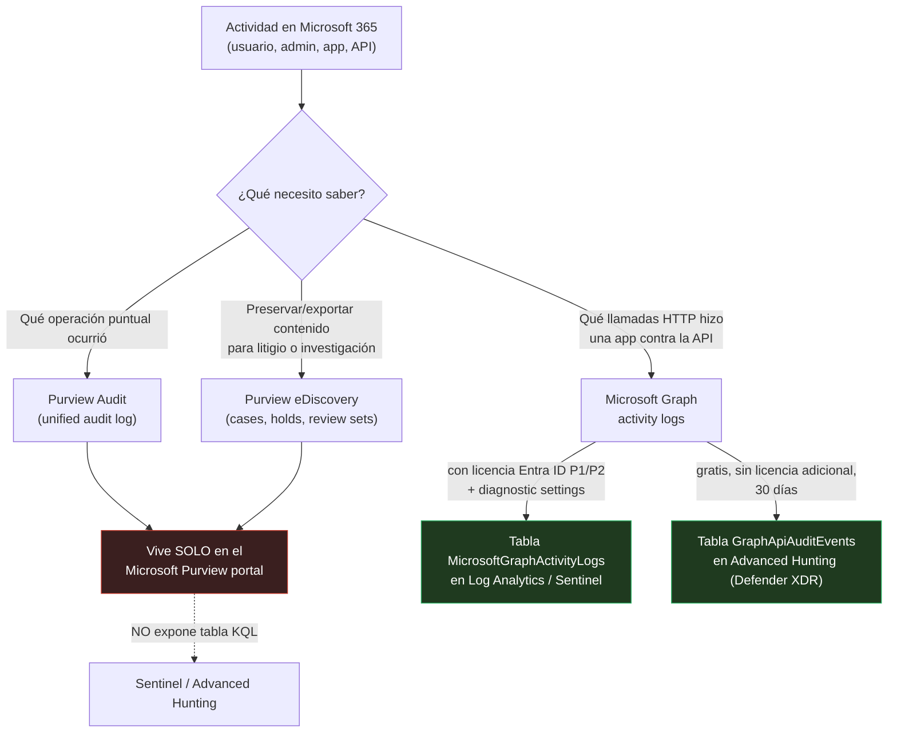
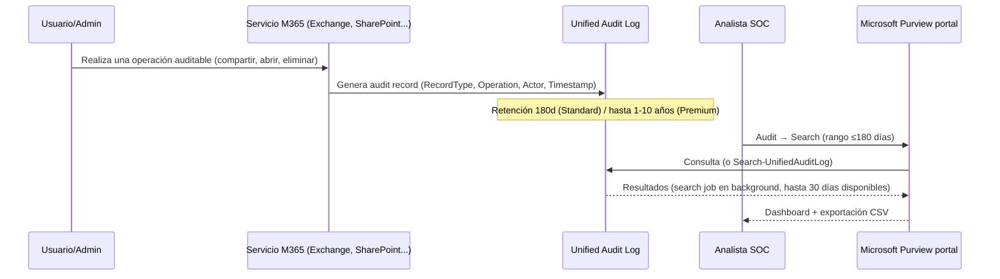
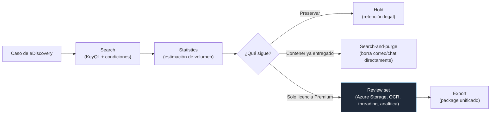
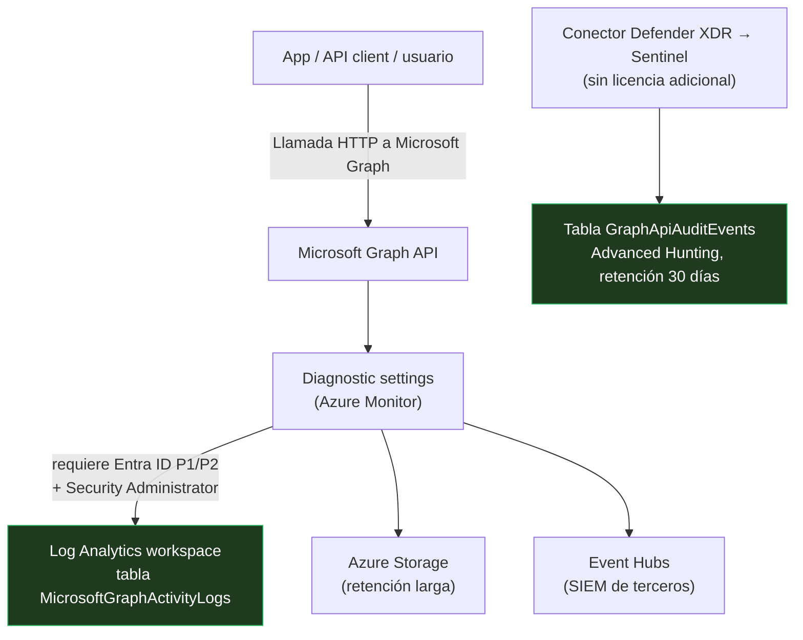
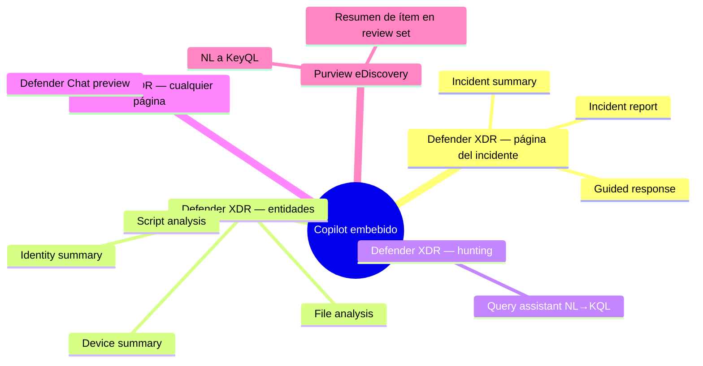
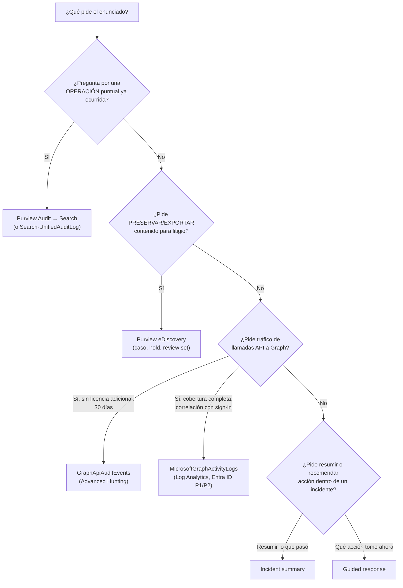
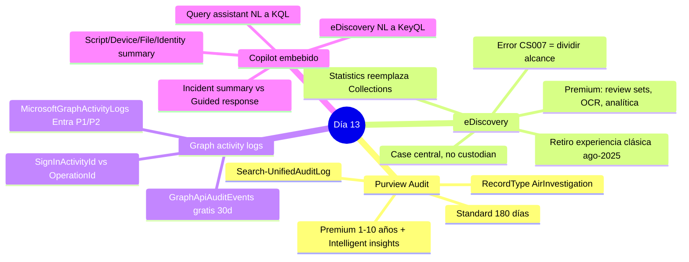

# Lección Día 13 — Purview Audit, eDiscovery, Microsoft Graph Activity Logs y Copilot Embebido

> [!info] Contexto
> Día 13 del plan de [[PLAN_MAESTRO_MULTITRACK]] §8.3, dentro del **Dominio 2 — Respond to security incidents (35-40% del examen)**. Con esta lección **se completa el Dominio 2 al 100%**: es el último día de contenido nuevo de ese dominio.
>
> Objetivos exactos del study guide oficial (skills measured as of July 28, 2026) que cierra hoy: **"Investigate Microsoft 365 activities to identify threats using Microsoft Purview Audit, eDiscovery, and Microsoft Graph activity logs"** y **"Investigate and manage agentic AI systems and Copilot embedded experiences"**.
>
> Este día es distinto a los tres anteriores (MDO/MDCA, Entra ID Protection/MDI, Defender for Cloud): hasta ahora investigabas amenazas dentro de un producto de seguridad. Hoy investigas **actividad de usuarios y aplicaciones dentro de los servicios de Microsoft 365 mismos**, con herramientas que viven en un portal distinto (Microsoft Purview, no Defender) y que la mayoría de las veces **no aparecen en ninguna tabla de Sentinel ni de Advanced Hunting** — el dato más importante de hoy.

> [!warning] Corregido / ampliado 11-sep-2026
> Se re-verificó cada fuente de esta lección contra Microsoft Learn hoy. No hay cambios de fondo respecto a la versión del 31-ago (los datos de Standard/Premium, roles y límites siguen siendo los mismos), pero se **amplía con detalle nuevo no incluido antes**: la lista completa de eventos de Teams cubiertos por Audit (Premium) "Intelligent insights" (sección 2.5), la tabla completa de capacidades de eDiscovery vs Premium eDiscovery (sección 3.3, incluye funciones nuevas como *Review set KQL queries* y *Query Report*, ambas en preview), y la columna `UniqueTokenId` de `MicrosoftGraphActivityLogs` (antes solo se mencionaba `SignInActivityId`/`OperationId`). También se añaden 6 diagramas Mermaid, capturas oficiales de Copilot en Defender, y 4 notas de concepto nuevas en `Conceptos/`.

---

## 📖 Lectura del día

### 0. Dónde estamos: hoy se completa el Dominio 2

| Sub-bloque del Dominio 2 | Qué agrupa | Cuándo lo viste |
|---|---|---|
| Gestión de incidentes unificados | Manage incident pane, Case management | Día 8 |
| Respuesta MDE | Timeline, Live response, Investigation package | Día 9 |
| Respuesta por producto | MDO, MDCA (Día 10) · Entra ID Protection, MDI (Día 11) · Defender for Cloud (Día 12) | Días 10, 11, 12 |
| Agentic AI / Copilot embebido | Qué hace Copilot dentro de Defender XDR y cómo se usa al investigar | **Hoy** |
| **Investigate Microsoft 365 activities to identify threats** | Purview Audit, eDiscovery, Microsoft Graph activity logs | **Hoy — cierra el Dominio 2** |

### 1. Microsoft Purview: la plataforma madre, y por qué hoy es distinto a todo lo anterior

**Definición desde cero.** **Microsoft Purview** es la plataforma unificada de gobernanza de datos, cumplimiento normativo (*compliance*) y protección de información de Microsoft 365. Vive en su propio portal, `purview.microsoft.com`, separado del portal de seguridad `security.microsoft.com` que usaste en los Días 8-12. No es un producto de detección de ataques — es un producto de **visibilidad y control sobre los datos**: quién los tocó, dónde viven, si cumplen una política, si hay que preservarlos para un litigio.

**Por qué existe.** Hasta el Día 12, cada herramienta que estudiaste generaba **alertas** de "esto parece un ataque" y terminaba, casi siempre, en las tablas `SecurityAlert` y `SecurityIncident` de Sentinel (regla fijada desde el Día 6: alerta individual de producto = `SecurityAlert`; incidente correlacionado de Sentinel = `SecurityIncident`). Purview resuelve un problema distinto: la mayoría de las investigaciones reales no empiezan con una alerta — empiezan con una pregunta de negocio o legal ("¿alguien filtró este documento?", "¿qué hizo este empleado antes de renunciar?"), y para responderla necesitas un **registro de actividad**, no una alerta.

**Cómo funciona por dentro — el mapa de las tres piezas de hoy:**



**Regla de una línea para no confundirlas en el examen:** Audit = una **operación** ya registrada sobre un objeto. eDiscovery = **preservar y exportar contenido** para una investigación legal o forense. Graph activity logs = **tráfico de API**, no interacción humana en un portal.

---

### 2. Concepto 1 — Microsoft Purview Audit

**2.1 Definición desde cero.** **Microsoft Purview Audit** (también llamado *unified audit log*, registro de auditoría unificado) es el sistema que registra automáticamente miles de tipos de operaciones que ocurren dentro de los servicios de Microsoft 365: un usuario abre un archivo, comparte un enlace, cambia un permiso, inicia sesión; un administrador elimina un buzón, cambia una política. Cada una de esas acciones genera un **registro de auditoría** (audit record) que se guarda en un log central.

**2.2 Por qué existe.** Sin un registro centralizado, reconstruir "qué pasó" después de un incidente requeriría revisar logs dispersos de cada aplicación por separado (Exchange, SharePoint, Teams, Entra ID…). Audit los unifica en un solo lugar buscable, para que un analista de seguridad, un investigador forense o un equipo de cumplimiento no tengan que aprender diez sistemas distintos.

**2.3 Cómo funciona por dentro.** Existe en dos niveles — verificado hoy en Microsoft Learn (`audit-solutions-overview`, ms.date 18-may-2026, actualizado 8-jul-2026): **Audit (Premium) incluye toda la funcionalidad de Audit (Standard)**, no es un producto aparte, solo añade capacidades encima.

| Capacidad | Audit (Standard) | Audit (Premium) |
|---|---|---|
| Habilitado por defecto | ✅ | ✅ |
| Búsqueda de miles de eventos auditados | ✅ | ✅ |
| Audit Search Graph API / `Search-UnifiedAuditLog` | ✅ | ✅ |
| Retención por defecto | **180 días** | 180 días para la mayoría; **1 año** para Entra ID, Exchange, OneDrive, SharePoint |
| Retención extendida hasta 10 años | ❌ | ✅ (requiere add-on de 10 años, por usuario) |
| Políticas de retención de auditoría personalizadas | ❌ | ✅ |
| **Intelligent insights** (eventos forenses de alto valor) | ❌ | ✅ |
| Ancho de banda a la Office 365 Management Activity API | Baseline (2,000 solicitudes/min) | ~2x el baseline |

**Qué son los "Intelligent insights" de Premium, en concreto (lo que más pregunta el examen):** son eventos forenses que **Standard no registra en absoluto**, no una versión "resumida" de lo mismo. Verificado hoy con el detalle exacto de propiedades:

| Servicio | Actividad | Propiedad que añade |
|---|---|---|
| Exchange Online | `MailItemsAccessed` | `SensitivityLabel` (la etiqueta de confidencialidad del correo accedido) |
| Microsoft Teams | `ChatCreated`, `ChatRetrieved`, `MessageRead`, `MessageSent`, entre otras | `AppAccessContext`, `ParticipantInfo` |
| Microsoft Teams (reuniones) | `MeetingParticipantDetail` | `IsJoinedFromLobby`, `ArtifactShared` |

`MailItemsAccessed` (cuándo y qué correos accedió un usuario o proceso) y los eventos de búsqueda dentro de Exchange/SharePoint son exactamente el tipo de evidencia que necesitas para responder "¿el atacante leyó/exfiltró contenido sensible, o solo tocó el buzón sin abrir nada?" — la pregunta central de una investigación de BEC (Business Email Compromise, ya visto en el Día 10). **Sin licencia de Audit Premium en el usuario investigado, esos eventos simplemente no existen en el log**, sin importar cuánto busques.

**2.4 Dónde se configura / desde dónde se usa.** La búsqueda vive en `purview.microsoft.com` → **Audit** → **Search**. Permisos necesarios: rol **Audit Logs** o **View-Only Audit Logs**, asignado en el Microsoft Purview portal (para PowerShell, el mismo rol pero asignado en el Exchange admin center). Límites operativos clave:

- **Rango de fechas: 180 días máximo por búsqueda**, aunque la retención total sea de 1 o 10 años.
- Hasta **10 search jobs en paralelo** por usuario (solo uno sin filtros).
- Exportación: hasta 50,000 filas (Standard) o 1,000,000 (Premium).
- Cmdlet equivalente: **`Search-UnifiedAuditLog`** (Exchange Online PowerShell), con el parámetro `-RecordType` para filtrar por el producto que generó el registro.



**2.5 Ejemplo concreto de escenario SOC.** El SOC (Security Operations Center) sospecha que una cuenta comprometida con licencia E5 (incluye Audit Premium) leyó correos con información financiera sensible antes de que se revocara el acceso.

```kql
// Esta query NO corre en Sentinel/Advanced Hunting: es el equivalente conceptual
// de lo que Search-UnifiedAuditLog trae del audit log. Se muestra en pseudo-KQL
// para razonar el filtro, tal como el examen lo describe en texto.
// RecordType = ExchangeItem, Operation = MailItemsAccessed
// Filtra por: UserId, fecha del compromiso, y revisa AuditData.SensitivityLabel
```

```powershell
# Equivalente real en Exchange Online PowerShell
Search-UnifiedAuditLog -StartDate 2026-09-01 -EndDate 2026-09-08 `
  -UserIds "victima@contoso.com" -Operations MailItemsAccessed `
  -RecordType ExchangeItem -ResultSize 500
```

Si la cuenta comprometida **no** tuviera licencia Audit Premium, `MailItemsAccessed` no aparecería en absoluto en los resultados — no es que el resultado venga "vacío por filtro", es que el evento nunca se generó.

**2.6 Trampa de examen.** El examen pregunta el período de retención "por defecto" y espera que sepas que **cambió de 90 a 180 días el 17-oct-2023** — si ves "90 días" como opción, es el valor viejo, ya no vigente para Standard. También pregunta por `RecordType`: el valor **`AirInvestigation`** corresponde a eventos de AIR (Automated Investigation and Response) — y AIR de **Defender for Office 365** sigue generando estos eventos con normalidad después del retiro de AIR de MDE (1-sep-2026), un dato que ya te costó puntos antes en este curso (ver Día 10).

**2.7 Nota de concepto:** [[Conceptos/Purview Audit]]

---

### 3. Concepto 2 — Microsoft Purview eDiscovery

**3.1 Definición desde cero.** **eDiscovery** (electronic discovery, descubrimiento electrónico) es el proceso de identificar, preservar y exportar **ESI** (Electronically Stored Information, información almacenada electrónicamente) para usarla como evidencia en una investigación legal, interna o de seguridad. A diferencia de Audit (que te dice qué operación ocurrió), eDiscovery te deja **buscar contenido real** — el texto de correos, archivos, chats de Teams — y ponerlo bajo retención legal (*hold*) para que nadie pueda borrarlo mientras dura la investigación.

**3.2 Por qué existe.** Una investigación legal o de cumplimiento no solo necesita saber "qué pasó" (eso lo responde Audit) — necesita **el contenido mismo**, protegido de que alguien lo elimine o modifique mientras se decide qué hacer. eDiscovery separa "buscar y ver" de "preservar" y de "exportar/revisar en profundidad", como tres capacidades encadenadas dentro de un mismo flujo de caso.

**3.3 Cómo funciona por dentro — la reestructuración post-2025.** Verificado hoy (`edisc`, ms.date 29-jun-2026): **Microsoft retiró todas las experiencias clásicas de eDiscovery el 31 de agosto de 2025** (Content Search clásico, eDiscovery Standard clásico, eDiscovery Premium clásico del portal de cumplimiento viejo). Todo vive hoy dentro de una **experiencia unificada**, organizada por **casos (cases)**, no por "custodians" como en versiones viejas.

| Término viejo (retirado) | Término/concepto actual |
|---|---|
| Custodian (persona de interés) | El **caso** es la unidad central; se agregan personas/grupos/fuentes de datos al caso |
| Collections (estimaciones inmutables) | **Statistics** dentro de una búsqueda — ya no es inmutable, se puede re-ejecutar |
| Jobs | **Processes** |
| Content Search (página independiente) | **Caso de Content Search** generado por el sistema (o se crea explícitamente), con las mismas capacidades que cualquier otro caso |

**Tabla de capacidades — eDiscovery vs Premium eDiscovery** (verificado hoy, tabla completa oficial):

| Capacidad | eDiscovery | Premium eDiscovery |
|---|---|---|
| Buscar contenido, keyword queries, exportar resultados | ✅ | ✅ |
| Estadísticas y muestras de búsqueda | ✅ | ✅ |
| Colocar ubicaciones en hold | ✅ | ✅ |
| Search-and-purge (buscar y eliminar) | ✅ | ✅ |
| Review sets (conjunto de revisión en Azure Storage) | ❌ | ✅ |
| OCR (Optical Character Recognition), threading de conversaciones | ❌ | ✅ |
| Analítica (near-duplicate detection, email threading, themes) | ❌ | ✅ |
| Review set KQL queries (preview), Query Report (preview) | ❌ | ✅ |
| Acceso de usuarios invitados (preview) | ❌ | ✅ |
| Security Copilot (resumen de ítems, KeyQL por lenguaje natural) | ❌ | ✅ |

**3.4 Dónde se configura / rol necesario.** Todo vive dentro de **eDiscovery** en `purview.microsoft.com`. Roles RBAC (Role-Based Access Control): **eDiscovery Manager** (acceso limitado a los casos donde es miembro explícito) y **eDiscovery Administrator** (acceso a todos los casos, incluido el caso de Content Search del sistema).



**3.5 Ejemplo concreto de escenario SOC — resolver el error CS007.** Contoso necesita encontrar, preservar y exportar todos los documentos de SharePoint con el término "proyecto-fénix" compartidos externamente en los últimos 18 meses. Al lanzar la búsqueda, el analista recibe el error **CS007**.

**Razonamiento:** CS007 casi siempre indica una búsqueda demasiado grande o compleja — 18 meses en toda la organización con un término amplio encaja exactamente en ese patrón. La solución **no** es cambiar el término ni resolver duplicados de destinatarios (eso corrige un error distinto): es **dividir la búsqueda en fragmentos más pequeños**, típicamente por rango de fechas:

1. Dividir los 18 meses en 3 búsquedas de 6 meses.
2. Ejecutar cada una como un proceso separado dentro del mismo caso.
3. Revisar Statistics de cada fragmento antes de agregar a un review set.
4. Con licencia Premium, usar el review set combinado (OCR, threading, analítica) para reducir volumen antes de exportar.

Es el mismo principio operativo que el límite de 180 días de Audit Search (sección 2): cuando el rango es demasiado grande, se fragmenta por tiempo o alcance, no se cambia de herramienta.

**3.6 Trampa de examen.** "Content Search" ya **no es una página independiente** — si el enunciado la describe como tal, es terminología obsoleta (pre-31-ago-2025). Y **Audit ≠ eDiscovery** aunque ambas vivan en Purview: Audit responde "qué operación ocurrió"; eDiscovery responde "qué contenido existe/se preserva/se exporta".

**3.7 Nota de concepto:** [[Conceptos/eDiscovery]]

---

### 4. Concepto 3 — Microsoft Graph activity logs

**4.1 Definición desde cero.** **Microsoft Graph** es la API (Application Programming Interface, interfaz de programación) unificada con la que casi todas las aplicaciones —Outlook, Teams, apps de terceros autorizadas, incluso clientes de IA vía el Microsoft MCP Server for Enterprise— leen y escriben datos de Microsoft 365: correos, calendarios, archivos, usuarios. **Microsoft Graph activity logs** es el registro de **cada solicitud HTTP** que ese API procesa para tu tenant: quién la hizo, con qué aplicación, a qué recurso, con qué resultado.

**4.2 Por qué existe.** Un usuario puede comprometer una cuenta y, en vez de usar el portal normal (donde Audit y sign-in logs lo verían con facilidad), usar directamente llamadas programáticas a la API de Graph — por ejemplo, para enumerar usuarios o descargar archivos en bloque vía un token OAuth robado. Graph activity logs existe para dar visibilidad a **ese tráfico de API**, que de otra forma sería invisible para el resto de las herramientas de auditoría.

**4.3 Cómo funciona por dentro.** Verificado hoy (`microsoft-graph-activity-logs-overview`, actualizado 4-jul-2026): tenant admins activan la recolección vía **Diagnostic settings de Azure Monitor**, que envían los logs a un destino — Log Analytics (el mismo workspace que usa Sentinel), Azure Storage, o Azure Event Hubs (para SIEM de terceros).

**4.4 Dónde se configura / rol necesario.**

- **Requiere licencia Microsoft Entra ID P1 o P2** — no una licencia de Purview.
- **Security Administrator es el rol de menor privilegio soportado** para configurar diagnostic settings.
- El destino recomendado para este curso: un workspace de Log Analytics, en la tabla **`MicrosoftGraphActivityLogs`**. Se factura como cualquier tabla de ingesta — estimado oficial: ~15 GiB/mes de Azure Monitor Logs para un tenant de 1,000 usuarios.
- **Columnas clave verificadas hoy contra el esquema oficial completo:**

| Columna | Qué es |
|---|---|
| `OperationId` | Identificador de una solicitud individual, o de todo un lote (*batch*) si la solicitud viene agrupada |
| `SignInActivityId` | Correlaciona esa llamada a Graph con el inicio de sesión completo que la originó (se une contra `UniqueTokenIdentifier` de `SigninLogs` y tablas relacionadas) |
| `UniqueTokenId` | El identificador único embebido en el token de acceso/ID usado para la llamada — distinto de `SignInActivityId`, sirve para rastrear el token específico, no la sesión de sign-in completa |
| `ResponseStatusCode` | Código HTTP de respuesta (401/403 = fallo de autorización, útil para detectar reconocimiento) |
| `RequestUri` | El recurso de Graph solicitado (ej. `/groups`, `/users`) |



**4.5 Ejemplo concreto — correlacionar una llamada sospechosa con el sign-in que la originó.**

```kql
// Paso 1: top 20 entidades que llaman a "groups" y fallan por autorización
MicrosoftGraphActivityLogs
| where TimeGenerated >= ago(3d)
| where ResponseStatusCode == 401 or ResponseStatusCode == 403
| where RequestUri contains "/groups"
| summarize UniqueRequests = count_distinct(RequestId) by AppId, ServicePrincipalId, UserId
| sort by UniqueRequests desc
| take 20
```

```kql
// Paso 2: correlacionar esas llamadas con el inicio de sesión completo que las originó
MicrosoftGraphActivityLogs
| where TimeGenerated > ago(7d)
| join kind=leftouter (
    union SigninLogs, AADNonInteractiveUserSignInLogs, AADServicePrincipalSignInLogs, AADManagedIdentitySignInLogs
    | where TimeGenerated > ago(7d)
) on $left.SignInActivityId == $right.UniqueTokenIdentifier
```

Si el analista hubiera intentado correlacionar por `OperationId` en vez de `SignInActivityId`, el `join` no encontraría coincidencias reales — `OperationId` no está diseñado para eso, solo agrupa solicitudes del mismo lote/batch.

**4.6 Trampa de examen — la tabla gratuita alternativa.** Existe **`GraphApiAuditEvents`**, una tabla del esquema de **Advanced Hunting** (Defender XDR), no de Log Analytics vía diagnostic settings. Se activa marcando la casilla del conector de Defender XDR hacia Sentinel, **sin licencia Entra ID P1/P2 adicional**, con retención fija de **30 días**. Trae menos columnas: usa `UniqueTokenIdentifier` y `OperationId`, pero **no trae `SignInActivityId`**.

| El enunciado dice | Tabla correcta |
|---|---|
| "sin licencia adicional / gratis / 30 días" | `GraphApiAuditEvents` (Advanced Hunting) |
| "cobertura completa, retención configurable, requiere Entra ID P1/P2" | `MicrosoftGraphActivityLogs` (Log Analytics) |
| "correlacionar con el inicio de sesión completo" | Columna `SignInActivityId`, solo en `MicrosoftGraphActivityLogs` |

**4.7 Nota de concepto:** [[Conceptos/Graph activity logs]]

---

### 5. Concepto 4 — Copilot embebido en Defender XDR y en Purview

**5.1 Definición desde cero.** **Security Copilot** es la capa de inteligencia artificial generativa de Microsoft para seguridad. El examen **no evalúa cómo se despliega o se administra** — evalúa que sepas **usarlo como analista** dentro de las herramientas que ya conoces. "Embebido" significa que no es una app aparte: aparece como paneles y botones dentro de Defender XDR y de eDiscovery.

**5.2 Por qué existe.** Investigar un incidente con 40 alertas correlacionadas, leer un script PowerShell ofuscado, o redactar un reporte final son tareas que consumen mucho tiempo de analista. Copilot las acelera generando resúmenes, traducciones de lenguaje natural a consultas, y recomendaciones — sin reemplazar la decisión final, que sigue siendo del analista.

**5.3 Cómo funciona por dentro — dos superficies distintas.**

**a) Dentro de Microsoft Defender XDR** (verificado hoy, `security-copilot-in-microsoft-365-defender`, ms.date 17-jul-2026, actualizado 2-ago-2026):

| Capacidad | Qué hace | Dónde se usa |
|---|---|---|
| **Incident summary** | Resumen automático al abrir un incidente: cuándo empezó, dónde, línea de tiempo, activos, IOCs | Pestaña Copilot del incidente |
| **Guided response** | Recomendaciones de acción específicas al incidente concreto | Pestaña Copilot del incidente |
| **Script analysis** | Analiza scripts/comandos sospechosos (PowerShell, líneas ofuscadas) | Vista de attack story |
| **Device summary** | Postura de seguridad, comportamientos inusuales, software vulnerable | Página del dispositivo |
| **File analysis** | Veredicto, certificados, llamadas a API, strings encontrados | Página del archivo |
| **Identity summary** | Riesgo de una identidad: rol, cambios, comportamiento de sign-in | Página de la identidad |
| **Incident report** | Reporte consolidado (resumen + acciones + equipo) | Página del incidente |
| **Query assistant (NL→KQL)** | Traduce una pregunta en lenguaje natural a una consulta KQL lista para ejecutar | Advanced Hunting |
| **Defender Chat (preview)** | Chat consciente del contexto de la página, propone un plan de pasos que apruebas/rechazas antes de ejecutar | Botón Copilot, cualquier página |


*Captura oficial: fíjate en que el resumen incluye línea de tiempo, activos involucrados e IOCs — es exactamente lo que pide "resumir lo que pasó".*


*Captura oficial: es una tarjeta separada de Incident summary — nota cómo da acciones concretas, no un resumen del pasado.*

**b) Dentro de eDiscovery (Purview):** verificado hoy, dos capacidades distintas de las de Defender XDR:

- **Traduce lenguaje natural a KeyQL** (Keyword Query Language, el lenguaje de consulta de eDiscovery, distinto de KQL).
- **Resume un ítem dentro de un review set** — incluye documentos, transcripciones de reuniones y adjuntos.



**5.4 Dónde se configura / rol necesario.** Copilot en Defender y en eDiscovery requiere **acceso provisionado a Security Copilot** — modelo de consumo basado en **SCU** (Security Compute Units), comprados/asignados aparte de las licencias de Defender/Purview/E5. No viene incluido automáticamente con ninguna licencia de trial estándar.

**5.5 Ejemplo concreto — usar Copilot en el orden correcto de una investigación.** Un analista Tier 1 abre un incidente de alta severidad con 40 alertas correlacionadas. Primero usa **Incident summary** para entender el ataque sin leer las 40 alertas una por una. Después, para decidir la acción, usa **Guided response** — recomendaciones específicas (aislar un dispositivo concreto, revocar una sesión concreta), no una lista genérica. Si aparece un script PowerShell ofuscado, usa **Script analysis**. Al cerrar, usa **Incident report** para la documentación final.

**5.6 Trampa de examen.** "Resumir lo que pasó" → **Incident summary**. "Qué acción tomo ahora" → **Guided response**. Son dos tarjetas separadas dentro de la misma pestaña Copilot, no la misma función con dos nombres.

**5.7 Nota de concepto:** [[Conceptos/Copilot embebido en Defender XDR]]

---

### 6. Tabla de decisión: el enunciado dice X → la respuesta es Y



| El enunciado dice (calificador) | Herramienta / respuesta correcta | Por qué NO las demás |
|---|---|---|
| "¿Qué hizo el usuario X con el documento Y? (operación puntual)" | **Purview Audit → Search** | eDiscovery preserva/exporta para litigio, no responde "qué operación puntual ocurrió" rápido |
| "Encuentra todos los correos con adjunto malicioso X y ponlos en retención legal" | **Purview eDiscovery** (caso, hold) | Audit te dice que un correo se abrió, pero no preserva contenido en bloque ni aplica hold |
| "No se puede buscar 12 meses en una sola búsqueda de Audit" | Dividir en rangos de **180 días o menos** | Límite operativo del search job, no de retención total |
| "eDiscovery falla con CS007 por demasiados resultados" | Dividir por rango de fechas o menos ubicaciones | No es error de destinatarios duplicados ni de permisos |
| "¿Qué acciones automatizadas tomó MDO al investigar un correo?" | `RecordType == "AirInvestigation"` | `AzureActiveDirectory` es el RecordType de identidad, no de MDO |
| "Detectar llamadas OAuth a Graph, sin licencia adicional, 30 días" | `GraphApiAuditEvents` | `MicrosoftGraphActivityLogs` exige Entra ID P1/P2 |
| "Correlacionar una llamada a Graph con el sign-in completo" | Columna `SignInActivityId` | `OperationId` solo agrupa lote de solicitudes |
| "Resumir automáticamente un incidente al abrirlo" | **Incident summary** | Guided response da acciones, no resumen |
| "Recomendar próxima acción de respuesta" | **Guided response** | Incident summary describe el pasado |
| "Construir consulta KeyQL en eDiscovery sin conocer operadores" | Security Copilot en eDiscovery | Query assistant de Advanced Hunting traduce a KQL, no a KeyQL |
| "¿El atacante abrió/leyó el correo, o solo tocó el buzón?" | `MailItemsAccessed` (Audit Premium) | Standard no registra este evento en absoluto |

### 7. Mindmap del día



---

## 💡 Ejemplos concretos

### Ejemplo 1 — Correlacionar una llamada sospechosa a Microsoft Graph con el inicio de sesión que la originó

**Escenario:** El SOC recibe una alerta de Entra ID Protection: un inicio de sesión desde una IP de riesgo alto. El analista necesita confirmar si, durante esa misma sesión, la cuenta hizo alguna llamada a Microsoft Graph API que fallara por falta de autorización (posible reconocimiento tras un compromiso).

**Razonamiento:** el analista ya tiene el evento de sign-in en `SigninLogs`. Para encontrar las llamadas a Graph asociadas a esa misma sesión, necesita unir `MicrosoftGraphActivityLogs` contra las tablas de sign-in usando `SignInActivityId` — el campo diseñado exactamente para esta correlación (ver sección 4.5 arriba para el KQL completo).

### Ejemplo 2 — Resolver el error CS007 al investigar exfiltración masiva vía SharePoint con eDiscovery

Ver el desarrollo completo en la sección 3.5. El principio que hay que fijar: **cuando el rango es demasiado grande, se fragmenta por tiempo o por alcance, no se cambia de herramienta** — idéntico al límite de 180 días de Audit Search.

### Ejemplo 3 — Usar Copilot embebido correctamente según la fase de la investigación

Ver el desarrollo completo en la sección 5.5. El orden correcto: **Incident summary** (entender) → **Guided response** (decidir) → **Script analysis** (si aparece un artefacto sospechoso) → **Incident report** (cerrar). Un error común es pedir el resumen y las acciones de respuesta como si fueran la misma tarjeta — son dos pasos distintos, en ese orden.

---

## 🎥 Videos

1. **[Copilot in Microsoft Defender: incident summary, guided response, and more](https://learn.microsoft.com/en-us/training/modules/security-copilot-embedded-experiences/)** — módulo oficial de Microsoft Learn, cubre las capacidades embebidas de la sección 5. Búsqueda verificada de nuevo hoy: sigue sin existir un video reciente y específico de Exam Readiness Zone dedicado a Purview Audit/eDiscovery/Graph activity logs para el temario 2026 — es contenido demasiado nuevo. Se usa el módulo oficial de Learn en su lugar.
2. Módulo oficial de Microsoft Learn: **[Search the audit log in Microsoft Purview](https://learn.microsoft.com/en-us/training/modules/m365-compliance-audit-logs/)** — recorrido práctico del flujo de búsqueda de la sección 2 (Standard vs Premium, límites, `Search-UnifiedAuditLog`).

> [!note] Honestidad sobre la búsqueda de video de hoy
> A diferencia de días con cobertura de video más consolidada, el contenido de Purview de este día es tan reciente (retiro de eDiscovery clásico en ago-2025, cambios de terminología documentados en jun-2026) que la oferta de video de calidad todavía no alcanzó al temario. Los dos módulos de Learn de arriba están verificados y actualizados hoy.

---

## 🧪 Ejercicio práctico

> [!note] Este lab cabe en un bloque normal entre semana — con una parte opcional que probablemente no vas a poder ejecutar
> Purview Audit y eDiscovery corren sobre tu **trial M365 E5** (el mismo tenant de `security.microsoft.com`/`purview.microsoft.com` de los Días 8-12) — no hace falta esperar al sábado. La parte de Microsoft Graph activity logs necesita licencia Entra ID P1/P2 y un workspace de Log Analytics; si tu trial no la incluye, queda como paso teórico. La parte de Copilot probablemente no la puedas ejecutar sin SCUs provisionadas — queda como exploratoria.
>
> Lab de referencia de [[MAPA_DIARIO_LEARN_LABS]]: **[Lab 3 Ex1 — Explore Purview Audit](https://microsoftlearning.github.io/SC-200T00A-Microsoft-Security-Operations-Analyst/Instructions/Labs/LAB_AK_03_Lab1_Ex01_Explore_Purview_Audit.html)** (variante Defender, no la versión Azure retirada).

- [ ] **Paso 1 — Buscar el audit log.** En `purview.microsoft.com` → **Audit** → **Search**, configura una búsqueda de los últimos 7 días sin filtro de actividad y revisa el dashboard de resultados. Identifica el `RecordType` de al menos 3 eventos distintos.
- [ ] **Paso 2 — Confirmar el límite de rango.** Intenta configurar una búsqueda con rango mayor a 180 días y confirma el error de rango máximo.
- [ ] **Paso 3 — Explorar eDiscovery.** Dentro de **eDiscovery**, localiza el caso de **Content Search** generado automáticamente (o créalo) y lanza una búsqueda simple por palabra clave. Revisa la pestaña **Statistics**.
- [ ] **Paso 4 (si tu trial tiene Entra ID P1/P2) — Configurar Microsoft Graph activity logs.** En `portal.azure.com` → **Microsoft Entra ID** → **Diagnostic settings**, crea una configuración que envíe los logs a tu workspace de Log Analytics de Sentinel, espera ~30 minutos, y corre la primera query del Ejemplo 1 contra `MicrosoftGraphActivityLogs`.
- [ ] **Paso 5 (opcional, probablemente no disponible en tu trial) — Copilot embebido.** Si tu tenant tiene acceso provisionado a Security Copilot, abre un incidente existente y compara **Incident summary** contra **Guided response**. Si no, revisa las capturas de la sección 5.3 de esta lección.
- [ ] **Paso 6 —** responde el quiz de hoy y el repaso acumulativo.

---

## ✅ Quiz del día

Cinco preguntas sobre el contenido nuevo de hoy. Responde antes de abrir el bloque de respuestas.

**1.** Una organización tiene únicamente usuarios con licencia Office 365 E3 (sin ningún add-on de auditoría). ¿Cuál es el período de retención por defecto de sus registros de Purview Audit?

- A) 90 días
- B) 180 días
- C) 1 año
- D) 10 años

**2.** Un analista necesita filtrar el audit log de Microsoft 365 para encontrar únicamente las acciones automatizadas que Defender for Office 365 tomó al investigar un correo de phishing. ¿Qué valor de `RecordType` usa?

- A) `AzureActiveDirectory`
- B) `ExchangeItem`
- C) `AirInvestigation`
- D) `ComplianceSearch`

**3.** Una búsqueda de eDiscovery sobre 15 meses de actividad de SharePoint falla con el código de error CS007. ¿Qué acción resuelve el problema de forma correcta?

- A) Dividir la búsqueda en rangos de fechas más pequeños
- B) Eliminar destinatarios duplicados con un cmdlet de PowerShell
- C) Cambiar el rol del analista a eDiscovery Administrator
- D) Convertir la búsqueda en una regla de Advanced Hunting

**4.** Un equipo de seguridad quiere detectar llamadas sospechosas de una aplicación a Microsoft Graph API, sin adquirir licencias adicionales de Microsoft Entra ID y aceptando una retención de solo 30 días. ¿Qué tabla usan?

- A) `MicrosoftGraphActivityLogs`
- B) `SecurityAlert`
- C) `CloudAuditEvents`
- D) `GraphApiAuditEvents`

**5.** Un analista abre un incidente con múltiples alertas correlacionadas y quiere que Copilot le recomiende la acción de remediación específica para ese incidente (por ejemplo, aislar un dispositivo concreto), no un resumen de lo que ya pasó. ¿Qué capacidad usa?

- A) Incident summary
- B) Guided response
- C) Script analysis
- D) Incident report

> [!note]- Ver respuestas
> **1 — B.** Sin add-on de Audit Premium, el período de retención por defecto de Audit (Standard) es 180 días — cambió de 90 a 180 días desde el 17-oct-2023. **A** (90 días) era el valor viejo. **C** y **D** son valores exclusivos de Audit (Premium), que este escenario no tiene.
>
> **2 — C.** `AirInvestigation` es el `RecordType` específico para eventos de AIR, que en Defender for Office 365 sigue operando sin cambios (el retiro del 1-sep-2026 aplica solo a MDE). **A** es el RecordType de eventos de identidad, no de investigaciones de correo. **B** y **D** son nombres de RecordType inventados.
>
> **3 — A.** CS007 casi siempre indica una búsqueda demasiado grande o compleja; la solución documentada es dividirla en fragmentos más pequeños. **B** resuelve un error distinto (ambigüedad de destinatarios). **C** es un cambio de permisos que no afecta el tamaño de la búsqueda. **D** mezcla dos productos distintos.
>
> **4 — D.** `GraphApiAuditEvents` es la tabla gratuita del esquema de Advanced Hunting, sin licencia Entra ID P1/P2 adicional, retención fija de 30 días. **A** sí existe pero exige licencia Entra ID P1/P2 y diagnostic settings. **B** y **C** son tablas de otro dominio (alertas de Sentinel, eventos de nube de Defender for Cloud), no de tráfico de Graph API.
>
> **5 — B.** Guided response da recomendaciones específicas al incidente concreto. **A** describe lo que ya ocurrió, no recomienda el siguiente paso. **C** analiza un script puntual, no da un plan de remediación completo. **D** documenta el incidente después de resuelto.

---

## 🔁 Repaso acumulativo — re-test espaciado

**R1.** Un analista busca en Sentinel el incidente correlacionado que agrupó los casos abiertos hoy en Case Management, y también busca en qué tabla vive la actividad que acaba de auditar en Purview. ¿Qué tienen en común Case Management y Purview Audit/eDiscovery respecto a Sentinel?

- A) Ambos exponen sus datos en la tabla `SecurityIncident`
- B) Ninguno de los dos expone sus datos en ninguna tabla de Log Analytics ni de Advanced Hunting — viven solo dentro de sus propios portales/servicios
- C) Ambos exponen sus datos únicamente en `SecurityAlert`
- D) Case Management expone datos en `CloudAuditEvents`, y Purview Audit en `SecurityIncident`

**R2.** El equipo de cumplimiento necesita revisar las alertas de DLP (Data Loss Prevention) generadas la semana pasada por una política de protección de datos sensibles. ¿En qué portal(es) las revisa?

- A) Únicamente en el SharePoint admin center
- B) Únicamente en el Microsoft 365 admin center
- C) En el Microsoft Purview portal y en el Defender portal (unificado)
- D) Únicamente en Microsoft Entra admin center

**R3.** El SOC necesita un reporte de qué usuarios de alto riesgo hicieron un restablecimiento de contraseña en los últimos 14 días, para confirmar si la amenaza persiste en el tiempo o ya se resolvió. ¿Qué reporte de Entra ID Protection usan?

- A) Risky sign-ins report
- B) Sign-in logs sin filtrar
- C) Risky users report
- D) Identity Protection alerts

**R4.** Durante una investigación de MDE, el analista necesita capturar memoria, procesos y conexiones de red de un dispositivo comprometido, minimizando el impacto al usuario y evitando cortar la sesión de trabajo activa. ¿Qué acción usa?

- A) Isolate device
- B) Restrict app execution
- C) Live response con sesión interactiva
- D) Collect investigation package

> [!note]- Ver respuestas
> **R1 — B.** Refuerza el hallazgo del Día 8 (Case Management no expone tabla) con el hallazgo del Día 13 (Purview Audit/eDiscovery tampoco): ambos viven solo dentro de su propio portal. **A**, **C** y **D** asumen que existe una tabla — exactamente el error que el examen premia detectar.
>
> **R2 — C.** Fallo original del Simulacro 01 del 23-jul: las alertas DLP se revisan tanto en Microsoft Purview portal como en el Defender portal unificado. **A**, **B** y **D** son portales reales de administración, pero ninguno expone alertas DLP.
>
> **R3 — C.** Risky users report agrega el riesgo de una cuenta **a través del tiempo**; Risky sign-ins report es por evento puntual. **A** es la trampa clásica confundida en el simulacro original.
>
> **R4 — D.** El bloque más débil históricamente de este curso: "minimizar impacto" + "evitar cortar la sesión activa" descarta Isolate device y apunta a forense pasivo. Collect investigation package recolecta memoria/procesos/red sin aislar el dispositivo. **A** corta la red. **B** solo bloquea apps. **C** permite interactuar en vivo, pero el enunciado pide recolección pasiva.

---

## ⚠️ Trampas del examen en los temas de hoy

1. **Audit = qué OPERACIÓN hizo alguien. eDiscovery = qué CONTENIDO existe/se preserva/se exporta.**
2. **Content Search ya no es una página independiente** desde el retiro de la experiencia clásica (31-ago-2025).
3. **`MailItemsAccessed` y los eventos de búsqueda son exclusivos de Audit Premium** — no existen en absoluto sin la licencia adecuada.
4. **Límite de 180 días por búsqueda de Audit** — límite operativo del search job, no de retención total.
5. **CS007 se resuelve dividiendo el alcance (fechas o ubicaciones), no cambiando permisos ni destinatarios.**
6. **`RecordType == "AirInvestigation"`** para AIR — y AIR de Defender for Office 365 sigue vigente después del 1-sep-2026.
7. **`GraphApiAuditEvents` (gratis, Advanced Hunting, 30 días) ≠ `MicrosoftGraphActivityLogs`** (Entra ID P1/P2, retención configurable).
8. **`SignInActivityId` correlaciona con la sesión completa; `OperationId` solo agrupa un lote de solicitudes.**
9. **Incident summary describe el pasado; Guided response recomienda el siguiente paso.**
10. **Ni Case Management (Día 8) ni Purview Audit/eDiscovery (hoy) exponen tabla de Log Analytics o Advanced Hunting.**

---

## 🎓 Cierre del Dominio 2 — Respond to security incidents (35-40%)

| Pieza del Dominio 2 | Qué cubre | Día(s) |
|---|---|---|
| Gestión de incidentes unificados | Manage incident pane, Case management | Día 8 |
| MDE — respuesta y evidencia | Timeline, Live response, Collect investigation package | Día 9 |
| MDO / MDCA | Threat Explorer, ZAP, attack disruption | Día 10 |
| Entra ID Protection / MDI | Risk levels, Attack paths | Día 11 |
| Defender for Cloud | CNAPP, CSPM vs CWPP | Día 12 |
| **Purview Audit / eDiscovery / Graph activity logs** | Investigación de actividad M365 | **Día 13 (hoy)** |
| **Agentic AI / Copilot embebido** | Incident summary, Guided response, NL→KQL, Copilot en eDiscovery | **Día 13 (hoy)** |

**El patrón de mayor valor que se repite en las siete lecciones del dominio:** cada producto tiene su propio conjunto de herramientas de investigación con nombres parecidos entre sí, y el examen decide cuál usar por el **calificador exacto del enunciado**, no por el concepto general.

Con el Dominio 2 cerrado, sigue el **Dominio 3 — Perform threat hunting (20-25%)**, que arranca en el [[Dia 15 - Repaso KQL Advanced Hunting Custom Detections y Hunting Graph|Día 15]] (repaso KQL del Día 14 fusionado + Advanced Hunting + custom detections + hunting graph/Sentinel Graph).

---

## 🔗 Notas relacionadas

- [[Dia 08 - Incidentes Unificados y Case Management]] — origen del hallazgo "Case Management no expone tabla", reforzado hoy en R1
- [[Dia 09 - Respuesta MDE Timeline Live Response y Evidencia]] — bloque MDE reforzado hoy en R4
- [[Dia 10 - MDO Threat Explorer ZAP y MDCA]] — origen del retiro de AIR (1-sep-2026, solo MDE), conectado con `RecordType: AirInvestigation`
- [[Dia 11 - Identidades Entra ID Protection y MDI]] — Risky users vs Risky sign-ins, retesteado en R3
- [[Dia 12 - Defender for Cloud Workload Protections]] — mismo patrón de tabla de decisión
- [[PLAN_MAESTRO_MULTITRACK]] — calendario vigente §8, examen 3-oct-2026 fijo
- [[REPASO_RAPIDO_Errores_Simulacro]] — §7 (Purview Audit/eDiscovery/Graph activity logs)
- [[TRACKER_TUTOR]]
- [[Conceptos/Purview Audit]] · [[Conceptos/eDiscovery]] · [[Conceptos/Graph activity logs]] · [[Conceptos/Copilot embebido en Defender XDR]]

## 📚 Fuentes verificadas (última pasada 11-sep-2026)

- [Learn about auditing solutions in Microsoft Purview](https://learn.microsoft.com/en-us/purview/audit-solutions-overview) — ms.date 18-may-2026, actualizado 8-jul-2026
- [Search the audit log](https://learn.microsoft.com/en-us/purview/audit-search) — ms.date 19-jun-2026, actualizado 14-jul-2026
- [Legacy eDiscovery tools retired](https://learn.microsoft.com/en-us/purview/ediscovery-legacy-retirement) — actualizado 11-jun-2026 (verificado 31-ago, no re-fetcheado hoy — sin cambios reportados en `edisc`)
- [Learn about eDiscovery](https://learn.microsoft.com/en-us/purview/edisc) — ms.date 29-jun-2026, actualizado 29-jun-2026, re-verificado hoy 11-sep-2026 — tabla de capacidades completa confirmada
- [Access Microsoft Graph activity logs for tenant monitoring](https://learn.microsoft.com/en-us/graph/microsoft-graph-activity-logs-overview) — ms.date 25-nov-2025, actualizado 4-jul-2026, re-verificado hoy — esquema completo de columnas confirmado (incluida `UniqueTokenId`)
- [GraphAPIAuditEvents table in the advanced hunting schema](https://learn.microsoft.com/en-us/defender-xdr/advanced-hunting-graphapiauditevents-table) — ms.date 27-jul-2026, actualizado 3-ago-2026, re-verificado hoy
- [Microsoft Security Copilot and Chat in Microsoft Defender](https://learn.microsoft.com/en-us/defender-xdr/security-copilot-in-microsoft-365-defender) — ms.date 17-jul-2026, actualizado 2-ago-2026, re-verificado hoy — capturas de pantalla confirmadas y citadas
- Dato no re-verificado hoy con fuente primaria: `RecordType: AirInvestigation` (valor 64 del enum) — confirmado en la sesión del 31-ago contra el esquema de Office 365 Management Activity API, se mantiene sin cambios

---

> [!tip] Orden de consumo de hoy (fijado el 24-ago, ver [[PLAN_MAESTRO_MULTITRACK]] §7.7)
> 🎧 Escucha primero el Audio Overview de esta lección en NotebookLM → 📖 luego lee esta nota completa, con foco en la sección 6 (tabla y diagrama de decisión) → ✅ y cierra con el quiz. Escuchar no sustituye leer, y leer no sustituye el quiz — el día se cierra con el quiz respondido, no antes.
