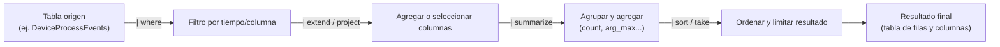
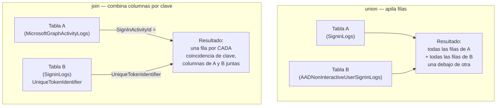
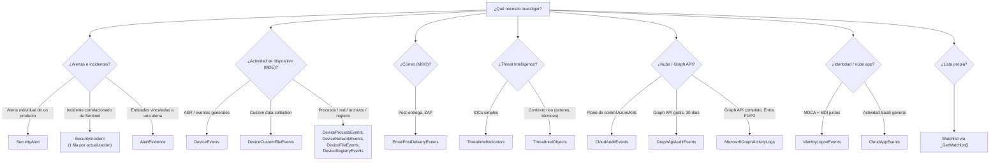
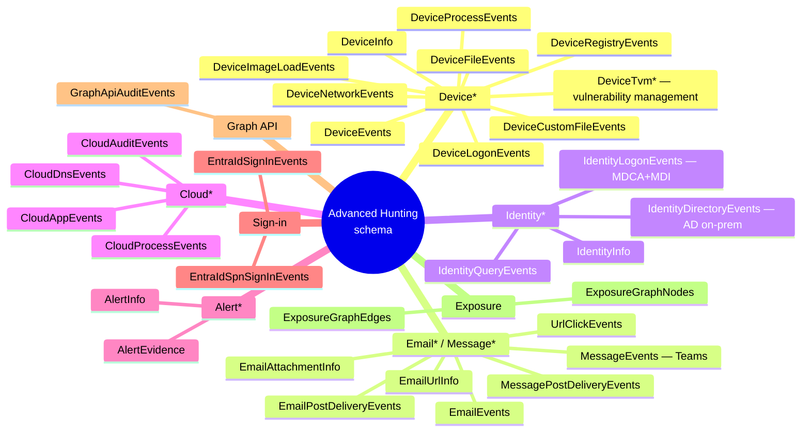
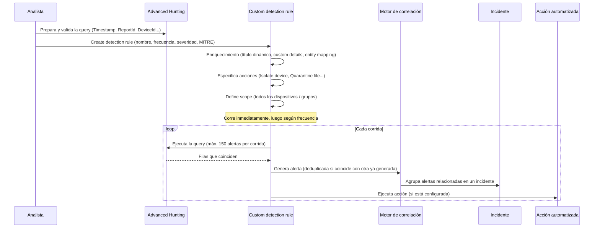
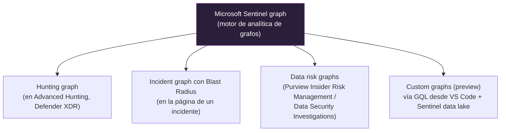
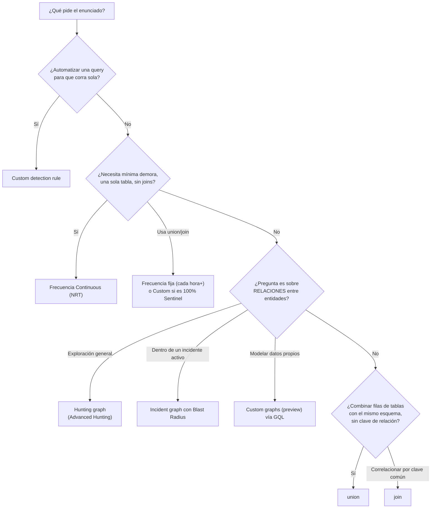
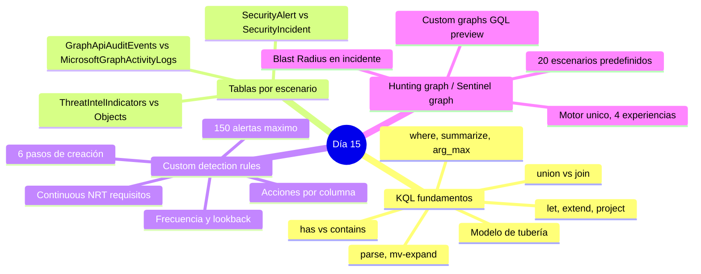

# Lección Día 15 — Repaso KQL (Día 14 fusionado) + Advanced Hunting: Custom Detections y Hunting Graph / Sentinel Graph

> [!info] Contexto
> Día 15 del plan de [[PLAN_MAESTRO_MULTITRACK]] §8.3, dentro del **Dominio 3 — Perform threat hunting (20-25% del examen)**, que **arranca hoy** — el Dominio 2 quedó cerrado con el [[Dia 13 - Purview Audit eDiscovery Graph Activity Logs y Copilot Embebido|Día 13]].
>
> Por la compresión de contenido fijada en §8.2 del plan maestro, el **Día 14 no ocupa día propio**: era un repaso condensado "¿qué tabla uso para X?" de KQL (Kusto Query Language, el lenguaje de consulta de Sentinel y de Advanced Hunting), y se funde hoy con contenido nuevo: hoy sigues usando KQL, solo que para automatizar detecciones en vez de solo consultarlas.
>
> Objetivo exacto del study guide oficial (skills measured as of July 28, 2026): **"Create and manage custom detection rules by using Advanced Hunting"** (formalmente vive en el Dominio 1, pero se enseña hoy porque requiere soltura con KQL) y **"Create hunting queries with Kusto Query Language (KQL) that use the graph capabilities of Microsoft Sentinel"** (Dominio 3, hunting graphs y Sentinel Graph).

> [!warning] Corregido / ampliado 11-sep-2026
> Se re-verificó cada fuente hoy contra Microsoft Learn. **Cambios de fondo respecto al 31-ago:**
> 1. La página de custom detection rules se actualizó el **2-sep-2026** (después de la primera escritura de esta lección) y **la lista de tablas compatibles con Continuous (NRT) creció**: en Defender XDR se añadieron `AlertEvidence`, `CloudAppEvents`, `DeviceFileCertificateInfo`, `DeviceImageLoadEvents`, `DeviceNetworkInfo`, `DeviceInfo`, `DeviceRegistryEvents`, `EmailAttachmentInfo`, `EmailUrlInfo`, `IdentityQueryEvents`, `UrlClickEvents`; en Sentinel se añadieron `ABAPAuditLog_CL`, `AuditLogs`, `AWSCloudTrail`, `AWSGuardDuty`, `GCPAuditLogs`, `OfficeActivity`, `Okta_CL`/`OktaV2_CL`, `ProofpointPOD` y variantes ProofPoint TAP.
> 2. El **lookback de la frecuencia Custom (solo datos de Sentinel) no es un rango libre de "5 min a 14 días"** como se simplificó antes — tiene reglas propias: frecuencias más frecuentes que 1 hora → lookback limitado a menos de 48 horas; más frecuentes que 1 día → lookback hasta 14 días; de 1 día o menos frecuentes → lookback hasta 30 días. Se corrige en la sección 3.
> 3. El **hunting graph tiene 20 escenarios predefinidos**, no 7 — se amplía la tabla en la sección 6 con los más relevantes para el examen.
> 4. Se confirma el listado completo de tablas del esquema de Advanced Hunting (más de 60 tablas) — se usa para construir el mapa de familias de la sección 2.
> 5. Se añaden 6 diagramas Mermaid, capturas oficiales de Microsoft Learn, 5 notas de concepto nuevas en `Conceptos/`, y se corrige la distribución de letras del quiz principal (la letra B se repetía en 3 de 5 preguntas — ver sección de quiz).

---

## 📖 Lectura del día

### 0. Dónde estamos

| Bloque | Qué agrupa | Cuándo |
|---|---|---|
| Dominio 2 completo | Gestión de incidentes, MDE, MDO/MDCA, Entra ID/MDI, Defender for Cloud, Purview, Copilot embebido | Días 8-13, cerrado |
| Repaso KQL fundamentales + "¿qué tabla uso para X?" (Día 14 fusionado) | Operadores clave + consolidar las tablas ya vistas | **Primera mitad de hoy** |
| Custom detection rules (Advanced Hunting) | Convertir una query en una regla automatizada, con acciones de respuesta | **Hoy** |
| Hunting graph / Microsoft Sentinel graph | Visualizar relaciones entre entidades como grafo en vez de tabla | **Hoy — arranca el Dominio 3** |

---

### 1. KQL (Kusto Query Language): el lenguaje, desde cero

**1.1 Definición desde cero.** **KQL** (Kusto Query Language) es el lenguaje de consulta que usan tanto **Microsoft Sentinel** (sobre datos en Log Analytics) como **Advanced Hunting** (sobre datos del esquema de Defender XDR). Es un lenguaje de **flujo de datos**: escribes una tabla de origen y la vas transformando con una cadena de operadores conectados por el carácter `|` (pipe), donde cada operador recibe el resultado del anterior y produce un resultado nuevo — igual que una tubería por la que pasa un flujo de filas que se van filtrando, agrupando o transformando en cada paso.

**1.2 Por qué existe.** Los datos de seguridad llegan en volúmenes de millones de filas por día. KQL está optimizado para ese volumen: es de solo lectura (no puedes modificar datos con él, solo consultarlos), lo que permite optimizaciones agresivas de rendimiento, y su sintaxis de tubería hace que una consulta compleja se lea de arriba hacia abajo como una receta de pasos, no como una única expresión anidada.

**1.3 Cómo funciona por dentro — el modelo de tubería.**



Cada operador solo puede ver lo que le llega del anterior — no hay "variables globales" salvo las que definas explícitamente con `let` (ver 1.5).

**1.4 Dónde se usa.** En Advanced Hunting (`security.microsoft.com` → Investigation & response → Hunting → Advanced hunting) y en Sentinel (Logs, dentro del workspace de Log Analytics). **Importante — no confundir con otro lenguaje de consulta ya visto:** eDiscovery (Día 13) usa **KeyQL** (Keyword Query Language), un lenguaje distinto, más simple, orientado a búsqueda de texto/palabras clave, no a transformación tabular de datos.

**1.5 Operadores clave — definición, por qué existe cada uno, y ejemplo.**

| Operador | Qué hace | Por qué existe | Ejemplo mínimo |
|---|---|---|---|
| `where` | Filtra filas que cumplen una condición | Reducir el volumen antes de operaciones costosas | `\| where TimeGenerated > ago(1d)` |
| `summarize` | Agrupa filas por una o más columnas y calcula una agregación (count, sum, arg_max...) | Convertir miles de eventos individuales en una fila resumen por entidad | `\| summarize count() by DeviceId` |
| `arg_max(Col, *)` | Dentro de `summarize`, se queda con la fila completa que tiene el valor máximo de `Col` en cada grupo | Necesitas "el último estado" de una entidad, no solo un número agregado | `\| summarize arg_max(TimeGenerated, *) by IncidentNumber` |
| `let` | Define una variable o subconsulta con nombre, reutilizable en el resto de la query | Evita repetir la misma expresión varias veces y hace la query legible | `let umbral = 5d;` |
| `extend` | Añade una columna nueva calculada, **conservando** todas las columnas existentes | Enriquecer sin perder el resto de los datos | `\| extend Dominio = tostring(split(Email, "@")[1])` |
| `project` | Selecciona (y opcionalmente renombra) solo las columnas que listas, **descartando** el resto | Reducir el ancho de la tabla resultado a lo que realmente necesitas mostrar | `\| project DeviceName, Timestamp` |
| `has` | Busca un término como **palabra completa tokenizada** (usa el índice de términos, es más rápido) | Búsqueda de texto eficiente cuando el término es una palabra completa | `\| where ProcessCommandLine has "powershell"` |
| `contains` | Busca el término como **subcadena** en cualquier posición (no usa el índice de términos, es más lento) | Necesario cuando el término buscado es una parte de una palabra más larga | `\| where ProcessCommandLine contains "power"` |
| `parse` | Extrae campos estructurados de una columna de texto libre usando un patrón | Cuando el dato que necesitas está "escondido" dentro de un string sin columna propia | `\| parse EventData with * "User=" User "," *` |
| `mv-expand` | Convierte una columna de tipo array/dynamic en varias filas, una por cada elemento | Cuando una fila trae una lista (ej. varios destinatarios) y necesitas analizarlos uno por uno | `\| mv-expand RecipientEmailAddress` |

**Trampa de examen — `has` vs `contains`:** si el enunciado dice "optimizar el rendimiento de la búsqueda de texto" y el término buscado es una palabra completa, la respuesta es `has`, no `contains`. Si el término es una parte de una palabra (ej. buscar "admin" dentro de "sysadmin123"), `has` no lo encuentra — ahí sí hace falta `contains`, aceptando el costo de rendimiento.

**1.6 `union` vs `join` — el error más repetido de este alumno en el curso, desde cero.**

**`union`** combina **filas** de dos o más tablas/consultas, apilándolas una debajo de otra. El resultado tiene la **unión de todas las columnas** de ambas tablas: donde una tabla no tiene una columna que sí tiene la otra, esa celda queda vacía (`null`). No necesita ninguna condición de coincidencia — simplemente junta todo.

**`join`** combina **columnas** de dos tablas **basándose en una clave que coincide** entre ambas (como buscar la fila de la tabla B cuyo valor de una columna es igual al de la tabla A). El resultado tiene una fila por cada coincidencia encontrada, con columnas de ambas tablas lado a lado.



**Regla de una línea:** si necesitas **"todos los eventos de este tipo, sin importar de qué tabla vengan"** (esquemas parecidos, sin relación entre filas) → `union`. Si necesitas **"enriquecer esta fila con datos de otra tabla relacionada por un identificador común"** → `join`.

**Trampa de examen fijada aquí (fallo repetido del alumno):** una query que hace `union SigninLogs, AADNonInteractiveUserSignInLogs` seguida de un `join` contra `MicrosoftGraphActivityLogs` usa **ambos operadores para propósitos distintos en la misma query** — el `union` junta dos tablas de sign-in con el mismo esquema (son "el mismo tipo de evento" repartido en dos tablas), y el `join` posterior correlaciona esa combinación contra una tabla de otro tipo de dato (llamadas a Graph) por una clave compartida. Si el examen pregunta "¿por qué se usó `union` aquí en vez de `join`?", la respuesta es: porque `SigninLogs` y `AADNonInteractiveUserSignInLogs` no tienen una clave de correlación entre sí que buscar — son la misma clase de evento dividida en dos tablas por tipo de sign-in (interactivo vs no interactivo), así que se combinan apilando filas, no cruzando columnas.

**1.7 Nota de concepto:** [[Conceptos/KQL (Kusto Query Language)]] y [[Conceptos/union vs join]]

---

### 2. Drill "¿qué tabla uso para X?" — el mapa completo de tablas por escenario

Antes de seguir, ejercicio de retrieval activo: para cada escenario, decide primero qué tabla usarías, y solo después compara con la tabla de referencia.



**Tabla de referencia completa:**

| Necesito... | Uso la tabla | De dónde la conoces | Nota clave |
|---|---|---|---|
| Alertas individuales de un producto Defender | **`SecurityAlert`** | Día 6, reforzada Días 9-13 | Alerta de producto = `SecurityAlert`. Incidente correlacionado = `SecurityIncident` |
| Incidente correlacionado de Sentinel | **`SecurityIncident`** | Día 6 | Una fila **por actualización**, no por incidente — usa `summarize arg_max(LastModifiedTime, *) by IncidentNumber` |
| Entidades vinculadas a una alerta en una sola fila | **`AlertEvidence`** | Día 6 | Complementa a `SecurityAlert`, no la reemplaza |
| Auditar impacto de una regla ASR antes de Block | **`DeviceEvents`**, `ActionType` con prefijo `Asr` | Día 5 | El ID de la regla vive en `AdditionalFields` |
| Confirmar custom data collection | **`DeviceCustomFileEvents`** | Día 5 | Distinta de `DeviceFileEvents` |
| Eventos de ZAP sobre correo entregado | **`EmailPostDeliveryEvents`**, `ActionType` = `Phish ZAP` / `Malware ZAP` | Día 10 | "ZAP" solo existe como filtro de UI en Threat Explorer |
| IOCs clásicos (IP, dominio, hash, URL) | **`ThreatIntelIndicators`** | Día 3 | Reemplaza a la tabla retirada `ThreatIntelligenceIndicator` |
| Contexto rico de TI (actores, técnicas, malware) | **`ThreatIntelObjects`** | Día 3 | Objetos STIX que NO son indicadores simples |
| Actividad del plano de control Azure / Kubernetes | **`CloudAuditEvents`** | Día 12 | `ProductName == "Azure Security Center"` (valor legado) |
| Llamadas a Graph API, gratis, sin licencia adicional, 30 días | **`GraphApiAuditEvents`** | Día 13 | No trae `SignInActivityId` |
| Cobertura completa de Graph API + correlación con sign-in | **`MicrosoftGraphActivityLogs`** | Día 13 | Requiere Entra ID P1/P2. Columna clave: `SignInActivityId` |
| Lista de referencia propia dentro de una query | **`Watchlist`** (vía `_GetWatchlist('nombre')`) | Día 1 | Única tabla del plan gratuito Analytics sin más datos conectados |

**Dos tablas más que ya usaste:** `SecurityEvent` (Windows Security Events vía AMA, Día 2) y `AzureActivity` (diagnostic setting "Azure Activity", Día 3 — distinta de `CloudAuditEvents`, que es específica de Defender for Cloud).

**El mapa de familias completo del esquema de Advanced Hunting** (verificado hoy contra la referencia oficial, más de 60 tablas — familias relevantes para el examen):



**El patrón de fondo:** en casi todos los casos, el error no es "no sé qué hace la tabla" — es confundir dos tablas de nombre parecido que responden preguntas distintas. Es el mismo patrón de "el calificador del enunciado decide" que ya viste en las tablas de decisión de los Días 9 y 13, aplicado ahora a nombres de tabla.

---

### 3. Concepto 1 — Advanced Hunting y Custom Detection Rules

**3.1 Definición desde cero.** **Advanced Hunting** es el motor de búsqueda basado en KQL dentro del portal de **Microsoft Defender XDR**, que te da acceso directo al esquema de más de 60 tablas de eventos crudos de todos los productos Defender (MDE, MDO, MDCA, MDI) más algunas tablas de Sentinel/Exposure Management. Una **custom detection rule** (regla de detección personalizada) es una query de Advanced Hunting convertida en una regla que **corre sola, a intervalos fijos, genera una alerta cuando encuentra coincidencias, y opcionalmente ejecuta una acción de respuesta automatizada**.

**3.2 Por qué existe.** Correr una query manualmente sirve para investigar un incidente puntual, pero no escala para monitoreo continuo — nadie va a re-ejecutar la misma query cada hora para ver si apareció un caso nuevo. Verificado hoy (`custom-detection-rules`, ms.date 2-sep-2026): es, en esencia, el mismo concepto que las **Scheduled analytics rules de Sentinel** (Día 4), pero viviendo dentro del ecosistema de Advanced Hunting — con una diferencia importante: **una custom detection rule puede combinar datos de Defender XDR y de Microsoft Sentinel en la misma query**, algo que una analytics rule clásica de Sentinel no hace al revés.

**3.3 Cómo funciona por dentro — los seis pasos.**



**Paso 1 — Preparar la query.** Columnas recomendadas: `Timestamp`/`TimeGenerated` (marca de tiempo de la alerta; si faltan, se usa el lookback), `DeviceId`/`ReportId` (para tablas de MDE, mapea grupo de dispositivos y construye árbol de procesos), y una columna identificadora fuerte por tipo de activo (dispositivo, buzón, cuenta). **Límite duro:** 150 alertas máximo por corrida — si la query es demasiado amplia, ajústala antes de crear la regla.

**Paso 2 — Alert details.** Nombre, frecuencia, lookback, título/descripción (sin HTML/Markdown, se sanitizan), severidad, categoría, técnica/sub-técnica MITRE ATT&CK, vínculo opcional a un reporte de threat analytics.

**Paso 3 — Enriquecimiento.** Título/descripción dinámicos con `{{Columna}}` (hasta 3 columnas por campo), hasta 20 pares clave-valor de custom details (límite combinado 4 KB), y entity mapping (impacted assets: cuenta, dispositivo, buzón, app en la nube, recurso Azure/AWS/GCP; related evidence: proceso, archivo, IP, app OAuth, DNS, grupo de seguridad, URL).

**Paso 4 — Acciones.** Ver tabla completa en la sección 3.5.

**Paso 5 — Scope.** Todos los dispositivos o grupos específicos — solo afecta reglas que consultan datos de dispositivo.

**Paso 6 — Revisar y activar.** Corre inmediatamente al guardarse.

**3.4 Dónde se configura / permisos necesarios.**

| Dato objetivo de la regla | Permiso/rol necesario |
|---|---|
| Datos de Microsoft Defender (MDE, MDO, MDCA, MDI) | **Security settings (manage)** en el portal de Defender, o **Security Administrator** (Entra), o **Security Operator** (solo si el RBAC de MDE está desactivado; si está activo, necesita además **Manage Security Settings** en MDE) |
| Datos de Microsoft Sentinel | **Microsoft Sentinel Contributor** o superior, sobre el workspace, resource group o suscripción |
| Regla que combina datos de varios productos | **Todos** los roles aplicables de cada producto — el permiso no se hereda entre productos |

Un detalle de esquema fino: `IdentityLogonEvents` mezcla datos de MDCA y MDI — gestionar una regla sobre esa tabla exige permisos de **ambos** productos. Desde el 2-sep-2026 también existe soporte (en preview) para acciones de gobernanza sobre identidades SaaS devueltas por `CloudAppEvents` (Box, Google Workspace, Salesforce — ver tabla de acciones abajo).

**3.5 Frecuencia, lookback y elegibilidad Continuous (NRT) — la tabla que más confunde en el examen.**

Al guardar una regla nueva, la primera corrida cubre los últimos 30 días. Después:

| Frecuencia | Lookback (datos de Defender XDR) | Lookback (datos 100% Sentinel) |
|---|---|---|
| Cada 24 horas | 30 días | Hasta 30 días |
| Cada 12 horas | 48 horas | — |
| Cada 3 horas | 12 horas | — |
| Cada hora | 4 horas | Menos de 48 horas |
| **Continuous (NRT)** | Near real-time, evalúa al ingerirse | Tablas soportadas (ver lista abajo) |
| **Custom** (solo si es 100% datos de Sentinel) | — | Más frecuente que 1h → &lt;48h · más frecuente que 1 día → hasta 14 días · 1 día o menos frecuente → hasta 30 días |

**Requisitos para Continuous (NRT), verificado hoy con la fuente actualizada 2-sep-2026:**

- Referencia **una sola tabla** (nada de `join`, `union`, `externaldata`).
- Usa solo operadores de la lista soportada de transformaciones KQL.
- No tiene líneas de comentario (`//`).

**Tablas que soportan Continuous (NRT), lista completa verificada hoy (creció respecto a la verificación anterior):**

| Microsoft Defender XDR | Microsoft Sentinel |
|---|---|
| `AlertEvidence`, `CloudAppEvents`, `DeviceEvents`, `DeviceFileCertificateInfo`, `DeviceFileEvents`, `DeviceImageLoadEvents`, `DeviceLogonEvents`, `DeviceNetworkEvents`, `DeviceNetworkInfo`, `DeviceInfo`, `DeviceProcessEvents`, `DeviceRegistryEvents`, `EmailAttachmentInfo`, `EmailEvents`, `EmailPostDeliveryEvents`, `EmailUrlInfo`, `IdentityDirectoryEvents`, `IdentityLogonEvents`, `IdentityQueryEvents`, `UrlClickEvents` | `ABAPAuditLog_CL`, `AuditLogs`, `AWSCloudTrail`, `AWSGuardDuty`, `AzureActivity`, `CommonSecurityLog`, `GCPAuditLogs`, `MicrosoftGraphActivityLogs`, `OfficeActivity`, `Okta_CL`/`OktaV2_CL`, `ProofpointPOD` (y variantes ProofPoint TAP), `SecurityAlert`, `SecurityEvent`, `SigninLogs` |

**Dato de esquema que conecta con la sección 2:** `ThreatIntelIndicators`, `ThreatIntelObjects`, `GraphApiAuditEvents` y `CloudAuditEvents` **no están** en la lista de tablas compatibles con Continuous (NRT) — si el examen pregunta por detección casi en tiempo real sobre esas tablas, la respuesta correcta nunca es NRT.

**3.6 Acciones automatizadas: qué se puede tomar y qué columna lo habilita.**

| Acción | Sobre qué actúa | Columna requerida |
|---|---|---|
| **Isolate device** | Aísla el dispositivo de la red | `DeviceId` |
| **Collect investigation package** | Recolecta información en ZIP | `DeviceId` |
| **Run antivirus scan** | Escaneo completo de Defender Antivirus | `DeviceId` |
| **Initiate investigation** | Dispara AIR sobre el dispositivo | `DeviceId` |
| **Restrict app execution** | Solo binarios firmados por Microsoft | `DeviceId` |
| **Allow/Block file** | Bloquea el archivo en todos los dispositivos | `SHA1`/`SHA256` |
| **Quarantine file** | Elimina y deja copia en cuarentena | `SHA1`/`InitiatingProcessSHA1`/`SHA256`/`InitiatingProcessSHA256` |
| **Mark user as compromised** | Sube el risk level a "High" en Entra ID | `AccountObjectId`/`InitiatingProcessAccountObjectId`/`RecipientObjectId` |
| **Disable user** / **Reset user authentication** | Bloquea sign-in o fuerza re-autenticación | `AccountSid`/`InitiatingProcessAccountSid` (Entra: `AccountObjectId`) |
| **Move to mailbox folder** / **Delete email** | Mueve o elimina el correo | `NetworkMessageId` **y** `RecipientEmailAddress` |
| **Gobernanza SaaS (preview)** — Disable user / Force password reset | Sobre identidades de Box, Google Workspace, Salesforce vía `CloudAppEvents` | `AccountObjectId`, `InstanceId`, `ApplicationId`, `AppInstanceId` |

**Trampa de examen fijada aquí:** si la query agrupa con `summarize` por `AccountObjectId` pero nunca proyecta `DeviceId`, la acción **Isolate device** no puede configurarse, sin importar que el escenario "suene" a que hace falta aislar algo. La disponibilidad de cada acción depende únicamente de qué columnas devuelve la query.


*Captura oficial: nota cómo las acciones aparecen agrupadas por tipo de entidad (dispositivo, archivo, usuario, correo) — cada grupo depende de una columna distinta.*


*Captura oficial: el botón "Migrate now" detecta automáticamente qué reglas existentes cumplen los requisitos de NRT (una sola tabla, sin joins/unions) y permite migrarlas en bloque.*

**3.7 Ejemplo concreto — query elegible para Continuous (NRT).**

```kql
// Elegible para Continuous (NRT): una sola tabla, sin joins/unions, sin comentarios
DeviceEvents
| where ingestion_time() > ago(1d)
| where ActionType == "AntivirusDetection"
| summarize (Timestamp, ReportId) = arg_max(Timestamp, ReportId), count() by DeviceId
| where count_ > 5
```

`DeviceId` queda disponible como columna de mapeo automático (el asistente lo detecta), así que las acciones de dispositivo (Isolate device, Run antivirus scan) quedan habilitadas. Si el analista hubiera usado `union DeviceEvents, DeviceProcessEvents` para ampliar cobertura, la regla seguiría siendo válida como detección, pero **dejaría de ser elegible para Continuous (NRT)**.

**3.8 Nota de concepto:** [[Conceptos/Advanced Hunting]] y [[Conceptos/Custom detection rule]]

---

### 4. Concepto 2 — Hunting graph y Microsoft Sentinel graph

**4.1 Definición desde cero.** **Microsoft Sentinel graph** (verificado hoy, `sentinel-graph-overview`, ms.date 7-ago-2026) es la **capacidad de analítica de grafos subyacente**: la plataforma que representa datos de seguridad como **nodos** (entidades: usuarios, dispositivos, recursos) y **aristas** (relaciones entre ellas) en vez de tablas. No es una pantalla única — es el motor que alimenta varias experiencias embebidas distintas en Defender y en Purview. El **hunting graph** es la experiencia concreta de ese motor dentro de la página de **Advanced Hunting**, pensada para threat hunting.

**4.2 Por qué existe.** Preguntas como "si comprometen esta cuenta, ¿qué activos críticos puede alcanzar?" o "¿qué camino conecta a este usuario con Domain Admins?" son preguntas sobre **relaciones**, no sobre filas y columnas. Responderlas con KQL tabular exige encadenar múltiples `join`, es lento y propenso a pasar por alto rutas indirectas de varios saltos. El hunting graph visualiza esas relaciones directamente.

**4.3 Cómo funciona por dentro — jerarquía de experiencias sobre el mismo motor.**



- **Hunting graph**: escenarios predefinidos + filtros avanzados, para exploración libre de relaciones.
- **Incident graph con Blast Radius**: dentro de un incidente concreto, evalúa qué activos críticos podría alcanzar el atacante desde el punto ya comprometido.
- **Data risk graphs de Purview**: dentro de Insider Risk Management y Data Security Investigations (fuera del alcance central de este curso, pero corren sobre el mismo motor).
- **Custom graphs (preview)**: modelas tus propias relaciones con datos del Sentinel data lake y de fuentes de terceros, usando **GQL** (Graph Query Language, distinto de KQL) desde un notebook de Visual Studio Code con la extensión de Sentinel. Los graph jobs on-demand retienen el grafo 30 días; los programados lo reconstruyen según el calendario configurado. Se factura bajo el medidor de Sentinel graph.

**4.4 Dónde se configura / rol necesario.** Además del rol correspondiente en Entra ID para Advanced Hunting, necesitas el **Microsoft Sentinel data lake** habilitado y acceso de **al menos solo lectura a Microsoft Security Exposure Management (MSEM)**. Si el data lake ya está activo, el hunting graph y el blast radius se aprovisionan automáticamente al iniciar sesión — no hace falta activación aparte. Ruta: **Investigation & response → Hunting → Advanced hunting** → ícono de hunting graph, o **Create new → Hunting graph**.


*Captura oficial: el hunting graph se abre como una pestaña nueva dentro de la misma página de Advanced Hunting, no como un portal aparte.*


*Captura oficial: cada nodo es una entidad (dispositivo, cuenta, recurso); cada arista es una relación con nombre (ej. "has permissions to").*

**4.5 Los dos modos de trabajo — escenarios predefinidos y filtros avanzados.** Verificado hoy: existen **20 escenarios predefinidos** (antes se documentaron solo 7 en este curso — se amplía). Los más relevantes para el examen:

| Escenario | Qué responde | Input requerido |
|---|---|---|
| **Attack paths to critical asset** | Rutas de movimiento lateral hacia un activo crítico | Activo crítico objetivo |
| **Entity relationship map** | Conexiones directas (entrantes/salientes) de una entidad | Entidad de origen |
| **Paths between two entities** | Si existe una ruta entre dos entidades concretas | Dos entidades (origen, destino) |
| **Access to key vaults** | Qué entidades tienen acceso directo/indirecto a un key vault | Key vault objetivo |
| **Users with access to sensitive data** | Qué usuarios tienen acceso a un storage account sensible | Storage account objetivo |
| **Potential data exfiltration by device** | A qué storage accounts tiene acceso un dispositivo | Dispositivo de origen |
| **Attack paths to critical Kubernetes clusters** | Usuarios/VMs/contenedores con acceso a un cluster crítico | Cluster objetivo |
| **Paths to domain admins** | Rutas desde usuarios sin privilegios hasta Domain Admins | Ninguno |
| **Paths to domain compromise (DCSync)** | Rutas multi-paso hacia privilegios de dominio completo | Ninguno |
| **Kerberoast paths to critical assets** | Cuentas vulnerables a Kerberoasting con ruta a activos sensibles | Ninguno |
| **OAuth applications with privileged access** | Cuentas híbridas sincronizadas dueñas de apps OAuth con acceso privilegiado | Ninguno |
| **External users with cloud resource access** | Cuentas invitadas con permisos privilegiados en recursos cloud | Ninguno |

*(El resto de escenarios — Choke points to SQL data stores, Access to Azure DevOps repositories, Least privilege access, Service accounts with RDP to critical devices, Exposed users with RDP to critical assets, AS-REP roast paths, Critical identities with storage access, Paths to sensitive identities — completan las 20 opciones; no se detallan todas aquí por espacio, pero siguen el mismo patrón: nodo/entidad objetivo → rutas de acceso o privilegio.)*

Además de los escenarios, puedes aplicar **filtros avanzados**: por nodo (crítico, vulnerable, expuesto a internet), por arista (tipo de relación: "has permissions to", "can authenticate as", "member of", entre otras), y por dirección (entrante, saliente, ambas).

**4.6 Ejemplo concreto — investigar movimiento lateral hacia un key vault.** Durante la investigación de un incidente, el equipo sospecha que una cuenta de servicio comprometida podría tener una ruta hacia un Azure Key Vault de producción. Escribir esto en KQL exigiría encadenar varios `join` entre tablas de identidad, permisos de Azure Resource Manager y configuración de Key Vault. El analista, en cambio, abre el hunting graph, selecciona **Access to key vaults**, ingresa el key vault objetivo, y renderiza el grafo — que muestra todos los nodos con una arista "has permissions to" o "can authenticate as" hacia el key vault, incluidas rutas indirectas de varios saltos que una query manual fácilmente pasaría por alto.

**4.7 Trampa de examen.** Si el enunciado pregunta por "el camino más corto/las rutas posibles entre A y B" o "el radio de impacto desde un punto comprometido", la respuesta correcta casi nunca es "escribe una query KQL con múltiples joins" — es usar el **hunting graph** (exploración general) o el **incident graph con Blast Radius** (específicamente dentro de un incidente activo). No los confundas: el hunting graph vive en Advanced Hunting; el blast radius vive en la página del incidente.

**4.8 Nota de concepto:** [[Conceptos/Hunting graph y blast radius]]

---

### 5. Tabla de decisión: el enunciado dice X → la respuesta/herramienta es Y



| El enunciado dice (calificador) | Herramienta / respuesta correcta | Por qué NO las demás |
|---|---|---|
| "Automatizar una query para que corra sola y tome acción" | **Custom detection rule** | Una query manual no corre sola ni toma acciones |
| "Correr casi al momento del evento, query de una sola tabla sin joins" | **Continuous (NRT)** | Las frecuencias fijas siempre tienen lookback de horas |
| "La query hace `union` de dos tablas de sign-in" | Frecuencia fija (cada hora+) o **Custom** si es 100% Sentinel | NRT exige una sola tabla sin `union`/`join` |
| "Datos 100% de Sentinel, correr cada 6 horas exactas" | Frecuencia **Custom** (con las reglas de lookback de la sección 3.5) | Ninguna frecuencia fija permite "cada 6 horas" exacto |
| "Aislar automáticamente los dispositivos identificados" | Acción **Isolate device**, requiere `DeviceId` | Sin `DeviceId` proyectado, la acción no está disponible |
| "Eliminar automáticamente el correo detectado" | Acción **Delete email**, requiere `NetworkMessageId` + `RecipientEmailAddress` | Move to mailbox folder mueve, no elimina |
| "Rutas posibles desde un usuario comprometido hasta Domain Admins" | **Hunting graph**, escenario **Paths to domain admins** | Escribir la query en KQL con joins múltiples es el trabajo lento que el hunting graph reemplaza |
| "Dentro de un incidente activo, qué activo crítico sigue" | **Incident graph con Blast Radius** | El hunting graph vive en Advanced Hunting, pantalla distinta |
| "Modelar relaciones propias con datos del data lake + terceros" | **Custom graphs (preview)** vía GQL | Los escenarios predefinidos son fijos, no aceptan modelo propio |
| "Combinar dos tablas del mismo tipo de evento sin clave de relación" | **`union`** | `join` requiere una clave de coincidencia explícita |
| "Enriquecer una fila con datos de otra tabla por un identificador común" | **`join`** | `union` no correlaciona, solo apila filas |
| "Buscar una palabra completa de forma eficiente" | **`has`** | `contains` es más lento (no usa índice de términos) |

### 6. Mindmap del día



---

## 💡 Ejemplos concretos

### Ejemplo 1 — Crear una custom detection rule elegible para Continuous (NRT)

**Escenario:** El SOC quiere una alerta automática cuando un mismo dispositivo acumule más de 5 detecciones de antivirus en el último día, con la menor demora posible.

**Razonamiento:** ver el desarrollo completo en la sección 3.7. La query debe referenciar una sola tabla, sin `join`/`union`, y devolver `Timestamp`/`ReportId` + `DeviceId` para ser elegible a Continuous (NRT).

### Ejemplo 2 — Elegir la frecuencia correcta según el origen de los datos

**Escenario:** dos reglas distintas: (a) una sobre `DeviceProcessEvents` (Defender XDR) revisada cada 3 horas; (b) otra sobre `AzureActivity` (100% Sentinel) exactamente cada 90 minutos.

**Razonamiento:** para (a), "Every 3 hours" trae lookback fijo de 12 horas, no configurable. Para (b), como `AzureActivity` es 100% Sentinel, la única opción para un intervalo arbitrario como 90 minutos es la frecuencia **Custom** — y con la regla corregida de la sección 3.5 (frecuencia más frecuente que 1 hora → lookback limitado a menos de 48 horas), el lookback que ofrece el asistente para 90 minutos queda dentro de esa ventana, no en un cálculo libre "4 veces la frecuencia" como se simplificaba antes.

### Ejemplo 3 — Usar el hunting graph para investigar movimiento lateral hacia un key vault

Ver el desarrollo completo en la sección 4.6. Si, además, el analista necesitara saber qué otros activos críticos quedan expuestos si esa misma cuenta se compromete del todo (no solo el key vault), usaría el escenario **Entity relationship map** con la cuenta como entidad de origen — dos escenarios distintos para dos preguntas relacionadas pero no idénticas.

---

## 🎥 Videos

1. **[Microsoft Sentinel graph demo | Accelerate incident response with unified security insights](https://www.youtube.com/watch?v=HdeCiMh97g0)** — video oficial vinculado desde el blog de anuncio de Microsoft Sentinel graph en Microsoft Community Hub, publicado el 2-oct-2025. Demo corta enfocada en blast radius del incident graph y el hunting graph en acción — cubre la sección 4 de hoy. No se pudo confirmar la duración exacta; suele rondar los 5-10 min.
2. Sobre custom detection rules específicamente: **búsqueda verificada de nuevo hoy sin resultado de un video reciente (2026) dedicado**. Usa el módulo oficial de Microsoft Learn **[Create custom detection rules in Microsoft Defender XDR](https://learn.microsoft.com/en-us/defender-xdr/custom-detection-rules)** — la misma fuente verificada hoy (actualizada 2-sep-2026) usada para escribir las secciones 3.2-3.6.
3. Para practicar KQL desde cero (sección 1 de hoy): **[KQL playground / Log Analytics demo](https://aka.ms/lademo)** — entorno de sandbox gratuito de Microsoft sin necesidad de tenant propio, referenciado en [[MAPA_DIARIO_LEARN_LABS]] para el Día 14 original.

> [!note] Honestidad sobre la búsqueda de video de hoy
> Igual que en el Día 13, prefiero decir con claridad que no encontré un video reciente y específico para la mitad de la lección de hoy (custom detections) en vez de forzar un enlace de relleno que pudiera traer un dato desactualizado sobre frecuencias o límites — es el área que más cambió recientemente según la propia documentación (actualizada hace apenas unos días al momento de escribir esto, 2-sep-2026).

---

## 🧪 Ejercicio práctico

> [!note] Este lab cabe en un bloque normal entre semana, con una parte que depende de qué tenga habilitado tu trial
> Advanced Hunting y las custom detection rules corren sobre tu **trial M365 E5** (`security.microsoft.com`) — no hace falta esperar al sábado. El hunting graph requiere **Microsoft Sentinel data lake habilitado + acceso de lectura a Microsoft Security Exposure Management**; si tu trial no las tiene activas, la parte 3 queda documentada como paso teórico.
>
> Labs de referencia de [[MAPA_DIARIO_LEARN_LABS]]: **[Lab 8 Ex4 — Prepare attacks](https://microsoftlearning.github.io/SC-200T00A-Microsoft-Security-Operations-Analyst/Instructions/Labs/LAB_AK_08_Lab1_Ex04_Attacks_Defender.html)** + **[Lab 8 Ex5 — Conduct attacks](https://microsoftlearning.github.io/SC-200T00A-Microsoft-Security-Operations-Analyst/Instructions/Labs/LAB_AK_08_Lab1_Ex05_Perform_Attacks_Defender.html)** (generan datos reales para huntear en tu propio tenant) y el **[KQL playground](https://aka.ms/lademo)** para practicar los operadores de la sección 1 sin necesidad de datos propios.

- [ ] **Paso 1 — Repasar el drill de operadores KQL.** Sin mirar la sección 1.5, escribe de memoria un ejemplo de `summarize` con `arg_max`, uno de `union`, y uno de `join`. Compara contra la tabla de referencia.
- [ ] **Paso 2 — Repasar el drill de tablas (sección 2).** Responde en voz alta o por escrito los 12 escenarios. Marca cuáles fallaste y vuelve a leer solo esas filas.
- [ ] **Paso 3 — Preparar y validar una query candidata a custom detection.** En Advanced Hunting, corre una versión adaptada de la query del Ejemplo 1 y confirma que devuelve `DeviceId`, `Timestamp` y `ReportId`.
- [ ] **Paso 4 — Crear la regla (sin activar acciones automáticas todavía).** Selecciona **Create detection rule**, completa nombre/severidad/categoría/técnica MITRE, y en el paso de frecuencia compara qué lookback te ofrece el asistente según cada opción.
- [ ] **Paso 5 — Explorar las acciones disponibles.** Sin guardar con una acción destructiva, revisa qué acciones aparecen habilitadas o deshabilitadas según las columnas que tu query devuelve.
- [ ] **Paso 6 (si tu trial tiene Sentinel data lake + MSEM) — Explorar el hunting graph.** Ve a Advanced hunting → ícono de hunting graph → Search with Predefined scenarios, y corre **Entity relationship map** sobre tu propia cuenta o un dispositivo de prueba.
- [ ] **Paso 7 —** responde el quiz de hoy y el repaso acumulativo.

---

## ✅ Quiz del día

> [!info] Nota sobre el orden de las opciones
> Las preguntas y el contenido correcto son los mismos que en la versión anterior de esta lección. Se reordenaron las letras de las opciones (no el contenido) porque la distribución previa tenía la letra B como respuesta correcta en 3 de 5 preguntas — un patrón explotable sin saber el tema, la misma fuga que ya se detectó y corrigió en quizzes anteriores de este curso (18-jul y 27-jul).

Cinco preguntas sobre el contenido nuevo de hoy. Responde antes de abrir el bloque de respuestas.

**1.** Un analista crea una custom detection rule usando datos de la tabla `DeviceProcessEvents` (Defender XDR) con frecuencia "Every 12 hours". ¿Cuál es el lookback period que aplica a esa regla?

- A) 48 horas
- B) 4 horas
- C) 12 horas
- D) 30 días

**2.** Una query de custom detection usa `union DeviceEvents, DeviceProcessEvents` para ampliar su cobertura. ¿Qué le impide a esta regla ser elegible para la frecuencia Continuous (NRT), sin importar qué tan simple sea el resto de la query?

- A) Que use la función `ingestion_time()`
- B) Que combine más de una tabla mediante `union`
- C) Que no tenga la palabra `where` en la consulta
- D) Que esté escrita desde la lista de Custom detection rules en vez de desde Advanced Hunting

**3.** Un analista quiere que una custom detection rule configure automáticamente la acción "Isolate device" sobre los dispositivos que identifique. ¿Qué columna debe devolver la query para que esa acción esté disponible?

- A) `ReportId`
- B) `AccountObjectId`
- C) `DeviceId`
- D) `NetworkMessageId`

**4.** Un tenant tiene el Microsoft Sentinel data lake habilitado y acceso de lectura a Microsoft Security Exposure Management. Un analista abre Advanced Hunting y quiere usar el hunting graph para investigar rutas de acceso hacia un recurso sensible. ¿Qué necesita hacer antes de poder usarlo?

- A) Configurar manualmente un conector adicional de AWS o GCP
- B) Adquirir una licencia separada de Microsoft Purview
- C) Escribir primero la query en GQL desde Visual Studio Code
- D) Nada adicional — con esos dos requisitos ya cumplidos, el hunting graph se aprovisiona automáticamente al iniciar sesión

**5.** Durante la investigación de un incidente activo, un analista quiere ver, dentro de la propia página del incidente, qué activo crítico podría verse comprometido a continuación a partir del recurso ya vulnerado. ¿Qué capacidad usa?

- A) Incident graph con Blast Radius
- B) Custom graphs (preview) vía GQL
- C) Hunting graph, escenario "Entity relationship map"
- D) Query assistant (NL→KQL) de Copilot

> [!note]- Ver respuestas
> **1 — A.** Para datos de Defender XDR con frecuencia "Every 12 hours", el lookback fijo es 48 horas. **B** (4 horas) corresponde a "Every hour". **C** (12 horas) corresponde a "Every 3 hours". **D** (30 días) corresponde a "Every 24 hours" — cada frecuencia tiene su propio lookback fijo, no son intercambiables.
>
> **2 — B.** El requisito de Continuous (NRT) es que la query referencie una sola tabla, sin `join` ni `union`, sin importar que las tablas individuales sí estén en la lista de tablas compatibles. **A** es al revés: las custom detections sí evalúan `ingestion_time()` internamente, eso no descalifica nada. **C** no es un requisito real — muchas queries válidas para NRT sí usan `where`. **D** es falso: el punto de entrada (desde Advanced Hunting o desde la lista de reglas) no afecta la elegibilidad de frecuencia.
>
> **3 — C.** `Isolate device` actúa sobre dispositivos identificados en la columna `DeviceId` de los resultados. **A** (`ReportId`) ayuda a identificar el evento original, no a mapear el dispositivo. **B** (`AccountObjectId`) es la columna para acciones sobre usuarios (Mark user as compromised). **D** (`NetworkMessageId`) es para acciones sobre correo.
>
> **4 — D.** Verificado hoy: si el Sentinel data lake ya está habilitado, el hunting graph y el blast radius del incident graph se aprovisionan automáticamente al iniciar sesión en el portal de Defender, sin paso de activación aparte. **A** no es un requisito general del hunting graph. **B** confunde el hunting graph con un producto de Purview. **C** describe el flujo de custom graphs (preview), un feature distinto y opcional, no un prerequisito del hunting graph con escenarios predefinidos.
>
> **5 — A.** El Incident graph con Blast Radius es la experiencia embebida específicamente dentro de la página del incidente, diseñada para evaluar el radio de impacto desde el punto ya comprometido. **B** y **C** son experiencias reales de Sentinel graph, pero viven en pantallas distintas (Advanced Hunting o un notebook de VS Code, no la página del incidente). **D** es una capacidad de Copilot que traduce lenguaje natural a KQL, no una visualización de grafo.

---

## 🔁 Repaso acumulativo — re-test espaciado

**R1.** Un analista consulta `SecurityAlert` en Sentinel filtrando por `ProductName == "Microsoft Defender for Cloud"` para encontrar las alertas generadas por los planes de Defender for Cloud, y obtiene cero resultados aunque sabe que hay alertas activas. ¿Cuál es la causa?

- A) Las alertas de Defender for Cloud no llegan nunca a `SecurityAlert`, solo a `SecurityIncident`
- B) El valor real de `ProductName` para esas alertas sigue siendo el nombre legado `"Azure Security Center"`
- C) Hace falta activar el conector Tenant-based antes de que existan alertas
- D) `ProductName` no es una columna válida de `SecurityAlert`

**R2.** Una búsqueda de eDiscovery sobre 15 meses de correo corporativo falla con el código de error CS007. ¿Qué acción resuelve el problema correctamente?

- A) Cambiar el rol del analista a eDiscovery Administrator
- B) Convertir la búsqueda en una regla de Advanced Hunting
- C) Dividir la búsqueda en rangos de fechas más pequeños
- D) Eliminar destinatarios duplicados con un cmdlet de PowerShell

**R3.** Durante una investigación de MDE, el analista necesita capturar memoria, procesos y conexiones de red de un dispositivo comprometido, minimizando el impacto al usuario y sin cortar la sesión de trabajo activa. ¿Qué acción usa?

- A) Live response con sesión interactiva
- B) Restrict app execution
- C) Isolate device
- D) Collect investigation package

**R4.** Un equipo de seguridad necesita ingerir indicadores de threat intelligence externos (feeds comerciales de IOCs) con el mínimo esfuerzo de configuración posible, evitando programar llamadas manuales a una API. ¿Qué opción usan?

- A) La Upload Indicators API, programada con un script propio
- B) La solución de Threat Intelligence + el conector Premium Defender TI (prearmado)
- C) Una tabla custom `_CL` alimentada por Logs Ingestion API
- D) El conector legacy "Threat Intelligence Platforms"

> [!note]- Ver respuestas
> **R1 — B.** La columna `ProductName` de `SecurityAlert` sigue usando el valor legado `"Azure Security Center"` para las alertas de Defender for Cloud, sin importar el renombre comercial. **A** es falso — sí llegan a `SecurityAlert` como alertas individuales. **C** describe un paso real de la migración de conectores, pero no es la causa de una query con cero resultados si el conector ya está activo. **D** es falso, la columna existe y es válida.
>
> **R2 — C.** CS007 indica una búsqueda demasiado grande o compleja; la solución es dividirla en fragmentos más pequeños, típicamente por rango de fechas o número de ubicaciones. **A** es un cambio de permisos que no afecta el volumen. **B** mezcla dos productos sin relación. **D** resuelve un error diferente (ambigüedad de destinatarios).
>
> **R3 — D.** El bloque más débil de este curso, reforzado de nuevo: "minimizar impacto" + "sin cortar la sesión activa" descarta `Isolate device` (corta la red) y apunta a recolección forense pasiva. `Collect investigation package` recolecta memoria, procesos y red sin aislar el dispositivo ni requerir interacción en vivo. **A** permite interactuar en vivo, pero el enunciado pide recolección pasiva. **B** solo bloquea ejecución de apps. **C** corta la red del usuario.
>
> **R4 — B.** Tercer retest espaciado: la solución de Threat Intelligence junto con el conector Premium Defender TI prearmado es la ruta de mínimo esfuerzo. **A** exige programar y mantener llamadas manuales a la API. **C** es la ruta correcta para una fuente sin conector, no para feeds comerciales que sí tienen conector dedicado. **D** es un conector legado, no la vía recomendada actual.

---

## ⚠️ Trampas del examen en los temas de hoy

1. **`union` combina filas de tablas con esquema parecido, sin clave de coincidencia. `join` combina columnas por una clave que coincide.** No son intercambiables — el fallo más repetido de este alumno en el curso.
2. **`has` busca palabra completa (rápido, indexado); `contains` busca subcadena (lento, sin índice).**
3. **150 alertas máximo por corrida de una custom detection rule.**
4. **Continuous (NRT) exige una sola tabla, sin `join`/`union`/`externaldata`, y sin comentarios** — el límite es sobre la query completa, no sobre si las tablas individuales están soportadas.
5. **El lookback de las frecuencias fijas (24h/12h/3h/1h) no es configurable con datos de Defender XDR** — solo con datos 100% de Sentinel, y con reglas propias según qué tan frecuente sea la corrida (sección 3.5).
6. **Cada acción automatizada depende de una columna específica en el resultado de la query**, no de la intención del analista.
7. **`IdentityLogonEvents` mezcla datos de MDCA y de MDI** — gestionar una custom detection sobre esa tabla exige permisos de ambos productos.
8. **Hunting graph ≠ Incident graph con Blast Radius ≠ Custom graphs** — los tres corren sobre el motor de Microsoft Sentinel graph, pero viven en pantallas distintas.
9. **El hunting graph requiere Sentinel data lake + acceso de lectura a Microsoft Security Exposure Management** — no viene habilitado por defecto.
10. **`ThreatIntelIndicators`, `ThreatIntelObjects`, `GraphApiAuditEvents` y `CloudAuditEvents` no soportan Continuous (NRT)**, aunque `CloudAppEvents` sí la soporta desde la actualización de sep-2026 — no las confundas por el nombre parecido.

---

## 🔗 Notas relacionadas

- [[Dia 01 - Arquitectura Sentinel y Tiers de Retencion]] — origen de `Watchlist`, reforzada hoy
- [[Dia 03 - Ingestion 2 Syslog CEF Azure Activity TI y Tablas Custom]] — origen de `ThreatIntelIndicators`/`ThreatIntelObjects` y `AzureActivity`
- [[Dia 04 - Detecciones Sentinel Analytics Rules y Anomalias]] — Scheduled analytics rules de Sentinel, concepto hermano de las custom detection rules de hoy
- [[Dia 05 - Configuracion Avanzada de MDE ASR Rules Advanced Features Device Groups y Custom Data Collection]] — origen de `DeviceEvents`/`DeviceCustomFileEvents`
- [[Dia 09 - Respuesta MDE Timeline Live Response y Evidencia]] — origen de Isolate device / Collect investigation package, reforzado en R3
- [[Dia 10 - MDO Threat Explorer ZAP y MDCA]] — origen de `EmailPostDeliveryEvents`
- [[Dia 12 - Defender for Cloud Workload Protections]] — origen de `CloudAuditEvents` y la trampa `ProductName == "Azure Security Center"`, retesteada en R1
- [[Dia 13 - Purview Audit eDiscovery Graph Activity Logs y Copilot Embebido]] — origen de `GraphApiAuditEvents`/`MicrosoftGraphActivityLogs` y CS007, reforzados en R2
- [[PLAN_MAESTRO_MULTITRACK]] — calendario vigente §8, compresión Día 14→15 en §8.2, examen 3-oct-2026 fijo
- [[TRACKER_TUTOR]]
- [[Conceptos/KQL (Kusto Query Language)]] · [[Conceptos/union vs join]] · [[Conceptos/Advanced Hunting]] · [[Conceptos/Custom detection rule]] · [[Conceptos/Hunting graph y blast radius]]

## 📚 Fuentes verificadas (última pasada 11-sep-2026)

- [Create custom detection rules in Microsoft Defender XDR](https://learn.microsoft.com/en-us/defender-xdr/custom-detection-rules) — ms.date **2-sep-2026**, actualizado 2-sep-2026 (más reciente que la verificación del 31-ago). Fuente principal de la sección 3: flujo de creación, columnas requeridas, permisos, frecuencia/lookback corregido, lista ampliada de tablas Continuous (NRT), acciones automatizadas incluida gobernanza SaaS en preview
- [Hunting graph in Microsoft Defender advanced hunting](https://learn.microsoft.com/en-us/defender-xdr/advanced-hunting-graph) — ms.date 4-may-2026, actualizado 26-jun-2026, re-verificado hoy — lista completa de 20 escenarios predefinidos confirmada
- [What is Microsoft Sentinel graph?](https://learn.microsoft.com/en-us/azure/sentinel/datalake/sentinel-graph-overview) — ms.date 7-ago-2026, actualizado 7-ago-2026, re-verificado hoy — jerarquía de experiencias (hunting graph, incident graph/blast radius, data risk graphs, custom graphs) y detalles de custom graphs (GQL, retención 30 días, facturación) confirmados
- [Data tables in the Microsoft Defender XDR advanced hunting schema](https://learn.microsoft.com/en-us/defender-xdr/advanced-hunting-schema-tables) — ms.date 27-jul-2026, actualizado 26-ago-2026, consultado hoy — lista completa de más de 60 tablas usada para el mapa de familias de la sección 2
- [GraphAPIAuditEvents table in the advanced hunting schema](https://learn.microsoft.com/en-us/defender-xdr/advanced-hunting-graphapiauditevents-table) — ms.date 27-jul-2026, actualizado 3-ago-2026, re-verificado hoy
- [Microsoft Sentinel graph demo | Accelerate incident response with unified security insights](https://www.youtube.com/watch?v=HdeCiMh97g0) — publicado 2-oct-2025, video oficial vinculado desde el anuncio de Microsoft Sentinel graph en Microsoft Community Hub

---

> [!tip] Orden de consumo de hoy (fijado el 24-ago, ver [[PLAN_MAESTRO_MULTITRACK]] §7.7)
> 🎧 Escucha primero el Audio Overview de esta lección en NotebookLM → 📖 luego lee esta nota completa, con foco en la sección 1.6 (`union` vs `join`) y la sección 5 (tabla y diagrama de decisión) → ✅ y cierra con el quiz. Escuchar no sustituye leer, y leer no sustituye el quiz — el día se cierra con el quiz respondido, no antes.
