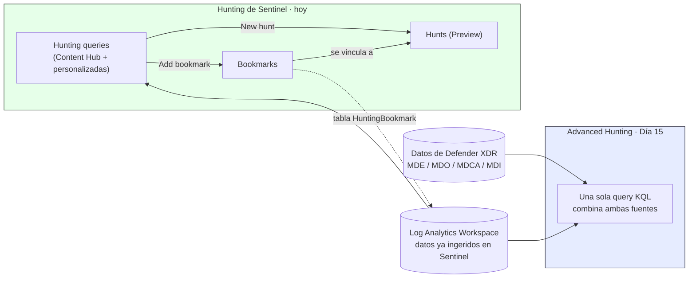
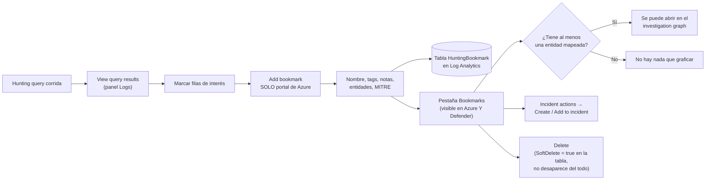
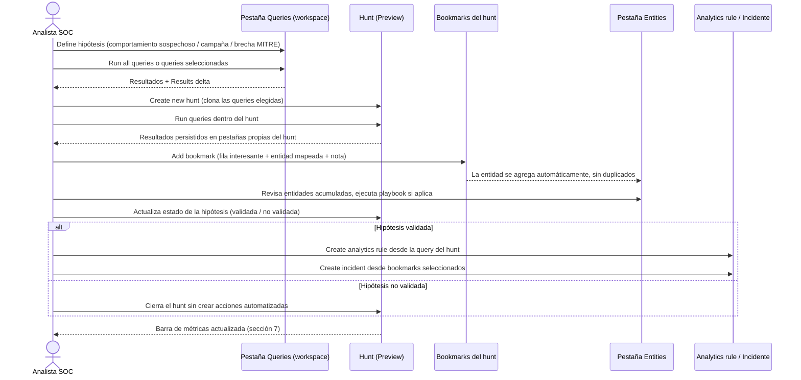
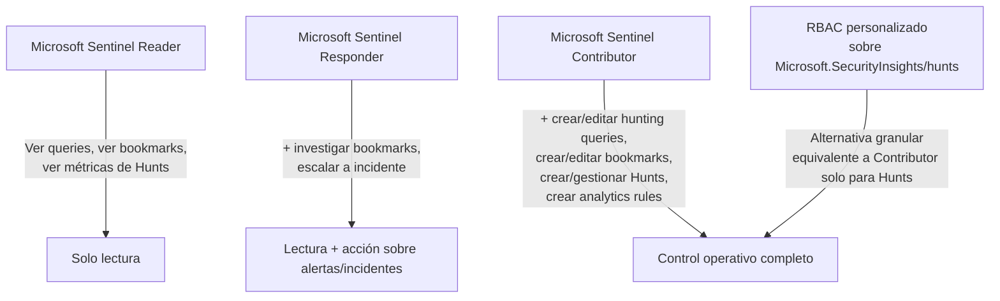
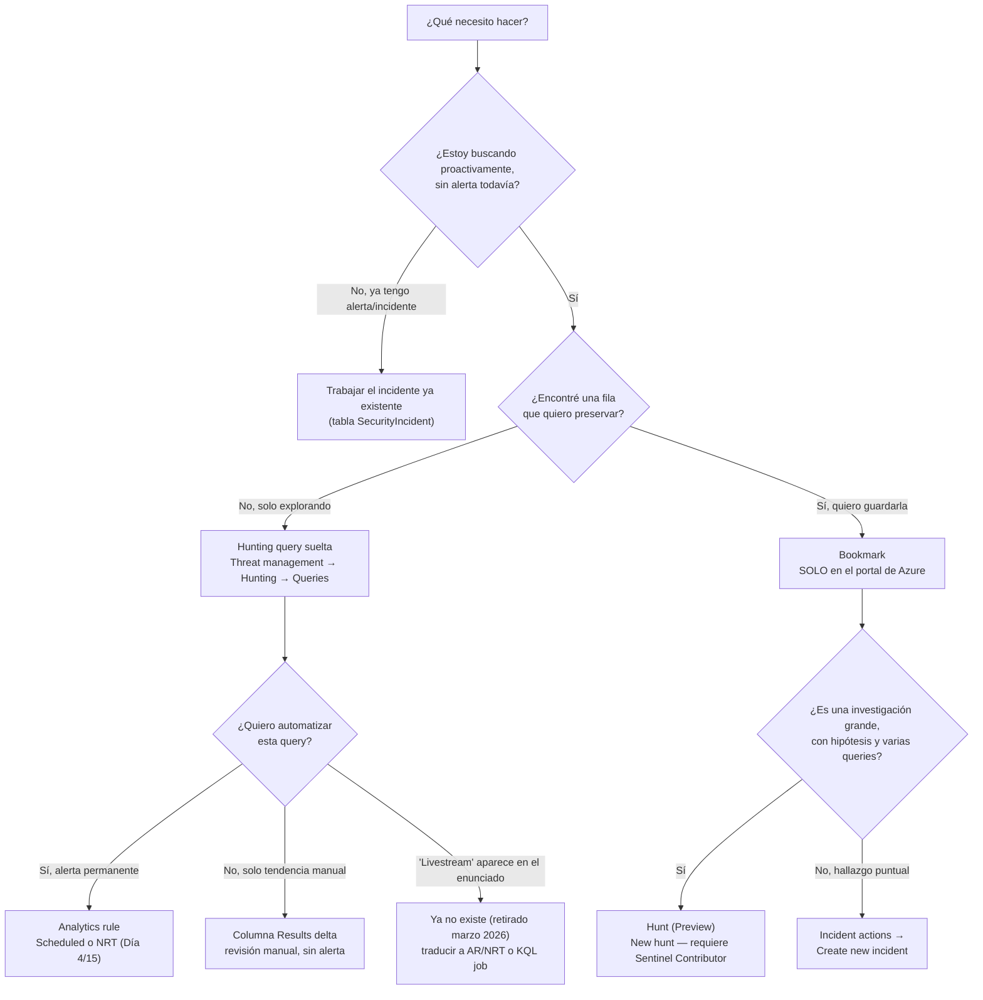
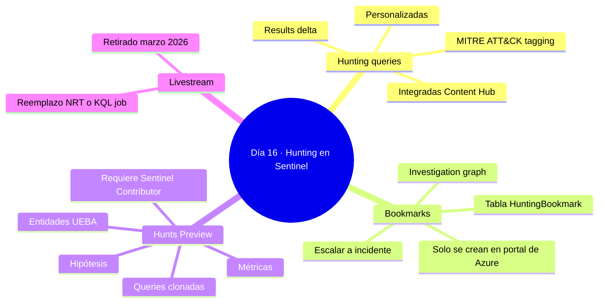

# Lección Día 16 — Hunting en Microsoft Sentinel: Queries, Bookmarks y Hunts

> [!info] Contexto
> Día 16 del plan de [[PLAN_MAESTRO_MULTITRACK]], dentro del **Dominio 3 — Perform threat hunting (20-25% del examen)**, que arrancó el Día 15 con custom detections y hunting graph. Hoy cubre la otra mitad de "hunting" que pide el temario: la **experiencia de hunting nativa de Microsoft Sentinel** — hunting queries basadas en hipótesis, bookmarks para preservar hallazgos, y la función **Hunts** que organiza todo eso en una investigación estructurada de principio a fin.
>
> **Nota de calendario, sin maquillar:** este día estaba programado para el lunes 31-ago según [[PLAN_MAESTRO_MULTITRACK]] §8.3. Se retoma hoy, viernes 11-sep, con **11 días de retraso real** — los Días 16, 17, 18 y el Simulacro #2 nunca se dieron. El detalle completo y la reconciliación del calendario quedan documentados en [[TRACKER_TUTOR]] y en el plan maestro; aquí solo queda dicho con honestidad antes de empezar. Lo que cambia hoy: liberaste tu horario, con **3 horas disponibles hoy y ~1 hora diaria de aquí al examen** (fijo, sábado 3-oct, quedan 22 días).
>
> **Formato nuevo de esta lección:** reescrita a petición tuya en versión más explicativa — cada concepto clave se explica desde cero (qué es, qué problema resuelve, cómo funciona paso a paso, dónde se configura con ruta y rol exactos, un ejemplo de SOC — Security Operations Center — con KQL comentado línea por línea cuando aplica, y su propia trampa de examen), con diagramas Mermaid, imágenes oficiales de Microsoft Learn, y una nota de concepto independiente enlazada como `[[Conceptos/<Nombre>]]` para cada pieza — útil para repasar ese concepto suelto más adelante sin releer la lección completa.

---

## 📖 Lectura del día

### 0. El mapa general: Advanced Hunting vs. Hunting de Sentinel

Antes de entrar a cada pieza, necesitas tener clarísimo dónde vive cada cosa, porque el examen SC-200 (Microsoft Security Operations Analyst) usa exactamente esta confusión como distractor.

El **Día 15** cubrió **Advanced Hunting**: el motor de búsqueda basado en **KQL** (Kusto Query Language, el lenguaje de consulta usado en toda la plataforma de Microsoft Sentinel y Defender) que vive dentro del **portal unificado de Defender** (`security.microsoft.com`). Advanced Hunting combina en una sola query datos de **Defender XDR** (Extended Detection and Response — la suite de productos Defender: MDE, MDO, MDCA, MDI) **y** datos ya ingeridos en **Microsoft Sentinel**, el SIEM (Security Information and Event Management, la plataforma central donde se correlacionan y almacenan los eventos de seguridad de toda la organización) de Microsoft.

Hoy el foco es distinto: la **experiencia de hunting que vive específicamente dentro de Microsoft Sentinel** — la ruta **Microsoft Sentinel → Threat management → Hunting**, accesible tanto desde el portal de Azure (`portal.azure.com`) como desde Microsoft Sentinel dentro del portal de Defender (con matices de qué se puede hacer en cada uno, que vas a ver en la sección 3). No son dos productos rivales: son dos experiencias con foco distinto que comparten el mismo lenguaje (KQL) y, en buena parte, los mismos datos subyacentes del workspace de Log Analytics (el almacén de datos donde vive toda la telemetría que ingiere Sentinel).

**La diferencia funcional que el examen puede usar como trampa, verificada hoy en Microsoft Learn** (`hunting`, ms.date 1-jul-2026, actualizado 8-ago-2026): **los bookmarks no existen en Advanced Hunting.** Solo existen en la experiencia de Hunting específica de Sentinel. Si un enunciado describe "preservar una fila de resultados con notas y tags para revisarla después", la respuesta nunca es Advanced Hunting por sí solo.



| Experiencia | Dónde vive (ruta exacta) | Combina datos de | ¿Tiene bookmarks? |
|---|---|---|---|
| **Advanced Hunting** (Día 15) | Portal de Defender → Investigation & response → Hunting → Advanced hunting | Defender XDR + Sentinel en una sola query | No |
| **Hunting de Sentinel** (hoy) | Microsoft Sentinel → Threat management → Hunting (portal de Azure y Defender) | Datos ya ingeridos en el workspace de Log Analytics | Sí |

---

### 1. Hunting query: el punto de entrada de una investigación proactiva

**Definición desde cero.** Una **hunting query** (query de caza de amenazas) es, en su sintaxis, exactamente igual que cualquier otra query KQL que ya escribiste desde el Día 1 — no hay un lenguaje especial. Lo que la hace "hunting query" es el **propósito**: en vez de confirmar una alerta que ya se disparó automáticamente, la usas para **buscar proactivamente** patrones sospechosos que ninguna de tus reglas automatizadas detecta todavía.

**Qué problema resuelve.** Un SOC (Security Operations Center, el equipo/centro de operaciones de seguridad que monitorea y responde a amenazas) que solo reacciona a alertas automáticas tiene un punto ciego estructural: solo ve lo que alguien ya programó como regla. Un atacante sofisticado diseña su actividad precisamente para no disparar esas reglas. Las hunting queries existen para que un analista pueda, de forma manual y dirigida por hipótesis, mirar datos que nadie está alertando todavía. El ejemplo que da la propia documentación de Microsoft: una query que muestra los procesos menos comunes de tu infraestructura. No querrías una alerta cada vez que corre un proceso poco común — la mayoría son inocentes — pero de vez en cuando vale la pena revisarla manualmente para ver si algo destaca.

**Cómo funciona, paso a paso.** Hay dos orígenes de hunting queries:

1. **Queries integradas (out of the box):** llegan instaladas junto con las soluciones que agregas desde el **Content hub** (el catálogo central de soluciones de Sentinel — paquetes de conectores, analytics rules, workbooks y hunting queries, todo junto, por producto o escenario). Investigadores de seguridad de Microsoft las mantienen y actualizan continuamente.
2. **Queries personalizadas:** las escribes o editas tú mismo, y las guardas como propias o las compartes con todo tu tenant.

Una vez que tienes una query en la lista, el flujo de trabajo diario es:

| Acción en la pestaña Queries | Qué hace |
|---|---|
| **Run all queries** / **Run selected queries** | Ejecuta todas o solo las marcadas. Puede tardar segundos o varios minutos según volumen de datos |
| **Filtrar por Results** | Ordena por más/menos resultados; filtra por `N/A` para ver queries que necesitan una fuente de datos que todavía no conectaste |
| **Results delta / Results delta percentage** | Ver sección 2 de hoy — compara resultados recientes contra el periodo anterior |
| **Filtrar por MITRE ATT&CK** | Ver sección 2 de hoy |
| **Save a query to favorites** | Las queries favoritas corren automáticamente cada vez que abres la página de Hunting |
| **View query results** | Abre los resultados en el panel de **Logs** (Log Analytics) — el único lugar desde donde puedes crear un bookmark (sección 3) |

**Dónde se configura (ruta exacta) y rol necesario.** Ruta: **Microsoft Sentinel → Threat management → Hunting → pestaña Queries**. Para correr y guardar queries personalizadas necesitas, como mínimo, el rol de Azure **Microsoft Sentinel Reader** (para ejecutar y ver) — para crear o editar queries personalizadas y compartirlas con el tenant necesitas **Microsoft Sentinel Contributor** o superior (mismo rol que exige la función Hunts, ver sección 8).

**Ejemplo de SOC, KQL comentado línea por línea.** Contoso quiere una hunting query manual (no automatizada todavía) que muestre logons interactivos fuera de horario laboral sobre la tabla `SecurityEvent` (la misma que ingeriste desde el Día 2 vía AMA — Azure Monitor Agent):

```kql
// Hunting query: logons interactivos fuera de horario laboral (00:00-06:00 o después de 22:00)
SecurityEvent
| where EventID == 4624          // 4624 = logon exitoso (Windows Security Event ID)
| where LogonType in (2, 10)     // 2 = interactivo (frente a la consola física) · 10 = RDP / RemoteInteractive
| extend HourOfDay = datetime_part("Hour", TimeGenerated)   // extrae solo la hora del timestamp completo
| where HourOfDay < 6 or HourOfDay > 22                     // filtra a la ventana "fuera de horario"
| project TimeGenerated, Account, Computer, LogonType, IpAddress, HourOfDay  // nos quedamos solo con las columnas útiles para revisar
| order by TimeGenerated desc    // los más recientes primero
```

Cada línea hace un trabajo concreto: filtra el tipo de evento correcto, filtra el tipo de logon relevante, calcula la hora, aplica el filtro de horario, recorta columnas, y ordena. Nada de esta query alerta por sí sola — es exploración manual, dirigida por la hipótesis "¿hay actividad administrativa fuera de horario que nadie está mirando?".

**Trampa de examen.** Una hunting query, por sí sola, **nunca genera una alerta ni un incidente automáticamente** — necesita convertirse explícitamente en una analytics rule (Día 4/15) para eso. Un enunciado que diga "quiero que esto me avise automáticamente de ahora en adelante" nunca tiene como respuesta correcta "dejar la hunting query como está".

🔗 Nota de concepto: [[Conceptos/Hunting Query de Sentinel]]

---

### 2. MITRE ATT&CK tagging y Results delta: cómo priorizas qué cazar primero

**Definición desde cero.** **MITRE ATT&CK** es un framework público (una base de conocimiento mantenida por MITRE Corporation) que cataloga las **tácticas** (el objetivo del atacante en una fase del ataque, ej. "Persistence") y **técnicas** (el método concreto para lograrlo, ej. "Kerberoasting") que usan los adversarios reales. Cada hunting query de Sentinel puede etiquetarse ("taguearse") con la táctica y técnica MITRE que detecta. **Results delta** es una métrica calculada automáticamente por Sentinel que compara cuántos resultados devolvió una query en las últimas 24 horas contra las 24-48 horas anteriores.

**Qué problema resuelve.** Con docenas o cientos de hunting queries disponibles, un analista no puede correrlas y revisarlas todas a mano cada día. MITRE tagging resuelve "¿qué áreas de mi superficie de ataque tienen o no cobertura de hunting?" — y Results delta resuelve "¿cuál de mis queries cambió de comportamiento recientemente, y por lo tanto merece mi atención primero?". Juntos convierten una lista plana de queries en una lista priorizada.

**Cómo funciona, paso a paso.** En la pestaña Queries, cada query trae asociada su táctica y técnica MITRE (heredadas de la definición de la query). Arriba de la tabla hay una **barra de tácticas MITRE ATT&CK** que cuenta cuántas queries hay mapeadas a cada táctica y se actualiza dinámicamente según los filtros activos. Para Results delta: cada vez que corres las queries, Sentinel calcula automáticamente el delta absoluto y porcentual entre el conteo actual y el periodo previo — puedes ordenar la tabla completa por esa columna para ver, de un vistazo, qué cambió más.

**Dónde se configura (ruta exacta) y rol necesario.** No es algo que "configures" activamente — es una vista calculada automáticamente en **Microsoft Sentinel → Threat management → Hunting → pestaña Queries**, visible con cualquier rol que tenga acceso de lectura a Hunting (Microsoft Sentinel Reader en adelante). Para ver la cobertura MITRE de forma dedicada: **Microsoft Sentinel → Threat management → MITRE ATT&CK (Preview)**, filtrando por "Hunting queries" en el menú **Simulated**.

**Ejemplo de SOC.** Un analista de Contoso, al empezar su turno, no corre las 80 hunting queries disponibles una por una. En su lugar: (1) ordena la pestaña Queries por **Results delta percentage** descendente, (2) revisa primero las 5 con el cambio más grande, (3) si alguna toca una táctica MITRE con la que Contoso ya tuvo un incidente reciente (ej. "Credential Access", por el Kerberoasting del Día 11), la prioriza aún más. Es un flujo de triage, no de fuerza bruta.

**Trampa de examen.** Un enunciado que pregunta "¿cómo identifico qué técnicas MITRE ATT&CK NO tienen cobertura de hunting?" no se resuelve revisando query por query — la vía correcta es la página **MITRE ATT&CK (Preview)** con el filtro de Hunting queries en Simulated, que da la vista agregada.

🔗 Nota de concepto: [[Conceptos/MITRE ATTCK Tagging y Results Delta]]

---

### 3. Bookmark: preservar lo que encontraste

**Definición desde cero.** Un **bookmark** (marcador) en el contexto de hunting de Sentinel es un objeto que **preserva una fila concreta de resultados de una hunting query**, junto con la query completa que la generó, en un registro permanente que puedes anotar, etiquetar y volver a consultar — sin depender de correr la query de nuevo con el mismo rango de tiempo exacto (que quizás ya ni siquiera exista si los datos rotaron fuera del periodo de retención).

**Qué problema resuelve.** Cazar amenazas implica revisar montañas de datos. En algún punto encuentras una fila que parece relevante — un proceso raro, una IP sospechosa, un patrón de login fuera de horario — y necesitas una forma de decir "esto es importante, no lo pierdas" sin que dependa de tu memoria ni de una captura de pantalla suelta que nadie más en el equipo puede consultar en KQL.

**Cómo funciona, paso a paso, verificado hoy en Microsoft Learn** (`bookmarks`, ms.date 1-jul-2026, actualizado 8-ago-2026):

1. Corres una hunting query (sección 1) y seleccionas **View query results**, que abre el panel de **Logs**.
2. Marcas el checkbox de las filas que te interesan.
3. Seleccionas **Add bookmark**. Se crea un bookmark por cada fila marcada, con el resultado de esa fila **y** la query que lo generó.
4. Opcionalmente agregas nombre, tags, notas, mapeo de entidades (igual que en las analytics rules del Día 4) y técnicas/tácticas MITRE ATT&CK — por defecto heredan el mapeo de la query que los generó, pero puedes editarlo.


**Dónde se configura (ruta exacta) y rol necesario — el detalle más importante de hoy.**

> [!warning] Bookmarks: solo se crean en el portal de Azure
> **Solo puedes CREAR bookmarks nuevos en el portal de Azure**, dentro de **Microsoft Sentinel → Threat management → Hunting**. **En el portal de Defender (`security.microsoft.com`) puedes VER los bookmarks que ya existen, pero no puedes crear ninguno nuevo desde ahí.** Es una restricción real de la plataforma, verificada hoy contra la documentación oficial — no un capricho de configuración. Es exactamente el tipo de trampa "ubicación de portal" que ya te costó puntos en el Día 7 (workbooks): sabes qué hace la función, el examen prueba si sabes dónde vive.

Rol necesario: **Microsoft Sentinel Contributor** (o superior) para crear/editar bookmarks; **Microsoft Sentinel Responder** alcanza para escalar un bookmark existente a incidente; **Microsoft Sentinel Reader** solo permite verlos.



**Qué puedes hacer con un bookmark ya creado:**

- **Verlo en la pestaña Bookmarks**, con filtros por tag (útil para agrupar todos los bookmarks de una campaña de investigación bajo el mismo tag).
- **Investigarlo en el investigation graph** (grafo de investigación, un diagrama interactivo de entidades y su timeline) — requiere al menos una entidad mapeada.
- **Escalarlo a un incidente:** desde la pestaña Bookmarks, seleccionas uno o varios y usas **Incident actions → Create new incident** o **Add to existing incident**.
- **Consultarlo en crudo vía KQL:** todos los bookmarks viven en la tabla **`HuntingBookmark`** de tu workspace de Log Analytics.
- **Borrarlo:** desaparece de la pestaña Bookmarks, pero `HuntingBookmark` conserva el historial — la fila más reciente pasa a `SoftDelete == true`.

**Ejemplo de SOC.** Retomando la query del Ejemplo de la sección 1: el analista encuentra la fila de la cuenta administrativa con logon a las 3:14 AM desde una IP desconocida. La marca y selecciona **Add bookmark**, escribe la nota "IP no reconocida, fuera de horario — validar con el usuario antes de escalar", y mapea las entidades `Account` e `IP address`. Con al menos una entidad mapeada, puede abrir el bookmark en el investigation graph para ver si esa misma cuenta o IP aparece correlacionada con otros eventos del workspace.

**Trampa de examen.** Si el enunciado dice explícitamente "el analista está trabajando en el portal de Defender e intenta crear un bookmark nuevo desde ahí" — la respuesta correcta nunca es "lo crea sin problema". Tiene que cambiar al portal de Azure primero.

🔗 Nota de concepto: [[Conceptos/Bookmark de Hunting en Sentinel]]

---

### 4. Hipótesis de threat hunting: el punto de partida de toda investigación

**Definición desde cero.** Una **hipótesis** de threat hunting es una idea concreta y verificable sobre una posible amenaza en tu entorno — algo que puedes validar o descartar con datos, no una sospecha vaga. Es el primer paso formal del flujo de trabajo de **Hunts** (sección 5).

**Qué problema resuelve.** Sin una hipótesis clara, "hacer hunting" se vuelve mirar datos sin rumbo — improductivo y difícil de medir. Definir la hipótesis antes de escribir la primera query obliga al analista a decidir qué está buscando y por qué, y le da al hunt completo un criterio de éxito claro: ¿la hipótesis se validó o no?

**Cómo funciona, paso a paso.** Microsoft Learn (`hunts`, ms.date 1-jul-2026) define tres puntos de partida típicos, cada uno con su propio flujo recomendado:

| Tipo de hipótesis | De dónde parte | Cómo arrancar |
|---|---|---|
| **Comportamiento sospechoso** | Algo visible en tu entorno que quieres confirmar si es un ataque | Pestaña Queries → **Run All queries** → filtrar por resultados distintos de `N/A`/`0` → ordenar por **Results Delta** (sección 2) |
| **Nueva campaña de amenaza** | Una amenaza recién conocida (noticia, feed de threat intel) | Instalar una solución específica desde el **Content Hub** (ej. detección de una vulnerabilidad concreta) → correr sus queries |
| **Brecha de detección** | Un hueco identificado en tu cobertura MITRE ATT&CK | Página **MITRE ATT&CK (Preview)** → filtrar por técnicas sin "Hunting queries" asociadas |

**Dónde se configura (ruta exacta) y rol necesario.** La hipótesis se redacta como texto libre en el campo **Description** al crear un hunt (**Microsoft Sentinel → Threat management → Hunting → pestaña Hunts (Preview) → New Hunt**), y su **estado** (validada / no validada / en progreso) se actualiza desde un menú desplegable dedicado dentro del hunt. Mismo rol que el resto de Hunts: **Microsoft Sentinel Contributor**.


**Ejemplo de SOC.** Contoso lee una noticia sobre una campaña activa de Kerberoasting (técnica ya vista el Día 11, dentro de MDI — Microsoft Defender for Identity) contra organizaciones similares. El analista redacta la hipótesis: *"Contoso podría tener cuentas de servicio con SPNs débiles expuestas a Kerberoasting, y Sentinel no tiene visibilidad independiente de eso fuera de MDI."* Es concreta, verificable, y define exactamente qué datos hay que mirar.

**Trampa de examen.** El estado de una hipótesis (validada/no validada) **no cierra automáticamente el hunt** — son dos campos independientes: el estado de la hipótesis describe el resultado de la investigación, el estado del hunt (abierto/cerrado) describe si el trabajo sigue activo.

🔗 Nota de concepto: [[Conceptos/Hipotesis de Threat Hunting]]

---

### 5. Hunts: organizar una investigación completa, no solo una query suelta

**Definición desde cero.** **Hunts** es una función de Microsoft Sentinel, verificada hoy como **en preview** (`hunts`, ms.date 1-jul-2026, actualizado 8-ago-2026), que agrupa una hipótesis, un conjunto de hunting queries persistidas, los bookmarks generados, las entidades recolectadas y los comentarios de colaboración en un solo contenedor de investigación con seguimiento de progreso.

**Qué problema resuelve.** Hasta aquí, cada query y cada bookmark viven algo sueltos entre sí. Cuando una investigación crece — varias hipótesis, decenas de queries, docenas de bookmarks — necesitas un contenedor que mantenga todo junto, con contexto persistente a través del tiempo, en vez de reconstruir manualmente "¿qué había encontrado la semana pasada sobre esto?" cada vez que retomas el caso.

**Cómo funciona, paso a paso — el ciclo completo:**

**Paso 1 — Definir la hipótesis** (sección 4).

**Paso 2 — Crear el hunt.** Dos caminos: (a) si ya seleccionaste queries relacionadas con tu hipótesis en la pestaña Queries, usas **Hunt actions → Create new hunt** y esas queries se **clonan automáticamente** dentro del hunt nuevo; (b) si todavía no decidiste queries, usas **Hunts (Preview) → New Hunt** para crear un hunt en blanco y agregar queries después.

**Paso 3 — Trabajar dentro del hunt**, que tiene tres pestañas propias:

- **Queries:** son **clones independientes** de las originales del workspace — editarlas o borrarlas aquí no afecta a la query general ni a la de otros hunts. Desde el menú contextual: Run, Edit, Clone, Delete, o **Create analytics rule** directamente (mismo flujo del Día 4/15, con nombre/descripción/KQL ya prellenados).
- **Bookmarks:** mismo flujo que la sección 3, pero vinculados al hunt.
- **Entities:** ver sección 6.

**Paso 4 — Comentarios.** Espacio de colaboración dentro del propio hunt para enlazar resultados de queries como referencia para el equipo.

**Paso 5 — Crear incidentes desde el hunt.** Desde la pestaña Bookmarks (igual que la sección 3) o desde **Hunt Actions → Create incident**, eligiendo qué bookmarks del hunt incluir.

**Paso 6 — Actualizar y cerrar.** Se actualiza el estado de la hipótesis y, cuando ya se crearon todas las analytics rules/incidentes/indicadores de TI necesarios, se cierra el hunt.




**Dónde se configura (ruta exacta) y rol necesario.** Ruta: **Microsoft Sentinel → Threat management → Hunting → pestaña Hunts (Preview)**. Rol: **Microsoft Sentinel Contributor**, o un rol RBAC personalizado con permisos sobre `Microsoft.SecurityInsights/hunts` — detalle completo en la sección 8.

**Ejemplo de SOC.** Ver Ejemplo 2 en la sección de ejemplos concretos, más abajo — el ciclo completo aplicado a la hipótesis de Kerberoasting de la sección 4.

**Trampa de examen.** "Editar una query dentro de un hunt sin afectar la query general del workspace" — se puede sin ningún problema, precisamente porque las queries de un hunt son clones. Un distractor típico asume que compartir "instancia" con las queries generales, y no es así.

🔗 Nota de concepto: [[Conceptos/Hunts de Microsoft Sentinel]]

---

### 6. Entidades y UEBA: consolidar quién y qué aparece en tu investigación

**Definición desde cero.** Una **entidad** es cualquier objeto identificable dentro de tus datos de seguridad — una cuenta, un dispositivo, una IP, un archivo. **UEBA** (User and Entity Behavior Analytics, análisis de comportamiento de usuarios y entidades) es la capacidad de Sentinel que perfila el comportamiento normal de esas entidades para detectar desviaciones. La pestaña **Entities** de un hunt es la vista que consolida, sin duplicados, todas las entidades que aparecieron en los bookmarks del hunt.

**Qué problema resuelve.** Si revisas bookmarks uno por uno, es fácil perder el patrón "esta misma cuenta de servicio apareció en tres bookmarks distintos". La pestaña Entities resuelve exactamente eso: te da la vista agregada, sin que tengas que cruzar manualmente los bookmarks.

**Cómo funciona, paso a paso.** La lista de la pestaña Entities se genera automáticamente a partir de las entidades mapeadas en los bookmarks del hunt, y el sistema resuelve duplicados automáticamente (la misma cuenta mapeada en dos bookmarks distintos aparece una sola vez). Desde ahí puedes: (1) seleccionar el nombre de una entidad para ir a su **página UEBA** correspondiente (historial de actividad, picos de riesgo); (2) hacer clic derecho para acciones específicas del tipo de entidad — por ejemplo, agregar una IP directamente a Threat Intelligence, o correr un playbook (Día 6) específico para ese tipo de entidad.

**Dónde se configura (ruta exacta) y rol necesario.** Ruta: dentro de un hunt abierto, pestaña **Entities**. Mismo rol que el resto de Hunts: Microsoft Sentinel Contributor para las acciones (ejecutar playbook, agregar a TI); Sentinel Reader alcanza para solo visualizar.


**Ejemplo de SOC.** En el hunt de Kerberoasting de la sección 4, el analista bookmarkeó cinco filas distintas a lo largo de varios días. En la pestaña Entities descubre que **la misma cuenta de servicio** aparece vinculada a tres de esos cinco bookmarks — un patrón que hubiera sido fácil pasar por alto revisando los bookmarks uno a uno en orden cronológico. Con un clic derecho sobre esa cuenta, ejecuta el playbook de "deshabilitar cuenta de servicio comprometida" ya construido en días anteriores (Día 6).

**Trampa de examen.** La pestaña Entities **no reemplaza** al investigation graph de un bookmark individual (sección 3) — son dos vistas distintas: Entities da la lista agregada sin duplicados de todo el hunt; el investigation graph de un bookmark da el diagrama visual de relaciones de ESE bookmark puntual.

🔗 Nota de concepto: [[Conceptos/Entidades y UEBA en Sentinel]]

---

### 7. Métricas de un hunt: medir el impacto del programa de hunting

**Definición desde cero.** La **barra de métricas** de la pestaña Hunts (Preview) es un panel que cuenta, de forma agregada sobre todos tus hunts, cuántas hipótesis se validaron, cuántos incidentes nuevos se crearon a partir de hunts, y cuántas analytics rules nuevas se crearon a partir de hunts.

**Qué problema resuelve.** Un programa de threat hunting maduro necesita justificar su valor ante el resto de la organización — "encontramos algo" no es una métrica, es una anécdota. La barra de métricas convierte la actividad de hunting en números concretos y acumulables a través del tiempo, útiles para fijar metas o mostrar el progreso del programa.

**Cómo funciona, paso a paso.** Se calcula automáticamente, sin configuración manual: cada vez que un hunt cambia su estado de hipótesis a "validada", cada vez que se crea un incidente desde un hunt, y cada vez que se crea una analytics rule desde un hunt, el contador correspondiente sube. Se visualiza en la parte superior de la pestaña **Hunts (Preview)**.

**Dónde se configura (ruta exacta) y rol necesario.** No requiere configuración — es una vista automática en **Microsoft Sentinel → Threat management → Hunting → pestaña Hunts (Preview)**, visible con Microsoft Sentinel Reader en adelante (verla no requiere el Contributor que sí exige crear o modificar hunts).


**Ejemplo de SOC.** El líder del SOC de Contoso usa la barra de métricas en su revisión trimestral: 12 hunts cerrados, 4 hipótesis validadas, 3 analytics rules nuevas creadas a partir de esos hunts. Con eso justifica ante dirección que el tiempo invertido en hunting proactivo generó detecciones permanentes, no solo hallazgos puntuales sin seguimiento.

**Trampa de examen.** Las métricas cuentan resultado accionado (hipótesis validada + acción tomada), no actividad bruta — correr muchas queries sin nunca validar una hipótesis ni crear una rule/incidente **no** mueve estos contadores.

🔗 Nota de concepto: [[Conceptos/Metricas de un Hunt]]

---

### 8. Permisos y RBAC para Hunting y Hunts

**Definición desde cero.** **RBAC** (Role-Based Access Control, control de acceso basado en roles) es el modelo de Azure que decide qué puede hacer cada usuario según el rol que tiene asignado sobre un recurso — en este caso, sobre el workspace de Sentinel o sobre el hunt específico.

**Qué problema resuelve.** No todos los miembros del SOC deben poder crear, editar o borrar contenido de hunting con el mismo nivel de acceso — un analista junior puede necesitar solo ver y correr queries, mientras que un analista senior necesita poder crear hunts, bookmarks y convertir hallazgos en reglas permanentes. RBAC aplica el principio de mínimo privilegio (dar solo el acceso necesario para el trabajo de cada rol) ya visto en el Día 6 con los permisos de playbooks.

**Cómo funciona, paso a paso.** Azure evalúa, para cada acción que un usuario intenta, si su rol asignado sobre el recurso (el workspace de Sentinel, o el resource group que lo contiene) incluye el permiso necesario. Los roles nativos de Sentinel relevantes para hunting, de menor a mayor privilegio:



**Dónde se configura (ruta exacta).** Los roles se asignan en **Azure Portal → tu suscripción o resource group → Access control (IAM) → Add role assignment**, seleccionando el rol nativo de Sentinel y el usuario/grupo. Verificado hoy (`hunts`, misma fuente): para usar la función Hunts específicamente se necesita el rol **Microsoft Sentinel Contributor**, o un rol RBAC personalizado con permisos sobre el ámbito **`Microsoft.SecurityInsights/hunts`** — un rol de solo lectura como Sentinel Reader no alcanza para crear ni gestionar hunts.

**Ejemplo de SOC.** Contoso tiene tres niveles de analista. Los analistas Tier 1 (triage inicial) reciben **Sentinel Reader** — pueden ver hunting queries, resultados y métricas, pero no crear nada nuevo. Los analistas Tier 2 (investigación activa) reciben **Sentinel Responder** — pueden bookmarkear y escalar a incidente, pero no crear hunts ni analytics rules nuevas. Solo los analistas Tier 3 (hunting proactivo dedicado) reciben **Sentinel Contributor**, porque son los únicos que crean hunts completos y convierten hallazgos en detecciones permanentes.

**Trampa de examen.** "Sentinel Reader es suficiente porque Hunts solo lee datos" es un distractor falso: Hunts no es una función de solo lectura — crea objetos nuevos (el hunt mismo, sus queries clonadas, sus bookmarks), así que exige un rol con permisos de escritura sobre el recurso.

🔗 Nota de concepto: [[Conceptos/RBAC y Permisos de Hunting en Sentinel]]

---

### 9. Livestream: la trampa de examen más importante de hoy, porque ya no existe

**Definición desde cero (de lo que ERA).** **Livestream** era una función de Microsoft Sentinel que permitía monitorear una hunting query en **near-real-time** (casi en tiempo real): en vez de correr la query una vez, Livestream la re-evaluaba continuamente y notificaba al analista cuando aparecían resultados nuevos, **sin crear un incidente automáticamente**.

Si estudiaste con cualquier guía o material anterior a marzo de 2026 — incluida la [[GUIA_INTENSIVA_24_DIAS]] de este mismo curso, que todavía lista "livestream" como tema del Día 16 — vas a encontrar esa descripción como si siguiera vigente. No es así.

> [!danger] Hallazgo crítico verificado hoy en Microsoft Learn
> La página oficial de Hunting (`hunting`, actualizada 8-ago-2026) lo dice explícitamente: **"Microsoft Sentinel livestreams are no longer available."** El retiro ocurrió **a mediados de marzo de 2026**. La alternativa recomendada oficialmente para automatizar queries y notificaciones es usar **analytics rules** (incluidas las NRT — Near Real-Time — ya vistas el Día 4), **KQL jobs** (a fondo el Día 17, dentro del Sentinel data lake) o **playbooks** (Día 6). Este dato es ausente en [[GUIA_INTENSIVA_24_DIAS]] y en [[REPASO_RAPIDO_Errores_Simulacro]] (ítem 7 de esa nota todavía pregunta "¿Livestream genera alertas?") porque ambos se escribieron antes del retiro — no se editaron sin tu permiso explícito, queda avisado aquí y en el tracker.

**Por qué esto es examinable, no solo trivia de producto.** El examen SC-200 tiene una fecha de corte de contenido, y una pregunta que describa "quieres monitoreo continuo sin generar incidentes" ya no puede tener a Livestream como respuesta correcta. El distractor correcto pasa a ser "usa una NRT analytics rule" (si el objetivo admite generar una alerta) o, si el escenario pide explícitamente **no** generar ninguna alerta, la respuesta correcta es revisar manualmente la columna **Results delta** (sección 2), no ningún tipo de regla automatizada.

**Qué hacer si ves "Livestream" en un enunciado de práctica.** Reconoce que describe un feature retirado, y traduce la necesidad descrita a su alternativa vigente según si se acepta o no generar una alerta automática — exactamente el razonamiento del Ejemplo 3 más abajo.

🔗 Nota de concepto: [[Conceptos/Livestream de Microsoft Sentinel (Retirado)]]

---

### 10. Diagrama de decisión y tabla de decisión del día

Con las nueve piezas ya explicadas, este es el árbol de decisión completo para resolver cualquier escenario de examen sobre hunting en Sentinel:



| El enunciado dice (calificador) | Herramienta / respuesta correcta | Por qué NO las demás |
|---|---|---|
| "Preservar una fila de resultados de una query, con notas y tags, para revisarla más tarde" | **Bookmark** (Add bookmark, desde el panel Logs) | Advanced Hunting no tiene bookmarks (sección 0); "guardar como favorita" preserva la query, no el resultado puntual |
| "Crear un bookmark nuevo desde el portal de Defender" | **No es posible** — hay que crearlo desde el portal de Azure | En el portal de Defender solo se pueden VER bookmarks ya creados, nunca crear uno nuevo |
| "Monitorear una query continuamente y recibir notificación cuando cambien los resultados, sin crear un incidente" | **NRT analytics rule** o **KQL job** (Día 17) — Livestream ya no existe | Livestream fue retirado desde marzo de 2026; sigue apareciendo en materiales viejos como trampa |
| "Organizar una investigación completa con hipótesis, varias queries persistentes y seguimiento de progreso a través del tiempo" | **Hunts (Preview)** — New hunt | Una query o un bookmark sueltos no mantienen el contexto agregado de una investigación completa |
| "Editar una query dentro de un hunt sin afectar la query general del workspace" | Se puede sin problema — las queries de un hunt son **clones independientes** | Un distractor típico asume que comparten instancia con las queries generales; no es así |
| "Identificar técnicas MITRE ATT&CK sin cobertura de hunting queries" | Página **MITRE ATT&CK (Preview)** → filtro de Hunting queries en Simulated | Las hunting queries individuales no muestran cobertura agregada por técnica |
| "Encontré un patrón valioso en una hunting query y quiero que dispare una alerta automáticamente de ahora en adelante" | **Create analytics rule** desde los resultados de la query | Una hunting query nunca alerta por sí sola |
| "Consultar en KQL todos mis bookmarks históricos, incluidos los ya borrados de la vista" | Tabla **`HuntingBookmark`** en Log Analytics, filtrando `SoftDelete` | La pestaña Bookmarks de la UI solo muestra hasta 1,000 activos |
| "¿Qué rol mínimo necesito para crear un hunt?" | **Microsoft Sentinel Contributor** (o RBAC sobre `Microsoft.SecurityInsights/hunts`) | Sentinel Reader no alcanza — Hunts crea objetos nuevos, no es solo lectura |

### 11. Mapa mental del día



---

## 💡 Ejemplos concretos

### Ejemplo 1 — De hipótesis a bookmark: detectar logons fuera de horario

**Escenario:** El SOC de Contoso sospecha que una cuenta administrativa puede estar comprometida, porque las alertas automáticas configuradas hasta ahora solo cubren fuerza bruta, no uso anómalo de una cuenta ya autenticada. Se decide una hunting query manual como primer paso.

**Razonamiento:** es exactamente el tipo de hipótesis "comportamiento sospechoso" de la sección 4 — parte de algo visible (la preocupación por la cuenta) sin esperar a que dispare una alerta ya existente. La query corre sobre `SecurityEvent`, la misma tabla que ya usaste desde el Día 2 (ingerida vía AMA).

```kql
// Hunting query: logons interactivos fuera de horario laboral (00:00-06:00 o después de 22:00)
SecurityEvent
| where EventID == 4624          // logon exitoso
| where LogonType in (2, 10)     // 2 = interactivo, 10 = RDP/RemoteInteractive
| extend HourOfDay = datetime_part("Hour", TimeGenerated)
| where HourOfDay < 6 or HourOfDay > 22
| project TimeGenerated, Account, Computer, LogonType, IpAddress, HourOfDay
| order by TimeGenerated desc
```

El analista corre la query desde la pestaña Queries, selecciona **View query results**, y encuentra una fila con la cuenta administrativa haciendo login interactivo a las 3:14 AM desde una IP que no reconoce. Marca el checkbox de esa fila y selecciona **Add bookmark**, agrega la nota "IP no reconocida, fuera de horario — validar con el usuario antes de escalar" y mapea la entidad `Account` y la entidad `IP address`. Como el bookmark quedó con al menos una entidad mapeada, puede abrirlo en el investigation graph para ver rápidamente si esa misma cuenta o IP aparece en otros eventos correlacionados del workspace.

### Ejemplo 2 — Un Hunt completo desde una brecha de detección MITRE

**Escenario:** Durante una revisión trimestral, el equipo de Contoso quiere saber si tienen cobertura de hunting queries para la técnica **Kerberoasting** (ya vista el Día 11, dentro de MDI) fuera del propio Defender for Identity — es decir, si Sentinel tiene alguna forma independiente de detectarlo sobre los logs de seguridad ya ingeridos.

**Razonamiento:** es la hipótesis "brecha de detección" de la sección 4. El analista va a la página **MITRE ATT&CK (Preview)**, filtra la vista **Simulated** por "Hunting queries" para ver qué técnicas sí tienen queries asociadas, y confirma que Kerberoasting no aparece cubierta. Selecciona la tarjeta de la técnica y, al no haber ninguna query lista para clonar, decide construir una desde cero.

En vez de trabajar con una query suelta, crea un **Hunt** nuevo (**Hunts (Preview) → New Hunt**) llamado "Cobertura Kerberoasting - Sentinel", describe la hipótesis ("Contoso no tiene visibilidad de solicitudes TGS anómalas de tickets Kerberos fuera de MDI"), y agrega la query nueva a la pestaña Queries del hunt. Corre la query, bookmarkea los hallazgos relevantes, y usa la pestaña Entities (sección 6) para revisar de forma centralizada qué cuentas de servicio aparecieron marcadas en más de un bookmark — el mismo flujo que ilustra el diagrama `sequenceDiagram` de la sección 5. Al validar la hipótesis (encontró cuentas de servicio con SPNs débiles), usa **Create analytics rule** desde la query del hunt para convertirla en detección automática permanente, y cierra el hunt marcando la hipótesis como validada — la barra de métricas (sección 7) suma una analytics rule nueva a su conteo.

### Ejemplo 3 — Resolver la trampa de Livestream con la alternativa correcta

**Escenario:** Un enunciado de práctica (redactado con vocabulario de una guía vieja) dice: *"Configura Livestream sobre una hunting query para recibir una notificación cada vez que aparezca una nueva coincidencia, sin generar un incidente."*

**Razonamiento:** el enunciado describe con precisión lo que Livestream hacía — pero Livestream ya no existe (sección 9). La respuesta correcta hoy depende de un matiz que el propio enunciado no aclara del todo: si "notificación" implica generar una alerta automática, la vía correcta es una **NRT analytics rule** (Día 4) cuya query cumpla los requisitos de elegibilidad ya vistos el Día 15 (una sola tabla, sin `join`/`union`, sin comentarios). Si en cambio el objetivo es monitoreo puramente manual sin ninguna alerta — el "sin generar un incidente" del enunciado empuja hacia esa lectura — la vía correcta es simplemente **guardar la query como favorita** y revisar periódicamente la columna **Results delta** (sección 2), que ya muestra si aparecieron resultados nuevos en las últimas 24 horas sin que nada se dispare automáticamente. Ninguna de las dos vías se llama "Livestream", y reconocer eso — no solo saber para qué servía Livestream — es lo que el examen puede estar probando si el escenario usa terminología retirada a propósito.

---

## 🎥 Videos

1. **[Perform threat hunting in Microsoft Sentinel | SC-200 | Episode 10](https://www.youtube.com/watch?v=z6QbN4rpAvA)** — episodio de la serie oficial "SC-200: Defend against cyberthreats with Microsoft's security operations platform" (parte de la playlist oficial vinculada desde el propio Microsoft Learn training path del Dominio 3). Actualizado el 4-may-2026. No pude confirmar la duración exacta desde la búsqueda — los episodios de esta serie suelen rondar 10-20 minutos; si al abrirlo resulta muy distinto, avísame para corregir el dato. Cubre el flujo clásico de hunting queries + bookmarks; es razonablemente probable que **no** cubra todavía la función Hunts (Preview), que es más reciente — compénsalo con la lectura de la sección 5 de hoy.
2. **Sobre la función Hunts (Preview) específicamente:** búsqueda verificada hoy sin resultado de un video reciente y dedicado — es un feature demasiado nuevo (documentación con `ms.date` de julio de 2026) para tener cobertura amplia en video todavía. En su lugar, usa el módulo oficial de Microsoft Learn **[Conduct end-to-end proactive threat hunting in Microsoft Sentinel](https://learn.microsoft.com/en-us/azure/sentinel/hunts)** — es la misma fuente verificada hoy para escribir la sección 5 completa.

> [!note] Honestidad sobre la búsqueda de video de hoy
> Mismo patrón que en los Días 13 y 15: prefiero decir con claridad que no hay un video reciente dedicado a Hunts en vez de forzar un enlace de relleno que traiga un dato ya desactualizado — es justo el área que más cambió recientemente (retiro de Livestream en marzo-2026, función Hunts todavía en preview).

---

## 🧪 Ejercicio práctico

> [!note] Este lab usa tu workspace de Sentinel ya existente (Azure for Students)
> La pestaña Hunting vive dentro del mismo workspace de Log Analytics + Sentinel que configuraste desde el Día 1, en `portal.azure.com` (no el trial M365 E5 de los labs de MDE/MDO). Ya tienes datos reales corriendo ahí desde el Día 2 (`SecurityEvent` vía AMA) — suficiente para practicar hunting queries y bookmarks de verdad, sin depender de datos simulados. Recuerda: **los bookmarks solo se crean desde el portal de Azure**, así que haz todo el lab ahí, no en `security.microsoft.com`.

- [ ] **Paso 1 — Correr la query del Ejemplo 1.** En Microsoft Sentinel → Threat management → Hunting → Queries, crea una query personalizada con el KQL de la sección de ejemplos (ajusta el rango horario si tu VM no tiene logons recientes fuera de horario — puedes simular uno con un RDP de prueba, o simplemente usar cualquier filtro que devuelva resultados de tu `SecurityEvent` real).
- [ ] **Paso 2 — Crear un bookmark real.** Desde View query results, marca al menos una fila, selecciona Add bookmark, y complétalo con nota, tag y al menos una entidad mapeada (Account o IP).
- [ ] **Paso 3 — Confirmar la restricción de portal.** Abre Microsoft Sentinel dentro del portal de Defender (`security.microsoft.com` → Microsoft Sentinel → Hunting → Bookmarks) y confirma que ves el bookmark que acabas de crear, pero que no aparece la opción de crear uno nuevo ahí — es la confirmación práctica de la sección 3 de hoy.
- [ ] **Paso 4 — Consultar `HuntingBookmark` directamente.** En Logs, corre `HuntingBookmark | take 10` y revisa las columnas — confirma que ahí vive el dato crudo del bookmark que creaste.
- [ ] **Paso 5 — Crear un Hunt (si tu suscripción ya muestra la pestaña Hunts (Preview)).** Si aparece, crea un hunt en blanco, agrégale la query del Paso 1, corre la query dentro del hunt y confirma en la pestaña Queries del hunt que es un clon independiente (edítala ligeramente y verifica que la query general de la sección Queries del workspace no cambió). Si tu suscripción todavía no tiene Hunts habilitado (es razonable, sigue en preview), documenta el flujo como paso teórico usando las capturas del artículo de Microsoft Learn.
- [ ] **Paso 6 —** responde el quiz de hoy y el repaso acumulativo.

---

## ✅ Quiz del día

Cinco preguntas sobre el contenido nuevo de hoy. Responde antes de abrir el bloque de respuestas.

**1.** ¿En qué portal puedes CREAR una nueva hunting bookmark en Microsoft Sentinel?

- A) Solo en el portal de Defender (security.microsoft.com), nunca en el portal de Azure
- B) Solo en el portal de Azure (portal.azure.com); en el portal de Defender solo puedes verlas
- C) En cualquiera de los dos portales indistintamente, sin restricción
- D) En ninguno de los dos directamente; se crean solo por API o PowerShell

**2.** Un analista, guiándose por una guía de estudio antigua, busca la opción "Livestream" en la página de Hunting para monitorear una query en near-real-time sin crear incidentes. ¿Qué es correcto hoy?

- A) Livestream sigue disponible sin cambios en ambos portales
- B) Livestream ahora se llama "Live monitor" y vive dentro de la pestaña Hunts
- C) Livestream fue retirado desde mediados de marzo de 2026; la alternativa recomendada es una analytics rule (incluida NRT) o un KQL job
- D) Livestream sigue activo, pero solo si el tenant tiene el Sentinel data lake habilitado

**3.** Un analista agrega una hunting query existente a un Hunt nuevo y edita el filtro de esa copia dentro del hunt. ¿Qué ocurre con la query original en la pestaña general Queries de Hunting, fuera del hunt?

- A) No se modifica: las queries dentro de un hunt son clones independientes del resto del workspace
- B) Se actualiza automáticamente, porque los hunts comparten instancia con las queries generales
- C) Se elimina de la pestaña general en cuanto se agrega a un hunt
- D) Queda bloqueada para edición hasta que el hunt se cierre

**4.** ¿Qué permiso mínimo, verificado en la documentación oficial, necesita un analista para usar la función Hunts en Microsoft Sentinel?

- A) Rol de Entra ID Global Reader, sin necesidad de ningún rol de Azure
- B) Rol de Microsoft Sentinel Reader es suficiente, porque Hunts solo lee datos
- C) Licencia de Microsoft Defender for Cloud Apps además del rol de Sentinel
- D) Rol de Azure Microsoft Sentinel Contributor, o un rol RBAC personalizado con permisos sobre Microsoft.SecurityInsights/hunts

**5.** Un analista quiere abrir uno de sus bookmarks en el investigation graph para visualizar entidades relacionadas. ¿Qué requisito debe cumplir el bookmark para poder hacerlo?

- A) Debe tener al menos un tag asignado
- B) Debe tener al menos una entidad mapeada
- C) Debe estar vinculado ya a un incidente existente
- D) Debe haberse creado desde una query elegible para Continuous (NRT)

> [!note]- Ver respuestas
> **1 — B.** Verificado hoy: los bookmarks solo se crean en el portal de Azure, bajo Microsoft Sentinel → Threat management → Hunting (ver sección 3, [[Conceptos/Bookmark de Hunting en Sentinel]]). **A** es al revés. **C** es falso — hay una restricción real de plataforma, no es indistinto. **D** es falso, la UI del portal de Azure sí permite crearlos directamente.
>
> **2 — C.** Confirmado en la documentación oficial actualizada el 8-ago-2026: Livestream se retiró a mediados de marzo de 2026 (sección 9, [[Conceptos/Livestream de Microsoft Sentinel (Retirado)]]). Las alternativas oficiales son analytics rules (incluida NRT), KQL jobs o playbooks. **A** y **D** son falsos — ya no está disponible en ningún caso. **B** inventa un nombre que no existe en la documentación.
>
> **3 — A.** Las queries dentro de un hunt son clones independientes de las del workspace general — editarlas ahí no afecta a la original ni a las de otros hunts (sección 5, [[Conceptos/Hunts de Microsoft Sentinel]]). **B** y **C** describen un comportamiento que no existe. **D** tampoco: nada se bloquea por tener un hunt abierto.
>
> **4 — D.** Verificado hoy: se necesita el rol de Azure Microsoft Sentinel Contributor o un rol RBAC personalizado con permisos sobre el ámbito Microsoft.SecurityInsights/hunts (sección 8, [[Conceptos/RBAC y Permisos de Hunting en Sentinel]]). **A** no es un rol de Azure aplicable a este recurso. **B** es falso — un rol de solo lectura no alcanza para crear y gestionar hunts. **C** mezcla un producto sin relación (MDCA) con el requisito real.
>
> **5 — B.** El bookmark necesita al menos una entidad mapeada para poder visualizarse en el investigation graph — sin eso, no hay nada que el grafo pueda dibujar (sección 3). **A** (tag) es útil para filtrar, no es requisito del grafo. **C** es falso — puedes investigar un bookmark sin que esté vinculado todavía a ningún incidente. **D** confunde un requisito de custom detection rules (Día 15) con uno de bookmarks, dos features distintas.

---

## 🔁 Repaso acumulativo — re-test espaciado

Cuatro preguntas que re-testean puntos ya medidos en sesiones anteriores.

**R1.** Un analista necesita revisar qué procesos y conexiones ocurrieron en un dispositivo específico en los minutos ANTES de que se disparara una alerta, sin necesidad de escribir una query. ¿Qué usa?

- A) Timeline del dispositivo
- B) Advanced Hunting
- C) Live response
- D) Collect investigation package

**R2.** Un analista crea un bookmark desde una hunting query y luego, desde la pestaña Bookmarks, selecciona "Create new incident". Días después, quiere consultar en KQL el incidente resultante para ver su severidad actual. ¿Qué tabla usa?

- A) SecurityAlert
- B) HuntingBookmark
- C) SecurityIncident
- D) AlertEvidence

**R3.** Durante una hunting query sobre Graph activity logs, el analista necesita correlacionar varias llamadas hechas por el MISMO token de acceso, usando la tabla que sí trae esa columna. ¿Qué columna usa?

- A) OperationId
- B) UniqueTokenIdentifier
- C) AccountObjectId
- D) SignInActivityId

**R4.** Un analista escribe una hunting query que necesita apilar (combinar en un solo resultado, sin cruzar columnas) los registros de dos tablas distintas de logon. ¿Qué operador de KQL usa?

- A) join
- B) union
- C) summarize
- D) extend

> [!note]- Ver respuestas
> **R1 — A.** Otro ángulo del bloque más débil del curso (Timeline vs Advanced Hunting vs Live response vs Isolate vs Collect investigation package): "antes de la alerta, sin escribir query" apunta directo a Timeline, la vista cronológica ya lista del dispositivo. **B** (Advanced Hunting) exige escribir una query — el enunciado lo descarta explícitamente. **C** (Live response) es interacción en vivo, no revisión de eventos pasados. **D** (Collect investigation package) recolecta un ZIP para análisis externo, no te deja "revisar" en pantalla directamente.
>
> **R2 — C.** Regla fijada desde el Día 6 y reforzada muchas veces desde entonces: incidente correlacionado de Sentinel → `SecurityIncident`. **A** (`SecurityAlert`) es para alertas individuales de producto, no incidentes. **B** (`HuntingBookmark`, ver [[Conceptos/Bookmark de Hunting en Sentinel]]) tiene el bookmark original, no el estado del incidente creado a partir de él. **D** (`AlertEvidence`) trae entidades relacionadas a una alerta, no el estado del incidente.
>
> **R3 — D.** Primer retest formal del dato de esquema del Día 13: `SignInActivityId` es la columna que correlaciona múltiples eventos del mismo token/sesión completa en `MicrosoftGraphActivityLogs`. **A** (`OperationId`) identifica una operación individual, no la sesión completa. **B** es una columna inventada, no existe en el esquema real. **C** (`AccountObjectId`) identifica la cuenta, no el token específico usado.
>
> **R4 — B.** Retest del Día 15 (sección 1, ítem 22 de [[REPASO_RAPIDO_Errores_Simulacro]]): `union` apila filas de varias tablas sin cruzar columnas. **A** (`join`) cruza columnas entre dos tablas por una clave común — es para relacionar, no para apilar. **C** (`summarize`) agrega resultados, no combina tablas. **D** (`extend`) crea columnas calculadas, tampoco combina tablas.

---

## ⚠️ Trampas del examen en los temas de hoy

1. **Livestream ya no existe** (retirado desde marzo de 2026) — si aparece en un enunciado con lenguaje de guía vieja, la respuesta correcta es NRT analytics rule, KQL job o playbook, nunca "Livestream".
2. **Bookmarks solo se crean en el portal de Azure** — el portal de Defender solo permite verlos, nunca crearlos.
3. **Advanced Hunting no tiene bookmarks** — es exclusivo de la experiencia de Hunting de Sentinel.
4. **Las queries dentro de un Hunt son clones independientes** — editarlas no afecta a la query general del workspace ni a las de otros hunts.
5. **Un bookmark necesita al menos una entidad mapeada** para poder abrirse en el investigation graph.
6. **Hunts (Preview) exige Microsoft Sentinel Contributor** (o RBAC personalizado sobre `Microsoft.SecurityInsights/hunts`) — un rol de solo lectura no alcanza.
7. **`HuntingBookmark` conserva el historial aunque borres un bookmark** — la última fila pasa a `SoftDelete == true` en vez de desaparecer.
8. **"Results delta" no es una alerta** — es una columna de la pestaña Queries que compara volumen de resultados entre periodos; sirve para revisión manual, no dispara nada automáticamente.
9. **El estado de la hipótesis y el estado del hunt son campos independientes** — validar la hipótesis no cierra el hunt automáticamente.
10. **La pestaña Entities no es lo mismo que el investigation graph de un bookmark** — Entities da la vista agregada de todo el hunt; el investigation graph es del bookmark individual.

---

## 🔗 Notas relacionadas

**Lecciones del curso:**

- [[Dia 02 - Ingestion 1 AMA DCR Windows Security Events y WEF]] — origen de la tabla `SecurityEvent`, usada en el Ejemplo 1 de hoy
- [[Dia 04 - Detecciones Sentinel Analytics Rules y Anomalias]] — Scheduled/NRT analytics rules, la alternativa vigente a Livestream
- [[Dia 06 - AIR Attack Disruption Automation Rules y Playbooks]] — playbooks, otra alternativa vigente a Livestream y usados en el Ejemplo de la pestaña Entities
- [[Dia 11 - Identidades Entra ID Protection y MDI]] — origen de Kerberoasting, usado en el Ejemplo 2 de hoy
- [[Dia 13 - Purview Audit eDiscovery Graph Activity Logs y Copilot Embebido]] — origen de `SignInActivityId`, retesteado hoy en R3
- [[Dia 15 - Repaso KQL Advanced Hunting Custom Detections y Hunting Graph]] — custom detection rules y el flujo "convertir hunting query en analytics rule", extendido hoy con Hunts
- [[REPASO_RAPIDO_Errores_Simulacro]] — el ítem 7-8 sobre Livestream de esa nota queda desactualizado por el retiro de hoy; no se editó sin permiso explícito
- [[PLAN_MAESTRO_MULTITRACK]] — calendario vigente, examen 3-oct-2026 fijo
- [[TRACKER_TUTOR]]

**Notas de concepto de hoy:**

- [[Conceptos/Hunting Query de Sentinel]]
- [[Conceptos/MITRE ATTCK Tagging y Results Delta]]
- [[Conceptos/Bookmark de Hunting en Sentinel]]
- [[Conceptos/Hipotesis de Threat Hunting]]
- [[Conceptos/Hunts de Microsoft Sentinel]]
- [[Conceptos/Entidades y UEBA en Sentinel]]
- [[Conceptos/Metricas de un Hunt]]
- [[Conceptos/RBAC y Permisos de Hunting en Sentinel]]
- [[Conceptos/Livestream de Microsoft Sentinel (Retirado)]]

## 📚 Fuentes verificadas hoy (11-sep-2026)

- [Hunting Capabilities in Microsoft Sentinel](https://learn.microsoft.com/en-us/azure/sentinel/hunting) — ms.date 1-jul-2026, actualizado 8-ago-2026, fuente principal de las secciones 0, 1, 2 y 9 (hunting queries, MITRE tagging, Results delta, retiro de Livestream). Imagen usada: `media/hunting/hunting-start.png`
- [Hunt with bookmarks in Microsoft Sentinel](https://learn.microsoft.com/en-us/azure/sentinel/bookmarks) — ms.date 1-jul-2026, actualizado 8-ago-2026, fuente de la sección 3 completa (flujo de creación/gestión de bookmarks, restricción de portal, tabla `HuntingBookmark`). Imágenes usadas: `media/bookmarks/add-hunting-bookmark.png`, `media/bookmarks/mitre-attack-mapping.png`
- [Conduct End-to-end Threat Hunting with Hunts](https://learn.microsoft.com/en-us/azure/sentinel/hunts) — ms.date 1-jul-2026, actualizado 8-ago-2026, fuente de las secciones 4, 5, 6, 7 y 8 (hipótesis, creación de hunt, pestañas Queries/Bookmarks/Entities, permisos, métricas). Imágenes usadas: `media/hunts/create-hunt-description.png`, `media/hunts/view-hunt-details.png`, `media/hunts/entities-add-ti.png`, `media/hunts/track-metrics.png`
- Búsqueda verificada: el retiro de Livestream se anunció para mediados de marzo de 2026, coherente con el aviso vigente en la documentación de hunting al día de hoy
- Todas las URLs de imágenes se verificaron con una petición HTTP directa (código 200, contenido PNG válido) antes de incluirlas

---

> [!tip] Orden de consumo de hoy (fijado el 24-ago, ver [[PLAN_MAESTRO_MULTITRACK]] §7.7)
> 🎧 Escucha primero el Audio Overview de esta lección en NotebookLM (si ya lo generaste) → 📖 luego lee esta nota completa, con foco en la sección 3 (restricción de portal de bookmarks) y la sección 9 (retiro de Livestream) → ✅ y cierra con el quiz. Escuchar no sustituye leer, y leer no sustituye el quiz — el día se cierra con el quiz respondido, no antes.
